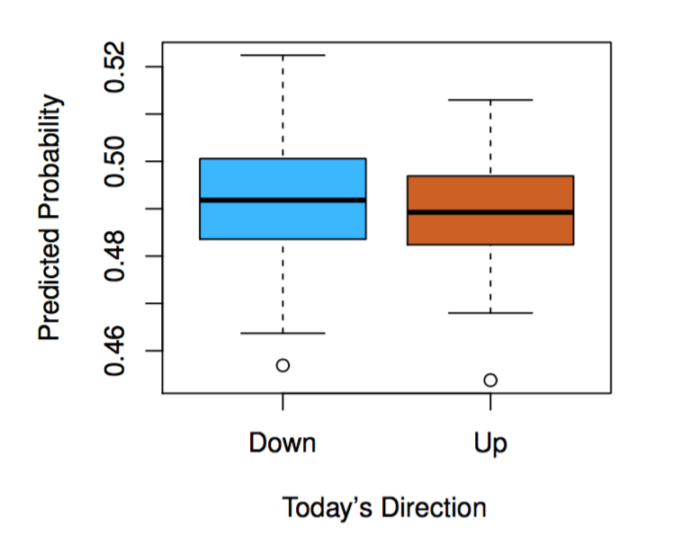

# Introduction

**Learning objectives:**

- Recognize various types of statistical learning.
- Understand why this book is useful for you.
- Be able to read mathematical notation used throughout this book.
- Describe the overall layout of this book.
- Be able to find data used in examples throughout the book.

## What is statistical learning?

[**Statistical learning**](https://en.wikipedia.org/wiki/Statistical_learning_theory) is the theoretical foundation for machine learning framework. It makes connections between the fields of statistics and functional analysis. 

In particular, the **Statistical learning theory** deals with the problem of finding a predictive function based on data and this is what is best known as **supervised learning**, in this book we will see more than just theory, as we will deal with **unsupervised learning** as well as making practical applications.


- **Supervised:** "Building a model to **predict an *output* from *inputs*.**"
  - Predict `wage` from `age`, `education`, and `year`.
  - Predict `market direction` from `previous days' performance`.
- **Unsupervised:** Inputs but no specific outputs, **find relationships and structure.**
  - Identify `clusters` within `cancer cell lines`.


## Why ISLR?

- "Facilitate the transition of statistical learning from an academic to a mainstream field."
- Machine learning* is useful to everyone, let's all learn enough to use it responsibly.
- R "labs" make this make sense for this community!


## Notation

- *n* = number of observations (rows)
- *p* = number of features/variables (columns)
- We'll come back here if we need to as we go!
- Some symbols they assume we know:
  - $\in$ = "is an element of", "in"
  - ${\rm I\!R}$ = "real numbers"

## What have we gotten ourselves into?

- 2: Terminology & main concepts
- 3-4: Classic linear methods
- 5: Resampling (so we can choose the best method)
- 6: Modern updates to linear methods
- 7+: Beyond Linearity (we can worry about details as we get there)

## Where's the data?

```{r 01-install, eval = FALSE}
install.packages("ISLR2")
```

Or "install" this book.

```{r 01-install-book, eval = FALSE}
install.packages("remotes")
remotes::install_github("r4ds/bookclub-islr")
remove.packages("bookclubislr") # This isn't really a package.
```


**Some info about the book:**

```{r tidyverse, message=FALSE, warning=FALSE, include=FALSE, paged.print=FALSE}
library(tidyverse)
```


**An Introduction to Statistical Learning (ISL by James, Witten, Hastie and Tibshiraniis)**, is a collection of modern statistical methods for modeling and making predictions from real-world data.

It is a middle way between theoretical statistics and the practice of applying statistics to real-world problems.

It can be considered as a user manual, with self-contained R labs, which lead you through the use of different methods for applying statistical analysis to different kinds of data.


## Some useful resources:

- the book page: [statlearning.com](https://www.statlearning.com/)
- pdf of the book: [ISLRv2_website](https://web.stanford.edu/~hastie/ISLR2/ISLRv2_website.pdf)
- course on edX: [statistical-learning](https://www.edx.org/course/statistical-learning)
- youtube channel: [playlists](https://www.youtube.com/channel/UCB2p-jaoolkv0h22m4I9l9Q/playlists)
- exercise solutions: [applied solutions](https://waxworksmath.com/Authors/G_M/James/james.html)
- book package [ISLR2](https://cran.rstudio.com/web/packages/ISLR2/index.html)

**Some more theoretical resources:**

- The Elements of Statistical Learning (ESL, by Hastie, Tibshirani, and Friedman) [ESLII](https://web.stanford.edu/~hastie/Papers/ESLII.pdf)


## What is covered in the book?

The book provides a series of toolkits classified as **supervised or unsupervised** techniques for understanding data.

The second edition of the book (2021) contains additions within the most updated statistical analysis.
```{r contents,echo=FALSE, fig.align='center', fig.cap='Editions', out.width='80%'}
knitr::include_graphics("images/01-contents.png")
```


## How the book is divided

The book is divided in 13 chapters covering:

- Introduction and Statistical Learning:
    
    - Supervised Versus Unsupervised Learning
    - Regression Versus Classification Problems

**Linear statistical learning**

- Linear Regression:

    - basic concepts 
    - introduction of K-nearest neighbor classifier
      
- Classification:

    -  logistic regression
     - linear discriminant analysis

- Resampling Methods: 
    
    - cross-validation 
    - the bootstrap
    
- Linear Model Selection and Regularization: 
potential improvements over standard linear regression

     - stepwise selection
     - ridge regression
     - principal components regression
     - the lasso
     
     
**Non-linear statistical learning**

- Moving Beyond Linearity: 

    - Polynomial Regression
    - Regression Spline
    - Smoothing Splines
    - Local Regression
    - Generalized Additive Models
    
- Tree-Based Methods:

    - Decision Trees
    - Bagging, Random Forests, Boosting, and Bayesian Additive Regression Trees
    
- Support Vector Machines (linear and non-linear classification)

- Deep Learning (non-linear regression and classification)

- Survival Analysis and Censored Data

- Unsupervised Learning:

    - Principal components analysis
    - K-means clustering
    - Hierarchical clustering
    
- Multiple Testing


**Each chapter includes 1 self-contained R lab on the topic**

## Some examples of the problems addressed with statistical analysis

- Identify the risk factors for some type of cancers
- Predict whether someone will have a hearth attack on the basis of demographic, diet, and clinical measurements
- Email spam detection
- Classify a tissue sample into one of several cancer classes, based on a gene expression profile
- Establish the relationship between salary and demographic variables in population survey data

([source](https://web.stanford.edu/~hastie/ISLR2/Slides/Ch1_Inroduction.pdf))


## Datasets provided in the ISLR2 package:

The book provides the {ISLR2} R package with all the datasets needed the analysis.

```{r islr2package, message=FALSE, warning=FALSE, paged.print=FALSE}
# install.packages("ISLR2")
# install.packages("remotes")
# remotes::install_github("r4ds/bookclub-islr")
# remove.packages("bookclubislr") 
library(ISLR2)
```


```{r datasets,echo=FALSE, fig.align='center', fig.cap='Datasets in ISLR2 package', out.width='80%'}
knitr::include_graphics("images/01-datasets.png")
```


### Example datasets

As an example some of the data sets used are:

1. **Wage Data**: predicting a continuous or quantitative output value (a regression problem) - Chapter3.
```{r}
ISLR2::Wage%>%head
```

```{r}
p1<- Wage%>%
  ggplot(aes(x=age,y=wage))+
  geom_point(color="grey55")+
  geom_smooth()+
  theme_bw()
```


```{r message=FALSE, warning=FALSE, paged.print=FALSE}
p2<-Wage%>%
  ggplot(aes(x=year,y=wage))+
  geom_point(color="grey55")+
  geom_smooth(method="lm")+
  theme_bw()
```

```{r}
p3<-Wage%>%
  ggplot(aes(x=education,y=wage))+
  geom_boxplot(aes(fill=education),show.legend = F)+
  theme_bw()+
  theme(axis.text.x = element_text(size=5))
```

```{r message=FALSE, warning=FALSE, paged.print=FALSE}
library(patchwork)
p1|p2|p3
```


2. **Stock Market Data**: predicting a categorical or qualitative output (classification problem).
Predict whether the index will increase or decrease on a given day, using the past 5 days’ percentage changes in the index - Chapter 4.
```{r}
ISLR2::Smarket%>%head
```

```{r}
Smarket%>%
  pivot_longer(cols=c("Lag1","Lag2","Lag3"),names_to="lags13",values_to="lags13_val")%>%
  ggplot(aes(x=Direction,y=lags13_val))+
  geom_boxplot(aes(fill=Direction),show.legend = F)+
  facet_wrap(~lags13)+
  labs(x="Today's Direction",y="Percentage change in S&P")+
  theme_bw()+
  theme(strip.background = element_blank())
```

```{r Smarket1,echo=FALSE, fig.align='center', fig.cap='fit a quadratic discriminant analysis model', out.width='80%'}

```

3. **Gene Expression Data**
```{r}
class(NCI60)
ISLR2::NCI60%>%names
NCI60$labs
# View(NCI60)
```


```{r NCI601,echo=FALSE, fig.align='center', fig.cap='the first two principal components of the data', out.width='80%'}
knitr::include_graphics("images/fig1_2.png")
```


## Meeting Videos

### Cohort 1

`r knitr::include_url("https://www.youtube.com/embed/URL")`

<details>
<summary> Meeting chat log </summary>

```
ADD LOG HERE
```
</details>
