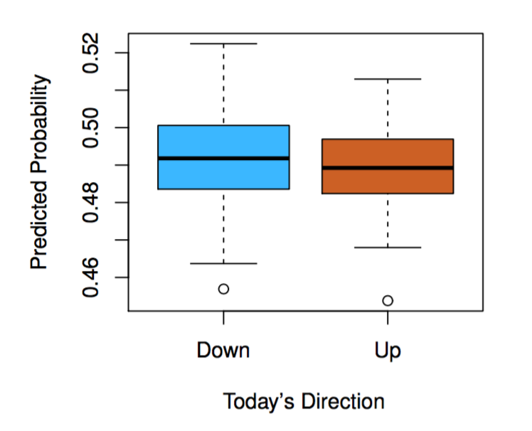
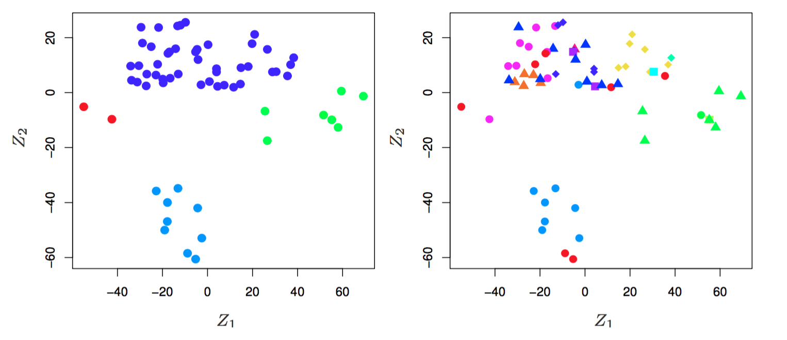

# Introduction

**Learning objectives:**

- Recognize various types of statistical learning.
- Understand why this book is useful for you.
- Be able to read mathematical notation used throughout this book.
- Describe the overall layout of this book.
- Be able to find data used in examples throughout the book.

## What is statistical learning?

[**Statistical learning**](https://en.wikipedia.org/wiki/Statistical_learning_theory) is the theoretical foundation for machine learning framework. It makes connections between the fields of statistics and functional analysis. 

In particular, the **Statistical learning theory** deals with the problem of finding a predictive function based on data and this is what is best known as **supervised learning**, in this book we will see more than just theory, as we will deal with **unsupervised learning** as well as making practical applications.


- **Supervised:** "Building a model to **predict an *output* from *inputs*.**"
  - Predict `wage` from `age`, `education`, and `year`.
  - Predict `market direction` from `previous days' performance`.
- **Unsupervised:** Inputs but no specific outputs, **find relationships and structure.**
  - Identify `clusters` within `cancer cell lines`.


## Why ISLR?

- "Facilitate the transition of statistical learning from an academic to a mainstream field."
- Machine learning* is useful to everyone, let's all learn enough to use it responsibly.
- R "labs" make this make sense for this community!

## Premises of ISLR

From Page 9 of the Introduction:

- "Many statistical learning methods are relevant and useful in a wide range of academic and non-academic disciplines, beyond just the statistical sciences."
- "Statistical learning should not be viewed as a series of black boxes."
- "While it is important to know what job is performed by each cog, it is not necessary to have the skills to construct the machine inside the box!"
- "We presume that the reader is interested in applying statistical learning methods to real-world problems."

## Notation

- *n* = number of observations (rows)
- *p* = number of features/variables (columns)
- We'll come back here if we need to as we go!
- Some symbols they assume we know:
  - $\in$ = "is an element of", "in"
  - ${\rm I\!R}$ = "real numbers"

## What have we gotten ourselves into?

**An Introduction to Statistical Learning (ISL by James, Witten, Hastie and Tibshiraniis)**, is a collection of modern statistical methods for modeling and making predictions from real-world data.

It is a middle way between theoretical statistics and the practice of applying statistics to real-world problems.

It can be considered as a user manual, with self-contained R labs, which lead you through the use of different methods for applying statistical analysis to different kinds of data.

- 2: Terminology & main concepts
- 3-4: Classic linear methods
- 5: Resampling (so we can choose the best method)
- 6: Modern updates to linear methods
- 7+: Beyond Linearity (we can worry about details as we get there)

## Where's the data?

```{r 01-install, eval = FALSE}
install.packages("ISLR2")
```

Or "install" this book.

```{r 01-install-book, eval = FALSE}
install.packages("remotes")
remotes::install_github("r4ds/bookclub-islr")
remove.packages("bookclubislr") # This isn't really a package.
```

We'll look at this data in more detail below.

## Some useful resources:

- the book page: [statlearning.com](https://www.statlearning.com/)
- pdf of the book: [ISLRv2_website](https://web.stanford.edu/~hastie/ISLR2/ISLRv2_website.pdf)
- course on edX: [statistical-learning](https://www.edx.org/course/statistical-learning)
- youtube channel: [playlists](https://www.youtube.com/channel/UCB2p-jaoolkv0h22m4I9l9Q/playlists)
- exercise solutions: [applied solutions](https://waxworksmath.com/Authors/G_M/James/james.html)
- book package [ISLR2](https://cran.rstudio.com/web/packages/ISLR2/index.html)

**Some more theoretical resources:**

- The Elements of Statistical Learning (ESL, by Hastie, Tibshirani, and Friedman) [ESLII](https://web.stanford.edu/~hastie/Papers/ESLII.pdf)


## What is covered in the book?

The book provides a series of toolkits classified as **supervised or unsupervised** techniques for understanding data.

The second edition of the book (2021) contains additions within the most updated statistical analysis.

```{r 01-contents, echo=FALSE, fig.align='center', fig.cap='Editions', out.width='80%'}
knitr::include_graphics("images/01-contents.png")
```


## How is the book divided?

The book is divided into 13 chapters covering:

- Introduction and Statistical Learning:
  - Supervised Versus Unsupervised Learning
  - Regression Versus Classification Problems

**Linear statistical learning**

- Linear Regression:
  - basic concepts
  - introduction of K-nearest neighbor classifier
      
- Classification:
  - logistic regression
  - linear discriminant analysis

- Resampling Methods:
  - cross-validation
  - the bootstrap
    
- Linear Model Selection and Regularization: 
potential improvements over standard linear regression
  - stepwise selection
  - ridge regression
  - principal components regression
  - the lasso
     
     
**Non-linear statistical learning**

- Moving Beyond Linearity:
  - Polynomial Regression
  - Regression Spline
  - Smoothing Splines
  - Local Regression
  - Generalized Additive Models
    
- Tree-Based Methods:
  - Decision Trees
  - Bagging, Random Forests, Boosting, and Bayesian Additive Regression Trees
    
- Support Vector Machines (linear and non-linear classification)

- Deep Learning (non-linear regression and classification)

- Survival Analysis and Censored Data

- Unsupervised Learning:
  - Principal components analysis
  - K-means clustering
  - Hierarchical clustering
    
- Multiple Testing


**Each chapter includes 1 self-contained R lab on the topic**

## Some examples of the problems addressed with statistical analysis

- Identify the risk factors for some type of cancers
- Predict whether someone will have a hearth attack on the basis of demographic, diet, and clinical measurements
- Email spam detection
- Classify a tissue sample into one of several cancer classes, based on a gene expression profile
- Establish the relationship between salary and demographic variables in population survey data

([source](https://web.stanford.edu/~hastie/ISLR2/Slides/Ch1_Inroduction.pdf))


## Datasets provided in the ISLR2 package

The book provides the {ISLR2} R package with all the datasets needed the analysis.

```{r 01-islr2package, message=FALSE, warning=FALSE, paged.print=FALSE}
# install.packages("ISLR2")
# install.packages("remotes")
# remotes::install_github("r4ds/bookclub-islr")
# remove.packages("bookclubislr") 
library(ISLR2)
```


```{r 01-datasets, echo=FALSE, fig.align='center', fig.cap='Datasets in ISLR2 package', out.width='80%'}
knitr::include_graphics("images/01-datasets.png")
```


### Example datasets

```{r 01-tidyverse, include = FALSE}
library(tidyverse)
```
As an example some of the data sets used are:

1. **Wage Data**: predicting a continuous or quantitative output value (a regression problem) - Chapter3.
```{r 01-wage-data}
ISLR2::Wage %>% head()
```

```{r 01-wage-plot}
p1 <- Wage %>%
  ggplot(aes(x = age, y = wage)) +
  geom_point(color = "grey55") +
  geom_smooth() +
  theme_bw()
```


```{r 01-wage-plot-2, message=FALSE, warning=FALSE, paged.print=FALSE}
p2<-Wage %>%
  ggplot(aes(x = year, y = wage)) +
  geom_point(color = "grey55") +
  geom_smooth(method = "lm") +
  theme_bw()
```

```{r 01-wage-plot-3}
p3<-Wage %>%
  ggplot(aes(x = education, y = wage)) +
  geom_boxplot(aes(fill = education), show.legend = FALSE) +
  theme_bw() +
  theme(axis.text.x = element_text(size = 5))
```

```{r 01-patchwork, message=FALSE, warning=FALSE, paged.print=FALSE}
library(patchwork)
p1|p2|p3
```


2. **Stock Market Data**: predicting a categorical or qualitative output (classification problem).
Predict whether the index will increase or decrease on a given day, using the past 5 days’ percentage changes in the index - Chapter 4.
```{r 01-stocks}
ISLR2::Smarket %>% head()
```

```{r 01-stocks-plot}
Smarket %>%
  pivot_longer(
    cols=c("Lag1","Lag2","Lag3"), names_to="lags13", values_to="lags13_val"
  ) %>%
  ggplot(aes(x=Direction,y=lags13_val)) +
  geom_boxplot(aes(fill=Direction),show.legend = F) +
  facet_wrap(~lags13) +
  labs(x="Today's Direction",y="Percentage change in S&P") +
  theme_bw() +
  theme(strip.background = element_blank())
```

```{r 01-Smarket1, echo=FALSE, fig.align='center', fig.cap='fit a quadratic discriminant analysis model', out.width='80%'}

```

3. **Gene Expression Data**
```{r 01-genes}
class(NCI60)
ISLR2::NCI60 %>% names()
NCI60$labs
# View(NCI60)
```


```{r 01-NCI601, echo=FALSE, fig.align='center', fig.cap='the first two principal components of the data', out.width='80%'}

```


## Meeting Videos

### Cohort 1

`r knitr::include_url("https://www.youtube.com/embed/VSRRy3vpvq0")`

<details>
<summary> Meeting chat log </summary>

```
00:07:44	Fran Barton:	Hi!!!
00:08:00	Mei Ling Soh:	Hello!
00:08:17	BEN:	Hello!
00:08:53	Kim Martin:	Hello :)
00:09:15	Stijn Van de Vondel:	Hiya!
00:09:31	Ryan S:	18 participants before kick off time!  Jon, hope you're expecting a large crowd.  :-)
00:11:18	Fran Barton:	Gesundheit
00:11:49	Jyoti Bhogal:	That's Starry Nights in the background @Jon :)
00:11:59	Kim Martin:	I'm going to turn off my camera and mic for a little bit so no one is subjected to seeing me eat peanut butter from the 'emergency snack jar' 😵
00:12:08	Fran Barton:	:-D
00:12:31	Fran Barton:	I'm in a shared office with background noise so will stay on mute most of the time
00:12:43	Stijn Van de Vondel:	Gotta say, that's one hell of a silent vacuum
00:13:05	Stijn Van de Vondel:	If it's not the mic, you may be sitting on a vacuum goldmine
00:13:21	Kim Martin:	😂
00:16:42	Kim Martin:	Shall we do tag-team presentations to spread the responsibility/opportunity around?
00:16:51	Kim Martin:	(swopping presenter mid-session/chapter)
00:17:18	Raymond Balise:	chapter 2 is a lot
00:20:02	Ryan S:	love that idea -- discussion one week, exercises second week
00:20:15	Mei Ling Soh:	I second that
00:20:27	Kim Martin:	+1
00:20:40	Raymond Balise:	thoughts on Tidymodels vs Base?
00:22:25	Kim Martin:	Nothing against Tidyverse (recent convert), but it makes sense to me to start with base
00:22:36	Jyoti Bhogal:	The link for today's meeting, I got through a friend. What do I need to do to subscribe for receiving the links for meetings?
00:22:41	Kim Martin:	(the argument is overblown, imo)
00:23:16	Jyoti Bhogal:	thank you
00:23:17	Raymond Balise:	👍🏼
00:23:17	Kim Martin:	https://github.com/r4ds/bookclub-islr
00:23:23	David Severski:	To be clear, we’re talking tidymodels vs base, not tidyverse v base.
00:23:31	Jon Harmon (jonthegeek):	r4ds.io/islr
00:28:03	Fran Barton (he/him):	do we know why they are called "supervised" and "unsupervised"? interesting terminology and I think it would help me to understad better if I could grasp what they have to do with whether you're looking for outputs or not
00:28:35	August:	supervised has a target/output to be predicted.
00:29:02	Fran Barton (he/him):	"letting the machine go play" is great - that helps thx
00:29:15	Kim Martin:	All models that involve 'training' are supervised, I'm guessing?
00:30:24	Kim Martin:	If the process of the unsupervised model 'deciding' on how to group things into clusters is computationally expensive, then you'd train it first...
00:30:52	Kim Martin:	… then after it has 'decided', it'll be quick in the future to slot new observations into those clusters
00:30:58	Kim Martin:	(guessing)
00:31:44	BEN:	tidymodels nomenclature is always exciting :3
00:32:05	Arnab Dey (he/him):	epsilon?
00:32:12	Kim Martin:	'Exciting'? (novice - curious)
00:32:35	BEN:	both
00:32:36	Keuntae Kim:	that stands for "element of"
00:32:50	SriRam:	In set theory, it is called “belongs to”
00:32:51	Arnab Dey (he/him):	ah!
00:32:52	Kaustav Sen:	belongs to? https://www.mathdoubts.com/belongs-to/#:~:text=In%20the%20set%20theory%2C%20the,element%20belongs%20to%20the%20set.&text=It%20helps%20us%20to%20express,its%20set%20in%20mathematical%20form.
00:32:53	August:	Isn't E also euler?
00:32:57	Keuntae Kim:	correct. already in the slide... hahah
00:33:08	Raymond Balise:	add the link to that book later plz
00:33:14	Fran Barton (he/him):	wikipedia: "The lunate epsilon, ϵ, is not to be confused with the set membership symbol ∈"
00:33:33	Kim Martin:	Math notation as bird spotting hobby alternative...
00:33:42	August:	sorry you're right euler is more like e
00:34:05	Ryan Metcalf:	Latex: \in
00:34:18	Jon Harmon (jonthegeek):	r4ds.io/islr
00:34:21	Jon Harmon (jonthegeek):	statlearning.com
00:34:23	Raymond Balise:	the notation book reference plz
00:34:29	Kim Martin:	https://www.amazon.com/Mathematical-Notation-Guide-Engineers-Scientists/dp/1466230525
00:34:37	Raymond Balise:	thx kim
00:34:41	Mei Ling Soh:	https://www.rapidtables.com/math/symbols/Basic_Math_Symbols.html
00:35:11	Fran Barton (he/him):	^ useful! thx
00:38:08	Fran Barton (he/him):	I think `install.github("ISLR2")` is maybe missing the repo owner name "CRAN/ISLR2" ??
00:38:37	Ryan S:	let's say it's been many years since my last "traditional / undergrad" stats class.  Will I survive ISLR or should I brush up a bit?
00:39:06	Fran Barton (he/him):	ah of course - let's fix on github ;-)
00:39:56	SriRam:	This is also my stepping stone into this world
00:40:25	Ryan S:	good to know.  Otherwise, I have the hours of 2:00 AM to 3:00 AM on Saturdays I can use to review Stats 101.
00:40:30	Ryan S:	😆
00:43:16	Ryan S:	thx!
00:43:19	Wayne Defreitas:	thx
00:43:19	Stijn Van de Vondel:	Thanks for hosting, can't wait for the next parts!
00:43:20	A. S. Ghatpande:	thanks
00:43:23	Jiwan Heo:	thank you!
```
</details>

### Cohort 2

`r knitr::include_url("https://www.youtube.com/embed/n29onzdTbAo")`

<details>
<summary> Meeting chat log </summary>

```
00:32:05	Ricardo Serrano:	https://github.com/r4ds/bookclub-islr
00:32:07	Michael Haugen:	https://github.com/r4ds/bookclub-islr
00:50:59	Federica Gazzelloni:	https://emilhvitfeldt.github.io/ISLR-tidymodels-labs/index.html
00:51:11	Federica Gazzelloni:	https://www.dataschool.io/15-hours-of-expert-machine-learning-videos/
```
</details>

### Cohort 3

`r knitr::include_url("https://www.youtube.com/embed/cXjTKOoN6aU")`

<details>
<summary> Meeting chat log </summary>

```
00:08:45	Fariborz Soroush:	Lighting in my room is terrible. I cut my video :D
00:10:23	Mei Ling Soh:	That’s fine!
00:15:24	Fariborz Soroush:	Go CHoPpers I guess?:lol:
00:15:36	Rose Hartman (she/her):	Woot 🙂
00:19:30	Amber:	My wifi is a bit rocky so I don’t want to put on my audio, but hi everyone! I’m Amber, I’m a student at CUNY Grad Center in NY where I’m studying Quantitative Methods in the Social Sciences, and have struggled with r during the entire time of my studies 😂 so I’m really looking forward to this book club to finally get comfortable with r
00:19:59	Rose Hartman (she/her):	Hi Amber! 🙂
00:20:36	Rose Franzen (she/her):	Hi Amber!
00:20:38	Nilay Yönet:	👋☺️
00:20:40	Fariborz Soroush:	Hi Amber :)
00:21:46	Mounika [Monika]:	Hi Amber :)
00:25:15	Mounika [Monika]:	Mei, could you please post also the link to the R4DS GitHub resource?
00:25:24	Rose Franzen (she/her):	https://r4ds.github.io/bookclub-islr/book-club-meetings.html
00:25:34	Mounika [Monika]:	Thank you !
00:36:28	Rose Hartman (she/her):	Did you get the capitals? install.packages(“ISLR2”)?
00:36:31	Rose Hartman (she/her):	It worked fine for me
00:36:38	Rahul:	I don’t know much R but looking online https://cran.rstudio.com/web/packages/ISLR2/ seems that it Depends:	R (≥ 3.5.0)
00:37:38	Nilay Yönet:	yes my R version is
00:37:40	Nilay Yönet:	R version 4.1.0 (2021-05-18)
00:38:12	Rahul:	OK, then that might not be the reason
00:38:43	Nilay Yönet:	Idk :/ I will try cloning :)
00:38:45	Rose Hartman (she/her):	Nilay, usually when I get that error message, I find it’s because I had a typo in the package name ;) Double check that you typed it in correctly?
00:39:03	Nilay Yönet:	oh ok I will check that as well :)
00:49:10	Fariborz Soroush:	Suggestions for API? VSCode? Jupyter? I remember R had its own interpreter but I have MacOS not sure if it works there.
00:50:10	Rose Hartman (she/her):	I really like RStudio for R: https://www.rstudio.com/products/rstudio/
00:50:24	Mounika [Monika]:	RStudio is the OG for R!!
00:50:38	Fariborz Soroush:	Ok, RStudio it is :) :D
00:54:31	Rahul:	13th march
00:54:36	Rose Hartman (she/her):	Quick poll: Who is interested in doing tidymodels? I am, but happy to skip it if everyone else would prefer to stay in base R.
00:55:35	Mounika [Monika]:	I think the plan of covering base as well as tidyR sounds good.. I am ok sticking to baseR if both is too much
00:57:24	Amber:	^^ same
00:57:44	Rose Franzen (she/her):	I am also interested in tidy models
00:57:47	Amber:	Bye everyone!
```
</details>

### Cohort 4

`r knitr::include_url("https://www.youtube.com/embed/VTA3wGNOaKQ")`

<details>
<summary> Meeting chat log </summary>

```
00:20:25	Kevin Kent:	https://github.com/r4ds/bookclub-islr
00:34:27	Kevin Kent:	https://forms.gle/r4vfsArqSz3cBe9v6
00:36:18	Kevin Kent:	https://forms.gle/r4vfsArqSz3cBe9v6
01:02:59	Ronald Legere:	https://otexts.com/fpp2/
01:03:17	Ronald Legere:	https://otexts.com/fpp3/
01:06:47	Lydia Gibson:	Spam always says free or has an exclamation point lol
```
</details>
