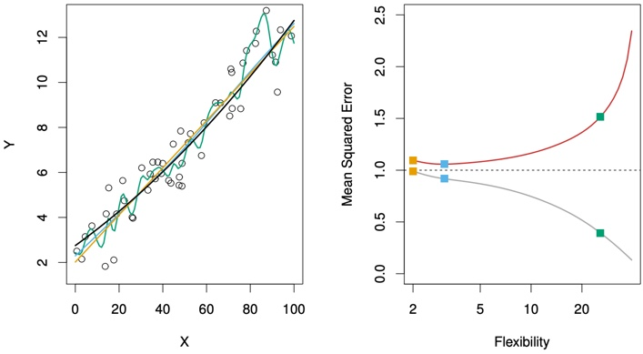
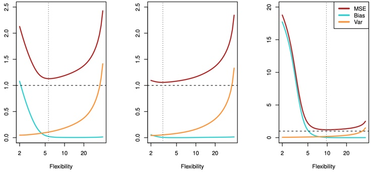
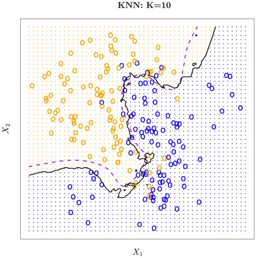

# Statistical Learning {#learning}

**Learning objectives:**

-   Understand Vocabulary for prediction
-   Understand "Error"/Accuracy
-   Understand Parametric vs Nonparametric Models
-   Describe the trade-off between more accurate models and more interpretable models.
-   Compare and contrast supervised and unsupervised learning.
-   Compare and contrast regression and classification problems.
-   Measure the accuracy/goodness of regression model fits.
-   Measure the accuracy/goodness of classification model fits.
-   Describe how bias and variance contribute to the model error.
-   Understand overfitting.
-   Recognize KNN.
-   Understand the role of tuning in ML models.

```{r 02-setup, echo = FALSE}
knitr::opts_chunk$set(include = TRUE)
```

```{r 02-library, echo=FALSE}
# Helper packages - need dplyr and ggplot
suppressPackageStartupMessages(library(tidyverse))
library(ggthemes)
suppressPackageStartupMessages(library(tidymodels))
tidymodels_prefer()
library(knitr)
```

## What is Statistical Learning? 

The chapter opens with a discussion of what models are good for, how we use them, and some of the issues that are involved.

Can we predict Sales using ad media spending?

```{r}
read_csv(
    "https://www.statlearning.com/s/Advertising.csv",
    col_types = "-dddd",
    skip = 1,
    col_names = c("row", "TV", "radio", "newspaper", "sales")
  ) %>% 
  pivot_longer(cols = -sales) %>% 
  ggplot(aes(value, sales)) +
  geom_point(shape = 21, color = "red") +
  geom_smooth(method = "lm", color = "blue",
              se = FALSE, formula = "y ~ x") +
  facet_wrap(vars(name),
             scales = "free_x",
             strip.position = "bottom") +
  theme_bw() +
  theme(strip.placement = "outside",
        panel.grid = element_blank(),
        strip.background = element_blank()) +
  labs(x = NULL,
       caption = "Source: https://www.statlearning.com/s/Advertising.csv | A simple least squares fit shown in blue")
```

You can make out a trend, at least in radio and TV.

We typically want to be able to characterize the **Sales** potential as a function of all three media inputs. How do they operate together?

<h4>**Notation**</h4>

In this setting, the advertising budgets are <mark>*input variables*</mark> while sales is an <mark>*output variable*</mark>. The input variables are typically denoted using the symbol $X$, with a subscript to distinguish them. 

So $X_1$ might be the `TV` budget, 
$X_2$ the `radio` budget, and 
$X_3$ the `newspaper` budget. 

The inputs go by different names, such as <mark>*predictors*, *independent variables*, *features*</mark>, or sometimes just <mark>*variables*</mark>. 

The output variable in this case, `sales` is often called the <mark>*response*</mark> or <mark>*dependent variable*</mark>, and is typically denoted using the symbol $Y$. 

We assume that there is some relationship between $Y$ and $X = (X_1, X_2,\dots,X_p)$, which can be written in the very general form

```{=tex}
\begin{equation}
y = f(X) + \epsilon
\end{equation}
```
Here $f$ is some fixed but unknown function of $X_1, \dots, X_p$, and $\epsilon$ is a random <mark>*error term*</mark>, which is independent of $X$ and has a mean of zero. In this formulation, $f$ represents the <mark>*systematic*</mark> information that $X$ provides about $Y$.

<h4>**What is the $f(X)$ good for?**</h4>

With a good $f$ we can make predictions of $Y$ at new points.

We can understand which components are important in explaining $Y$, and which components are irrelevant.

Depending on the complexity of $f$, we may be able to understand how each component of $X_j$ of $X$ affects $Y$.

```{r}
read_csv("https://www.statlearning.com/s/Income1.csv",
         col_types = "-dd",
         skip = 1,
         col_names = c("row", "Education","Income")) %>% 
  mutate(res = residuals(loess(Income ~ Education))) %>% 
  ggplot(aes(Education, Income)) +
  geom_point(shape = 20, size = 4, color = "red") +
  geom_segment(aes(xend = Education, yend = Income - res)) +
  geom_smooth(method = "loess", se = FALSE, color = "blue",
              formula = "y ~ x") +
  scale_x_continuous(breaks = seq(10,22,2)) +
  theme_bw() +
  theme(panel.grid = element_blank()) +
  labs(x = "Years of Education",
       caption = "Source: https://www.statlearning.com/s/Income1.csv | A loess fit shown in blue") 
```

The vertical lines represent the error terms $\epsilon$. That is, the difference between the model estimate and the observed value.

----

### Why Estimate $f$?

There are two main reasons that we may wish to estimate $f$: *prediction* and *inference*.

<h4>**Prediction**</h4>

In many situations, a set of inputs $X$ are readily available, but the output $Y$ cannot be easily obtained. We can predict $Y$ using

```{=tex}
\begin{equation}
\hat{Y} = \hat{f}(X)
\end{equation}
```
$\hat{f}$ is often treated as a *black box*,

> One is not typically concerned with the exact form of $\hat{f}$, provided that it yields accurate predictions for Y.

The accuracy of $\hat{Y}$ as a prediction for $Y$ depends on two quantities, called the *reducible error* and the *irreducible error*.

**Reducible Error** We can reduce the gap between our estimate and the true function by applying improved methods.

**Irreducible Error** The quantity $\epsilon$ may contain unmeasured variables that are useful in predicting $Y$ : since we don’t measure them, $f$ cannot use them for its prediction. The quantity $\epsilon$ will also contain unmeasurable variation. 


The focus of the book is on techniques for estimating $f$ with the aim of minimizing the *reducible* error. 

----

<h4>**Inference**</h4>

We are often interested in understanding the association between $Y$ and
$X = (X_1, X_2,\dots,X_p)$. In this situation we wish to estimate $f$, but our goal is not necessarily to make predictions for $Y$. Now $f$ cannot be treated as a black box, because we need to know its exact form. In this setting, one may be interested in answering the following questions:

- Which predictors are associated with the response?
 
- What is the relationship between the response and each predictor?

- Can the relationship between Y and each predictor be adequately summarized using a linear equation, or is the relationship more complicated?

Consider the **Advertising** data. One may be interested in answering questions such as:

– Which media are associated with sales?

– Which media generate the biggest boost in sales? or

– How large of an increase in sales is associated with a given increase
in TV advertising?

----

### How do we estimate $f$?

We want to find a function $f$ such that $Y ≈ f(X)$ for any observation. Broadly speaking, most statistical learning methods for this task can be characterized as either *parametric* or *non-parametric*. 

<h4>**Parametric Methods**</h4>

Parametric methods involve a two-step model-based approach.

1. First we make an assumption about the functional form of $f$

1. After a model is selected, we apply a procedure to fit or train the model.

> The potential disadvantage of a parametric approach is that the model we choose will usually not match the true unknown form of $f$. If the chosen model is too far from the true $f$, then our estimate will be poor.

We can try to address this problem by choosing more flexible models that can fit many different possible functional forms for $f$.

> These more complex models can lead to a phenomenon known as <mark>*overfitting*</mark> the data, which essentially means they follow the errors, or noise, too closely.

```{r}
ISLR2::Portfolio %>% 
  ggplot(aes(X, Y)) +
  geom_point(shape = 21, color = "gray50") +
  geom_smooth(method = "lm", color = "red", 
              se = FALSE, formula = "y ~ x") +
  geom_point(x = 1, y = 0.5, shape = 20, 
             color = "red", size = 8) +
  geom_vline(xintercept = 1, color = "red") +
  theme_bw() +
  theme(panel.grid = element_blank()) +
  labs(caption = "Source: ISLR2::Portfolio | A linear fit shown in red") 
```

In a given dataset, there may be many observed values of $Y$ for each $X$. In this regression example, the expected value of Y given X = 1 is 0.5.

The value of 0.5 is an average of sorts of the slice taken at x = 1.

Although it is almost never correct, a linear model often serves as a good and interpretable approximation.

<h4>**Non-Parametric Methods**</h4>

> Non-parametric methods don't make explicit assumptions about the functional form of $f$

Instead they seek an estimate of $f$ that gets as close to the data points as possible without being too rough or wiggly.

Any parametric approach brings with it the possibility that the functional form used to estimate $f$ on training data is very different from the true $f$, in which case the resulting model will not fit unseen, new data well.

Non-parametric approaches do suffer from a major disadvantage:

> A very large number of observations (far more a than is typically needed for a parametric approach) is required in order to obtain an accurate estimate for $f$.

----

### Prediction Accuracy vs Model Interpretability

Why would we ever choose to use a more restrictive method instead of a very flexible approach?

> If we are mainly interested in inference, then restrictive models are often more interpretable.

Flexible approaches can lead to such complicated estimates of $f$ that it is difficult to understand how any individual predictor is associated with the response.

### Supervised Versus Unsupervised Learning

Supervised problems have labeled data with a response measurement, also called a dependent variable. 

Unsupervised problems have no labels. The challenge is to derive clusters, or patterns, to better understand what is happening.

### Regression Versus Classification Problems

Variables can be characterized as either <mark>*quantitative*</mark> or <mark>*qualitative*</mark> (categorical).

Quantitative variables take on numerical values. 

In contrast, qualitative variables take on values in <mark>*classes*</mark>, or categories.

## Assessing Model Accuracy

There is no free lunch in statistics: no one method dominates all others over all possible problems.

Selecting the best approach can be challenging in practice.

### Measuring Quality of Fit

> *There is no free lunch in statistics*: no one method dominates all others over all possible data sets. On a particular data set, one specific method may work best, but some other method may work better on a similar but different data set.

<h4>**MSE**</h4>

We always need some way to measure how well a model's predictions actually match the observed data.

> In the regression setting, the most commonly-used measure is the <mark>*mean squared error*</mark> (MSE), given by $$ MSE = \frac{1}{n}\sum_{i=1}^n(y_i-\hat{f}(x_i))^2,$$

The MSE will be small if the predicted responses are very close to the true responses,and will be large if for some of the observations, the predicted and true responses differ substantially.

<h4>**Training vs. Test**</h4>

The MSE in the above equation is computed using the training data that was used to fit the model, and so should more accurately be referred to as the <mark>*training MSE*</mark>.

> In general, we do not really care how well the method works on the training data.

We are interested in the accuracy of the predictions that we obtain when we apply our method to previously unseen <mark>*test data*</mark>.

$$\mathrm{Ave}(y_0 - \hat{f}(x_0))^2 ,$$

We'd like to select the model for which this quantity is as small as possible on unseen, future samples.

The <mark>*degrees of freedom*</mark> is a quantity that summarizes the flexibility of a curve. The training MSE declines monotonically as flexibility increases.

<h4>**Overfitting**</h4>

<mark>As model flexibility increases, training MSE will decrease, but the test MSE may not.</mark> When a given method yields a small training MSE but a large test MSE, we are said to be *overfitting* the data.

> Overfitting refers specifically to the case in which a less flexible model would have yielded a smaller test MSE.

MSE, for a given value, can always be decomposed into the sum of three fundamental quantities: the <mark>*variance*</mark> of $\hat{f}(x_0)$, the squared <mark>*bias*</mark> of $\hat{f}(x_0)$ and the variance of the <mark>error terms</mark> $\epsilon$. That is,

$$E\big(y_0 - \hat{f}(x_0)\big)^2 = \mathrm{Var}\big(\hat{f}(x_0)\big) +[\mathrm{Bias}\big(\hat{f}(x_0)\big)]^2 + \mathrm{Var}(\epsilon)$$

Here the notation $E\big(y_0 - \hat{f}(x_0)\big)^2$ defines the <mark>*expected test MSE*</mark> at $x_0$ and refers to the average test MSE that we would obtain if we repeatedly estimated $f$ using a <mark>large number of training sets</mark>, and tested each at $x_0$. The overall expected test MSE can be computed by averaging $E \big(y_0 - \hat{f}x(x_0)\big)^2$ over all possible values of $x_0$ in the test set

 

The orange, blue and green squares indicate the MSEs associated with the corresponding curves in the left hand panel. A more restricted and hence smoother curve has fewer degrees of freedom than a wiggly curve—note that in Figure 2.9, linear regression is at the most restrictive end, with two degrees of freedom. The training MSE declines monotonically as flexibility increases.
 
As the flexibility of the statistical learning method increases, we observe a monotone decrease in the training MSE and a U-shape in the test MSE. This is a fundamental property of statistical learning that holds regardless of the particular data set at hand and regardless of the statistical method being used. As model flexibility increases, training MSE will decrease, but the test MSE may not.

When a given method yields a small training MSE but a large test MSE, we are said to be <mark>*overfitting*</mark> the data.



Another example in which the true $f$ is approximately linear.

However, because the truth is close to linear, the test MSE
only decreases slightly before increasing again, so that the orange least squares fit is substantially better than the highly flexible green curve.

Figure 2.11 displays an example in which f is highly non-linear. The
training and test MSE curves still exhibit the same general patterns, but now there is a rapid decrease in both curves before the test MSE starts to increase slowly.


> We need to select a statistical learning method that simultaneously achieves low variance and low bias.

### The Bias-Variance Trade-Off

As we use more flexible methods, the variance will increase and the bias will decrease. As we increase the flexibility of a class of methods, the bias tends to initially decrease faster than the variance increases. However, at some point increasing flexibility has little impact on the bias but starts to significantly increase the variance. When this happens the test MSE increases.



In all three cases, the variance increases and the bias decreases as the method's flexibility increases. The relationship between bias, variance, and test set MSE given is referred to as the <mark>*bias-variance trade-off*</mark>.

> The challenge lies in finding a method for which both the variance and the squared bias are low. This trade-off is one of the most important recurring themes in this book.

### The Classification Setting

The most common approach for quantifying the accuracy of our estimate $\hat{f}$ is the training <mark>*error rate*</mark>, the proportion of mistakes that are made if we apply our estimate $\hat{f}$ to the training observations: $$\frac{1}{n}\sum_{i=1}^{n}I(y_i \ne \hat{y}_i).$$

The above equation computes the fraction of incorrect classifications.

The equation is referred to as the <mark>*training error*</mark> rate because it is computed based on the data that was used to train our classifier.

> Again, we are most interested in the error rates that result from applying our classifier to test observations that were not used in training.

<h4>**Test Error**</h4>

The <mark>*test error*</mark> rate associated with a set of test observations of the form $(x_0, y_0)$ is given by

$$\mathrm{Ave}\big(I(y_i \ne \hat{y}_i)\big).$$

Where $\hat{y}_0$ is the predicted class label that results from applying the classifier to the test observation with predictor $x_0$. A good classifier is one for which the test error is smallest.

<h4>**The Bayes Classifier**</h4>

*Hypothetical -- cannot be done in practice*

The test error rate is minimized, on average, by a very simple classifier that *assigns each observation to the most likely class, given its predictor values*. In other words, we should simply assign a test observation with predictor vector $x_0$ to the class $j$ for which

$$\mathrm{Pr}(Y=j|X=x_0).$$

Note that is a <mark>*conditional probability*</mark>: it is the probability that $Y = j$, given the observed predictor vector $X_0$. This very simple classifier is called the <mark>*Bayes classifier*</mark>.

<h4>**Bayes Classifier Decision Boundary**</h4>

Figure 2.13 provides an example using a simulated data set in a two dimensional space consisting of predictors X1 and X2. The orange and
blue circles correspond to training observations that belong to two different classes. For each value of X1 and X2, there is a different probability of the response being orange or blue.


The purple dashed line represents the points where the probability is exactly 50%. This is called the <mark>*Bayes decision boundary*</mark>. An observation that falls on the orange side of the boundary will be assigned to the orange class, and similarly an observation on the blue side of the boundary will be assigned to the blue class.

> The Bayes classifier produces the lowest possible test error rate, called the <mark>*Bayes error rate*</mark>.

The overall Bayes error rate is given by

$$1- E\big(\mathop{\mathrm{max}}_{j}(Y=j|X)\big),$$

where the expectation averages the probability over all possible values of X. The Bayes error rate is analogous to the irreducible error, discussed earlier.

<h4>**K-Nearest Neighbors**</h4>

For real data, we do not know the conditional distribution of $Y$ given $X$, and so computing the Bayes classifier is impossible.

Many approaches attempt to estimate the conditional distribution of $Y$ given $X$, and then classify a given observation to the class with highest estimated probability. One such method is the <mark>*K-nearest neighbors*</mark> (KNN) classifier.

Given a positive integer K and a test observation $t_{0}$, the KNN classifier first identifies the K points in the training data that are closest to $x_0$

$$\mathrm{Pr}(Y=j|X=x_0) = \frac{1}{K}\sum_{i \in \mathcal{N}_0} I (y_i = j)$$

Finally, KNN classifies the test observation $x_0$ to the class with the largest probability.


The KNN approach with $K$ = 3 at all of the possible values for $X_1$ and $X_2$, and have drawn in the corresponding KNN decision boundary.

Despite the fact that it is a very simple approach, KNN can produce classifiers that are surprisingly close to the optimal Bayes classifier.

<h4>**KNN with Different K**</h4>

 

 

> The choice of K has a drastic effect on the KNN classifier obtained.

Nearest neighbor methods can be lousy when $p$ is large. 

Reason: the *curse of dimensionality*. Nearest neighbors tend to be far away in high dimensions.

<h4>**KNN Tuning**</h4>


> As we use more flexible classification methods, the training error rate will decline but the test error rate may not.

As $1/K$ increases, the method becomes more flexible. As in the regression setting, the training error rate consistently declines as the flexibility increases.

However, the test error exhibits a characteristic U-shape, declining at first (with a minimum at approximately $K$ = 10) before increasing again when the method becomes excessively flexible and overfits.

## Exercises

<h4>**Conceptual**</h4>

<span style="color: red;">
1. For each of parts (a) through (d), indicate whether we would generally expect the performance of a flexible statistical learning method to be better or worse than an inflexible method. Justify your answer.</span>

<span style="color: red;">
(a) The sample size n is extremely large, and the number of predictors p is small.</span>

A flexible model can take advantage of the large number of observations to make a detailed model.

<span style="color: red;">
(b) The number of predictors p is extremely large, and the number
of observations n is small.</span>

I'd apply Principal Component Analysis to drive p well under n, and then an inflexible, parametric method like Ordinary Least Squares could provide a model with a reasonable test set performance. 

<span style="color: red;">
(c) The relationship between the predictors and response is highly
non-linear.</span>

A flexible model could better capture the non-linearity.

<span style="color: red;">
(d) The variance of the error terms, i.e. σ2 = Var(ϵ), is extremely
high.</span>

An inflexible, parametric method would provide a standardized, average slice across the domain.

<span style="color: red;">
2. Explain whether each scenario is a classification or regression problem, and indicate whether we are most interested in inference or prediction. Finally, provide n and p.</span>

<span style="color: red;">
(a) We collect a set of data on the top 500 firms in the US. For each
firm we record profit, number of employees, industry and the
CEO salary. We are interested in understanding which factors
affect CEO salary.</span>

The problem is a regression, and we are interested in inferring the component factors. N is 500, and p is 3.

<span style="color: red;">
(b) We are considering launching a new product and wish to know
whether it will be a success or a failure. We collect data on 20
similar products that were previously launched. For each product we have recorded whether it was a success or failure, price charged for the product, marketing budget, competition price, and ten other variables.</span>

The problem is a binary classification prediction. The N is 20, p is 13. 

<span style="color: red;">
(c) We are interested in predicting the % change in the USD/Euro
exchange rate in relation to the weekly changes in the world
stock markets. Hence we collect weekly data for all of 2012. For
each week we record the % change in the USD/Euro, the %
change in the US market, the % change in the British market,
and the % change in the German market.</span>

The % change problem is a regression prediction with a p of 4 and an N of 52.

<span style="color: red;">
3. We now revisit the bias-variance decomposition.</span>

<span style="color: red;">
(a) Provide a sketch of typical (squared) bias, variance, training error, test error, and Bayes (or irreducible) error curves, on a single plot, as we go from less flexible statistical learning methods
towards more flexible approaches. The x-axis should represent
the amount of flexibility in the method, and the y-axis should
represent the values for each curve. There should be five curves.
Make sure to label each one.</span>


X-axis: increasing flexibility and model complexity

Y-axis: increasing Error, Variance, and Bias

<span style="color: blue;">Blue</span>: Bias

<span style="color: brown;">Brown</span>: Variance

<span style="color: green;">Yellow</span>: Training set MSE

<span style="color: green;">Green</span>: Testing set MSE

Black: Irreducibile error (Bayes)

<span style="color: red;">
(b) Explain why each of the five curves has the shape displayed in
part (a).</span>

<span style="color: green;">Yellow</span>: As models become more flexible and complex, the training error is reduced, but with diminishing benefit.

<span style="color: green;">Green</span>: We often observe a U-shaped error in the holdout training error. This is a combination of the Bias error above the least flexible model and the Variance error from over-fitting the most flexible models and the irreducible error component.

<span style="color: blue;">Blue</span>: The bias error component, as observed in the test result

<span style="color: brown;">Brown</span>: The variance error component, as observed in the test result

Black: The irreducible error component, as observed in the test result

<span style="color: red;">
4. You will now think of some real-life applications for statistical learning.</span>

<span style="color: red;">
(a) Describe three real-life applications in which classification might
be useful. Describe the response, as well as the predictors. Is the
goal of each application inference or prediction? Explain your
answer.</span>

- Infer the causes of expedited freight for a component part. The independent predictors would include country of origin, shipping method, promised lead time, and schedule changes for a year of deliveries.
      
- Predict customer churn for a learning labs subscription education program. The independent predictors would include monthly payment history, course topics, and web site visits.
      
- Predict the alphabetic letter of samples of handwriting. The independent predictors would be the pixels of many labeled images.

<span style="color: red;">
(b) Describe three real-life applications in which regression might
be useful. Describe the response, as well as the predictors. Is the
goal of each application inference or prediction? Explain your
answer.</span>

- Predict the survival rate of a vehicle component part in use by customers. The response is the proportion of parts still in service, censored. The independent predictors would include engine hours accumulated, region, machine chassis, and type of farm.
      
- Infer the characteristics of bottles of wine that influence price. The independent predictors would include the vintage year, the type of grape, the region, the color of the bottle, and the length of the story on the label.
      
- Predict the number of sales conversions per visitor for a web portal store front, given the catalog of products available, the layout parameters of the web site, the colors, and dimensions of the shopping experience.

<span style="color: red;">
(c) Describe three real-life applications in which cluster analysis
might be useful.</span>

- Given demographic data on millions of customers and what they buy, build five persona's for describing the current customer base to a company investor.
      
- Given IoT operating data from agricultural equipment, build three persona's for characterizing duty cycles of a fleet.
      
- Given employee communications transactional data, build three persona's for better tailoring targeted leadership training.

<span style="color: red;">
5. What are the advantages and disadvantages of a very flexible (versus
a less flexible) approach for regression or classification? Under what
circumstances might a more flexible approach be preferred to a less
flexible approach? When might a less flexible approach be preferred?</span>

The very flexible GBMs and Neural Nets require more data, and are often both less interpretable and explainable. Banks and highly regulated entities prefer simple linear models and decision trees so they can explain their management policies in simple terms.

<span style="color: red;">
6. Describe the differences between a parametric and a non-parametric
statistical learning approach. What are the advantages of a parametric approach to regression or classification (as opposed to a nonparametric approach)? What are its disadvantages?</span>

In any parametric approach we start with an assumption about the functional form and then work towards fitting the data to the closest version of that functional form. On advantage is in explainability, and another is that less data is required to build a useful model. A disadvantage is that the model might never achieve the lowest error rate. 

<span style="color: red;">
7. The table below provides a training data set containing six observations, three predictors, and one qualitative response variable.</span>

|Obs.|X1|X2|X3|Y
|:----|:---|:---|:---|:---|
|1| 0| 3| 0| Red
|2| 2| 0| 0| Red
|3| 0| 1| 3| Red
|4| 0| 1| 2| Green
|5|−1| 0| 1| Green
|6| 1| 1| 1| Red

<span style="color: red;">Suppose we wish to use this data set to make a prediction for Y when X1 = X2 = X3 = 0 using K-nearest neighbors.</span>

<span style="color: red;">(a) Compute the Euclidean distance between each observation and
the test point, X1 = X2 = X3 = 0.</span>

Red: sqrt((0-0)^2 + (0-3)^2 + (0-0)^2 )= sqrt(9) = 3 

Red: sqrt((0-2)^2 + (0-0)^2 + (0-0)^2 )= sqrt(4) = 2

Red: sqrt((0-0)^2 + (0-1)^2 + (0-3)^2 )= sqrt(10) = 3.162278

Green: sqrt((0-0)^2 + (0-1)^2 + (0-2)^2 )= sqrt(5)= 2.236068

Green: sqrt((0+1)^2 + (0-0)^2 + (0-1)^2 )= sqrt(2) =1.414214 

Red: sqrt((0-1)^2 + (0-1)^2 + (0-1)^2 )= sqrt(3)=1.732051

<span style="color: red;">(b) What is our prediction with K = 1? Why?</span>

For a test set X1=X2=X3=0, this is closest to Green which is at a distance sqrt(2). Therefore the prediction is Green.

<span style="color: red;">(c) What is our prediction with K = 3? Why?</span>

For a test set X1=X2=X3=0, this is closest to Red (Obs 2), Green(Obs 5) and Red(Obs 6). Thus the prediction will be Red.

<span style="color: red;">(d) If the Bayes decision boundary in this problem is highly nonlinear, then would we expect the best value for K to be large or small? Why?</span>

Small k values yield a model with lots of detailed curves in the boundary, and likely the lowest irreducible error.

<h4>**Applied**</h4>

<span style="color: red;">8. This exercise relates to the College data set, which can be found in the file College.csv on the book website.</span>

<span style="color: red;">(a) Use the read.csv() function to read the data into R. Call the loaded data college. Make sure that you have the directory set to the correct location for the data.</span>

<span style="color: red;">(b) Look at the data using the View() function. You should notice that the first column is just the name of each university. We don’t really want R to treat this as data. However, it may be handy to have these names for later. Try the following commands:</span>

<span style="color: red;">(c) i. Use the summary() function to produce a numerical summary
of the variables in the data set.</span>

```{r}
college <- read_csv("https://www.statlearning.com/s/College.csv",
                    show_col_types = FALSE) %>% 
   rename(college = `...1`) 

summary(college)
```

<span style="color: red;">ii. Use the pairs() function to produce a scatterplot matrix of
the first ten columns or variables of the data. Recall that you can reference the first ten columns of a matrix A using A[,1:10].</span>

```{r, fig.asp=1, fig.width=12}
# pairs(college[,3:12])

GGally::ggpairs(college[,2:11],
                mapping = aes(color = Private),
                progress = FALSE,
                lower = list(combo = GGally::wrap("facethist",  
bins = 40))) +
  theme_bw() +
  theme(panel.grid = element_blank()) +
  labs(caption = "Source: ISLR2::College | Ten numeric features") 
```

<span style="color: red;">iii. Use the plot() function to produce side-by-side boxplots of
Outstate versus Private.</span>

```{r}
# plot( college$Private, college$Outstate )

college %>% 
  ggplot(aes(Private, Outstate)) +
  geom_boxplot() +
  theme_bw() +
  theme(panel.grid = element_blank()) +
  labs(caption = "Source: ISLR2::College") 
```

<span style="color: red;">iv. Create a new qualitative variable, called Elite, by binning
the `Top10perc` variable. We are going to divide universities into two groups based on whether or not the proportion of students coming from the top 10 % of their high school
classes exceeds 50 %.</span>

<span style="color: red;">Use the summary() function to see how many elite universities there are.</span>

```{r}
# Elite <- rep("No", nrow(college))
# Elite[college$Top10perc > 50] <- " Yes "
# Elite <- as.factor(Elite)
# college <- data.frame(college , Elite)

college <- college %>% 
  mutate(Elite = as_factor(if_else(Top10perc > 50, "Yes", "No")))

summary(college$Elite)
```

<span style="color: red;">Now use the plot() function to produce side-by-side boxplots of Outstate versus Elite.</span>

```{r}
#plot( college$Elite, college$Outstate )

college %>% 
  ggplot(aes(Elite, Outstate)) +
  geom_boxplot() +
  theme_bw() +
  theme(panel.grid = element_blank()) +
  labs(caption = "Source: ISLR2::College") 
```

<span style="color: red;">v. Use the hist() function to produce some histograms with
differing numbers of bins for a few of the quantitative variables. You may find the command par(mfrow = c(2, 2)) useful: it will divide the print window into four regions so
that four plots can be made simultaneously. Modifying the arguments to this function will divide the screen in other ways.</span>

```{r}
college %>% 
  ggplot(aes(Enroll, fill = Private)) +
  geom_histogram(bins = 40) +  
  theme_bw() +
  theme(panel.grid = element_blank()) +
  labs(caption = "Source: ISLR2::College") 
```

<span style="color: red;">vi. Continue exploring the data, and provide a brief summary
of what you discover.</span>

```{r, fig.asp=1, fig.width=12}
GGally::ggpairs(bind_cols(college[,2],college[,12:18]),
                mapping = aes(color = Private),
                progress = FALSE,
                lower = list(combo = GGally::wrap("facethist",  
bins = 40))) +
  theme_bw() +
  theme(panel.grid = element_blank()) +
  labs(caption = "Source: ISLR2::College | Ten numeric features") 
```

The public institutions in this dataset enroll more undergraduates, while the private ones have more pursuing terminal degrees in their fields.

<span style="color: red;">9. This exercise involves the Auto data set studied in the lab. Make sure that the missing values have been removed from the data.
(a) Which of the predictors are quantitative, and which are qualitative?</span>

```{r}
Auto <- ISLR2::Auto %>% 
  drop_na %>% 
  tibble()

# summary(Auto)

skimr::skim(Auto)
```

Quantitative: mpg, cylinders, displacement, horsepower, weight, acceleration, year, origin

Qualitative: name

<span style="color: red;">(b) What is the range of each quantitative predictor? You can answer this using the range() function. range()</span>

```{r}
Auto %>%
  select(where(is.numeric)) %>%
  summarize(across(everything(), range)) %>%
  mutate(level = c("min", "max")) %>%
  pivot_longer(cols = -level,
               names_to = "metric",
               values_to = "value") %>%
  pivot_wider(names_from = level,
              values_from = value)
```

<span style="color: red;">(c) What is the mean and standard deviation of each quantitative predictor?</span>

```{r}
Auto %>%
  select(where(is.numeric)) %>%
  summarize(across(everything(), mean, na.rm = TRUE)) %>% pivot_longer(everything(),
                                                                       values_to = "mean")

Auto %>%
  select(where(is.numeric)) %>%
  summarize(across(everything(), sd, na.rm = TRUE)) %>% pivot_longer(everything(),
                                                                     values_to = "sd")
```

<span style="color: red;">(d) Now remove the 10th through 85th observations. What is the range, mean, and standard deviation of each predictor in the subset of the data that remains?</span>

```{r}
Auto[-c(10:85), ] %>%
  select(where(is.numeric)) %>%
  summarize(across(everything(),
                   range, na.rm = TRUE)) %>%
  mutate(level = c("min", "max")) %>%
  pivot_longer(cols = -level,
               names_to = "metric",
               values_to = "value") %>%
  pivot_wider(names_from = level,
              values_from = value)

Auto[-c(10:85), ] %>%
  select(where(is.numeric)) %>%
  summarize(across(everything(), mean, na.rm = TRUE)) %>%
  pivot_longer(everything(),
               values_to = "mean")

Auto[-c(10:85), ] %>%
  select(where(is.numeric)) %>%
  summarize(across(everything(), sd, na.rm = TRUE)) %>%
  pivot_longer(everything(),
               values_to = "sd")
```

<span style="color: red;">(e) Using the full data set, investigate the predictors graphically, using scatterplots or other tools of your choice. Create some plots highlighting the relationships among the predictors. Comment on your findings.</span>

```{r, fig.asp=1, fig.width=12}
GGally::ggpairs(select(Auto, -name),
                progress = FALSE,
                lower = list(combo = GGally::wrap("facethist",  
bins = 40)))
```

`displacement` appears to have a positive relationship with `horsepower`

`mpg` has a negative, nonlinear relationship with `displacement`

<span style="color: red;">(f) Suppose that we wish to predict gas mileage (mpg) on the basis of the other variables. Do your plots suggest that any of the other variables might be useful in predicting mpg? Justify your answer.</span>

Yes, a predictive model is certainly possible with this data set. 

<span style="color: red;">2.4 Exercises 57
10. This exercise involves the Boston housing data set. (a) To begin, load in the Boston data set. The Boston data set is part of the ISLR2 library.</span>

<span style="color: red;">How many rows are in this data set?</span>

```{r}
nrow(ISLR2::Boston)
```

<span style="color: red;">How many columns?</span>

```{r}
ncol(ISLR2::Boston)
```

<span style="color: red;">What do the rows and columns represent?</span>

These are housing sale values `medv` and the characteristics of 506 suburbs of Boston.

<span style="color: red;">(b) Make some pairwise scatterplots of the predictors (columns) in this data set. Describe your findings.</span>

```{r, fig.asp=1, fig.width=12}
GGally::ggpairs(ISLR2::Boston,
                progress = FALSE,
                lower = list(combo = GGally::wrap("facethist",  
bins = 40)))
```

`medv` is reduced with higher `lstat`

`medv` increases with `rm`

<span style="color: red;">(c) Are any of the predictors associated with per capita crime rate? If so, explain the relationship.</span>

Yes, `rad` highway access moderately at 0.626. Crime is highest at low `rad`, drops quickly, and then increase somewhat at high `rad`.

<span style="color: red;">(d) Do any of the census tracts of Boston appear to have particularly high crime rates? Tax rates? Pupil-teacher ratios? Comment on the range of each predictor</span>

```{r}
ISLR2::Boston %>% 
  slice_max(crim, n = 3)

ISLR2::Boston %>% 
  ggplot(aes(crim)) +
  geom_histogram(bins = 30)
```

Yes, the median crime rate `crim` is very low, at only 0.257. This feature is heavily skewed right. The range runs from 0.00637 to 89.0.

```{r}
ISLR2::Boston %>% 
  slice_max(tax, n = 3)

ISLR2::Boston %>% 
  ggplot(aes(tax)) +
  geom_histogram(bins = 30)
```

Yes, median full value tax rates range from 169k to 711k. The distribution across suburbs is also not even.

```{r}
ISLR2::Boston %>% 
  slice_min(ptratio , n = 3)

ISLR2::Boston %>% 
  ggplot(aes(ptratio)) +
  geom_histogram(bins = 30)
```

The `ptratio` is skewed left, with the bulk of the suburbs at the high end of the range from 2.16 to 38.

<span style="color: red;">(e) How many of the census tracts in this data set bound the Charles river?</span>

```{r}
ISLR2::Boston %>% 
  count(chas == 1)
```

35 suburbs bound the Charles River

<span style="color: red;">(f) What is the median pupil-teacher ratio among the towns in this data set?</span>

```{r}
ISLR2::Boston %>% 
  summarise(ptratio_median = median(ptratio))
```

<span style="color: red;">(g) Which census tract of Boston has lowest median value of owner occupied homes?</span>

```{r}
ISLR2::Boston %>% 
  add_rowindex() %>% 
  select(.row, medv) %>% 
  filter(medv == min(medv))
```

Rows 399 and 406.

<span style="color: red;">What are the values of the other predictors for that census tract, and how do those values compare to the overall ranges for those predictors? Comment on your findings.</span>

```{r, fig.asp=1}
ISLR2::Boston %>%
  mutate(bottom_tracts =
           if_else(medv == min(medv),
                   "Bottom",
                   NA_character_)) %>% 
  pivot_longer(cols = -c(bottom_tracts, medv)) %>% 
  ggplot(aes(value, medv, color = bottom_tracts)) +
  geom_point() +
  facet_wrap(vars(name),
             scales = "free_x") +
  theme_bw() +
  theme(strip.placement = "outside",
        panel.grid = element_blank(),
        strip.background = element_blank()) +
  labs(caption = "Source: ISLR2::Boston | Lowest Median Home Value Suburbs",
       color = NULL)

```

<span style="color: red;">The lowest median value suburbs of Boston are the oldest, they have higher crime than most, they are close to empoyment centers, they are related to industry, they have high taxes, and a low `zn` proportion of large lots zoned.</span>

<span style="color: red;">(h) In this data set, how many of the census tracts average more than seven rooms per dwelling? More than eight rooms per dwelling? Comment on the census tracts that average more than eight rooms per dwelling.</span>

```{r}
ISLR2::Boston %>% 
  mutate(room_state = case_when(
    rm > 8 ~ "eight_plus",
    rm > 7 ~ "seven_to_eight",
    TRUE ~ NA_character_
  )) %>% 
  count(room_state)
```


```{r, fig.asp=1}
ISLR2::Boston %>%
  mutate(room_state = case_when(
    rm > 8 ~ "eight_plus",
    rm > 7 ~ "seven_to_eight",
    TRUE ~ NA_character_
  )) %>% 
  pivot_longer(cols = -c(room_state, medv)) %>% 
  ggplot(aes(value, medv, color = room_state)) +
  geom_point(shape = 21, alpha = 0.7) +
  facet_wrap(vars(name),
             scales = "free_x") +
  theme_bw() +
  theme(strip.placement = "outside",
        panel.grid = element_blank(),
        strip.background = element_blank()) +
  labs(caption = "Source: ISLR2::Boston | More than 8 rooms per dwelling",
       color = NULL)
```

Again, the oldest homes have more than 8 rooms per dwelling. They have the lowest tax assessments and a low proportion of non-retail business acres per town.


