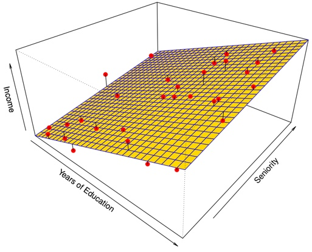
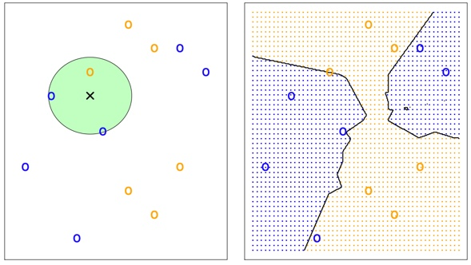

# Statistical Learning {#learning}

**Learning objectives:**

- Understand Vocabulary for prediction
- Understand "Error"/Accuracy
- Understand Parametric vs Nonparametric Models
- Describe the trade-off between more accurate models and more interpretable models.
- Compare and contrast supervised and unsupervised learning.
- Compare and contrast regression and classification problems.
- Measure the accuracy/goodness of regression model fits.
- Measure the accuracy/goodness of classification model fits.
- Describe how bias and variance contribute to the model error.
- Understand overfitting.
- Recognize KNN.
- Understand the role of tuning in ML models.

```{r 02-setup, echo = FALSE}
knitr::opts_chunk$set(include = TRUE)
```

```{r 02-library, echo=FALSE}
# Helper packages - need dplyr and ggplot
suppressPackageStartupMessages(library(tidyverse))
library(ggthemes)
suppressPackageStartupMessages(library(tidymodels))
tidymodels_prefer()
library(knitr)
```


## Advertising Example

Data set consists of the sales of that product in 200 different markets, along with advertising budgets for the product in each of those markets for three different media: TV, radio, and newspaper.


## Terms
In this setting, the advertising budgets are <mark>*input variables*</mark> while sales is an <mark>*output variable*</mark>. The input variables are typically denoted using the symbol $X$, with a subscript to distinguish them. So $X_1$ might be the `TV` budget, $X_2$ the `radio` budget, and $X_3$ the `newspaper` budget. The inputs go by different names, such as <mark>*predictors*, *independent variables*, *features*</mark>, or sometimes just <mark>*variables*</mark>. The output variable in this case, sales is often called the <mark>*response*</mark> or <mark>*dependent variable*</mark>, and is typically denoted using the symbol $Y$. Throughout this book, we will use all of these terms interchangeably.

## Equation 2.1
We assume that there is some relationship between $Y$ and $X = (X_1, X_2,\dots,X_p)$, which can be written in the very general form

\begin{equation}
y = f(X) + \epsilon
\end{equation}

Here $f$ is some fixed but unknown function of $X_1, \dots, X_p$, and $\epsilon$ is a random <mark>*error term*</mark>, which is independent of $X$ and has mean zero. In this formulation, $f$ represents the <mark>*systematic*</mark> information that $X$ provides about $Y$.

## Error terms


The vertical lines represent the error terms $\epsilon$.


## Error Terms Two Predictors


Here $f$ is a two-dimensional surface that must be estimated based on the observed data.

> In essence, statistical learning refers to a set of approaches for estimating $f$. 

## Why Estiamte $f$?

There are two main reasons that we may wish to estimate $f$: *prediction* and *inference*. 

## Prediction

In many situations, a set of inputs X are readily available, but the output Y cannot be easily obtained. In this setting, since the error term averages to zero, we can predict Y using 

\begin{equation}
\hat{Y} = \hat{f}(X)
\end{equation}

$\hat{f}$ is often treated as a *black box*, 

>One is not typically concerned with the exact form of $\hat{f}$, provided that it yields accurate predictions for Y.

## Accuracy
The accuracy of $\hat{y}$ as a prediction for $y$ depends on two quantities, which we will call the <mark>*reducible error*</mark> and the <mark>*irreducible error*</mark>. In general, $\hat{f}$ will not be perfect estimate for $f$, and this inaccuracy will introduce some error. This error is reducible because we can potentially improve the accuracy of $\hat{f}$ by using the most appropriate statistical learning technique to estimate $f$. 

Even if it were possible to form a perfect estimate for $f$,  <mark>our prediction would still have some error in it!</mark> This is because $Y$ is also a function of $\epsilon$, which, by definition, cannot be predicted using $X$. 

Therefore, variability associated with $\epsilon$ also affects the accuracy of our predictions. This is known as the *irreducible* error, because no matter how well we estimate $f$, we cannot reduce the error introduced by $\epsilon$. 

The quantity $\epsilon$ may contain unmeasured variables that are useful in predicting $Y$

## Reducible vs Irreducible Error
Consider a given estimate $\hat{f}$ and a set of predictors $X$, which yields the prediction $\hat{Y} = \hat{f}(X)$. It is easy to show that

 

where $\mathrm{E}(Y -\hat{Y})^2$ represents the average, or *expected value*, of the squared difference between the predicted and actual value of $Y$, and Var( $\epsilon$ ) represents the variance associated with the error term $\epsilon$. 

>The focus of this book is on techniques for estimating $f$ with the aim of minimizing the reducible error. It is important to keep in mind that the irreducible error will always provide an upper bound on the accuracy of our prediction for $Y$. This bound is almost always unknown in practice.

## Inference

We are often interested in understanding the association between $Y$ and $X_1,\dots,X_p$. In this situation we wish to estimate $f$, but <mark>our goal is not necessarily to make predictions for $Y$</mark>. Now $\hat{f}$ cannot be treated as a black box, because we need to know its exact form. 

+ Which predictors are associated with the response? 
+ What is the relationship between the response and each predictor? 
+ Can the relationship between $Y$ and each predictor be adequately summarized using a linear equation, or is the relationship more complicated?

## Linear Model

Depending on whether our ultimate goal is prediction, inference, or a combination of the two, different methods for estimating $f$ may be appropriate. 

<mark>*Linear models*</mark> allow for relatively simple and interpretable inference, but may not yield as accurate predictions as some other approaches. 

> In contrast, some of the highly non-linear approaches that we discuss in the later chapters of this book can potentially provide quite accurate predictions for $Y$, but this comes at the expense of a less interpretable model for which inference is more challenging.

## Parametric methods $_{(1)}$

We make an assumption about the functional form, or shape, of $f$. For example, one very simple assumption is that $f$ is linear in $X$:

$$
f(X) = \beta_0 + \beta_1X_1 + \beta_2X_2 + ··· + \beta_pX_p.
$$
Instead of having to estimate an entirely arbitrary $p$-dimensional function $f(X)$, one only needs to estimate the $p + 1$ coefficients $\beta_0, \beta_1, \dots, \beta_p$.

## Parametric methods $_{(2)}$

We need a procedure that uses the training data to fit or train the model. In the case of the linear model, we need to estimate the parameters $\beta_0, \beta_1,\dots, \beta_p$. That is, we want to find values of these parameters such that $$Y \approx \beta_0 + \beta_1 X_1 + \beta_2 X_2 + ... + \beta_pX_p.$$
The most common approach to fitting the model is referred to as <mark>*(ordinary) least squares*</mark>, which we discuss in [Chapter 3](#linear).

## Parametric methods $_{(3)}$ - Easier than an arbitray function

The model-based approach just described is referred to as *parametric*; it reduces the problem of estimating $f$ down to one of estimating a set of parameters. It is generally much easier to estimate a set of parameters, such as $\beta_0, \beta_1, \dots, \beta_y$ in the linear model, than it is to fit an entirely arbitrary function $f$. 

## Parametric methods $_{(4)}$ - Disadvantage

> The potential disadvantage of a parametric approach is that the model we choose will usually not match the true unknown form of $f$. If the chosen model is too far from the true $f$, then our estimate will be poor. 

We can try to address this problem by choosing <mark>*flexible*</mark> models that can fit many different possible functional forms for $f$. 

> These more complex models can lead to a phenomenon known as <mark>*overfitting*</mark> the data, which essentially means they follow the errors, or noise, too closely. 


## Basic Parametric Model


Figure shows an example of the parametric approach applied to the `Income` data. We have fit a linear model of the form $$\tt{income} \approx \beta_0 + \beta_1 \times \tt{education} + \beta_2 \times \tt{seniority}.$$ We can see that the linear fit given in Figure 2.4 is not quite right: the true $f$ has some curvature that is not captured in the linear fit.

## Non-Parametric Methods

> Non-parametric methods don't make explicit assumptions about the functional form of $f$ 

Instead they seek an estimate of $f$ that gets as close to the data points as possible without being too rough or wiggly. 

Any parametric approach brings with it the possibility that the functional form used to estimate $f$ is very different from the true $f$, in which case the resulting model will not fit the data well. 

In contrast, non-parametric approaches completely avoid this danger, since <mark>essentially no assumption about the form of $f$ is made.</mark>

But non-parametric approaches do suffer from a major disadvantage: 

>very large number of observations (far more a than is typically needed for a parametric approach) is required in order to obtain an accurate estimate for $f$.

## Thin plate splines


<br>

A <mark>*thin-plate spline*</mark> is used to estimate $f$. This approach does not impose any pre-specified model on $f$. It instead attempts to produce an estimate for $f$ that is as close as possible to the observed data, subject to the fit that is, the yellow surface being *smooth*.

Second plot shows the same thin-plate spline fit using a <mark>lower level of smoothness</mark>, allowing for a rougher fit. The resulting estimate fits the observed data perfectly! This is an example of overfitting the data.

## Prediction Accuracy vs Model Interpretability

*Why would we ever choose to use a more restrictive method instead of a very flexible approach?* 

> If we are mainly interested in inference, then restrictive models are much more interpretable.  

Very flexible approaches, can lead to such complicated estimates of $f$ that it is difficult to understand how any individual predictor is associated with the response.

+ Least squares linear regression is relatively inflexible but is quite interpretable. 
+ Lasso, less flexible approach than linear regression. It is also more interpretable
+ Generalized additive models (GAMs), more flexible than linear regression

Fully non-linear methods are highly flexible approaches that are harder to interpret.

+ bagging
+ boosting
+ support vector machines with non-linear kernels
+ neural networks (deep learning)

## Supervised Versus Unsupervised Learning

Most statistical learning problems fall into one of two categories: <mark>*supervised*</mark> or <mark>*unsupervised*</mark>.

> With unsupervised learning, there is no response variable to predict. The goal of cluster analysis is to ascertain, on the basis of $x_1,\dots, x_n$, whether the observations fall into relatively distinct groups. 


## Regression Versus Classification Problems

Variables can be characterized as either <mark>*quantitative*</mark> or <mark>*qualitative*</mark> (categorical). 

> Quantitative variables take on numerical values. In contrast, qualitative variables take on values in one of *K different* <mark>*classes*</mark>, or categories. 

## Assessing Model Accuracy

> *There is no free lunch in statistics*: no one method dominates all others over all possible data sets. On a particular data set, one specific method may work best, but some other method may work better on a similar but different data set.

## MSE 

We need some way to measure how well its predictions actually match the observed data. 

> In the regression setting, the most commonly-used measure is the <mark>*mean squared error*</mark> (MSE), given by 
$$ MSE = \frac{1}{n}\sum_{i=1}^n(y_i-\hat{f}(x_i))^2,$$

The MSE will be small if the predicted responses are very close to the true responses,and will be large if for some of the observations, the predicted and true responses differ substantially.

## Training vs. Test
The MSE in the above equation is computed using the training data that was used to fit the model, and so should more accurately be referred to as the <mark>*training MSE*</mark>. 

>In general, we do not really care how well the method works on the training data. 

We are interested in the accuracy of the predictions that we obtain when we apply our method to previously unseen  <mark>*test data*</mark>. 

$$\mathrm{Ave}(y_0 - \hat{f}(x_0))^2 ,$$

We'd like to select the model for which this quantity is as small as possible on future samples.

## Overfitting with Increased Flexiblity


<br><br>
</hr>
 

## Interpretation

The <mark>*degrees of freedom*</mark> is a quantity that summarizes the flexibility of a curve. The training MSE declines monotonically as flexibility increases.

<mark>As model flexibility increases, training MSE will decrease, but the test MSE may not.</mark> When a given method yields a small training MSE but a large test MSE, we are said to be *overfitting* the data. 

> Overfitting refers specifically to the case in which a less flexible model would have yielded a smaller test MSE.

## The Bias-Variance Trade-Off

MSE, for a given value, can always be decomposed into the sum of three fundamental quantities: the <mark>*variance*</mark> of $\hat{f}(x_0)$, the squared <mark>*bias*</mark> of $\hat{f}(x_0)$ and the variance of the <mark>error terms</mark> $\epsilon$. That is,

$$E\big(y_0 - \hat{f}(x_0)\big)^2 = \mathrm{Var}\big(\hat{f}(x_0)\big) +[\mathrm{Bias}\big(\hat{f}(x_0)\big)]^2 + \mathrm{Var}(\epsilon)$$

Here the notation $E\big(y_0 - \hat{f}(x_0)\big)^2$ defines the <mark>*expected test MSE*</mark> at $x_0$ and refers to the average test MSE that we would obtain if we repeatedly estimated $f$ using a <mark>large number of training sets</mark>, and tested each at $x_0$. The overall expected test MSE can be computed by averaging $E \big(y_0 - \hat{f}x(x_0)\big)^2$ over all possible values of $x_0$ in the test set

> We need to select a statistical learning method that simultaneously achieves low variance and low bias.

## Bias-Variance Trade-Off
As we use more flexible methods, the variance will increase and the bias will decrease. As we increase the flexibility of a class of methods, the bias tends to initially decrease faster than the variance increases. However, at some point increasing flexibility has little impact on the bias but starts to significantly increase the variance. When this happens the test MSE increases. 

 

In all three cases, the variance increases and the bias decreases as the method’s flexibility increases. The relationship between bias, variance, and test set MSE given is referred to as the <mark>*bias-variance trade-off*</mark>. 

> The challenge lies in finding a method for which both the variance and the squared bias are low. This trade-off is one of the most important recurring themes in this book.

## The Classification Setting

The most common approach for quantifying the accuracy of our estimate $\hat{f}$ is the training <mark>*error rate*</mark>, the proportion of mistakes that are made if we apply our estimate $\hat{f}$ to the training observations:
$$\frac{1}{n}\sum_{i=1}^{n}I(y_i \ne \hat{y}_i).$$

The above equation computes the fraction of incorrect classifications.

Equation is referred to as the <mark>*training error*</mark> rate because it is computed based on the data that was used to train our classifier. 

> We are most interested in the error rates that result from applying our classifier to test observations that were not used in training. 

## Test Error
The <mark>*test error*</mark> rate associated with a set of test observations of the form $(x_0, y_0)$ is given by

$$\mathrm{Ave}\big(I(y_i \ne \hat{y}_i)\big).$$

Where $\hat{y}_0$ is the predicted class label that results from applying the classifier to the test observation with predictor $x_0$. A good classifier is one for which the test error is smallest.

## The Bayes Classifier

The test error rate is minimized, on average, by a very simple classifier that *assigns each observation to the most likely class, given its predictor values*. In other words, we should simply assign a test observation with predictor vector $x_0$ to the class $j$ for which

$$\mathrm{Pr}(Y=j|X=x_0).$$

Note that is a <mark>*conditional probability*</mark>: it is the probability that $Y = j$, given the observed predictor vector $X_0$. This very simple classifier is called the <mark>*Bayes classifier*</mark>.

## Bayes Classifier Decision Boundry


The purple dashed line represents the points where the probability is exactly 50%. This is called the <mark>*Bayes decision boundary*</mark>. An observation that falls on the orange side of the boundary will be assigned to the orange class, and similarly an observation on the blue side of the boundary will be assigned to the blue class.

> The Bayes classifier produces the lowest possible test error rate, called the <mark>*Bayes error rate*</mark>. 

The overall Bayes error rate is given by

$$1- E\big(\mathop{\mathrm{max}}_{j}(Y=j|X)\big),$$

where the expectation averages the probability over all possible values of X. The Bayes error rate is analogous to the irreducible error, discussed earlier.

## K-Nearest Neighbors

For real data, we do not know the conditional distribution of $Y$ given $X$, and so computing the Bayes classifier is impossible. 

Many approaches attempt to estimate the conditional distribution of $Y$ given $X$, and then classify a given observation to the class with highest estimated probability. One such method is the <mark>*K-nearest neighbors*</mark> (KNN) classifier. 

Given a positive integer K and a test observation $t_{0}$, the KNN classifier first identifies the K points in the training data that are closest to $x_0$

$$\mathrm{Pr}(Y=j|X=x_0) = \frac{1}{K}\sum_{i \in \mathcal{N}_0} I (y_i = j)$$

Finally, KNN classifies the test observation $x_0$ to the class with the largest probability.



The KNN approach with $K$ = 3 at all of the possible values for $X_1$ and $X_2$, and have drawn in the corresponding KNN decision boundary.

Despite the fact that it is a very simple approach, KNN can often produce classifiers that are surprisingly close to the optimal Bayes classifier.

## KNN with Different K


<br>

> The choice of K has a drastic effect on the KNN classifier obtained.

## KNN Tuning


There is not a strong relationship between the training error rate and the test error rate. 

> As we use more flexible classification methods, the training error rate will decline but the test error rate may not. 

As $1/K$ increases, the method becomes more flexible. As in the regression setting, the training error rate consistently declines as the flexibility increases. 

However, the test error exhibits a characteristic U-shape, declining at first (with a minimum at approximately $K$ = 10) before increasing again when the method becomes excessively flexible and overfits.

