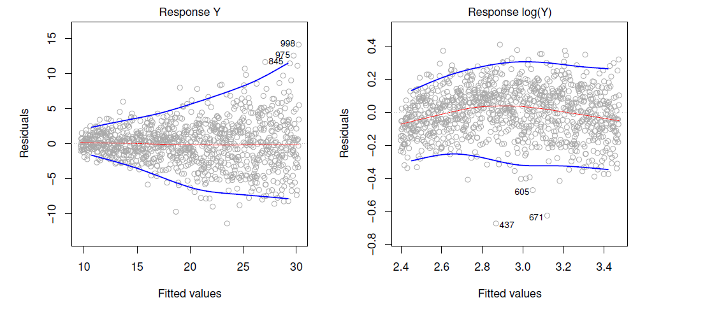
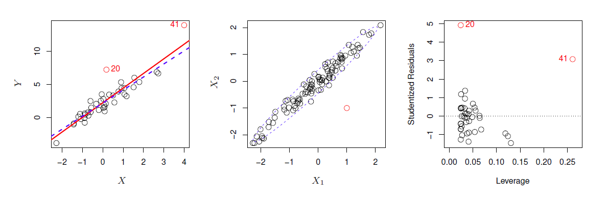

# Linear Regression {#linear}

**Learning objectives:**

- Perform linear regression with a **single predictor variable.**
- Estimate the **standard error** of regression coefficients.
- Evaluate the **goodness of fit** of a regression.
- Perform linear regression with **multiple predictor variables.**
- Evaluate the **relative importance of variables** in a multiple linear regression.
- Include **interaction effects** in a multiple linear regression.
- Perform linear regression with **qualitative predictor variables.**
- Model **non-linear relationships** using polynomial regression.
- Identify **non-linearity** in a data set.
- Compare and contrast linear regression with **KNN regression.**

## Questions to Answer

Recall the `Advertising` data from [Chapter 2](#learning). Here are a few important questions that we might seek to address:

1. **Is there a relationship between advertising budget and sales?**
2. **How strong is the relationship between advertising budget and sales?** Does knowledge of the advertising budget provide a lot of information about product sales?
3. **Which media are associated with sales?**
4. **How large is the association between each medium and sales?** For every dollar spent on advertising in a particular medium, by what amount will sales increase? 
5. **How accurately can we predict future sales?**
6. **Is the relationship linear?** If there is approximately a straight-line relationship between advertising expenditure in the various media and sales, then linear regression is an appropriate tool. If not, then it may still be possible to transform the predictor or the response so that linear regression can be used.
7. **Is there synergy among the advertising media?** Or, in stats terms, is there an interaction effect?

## Simple Linear Regression: Definition

**Simple linear regression:** Very straightforward approach to predicting response $Y$ on predictor $X$.

$$Y \approx \beta_{0} + \beta_{1}X$$

- Read "$\approx$" as *"is approximately modeled by."*
- $\beta_{0}$ = intercept
- $\beta_{1}$ = slope

$$\hat{y} = \hat{\beta}_{0} + \hat{\beta}_{1}x$$

- $\hat{\beta}_{0}$ = our approximation of intercept
- $\hat{\beta}_{1}$ = our approximation of slope
- $x$ = sample of $X$
- $\hat{y}$ = our prediction of $Y$ from $x$
- hat symbol denotes "estimated value" 

- Linear regression is a simple approach to supervised learning

## Simple Linear Regression: Visualization

```{r fig3-1, cache=FALSE, echo=FALSE, fig.align="center", fig.cap="For the `Advertising` data, the least squares fit for the regression of `sales` onto `TV` is shown. The fit is found by minimizing the residual sum of squares. Each grey line segment represents a residual. In this case a linear fit captures the essence of the relationship, although it overestimates the trend in the left of the plot."}

knitr::include_graphics("./images/fig3_1.jpg", error = FALSE)
```

## Simple Linear Regression: Math

- **RSS** = *residual sum of squares*

$$\mathrm{RSS} = e^{2}_{1} + e^{2}_{2} + \ldots + e^{2}_{n}$$

$$\mathrm{RSS} = (y_{1} - \hat{\beta}_{0} - \hat{\beta}_{1}x_{1})^{2} + (y_{2} - \hat{\beta}_{0} - \hat{\beta}_{1}x_{2})^{2} + \ldots + (y_{n} - \hat{\beta}_{0} - \hat{\beta}_{1}x_{n})^{2}$$

$$\hat{\beta}_{1} = \frac{\sum_{i=1}^{n}{(x_{i}-\bar{x})(y_{i}-\bar{y})}}{\sum_{i=1}^{n}{(x_{i}-\bar{x})^{2}}}$$
$$\hat{\beta}_{0} = \bar{y} - \hat{\beta}_{1}\bar{x}$$

- $\bar{x}$, $\bar{y}$ = sample means of $x$ and $y$

### Visualization of Fit

```{r fig3-2, cache=FALSE, echo=FALSE, fig.align="center", fig.cap="Contour and three-dimensional plots of the RSS on the `Advertising` data, using `sales` as the response and `TV` as the predictor. The red dots correspond to the least squares estimates $\\hat\\beta_0$ and $\\hat\\beta_1$, given by (3.4)"}

knitr::include_graphics("./images/fig3_2.jpg", error = FALSE)
```

**Learning Objectives:**

- Perform linear regression with a **single predictor variable.** `r emo::ji("heavy_check_mark")`

## Assessing Accuracy of Coefficient Estimates

$$Y = \beta_{0} + \beta_{1}X + \epsilon$$

- **RSE** = *residual standard error*
- Estimate of $\sigma$

$$\mathrm{RSE} = \sqrt{\frac{\mathrm{RSS}}{n - 2}}$$
$$\mathrm{SE}(\hat\beta_0)^2 = \sigma^2 \left[\frac{1}{n} + \frac{\bar{x}^2}{\sum_{i=1}^n (x_i - \bar{x})^2}\right],\ \ \mathrm{SE}(\hat\beta_1)^2 = \frac{\sigma^2}{\sum_{i=1}^n (x_i - \bar{x})^2}$$

- **95% confidence interval:** a range of values such that with 95% probability, the range will contain the true unknown value of the parameter
  - If we take repeated samples and construct the confidence interval for each sample, 95% of the intervals will contain the true unknown value of the parameter

$$\hat\beta_1 \pm 2\ \cdot \ \mathrm{SE}(\hat\beta_1)$$
$$\hat\beta_0 \pm 2\ \cdot \ \mathrm{SE}(\hat\beta_0)$$
**Learning Objectives:**

- Estimate the **standard error** of regression coefficients. `r emo::ji("heavy_check_mark")`

## Assessing the Accuracy of the Model

- **RSE** can be considered a measure of the *lack of fit* of the model. 
a
- *$R^2$* statistic provides an alternative that is in the form of a *proportion of the variance explained*, ranges from 0 to 1, a *good value* depends on teh application.

$$R^2 = 1 - \frac{RSS}{TSS}$$
where TSS is the *total sum of squarse*:
$$TSS = \Sigma (y_i - \bar{y})^2$$

## Multiple Linear Regression

**Multiple linear regression** extends simple linear regression for *p* predictors:

$$Y = \beta_{0} + \beta_{1}X_1 + \beta_{2}X_2 + ... +\beta_{p}X_p + \epsilon_i$$
- $\beta_{j}$ is the *average* effect on $Y$ from $X_{j}$ holding all other predictors fixed.  

- Fit is once again choosing the $\beta_{j}$ that minimizes the RSS.

- Example in book shows that although fitting *sales* against *newspaper* alone indicated a significant slope (0.055 +- 0.017), when you include *radio* in a multiple regression, *newspaper* no longer has any significant effect. (-0.001 +- 0.006) 

### Important Questions

1. *Is at least one of the predictors $X_1$, $X_2$,  ... , $X_p$ useful in predicting
the response?*

    F statistic close to 1 when there is no relationship, otherwise greater then 1.

$$F = \frac{(TSS-RSS)/p}{RSS/(n-p-1)}$$

2. *Do all the predictors help to explain $Y$ , or is only a subset of the
predictors useful?*

   p-values can help identify important predictors, but it is possible to be mislead by this especially with large number of predictors. Variable selection methods include Forward selection, backward selection and mixed. Topic is continued in Chapter 6.

3. *How well does the model fit the data?*

    **$R^2$** still gives *proportion of the variance explained*, so look for values "close" to 1. Can also look at **RSE** which is generalized for multiple regression as:
    
$$RSE = \sqrt{\frac{1}{n-p-1}RSS}$$
    

4. *Given a set of predictor values, what response value should we predict,
and how accurate is our prediction?* 

    Three sets of uncertainty in predictions:
    
    * Uncertainty in the estimates of $\beta_i$
    * Model bias
    * Irreducible error $\epsilon$

## Qualitative Predictors

* Dummy variables: if there are $k$ levels, introduce $k-1$ dummy variables which are equal to one ("one hot") when the underlying qualitative predictor takes that value. For example if there are 3 levels, introduce two new dummy variables and fit the model:

$$y_i = \beta_0 + \beta_1 x_{i1} + \beta_2 x_{i2} + \epsilon_i$$

| Qualitative Predicitor | $x_{i1}$ | $x_{i2}$ |
| ---------------------- |:--------:|:--------:|
| level 0    (baseline)  |    0     |    0     |
| level 1                |    1     |    0     |
| level 2                |    0     |    1     |

* Coefficients are interpreted the average effect relative to the baseline.

* Alternative is to use index variables, a different coefficient for each level:

$$y_i = \beta_{0 1} + \beta_{0 2} +\beta_{0 3} + \epsilon_i$$
    
## Extensions

- Interaction / Synergy effects
    
    Include a product term to account for synergy where one changes in one variable changes the association of the Y with another:
    
$$Y = \beta_{0} + \beta_{1}X_1 + \beta_{2}X_2 +  \beta_{3}X_1 X_2 + \epsilon_i$$
    
- Non-linear relationships (e.g. polynomial fits)

$$Y = \beta_{0} + \beta_{1}X + \beta_{2}X^2 + ... \beta_{n}X^n + \epsilon_i$$

## Potential Problems

1. *Non-linear relationships* 

    Residual plots are useful tool to see if any remaining trends exist. If so consider fitting transformation of the data. 
    
2. *Correlation of Error Terms*

    Linear regression assumes that the error terms $\epsilon_i$ are uncorrelated. Residuals may indicate that this is not correct (obvious *tracking* in the data). One could also look at the autocorrelation of the residuals. What to do about it?
    
3. *Non-constant variance of error terms*

    Again this can be revealed by examining the residuals.  Consider transformation of the predictors to remove non-constant variance. The figure below shows residuals demonstrating non-constant variance, and shows this being mitigated to a great extent by log transforming the data.
    
    

4. *Outliers*

   - Outliers are points with for which $y_i$ is far from value predicted by the model (including irreducible error).  See point labeled '20' in figure 3.13.
   - Detect outliers by plotting studentized residuals (residual $e_i$ divided by the estimated error) and look for residuals larger then 3 standard deviations in absolute value.
   - An outlier may not effect the fit much but can have dramatic effect on the **RSE**. 
   - Often outliers are mistakes in data collection and can be removed, but could also be an indicator of a deficient model.  

5. *High Leverage Points* 

   - These are points with unusual values of $x_i$.  Examples is point labeled '41' in figure 3.13.
   - These points can have large impact on the fit, as in the example, including point 41 pulls slope up significantly.
   - Use *leverage statistic* to identify high leverage points, which can be hard to identify in multiple regression.
   
 
6. *Collinearity*

   - Two or more predictor variables are closely related to one another.
   - Simple collinearity can be identified by looking at correlations between predictors. 
   - Causes the standard error to grow (and p-values to grow)
   - Often can be dealt with by removing one of the highly correlated predictors or combining them. 
   - *Multicollinearity* (involving 3 or more predictors) is not so easy to identify. Use *Variance inflation factor*, which is the ratio of the variance of $\hat{\beta_j}$ when fitting the full model to fitting the parameter on its own. Can be computed using the formula:
    
$$VIF(\hat{\beta_j}) = \frac{1}{1-R^2_{X_j|X_{-j}}}$$
    where $R^2_{X_j|X_{-j}}$ is the $R^2$ from a regression of $X_j$ onto all the other predictors.
    
## Answers to the Marketing Plan questions

1. **Is there a relationship between advertising budget and sales?**

    Tool: Multiple regression, look at F-statistic.

2. **How strong is the relationship between advertising budget and sales?** 

    Tool: **$R^2$** and **RSE**
    
3. **Which media are associated with sales?**
 
    Tool: p-values for each predictor's *t-statistic*.  Explored further in chapter 6.

4. **How large is the association between each medium and sales?**

    Tool: Confidence intervals on $\hat{\beta_j}$

5. **How accurately can we predict future sales?**

    Tool:: Prediction intervals for individual response, confidence intervals for average response.
    
    
6. **Is the relationship linear?** 

    Tool: Residual Plots
    
7. **Is there synergy among the advertising media?** 

    Tool: Interaction terms and associated p-vales.
    
## Comparison of Linear Regression with K-Nearest Neighbors

- This section examines the K-nearest neighbor (KNN) method (a non-parameteric method).
- This is essentially a k-point moving average.
- This serves to illustrate the Bias-Variance trade-off nicely  


## Meeting Videos

### Cohort 1

`r knitr::include_url("https://www.youtube.com/embed/dqA5MNNDqcE")`

<details>
<summary> Meeting chat log </summary>

```
00:07:48	A. S. Ghatpande:	Good morning
00:07:56	Daniel Lupercio:	Good morning everyone!
00:08:56	Kim Martin:	👋😁
00:10:32	Kim Martin:	If linear regression had a motto: "I contain multitudes!"
00:11:06	Raymond Balise:	+1 @Kim
00:15:43	Gianluca Pegoraro:	Is the “approximately modeled by” sign due to the existence of the irreducible error + reducible error?
00:15:45	Kim Martin:	Notation can be a surprisingly large barrier... and not hard to get over, when handled head-on.
00:16:18	Kim Martin:	@Gianluca I think the irreducible error is a given - even the 'true' function will suffer from irreducible error.
00:16:53	Gianluca Pegoraro:	Thanks everyone for the answer
00:16:56	Kim Martin:	God plays dice? ;)
00:18:08	Ryan Metcalf:	For the team, has anyone ever created the plot in Figure 3.1? The same that Jon is sharing?
00:18:10	Kim Martin:	Anyone know if there are any spaced repetition (eg AnkiDroid) cards for ISLR2 terms?
00:18:31	Kim Martin:	If not, should we create them?
00:18:59	Raymond Balise:	there is a package for that :)
00:19:07	Raymond Balise:	no idea what it is but there is one
00:19:39	Raymond Balise:	@ryan yep I have it somewhere
00:19:53	Raymond Balise:	will share it in the channel
00:20:21	collinberke:	I also have some resources as well, @Ryan Metcalf.
00:21:38	Kim Martin:	RSS seems worded strangely: wouldn't it make more sense to call it "sum of residual squares"?
00:22:01	Daniel Lupercio:	Some partial derivatives are used to find the minimization
00:22:05	jonathan.bratt:	Yeah, I think “SRS” or “SSR” would be easier to remember. :)
00:23:55	Kim Martin:	I think this might be a good walkthrough of the proof, if my notes are correct: https://www.khanacademy.org/math/statistics-probability/describing-relationships-quantitative-data/more-on-regression/v/proof-part-4-minimizing-squared-error-to-regression-line
00:28:12	Kaustav Sen:	is there any particular reason for doing (n-2) instead of n in the RSE formula?
00:28:34	jonathan.bratt:	something something degrees of freedom
00:28:38	Rahul T:	Might be related to Degree of freedom?
00:28:54	Rahul T:	We are estimating 2 beta params
00:29:22	Rahul T:	My guess not sure
00:29:33	Kaustav Sen:	ah.. makes sense.  thanks!
00:30:23	August:	I'm happy to read on
00:30:23	Kim Martin:	I'm struggling to keep up - life getting in the way... wouldn't say no to a go slow
00:30:53	Kim Martin:	What is more important: speed or solidity ;)
00:31:08	Raymond Balise:	I like your presentation would rather wait
00:31:57	A. S. Ghatpande:	sounds good, thanks
```
</details>

`r knitr::include_url("https://www.youtube.com/embed/PFhVGNzraoE")`

<details>
<summary> Meeting chat log </summary>

```
00:09:43	jonathan.bratt:	Is that Curious George as the Joker?
00:12:15	Kim Martin:	👋😁
00:13:58	Kim Martin:	Time to grab a coffee still?
00:14:08	SriRam:	Hi All, I missed the last class, may I know where we stopped the last time
00:14:50	Kim Martin:	Signup https://docs.google.com/spreadsheets/d/1_pIPi68R_FwpzK_uMCRSKen9gdQLBx4sN3uifL-g_Nw/edit?usp=sharing
00:27:20	Raymond Balise:	what was pluck() function?  why use it instead of pull()
00:28:01	SriRam:	May be revisit your code, I think values in the book are incorrect ? I may be wrong
00:31:35	SriRam:	Eq 3.14 vs table 3.1, I don’t get the same values
00:37:39	Keuntae Kim:	7.0325/0.4578 = 15.36...
00:38:16	Keuntae Kim:	The null hypothesis in this case is that the coefficient estimate is zero, which is not our expectation.
00:39:42	Keuntae Kim:	Ha - H0 / SE = t-value
00:46:59	Jon Harmon (jonthegeek):	"Akaike information criterion"
00:47:29	Jon Harmon (jonthegeek):	I was hoping to hear someone pronounce that 🙃
00:48:23	SriRam:	Thank you Kim, its the second value that seems incorrect 0.0475/0.0027
00:50:20	Rahul T:	Also allows to invert X’X
00:50:43	Rahul T:	I thought that was one of the reason
00:57:25	jonathan.bratt:	Who can say “heteroscedasticity” fast?
00:59:03	Kim Martin:	(good drinking game material, that)
00:59:39	Raymond Balise:	+1 Kim
01:00:58	Keuntae Kim:	The book does not mention about rule of thumbs for the VIF to evaluate the multicollinearity in the regression. What about your field?
01:02:04	Keuntae Kim:	Rule of thumbs for VIF to test collinearity when you create a linear regression model?
01:03:45	Raymond Balise:	I usually look in a SAS book at the office with a real formula…. but I think 5 is where you worry
01:04:35	Raymond Balise:	van Belle has a book on statistical rules of thumb that is another place to look
01:04:42	Keuntae Kim:	Someone says 2.5 or 3 and others also says 10.
01:05:00	Raymond Balise:	10 is a for sure you have a prolem
01:05:13	Keuntae Kim:	Got it.
01:05:24	Federica Gazzelloni:	can you share the github thing?
01:05:44	Raymond Balise:	If I see something over 5 I will drop variables and see how much the betas shift around
01:08:45	A. S. Ghatpande:	thanks August
```
</details>

`r knitr::include_url("https://www.youtube.com/embed/Y5dz5ExYGxI")`

<details>
<summary> Meeting chat log </summary>

```
00:04:59	Kim Martin:	👋😁
00:05:12	Mei Ling Soh:	Hihi!
00:21:08	August:	python plots work the saem way
00:21:13	August:	^same
00:21:14	Laura Rose:	yes
00:23:21	Laura Rose:	i agree
00:23:26	Daniel Lupercio:	Spot on
00:24:23	Federica Gazzelloni:	tidymodels
00:36:16	David Severski:	FYI, in zoom you can now share multiple apps at once by shift clicking on the window inside the share tray. 🙂
00:41:49	Mei Ling Soh:	I'm not following the tidymodels. Is there any introductory kind books for me to read on?
00:42:19	SriRam:	https://www.tidymodels.org/learn/
00:42:26	David Severski:	As a tidymodels convert, the real power comes when you are doing lots of different model types with different specifications and/or want to do tuning in a model-implementation independent fashion.
00:43:22	A. S. Ghatpande:	ISLR is much heavier lift than tidymodels
00:44:38	SriRam:	I prefer tidy style as it allows dplyr with it, I find dplyr easy to handle data
00:46:46	Federica Gazzelloni:	is there any difference in fitting interaction terms between classical model and tidymodels?
00:49:39	Daniel Lupercio:	The interaction being that the variables are multiplied?
00:49:50	SriRam:	I am getting a feeling that this (tidy) steps is like ggplot, adding layers to core model
00:50:13	Ryan Metcalf:	@SriRam, I would agree!
00:50:44	David Severski:	I’ve never found a complete reference to all the special operators within R model formulas… Anyone got one? Interaction, I(), power, multiplicity, etc...
00:50:59	Jon Harmon (jonthegeek):	step_interact(terms = ~ body_mass_g:starts_with("species"))
00:53:32	Federica Gazzelloni:	in general the use of step_interact is with all predictors, but in particular case you might need to choose just one or two predictors
00:54:31	SriRam:	I was also confused with the colon :  and the word “step”, I thought, this was stepwise regression with all predictors
00:55:19	Mei Ling Soh:	Me too. I was thinking about the stepwise regression
00:56:40	Daniel Lupercio:	Execersie 10 seems like a good start
01:02:02	SriRam:	parsnip is by max ? So if I wish, I can do these exercises using parsnip ? I believe there is also a book by max….. predictive models something???
01:05:52	David Severski:	Parsnip is part of the overall tidymodels ecosystem, but Max and the team. The tidymodels books and learning references earlier in the chat cover parsnip.
01:07:34	David Severski:	Oh dear, I never got the caret -> parsnip transition. Total Dad joke. 😛
01:07:57	SriRam:	😀
01:07:58	jonathan.bratt:	Yeah, it’s painfully clever :)
01:08:06	Laura Rose:	yeah i didn't get that either. good dad joke tho
01:08:34	David Severski:	There are three problems in computer science. Naming things and counting. ;)
01:08:39	SriRam:	So what is the latest, so I train myself in that :(
01:09:29	David Severski:	Tidymodels: parsnip + recipes + tuning + …
01:09:42	David Severski:	tidyverse: dplyr + ggplot + forcats + …
01:10:15	David Severski:	Both have metapackages that load the commonly used bits: library(tidymodels) and or library(tidyverse)
01:10:30	SriRam:	So my caret book becomes a paper weight ? :( :(
01:10:47	David Severski:	Caret is still supported, but will no longer get new features.
01:10:56	SriRam:	Oke
01:11:24	Federica Gazzelloni:	it depends if you need to set different parameters to your model, otherwise that is still to use
01:13:20	SriRam:	Time to catch up on chapters !!
01:13:47	Kim Martin:	😐
01:14:01	Federica Gazzelloni:	thanks
```
</details>

### Cohort 2

`r knitr::include_url("https://www.youtube.com/embed/PwJknyq61NQ")`

<details>
<summary> Meeting chat log </summary>
```
00:54:05	Ricardo Serrano:	https://github.com/rserran/melbourne_housing_kaggle
01:12:29	Michael Haugen:	So what do you do instead of p values?
```
</details>

`r knitr::include_url("https://www.youtube.com/embed/OUeMNQVaEvE")`

<details>
<summary> Meeting chat log </summary>
```
00:15:30	Ricardo Serrano:	https://github.com/rserran/melbourne_housing_kaggle
00:26:23	Jim Gruman:	😃 cool - TIL about `ggpubr` - thanks
00:32:04	jlsmith3:	Very cool!
01:03:46	Jim Gruman:	sounds great. thank you Ricardo!
01:06:45	Michael Haugen:	https://docs.google.com/spreadsheets/d/1bqZ5EO_ilCDsCuSr5N0MRJqGFj-Sy0fVRrt5Mw21p48/edit#gid=0
01:06:48	Michael Haugen:	Sign up
01:06:57	jlsmith3:	Thanks for the link!
```
</details>

`r knitr::include_url("https://www.youtube.com/embed/IMeAnVZgtb8")`

<details>
<summary> Meeting chat log </summary>
```
00:24:30	Ricardo Serrano:	https://github.com/rserran/melbourne_housing_kaggle
00:24:39	Federica Gazzelloni:	thanks
00:59:01	Jim Gruman:	tidy(x, conf.int = FALSE, conf.level = 0.95, exponentiate = FALSE, ...)  the exponentiate = TRUE will back out of the log to give just the odds
00:59:04	Anna-Leigh Brown:	https://www.wolframalpha.com/input/?i=logistic+function
01:06:46	Jim Gruman:	I will always question the glm breakpoint of 0.5, A good discussion for offline of a means of adjustment here: https://towardsdatascience.com/bank-customer-churn-with-tidymodels-part-2-decision-threshold-analysis-c658845ef1f
01:07:22	Jim Gruman:	thank you Michael !
01:09:39	jlsmith3:	Thank you, Michael!
01:09:44	Ricardo Serrano:	Thanks, Michael!
```
</details>

### Cohort 3

`r knitr::include_url("https://www.youtube.com/embed/VN_7plsw27I")`

<details>
<summary> Meeting chat log </summary>

```
00:12:38	Rose Hartman:	I think the edx videos are recorded by the authors, right?
00:12:39	Rahul:	https://www.youtube.com/playlist?list=PLOg0ngHtcqbPTlZzRHA2ocQZqB1D_qZ5V
00:50:26	Mei Ling Soh:	https://onmee.github.io/ISLR-Solutions/
01:02:13	Rose Hartman:	Yeah, this was great! Thanks!
```
</details>

`r knitr::include_url("https://www.youtube.com/embed/gpIOZyyK_bU")`

### Cohort 4

`r knitr::include_url("https://www.youtube.com/embed/TZQYnH16lVI")`

<details>
<summary> Meeting chat log </summary>

```
00:12:53	shamsuddeenmuhammad:	Anyone with intuition why this is called Least Square Method?
00:13:10	Ronald Legere:	you are minimizing the squares ;)
00:13:24	Ronald Legere:	"Lease <sum of> square"
00:13:27	Ronald Legere:	*least
00:13:59	shamsuddeenmuhammad:	ok
00:14:04	shamsuddeenmuhammad:	Thank you !
00:14:14	Kevin Kent:	yeah, the choice of coefficients where you are minimizing the sum of squared errors
00:32:32	Ronald Legere:	I just realized one of the real values of these kind of discussions is learning what other people were confused by that you perhaps should have been if you had thought about it more! If you see what I mean ;)
00:32:51	Sandra Muroy:	absolutely!
00:33:50	Kevin Kent:	haha, I love that. but it is really helpful to see how others think about things
00:42:24	Ronald Legere:	https://en.wikipedia.org/wiki/Student%27s_t-distribution
00:44:42	shamsuddeenmuhammad:	My stats is super rusty !
01:04:54	shamsuddeenmuhammad:	ok, thank you !
01:06:49	shamsuddeenmuhammad:	See yah next !
01:06:54	shamsuddeenmuhammad:	I like that too
```
</details>

`r knitr::include_url("https://www.youtube.com/embed/nD7n0PqK26Y")`

`r knitr::include_url("https://www.youtube.com/embed/ZAXtHeALvQU")`
