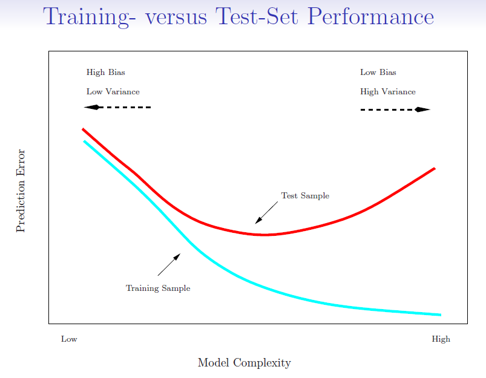
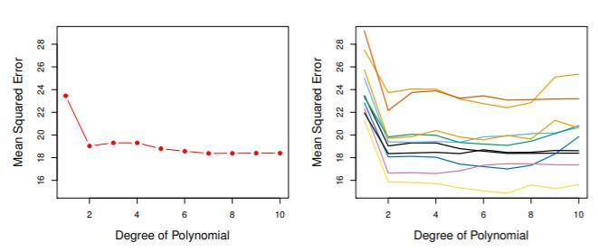
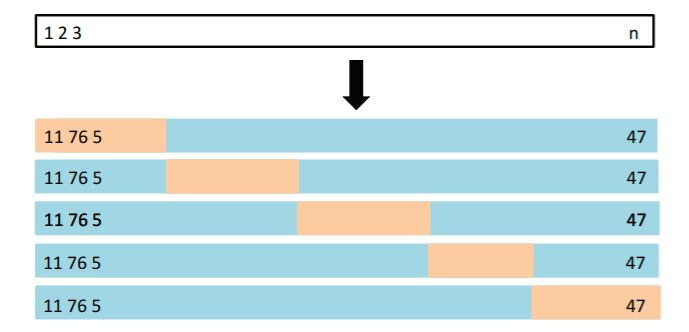
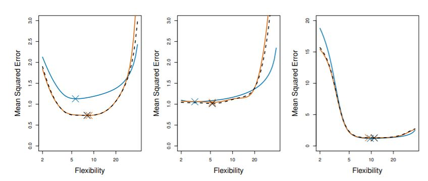
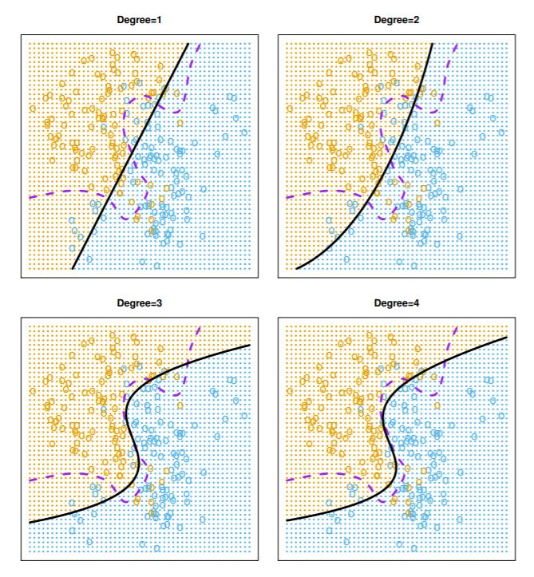
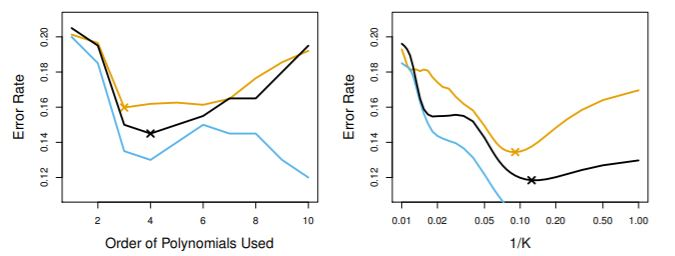
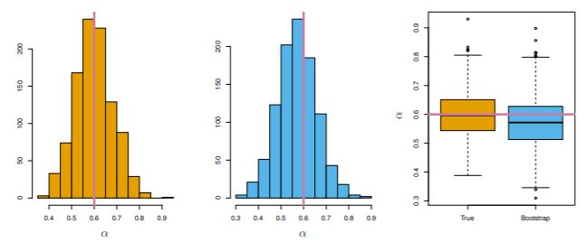

# Resampling Methods

**Learning objectives:**

-   **Big picture** - to learn about 2 resampling methods: **cross-validation** and the **bootstrap**

    -   Both refit a model to samples formed from the training set to obtain additional information about the fitted model: e.g. they provide estimates of test-set prediction error and the standard deviation and bias of parameter estimates.

-   Recall that the training error rate is often quite different from the test error rate and can dramatically underestimate it

```{r fig5-1, echo=FALSE, cache=FALSE, fig.align='center', fig.cap= "Training- versus Test-Set Performance. Source: https://hastie.su.domains/ISLR2/Slides/Ch5_Resampling_Methods.pdf"}



```

-   Best solution is to have a large test set (which is not often available)

-   Some methods (AIC, BIC) make a mathematical adjustment to the training error rate in order to estimate the test error rate.

-   Here we consider methods that estimate the test error by *holding out* a subset of the training observations from the fitting process. Then applying the statistical learning method to those held out observations

We will:

-   Use a **validation set** to estimate the test error of a predictive model.
-   Use **leave-one-out cross-validation** to estimate the test error of a predictive model.
-   Use **K-fold cross-validation** to estimate the test error of a predictive model.
-   Use **the bootstrap** to obtain standard errors of an estimate.
-   Describe the **advantages and disadvantages** of the various methods for estimating model test error.

## Validation Set Approach

-   This involves randomly splitting the data into a *training set* and *validation set*.

    -   Note that in certain applications, such as time series analysis, it is not feasible to randomly split the data.

-   The advantage of the validation set approach is that it is conceptually simple to understand and implement.

-   However, the *validation error rate* is variable depending on the assignment of the training and validation sets.

-   Additionally, we are giving up valuable data points by not using all of the data to estimate the model.

    -   Thus the validation error rate will tend to overestimate the test error rate.

## Validation Error Rate Varies Depending on Data Set

```{r fig5-2, echo=FALSE, cache=FALSE, fig.align='center', fig.cap= "Left: The validation set approach was used to estimated the test mean squared error from predicting mpg as a polynomial function of horsepower. Right: The estimated test error varies depending on the validation and training sets used."}


```

## Leave-One-Out Cross-Validation (LOOCV)

-   LOOCV aims to address some of the drawbacks of the validation set approach.

-   Similar to validation set approach, LOOCV involves splitting the data into a training set and validation set.

-   However, the validation set includes one observation, and the training set includes $n-1$ observations. This process is repeated for all observations such that $n$ models are estimated.

    -   Having a large training set avoids the problems from not using all (or almost all) of the data in estimating the model.
    -   Conversely, the validation error for a given model is highly variable since it consists of one observation, although it is unbiased.

LOOCV estimate of test error is averaged over the $n$ models:

$$CV_{n} = \frac{1}{n}{\sum_{i=1}^{n}}(y_{i}-\hat{y_{i}})^2$$

## Advantages of LOOCV over Validation Set Approach

-   There are several advantages to LOOCV over validation set approach.

    1.  It has less bias since models are repeatedly fitted on slightly different data sets, so it tends to not overestimate the test error as much as the validation set approach.
    2.  The estimated test error will always be the same when LOOCV is performed on the entire data set.

-   The major disadvantage to LOOCV is that it is computationally expensive.

-   A special case: for least-squares linear or polynomial regression, this shortcut makes the cost of LOOCV the same as that for a single model fit:

$$CV_{n} = \frac{1}{n}{\sum_{i=1}^{n}}\left(\frac{y_{i} - \hat{y_{i}}}{1 - h_{i}}\right)^2$$ where $h_{i}$ is the leverage for a given residual as defined in equation 3.37 in the book for a simple linear regression. Its value falls between 1 and $1/n$, so that observations whose residual has high leverage will contribute relatively more to the CV statistic.

-   In general, LOOCV can be used for various kinds of models, including logistic regression, LDA, and QDA.

## k-fold Cross-Validation

-   This is an alternative to LOOCV which involves dividing the data set into $k$ groups (folds) of approximately equal size.
-   The percent of the data set that is in the validation set can be thought of as $1/k$.
-   E.g., for $k=5$ groups, 20% of the data would be withheld for testing.

## Graphical Illustration of k-fold Approach

```{r fig5-5, echo=FALSE, cache=FALSE, fig.align='center', fig.cap= "The data set is split five times such that all observations are included in one validation set. The model is estimated on 80% of the data five different times, the predictions are made for the remaining 20%, and the test MSEs are averaged."}



```

-   Thus, LOOCV is a special case of k-fold cross-validation, where $k=n$.
-   The equation for the CV statistic is below:

$$CV_{k} = \frac{1}{k}{\sum_{i=1}^{k}}MSE_{i}$$

## Advantages of k-fold Cross-Validation over LOOCV

-   The main advantage of k-fold over LOOCV is computational.
-   However, there are other advantages related to the bias-variance tradeoff.
-   The figure below shows the true test error for the simulated data sets from Chapter 2 compared to the LOOCV error and k-fold cross-validation error.

```{r fig5-6, echo=FALSE, cache=FALSE,  fig.align='center', fig.cap="The estimated test errors for LOOCV and k-fold cross validation is compared to the true test error for the three simulated data sets from Chapter 2. True test error is shown in blue, LOOCV error is the dashed black line, and 10-fold error is shown in orange."}


```

## Bias-Variance Tradeoff and k-fold Cross-Validation

-   As mentioned previously, the validation approach tends to overestimate the true test error, but there is low variance in the estimate since we just have one estimate of the test error.

-   Conversely, the LOOCV method has little bias, since almost all observations are used to create the models.

-   But, LOOCV doesn't *shake up* the data enough: the estimates from each of the CV models is highly correlated and thus their mean can have high variance.

-   A better choice is k-fold CV with $k = 5$ or $k = 10$.

    -   Often used in modeling because it has been empirically demonstrated to yield results that do not have either too much bias or variance.

## Cross-Validation on Classification Problems

-   Previous examples have focused on measuring cross-validated test error in the regression setting where $Y$ is quantitative.
-   We can also use cross validation for classification problems (where $Y$ is qualitative). Here we use the number of misclassified observations (instead of the MSE) to quantify test error.
-   The LOOCV error rate takes the form:

$$CV_{n} = \frac{1}{n}{\sum_{i=1}^{n}}Err_{i}$$ where $Err_{i} = I(Y_{i}\neq\hat{Y}_{i})$

## Logistic Polynomial Regression, Bayes Decision Boundaries, and k-fold Cross Validation

```{r fig5-7, echo=FALSE, cache=FALSE, fig.align='center', fig.cap="Estimated decision boundaries of polynomial logistic regression models for simulated data are shown. The Bayes decision boundary is the dashed purple line."}


```

-   In practice, the true test error and Bayes error rate are unknown, so we need to estimate the test error rate.
-   This can be done via k-fold cross-validation, which is often a good estimate of the true test error rate.

```{r fig5-8, echo=FALSE, cache=FALSE, fig.align='center', fig.cap="The test error rate (beige), the training error rate (blue), and the 10-fold cross validation error rate (black) are shown for polynomial logistic regression and KNN classification."}


```

## The Bootstrap

-   The bootstrap can be used in a wide variety of modeling frameworks to estimate the uncertainty associated with a given estimator.

-   For example, the bootstrap is useful to estimate the standard errors of the coefficients for a linear regression.

-   The bootstrap involves **repeated sampling with replacement** from the original data set to form a distribution of the statistic in question.

## A simple bootstrap example

-   We want to invest a fixed sum of money in 2 financial assets that yield returns of X and Y respectively
-   We will invest a fraction of our money ${\alpha}$ in X
-   And invest the rest $(1-{\alpha})$ in Y
-   Since there is variability associated with the returns on the 2 assets, we want to choose ${\alpha}$ to minimize the total risk (variance) of our investment
-   Thus, we want to minimize: $Var({\alpha}X + (1-{\alpha})Y)$
-   The value of ${\alpha}$ that minimizes the risk is given by:

$${\alpha} = \frac{{\sigma}_{Y}^{2}-{\sigma}_{XY}}{{\sigma}_{X}^{2}+{\sigma}_{Y}^{2}-2{\sigma}_{XY}}$$ where ${\sigma}_{X}^{2} = Var(X)$, ${\sigma}_{Y}^{2} = Var(Y)$, and ${\sigma}_{XY} = Cov(X, Y)$

-   The quantities $Var(X)$, $Var(Y)$ and $Cov(X, Y)$ are unknown but we can estimate them from a dataset that contains measurements for X and Y.

-   Simulated 100 pairs of data points (X, Y) four times and got four values for $\hat{\alpha}$ ranging from 0.532 to 0.657.

-   Now, how accurate is this as an estimate of ${\alpha}$?

    -   Get the standard deviation of $\hat{\alpha}$
    -   Same simulation process as above but done 1,000 times to get 1,000 values of $\hat{\alpha}$ (i.e., 1,000 estimates for ${\alpha}$)
    -   True known value of ${\alpha}$ is 0.6
    -   The mean over all 1,000 estimates of ${\alpha}$ = 0.5996
    -   Std dev of the estimate is:

$$ \sqrt{\frac{1}{1000-1}\sum_{r=1}^{1000}(\hat{\alpha}_{r}-\bar{\alpha})^{2}} = 0.083$$ - Gives fairly good estimate of accuracy of ${\alpha}$ (we expect $\hat{\alpha}$ to differ from ${\alpha}$ by \~ 0.08)

## Population Distribution Compared to Bootstrap Distribution

-   BUT, for real data, we cannot generate new samples from the true population!
-   Use the bootstrap

```{r fig5-10, echo=FALSE, cache=FALSE, fig.align='center', fig.cap="The distribution of the mean of alpha is shown on the left, with 1000 samples generated from the true population. A bootstrap distribution is shown in the middle, with 1000 samples taken from the original sample. Note that both confidence intervals contain the true alpha (pink line) in the right panel, and that the spread of both distributions is similar."}



```

-   The 2 distributions look very similar with comparable estimates for ${\alpha}$

## Bootstrap Standard Error

The bootstrap standard error functions as an estimate of the standard error of $\hat{\alpha}$ estimated from the original data set.

The equation below gives the standard error for $\hat{\alpha}$:

$$SE_{B(\hat{\alpha})} = \sqrt{\frac{1}{B-1}\sum_{r=1}^{B}\left(\hat{\alpha}^{*r} - \frac{1}{B}\sum_{r'=1}^{B}\hat{\alpha}^{*r'}\right)^2}$$

where $B$ is the number of bootstrap samples, $*$ indicates it's a bootstrap estimate of $\hat{\alpha}$ and $\frac{1}{B}\sum_{r'=1}^{B}\hat{\alpha}^{*r'}$ is the mean of $\hat{\alpha}^{*r'}$

-   This was = **0.087** in our example

-   Compare to the estimate we obtained using 1,000 simulated data sets from the true population:

$$SD = \sqrt{\frac{1}{1000-1}\sum_{r=1}^{1000}(\hat{\alpha}_{r}-\bar{\alpha})^{2}} = 0.083$$

## Lab: Cross-Validation and the Bootstrap

**Resampling techniques**

### The Validation Set Approach

to estimate the test error rates

```{r 05L-libs, message=FALSE, warning=FALSE, paged.print=FALSE}
library(ISLR2)
library(tidyverse)
#library(tidymodels)
#tidymodels_prefer()
library(patchwork)
```

```{r 05L-auto}
data("Auto");dim(Auto)
```

```{r 05L-train1}
set.seed(1)
train1 <- sample(392,196) # 392/2 = 196 split the set in two groups
```

Check the trend of the data

```{r 05L-plot1}
ggplot(data=Auto, aes(x = horsepower, y = mpg))+
  geom_point() +
  geom_smooth()
```

The estimated test MSE for the linear regression fit is 23.27

```{r 05L-fit1}
lm.fit1 <- lm(mpg ~ horsepower, data = Auto, subset = train1)

# calculate MSE
mse <- cbind(Auto,pred=predict(lm.fit1, Auto))%>%
  select(mpg,pred)%>%
  slice(-train1)%>%
  mutate(res=(mpg-pred)^2)%>%
  summarize(mse=mean(res))
```

`poly()` function to estimate the **test error** for the quadratic and cubic regressions

```{r 05L-fit2}
lm.fit2 <- lm(mpg ~ poly(horsepower,2),data=Auto,subset=train1)

mean((Auto$mpg - predict(lm.fit2, Auto))[-train1]^2)
```

```{r 05L-fit3}
lm.fit3 <- lm(mpg ~ poly(horsepower,3),data=Auto,subset=train1)
mean((Auto$mpg - predict(lm.fit3, Auto))[-train1]^2)
```

```{r 05L-mse-list}
mse_df <- data.frame(sample= "seed_1",
                     poly=1:3,
           mse=c(mean((Auto$mpg - predict(lm.fit1, Auto))[-train1]^2),
                 mean((Auto$mpg - predict(lm.fit2, Auto))[-train1]^2),
                 mean((Auto$mpg - predict(lm.fit3, Auto))[-train1]^2)))
```

Trying with a different sample found that results are consistent and using a quadradic function is better than a simple liners function...

```{r 05L-train2}
set.seed(2)
train2 <- sample(392,196)
lm.fit4 <- lm(mpg ~ horsepower, data = Auto, subset = train2)
lm.fit5 <- lm(mpg ~ poly(horsepower, 2), data = Auto,subset = train2)
lm.fit6 <- lm(mpg ~ poly(horsepower, 3), data = Auto,subset = train2)

mse_df_full <- mse_df %>%
  rbind(data.frame(sample="seed_2",
                   poly=1:3,
           mse=c(mean((Auto$mpg - predict(lm.fit4, Auto))[-train2]^2),
                 mean((Auto$mpg - predict(lm.fit5, Auto))[-train2]^2),
                 mean((Auto$mpg - predict(lm.fit6, Auto))[-train2]^2))
           )) %>%
  group_by(sample)%>%
  arrange(mse)
mse_df_full
```

```{r 05L-plot2}
p1 <-ggplot(mse_df_full, aes(x=factor(1:6),y=mse,color=sample))+
  geom_line(group=1,color="grey35")+
  geom_point()+
  labs(x="model fit")+
  theme_bw()+
  theme(legend.position = "none")
p2 <-ggplot(mse_df_full, aes(x=factor(poly),y=mse,color=sample))+
  geom_point()+
  labs(x="polynomial")+
  theme_bw()+
  theme(axis.title.y = element_blank())
p1+p2
```

### Leave-One-Out Cross-Validation

**LOOCV estimate** for generalized linear models

-   glm()
-   cv.glm()

These **linear regressions** are the same

```{r 05L-lm-vs-glm}
glm.fit <- glm(mpg ~ horsepower, data = Auto)
lm.fit <- lm(mpg ~ horsepower, data = Auto)

coef(glm.fit)
coef(lm.fit)
```

In this section we use `glm()` as it can be used with `cv.glm()` function to compare results.

In the cv.glm function, the two numbers in the **delta vector** contain the **cross-validation results** or the **LOOCV statistic**

> LOOCV estimate for the MSE test error is the average of $n$ tests error estimates:

$$CV_{n} = \frac{1}{n}{\sum_{i=1}^{n}}MSE_{i}$$

```{r 05L-cv-glm}
library(boot)
glm.fit_cv <- glm(mpg ~ horsepower, data = Auto)

cv.err <- cv.glm(Auto, glm.fit_cv)


cv.err$delta
```

```{r 05L-cv.error}
cv.error <- rep(0, 10)

# iteratively fits polynomial regressions for polynomials of order i = 1 to i = 10
for (i in 1:10) {
  glm.fit <- glm(mpg ~ poly(horsepower, i), data = Auto)
  cv.error[i] <- cv.glm(Auto, glm.fit)$delta[1]
  }

cv.error
```

Sharp drop in the estimated test MSE between the linear and quadratic fits.

```{r 05L-plot3}
ggplot(data = data.frame(cv.error), 
       aes(x = factor(1:10), y =cv.error) ) +
  geom_line(group=1,color="blue")+
  geom_point(color="white",stroke=1,shape=21,size=2)+
  geom_point(color="blue",size=1.5)+
  labs(x="Degree of Polynomial",y="MSE",title="LOOCV")+
  scale_y_continuous(limits = c(16,28),breaks = seq(16,28,1))+
  theme_bw()+
  theme(panel.grid = element_line(size=0.2))
```

### k-Fold Cross-Validation

cv.glm() function is also used to implement **k-fold CV**.

computation time shorter

```{r 05L-k-folds}
k <- 10
set.seed(17)
cv.error.10 <- rep(0,10)
for (i in 1:10) {
  glm.fit <- glm(mpg ~ poly(horsepower, i), data = Auto)
  cv.error.10[i] <- cv.glm(Auto, glm.fit, K=10)$delta[1]
}
cv.error.10
```

```{r 05L-plot4}
data.frame(id=1:10,
           cv.error=cv.error,
           cv.error.10=cv.error.10) %>%
  pivot_longer(cols=c(cv.error,cv.error.10),names_to="cv",values_to="cv_values")%>%
ggplot(aes(x = id, y =cv_values,group=cv)) +
  geom_line(aes(color=cv))+
  geom_point(shape=".")+
  labs(x="Degree of Polynomial",y="MSE",title="10-fold CV")+
  scale_y_continuous(limits = c(16,28),breaks = seq(16,28,1))+
  theme_bw()+
  theme(panel.grid = element_line(size=0.2))
```

### The Bootstrap

Bootstrap approach can be applied in almost all situations.

```{r 05L-portfolio}
data("Portfolio")
```

#### Estimating the Accuracy of a Statistic of Interest

-   to assess the variability associated with the regression coefficients in a linear model fit, we need to quantify the uncertainty, and choose $\alpha$ in order minimize the total risk, or variance, of the investment.

$\alpha$ is the fraction we want to invest in $X$ and $(1-\alpha)$ is the fraction we want to invest in $Y$

$$Var=\alpha X+(1-\alpha)Y)$$ $$\alpha=\frac{\sigma^2_{Y}-\sigma_{XY}}{\sigma^2_{X}+\sigma^2_{Y}-2\sigma_{XY}}$$

```{r 05L-alpha.fn}
alpha.fn <- function(data,index) {
  X <- data$X[index]
  Y <- data$Y[index]
  (var(Y)-cov(X,Y))/(var(X)+var(Y)-2*cov(X,Y))
}
```

First $\alpha$ calculation

```{r 05L-alpha.fn2}
alpha.fn(Portfolio, 1:100)
```

**Bootstrap contruction**

Select 100 random observations from the range 1 to 100, with replacement, recompute $\hat{\alpha}$ based on new data.

```{r 05L-alpha-sample}
set.seed(7)
alpha.fn(Portfolio, sample(100, 100, replace = T))
```

Applying the `boot()` function with the `alpha.fn` and 1000 replications.

```{r 05L-bootstrap}
boot(Portfolio, alpha.fn, R = 1000)
```

#### Estimating the Accuracy of a Linear Regression Model

-   to assess the variability of the coefficient estimates and predictions

In particular, to assess the variability of the estimates for $\beta_{1}$ and $\beta_{2}$

```{r 05L-boot.fn}
boot.fn <- function(data, index)
  coef(lm(mpg ~ horsepower, data = data, subset = index))

boot.fn(Auto, 1:392)
```

If we try with different samples we obtain different results, with random observations.

Calculate the **standard errors** of 1,000 bootstrap estimates for the intercept and slope terms, applying the `boot.fn` to the bootstrap function `boot()`:

```{r 05L-boot_function}
boot(Auto, boot.fn, 1000)
```

```{r 05L-bt1}
summary(lm(mpg ~ horsepower, data = Auto))$coef
```

What if we change the model adding `I(horsepower^2)` term in the model?

```{r 05L-bt2}
boot.fn <- function(data, index)
  coef(lm(mpg ~ horsepower + I(horsepower^2), 
          data = data, subset = index))
```

```{r 05L-bt3}
set.seed(1)
boot(Auto, boot.fn, 1000)
```

```{r 05L-bt4}
summary(lm(mpg ~ horsepower + I(horsepower^2), data = Auto))$coef
```

## Meeting Videos

### Cohort 1

`r knitr::include_url("https://www.youtube.com/embed/Obt6EZeBfIw")`

<details>
<summary>Meeting chat log</summary>
```
    00:14:53    jonathan.bratt: Sorry, didn’t realize I was unmuted. :)
    00:15:03    Raymond Balise: be right back… I am listening
    00:15:16    August: time series can also be analysed with features, which means you can use decision trees, and not rely on the sequential indexing.
    00:17:08    August: for those wanting to understand when we aren't modelling on features https://otexts.com/fpp3/tscv.html
    00:17:18    August: application in modeltime https://cran.r-project.org/web/packages/modeltime.resample/vignettes/getting-started.html
    00:25:53    Jon Harmon (jonthegeek):    10-fold CV is orange, LOOCV is black dashed, true is blue.
    00:27:24    Mei Ling Soh:   How do we decide on the k-value?
    00:27:47    August: Its kind of a choice.
    00:29:05    jonathan.bratt: because we have five fingers on each hand :)
    00:29:39    Jon Harmon (jonthegeek):    rsample::vfold_cv defaults to 10 so I generally do 10 🙃
    00:29:47    August: the answer is in section 7.10.1 of ESL
    00:29:50    Mei Ling Soh:   😅
    00:30:04    August: By answer I mean explination
    00:31:09    August: With time series I tend to use about 5 or 6 k when using models which utilise sequential indexing.
    00:32:10    jonathan.bratt: Can you use the arrow keys?
    00:38:11    August: This is quite interesting: https://machinelearningmastery.com/how-to-configure-k-fold-cross-validation/
    00:39:53    Mei Ling Soh:   Thanks, August!
```
</details>

`r knitr::include_url("https://www.youtube.com/embed/JMDQsvVqMT8")`

<details>
<summary>Meeting chat log</summary>
```
    00:11:39    Jon Harmon (jonthegeek):    https://twitter.com/whyRconf
    00:14:38    SriRam: go for one page view, not scrolling view
    00:25:46    Wayne Defreitas:    lol
    00:33:53    SriRam: it should be square root of mean, not mean of square root ? Or did i read it wrong?
    00:45:45    Wayne Defreitas:    This was great thank you
    00:46:27    Mei Ling Soh:   Great! Thanks
    00:49:19    jonathan.bratt: Ch6 is long
```
</details>

### Cohort 2

`r knitr::include_url("https://www.youtube.com/embed/RQfPmCVuPC8")`

<details>
<summary>Meeting chat log</summary>
```
    00:29:18    Ricardo Serrano:    https://www.statology.org/assumptions-of-logistic-regression/
    00:29:26    Ricardo Serrano:    https://towardsdatascience.com/assumptions-of-logistic-regression-clearly-explained-44d85a22b290
    01:06:18    Jim Gruman: thank you Federica!!! more horsepower 🐎
    01:07:47    Jim Gruman: I need to jump off. Talk to you all next week. Ciao
```
</details>

`r knitr::include_url("https://www.youtube.com/embed/iDxpBea8AI0")`

<details>
<summary>Meeting chat log</summary>
```
    00:18:27    Federica Gazzelloni:    Hello Jenny!
    00:18:44    jlsmith3:   Good morning!
    00:39:57    Ricardo Serrano:    References for bias/variance https://www.bmc.com/blogs/bias-variance-machine-learning/
    00:40:26    Ricardo Serrano:    https://youtu.be/EuBBz3bI-aA
    00:40:36    Federica Gazzelloni:    Thanks Ricardo!
    00:57:55    Jim Gruman: 🐎 thank you everybody!
```
</details>

### Cohort 3

`r knitr::include_url("https://www.youtube.com/embed/PbXm-08CmUU")`

`r knitr::include_url("https://www.youtube.com/embed/Sa5xUFazPQY")`

`r knitr::include_url("https://www.youtube.com/embed/b--hZlZqJ6I")`

<details>
<summary>Meeting chat log</summary>
```
    00:07:07    Nilay Yönet:    https://emilhvitfeldt.github.io/ISLR-tidymodels-labs/resampling-methods.html
    00:33:41    Mei Ling Soh:   Maybe we can wrap up the lab soon?
    00:37:48    Fariborz Soroush:   👍
    01:04:24    Mei Ling Soh:   Two more minutes to go
    01:05:19    Nilay Yönet:    https://onmee.github.io/assets/docs/ISLR/Resampling-Methods.pdf
    01:05:22    Nilay Yönet:    https://waxworksmath.com/Authors/G_M/James/WWW/chapter_5.html
```
</details>

### Cohort 4

`r knitr::include_url("https://www.youtube.com/embed/N7hQaxyFOpM")`

<details>
<summary>Meeting chat log</summary>
```
00:37:41	Ronald Legere:	https://en.wikipedia.org/wiki/Bootstrapping_(statistics)
00:54:52	shamsuddeen:	Hello, I wil leave now. See you next week !
00:55:04	Sandra Muroy:	bye Sham!
00:55:13	shamsuddeen:	Thank you Sandra
```
</details>

`r knitr::include_url("https://www.youtube.com/embed/cMxQZnwf6VA")`

<details>
<summary>Meeting chat log</summary>
```
00:38:01	Ronald Legere:	https://stats.stackexchange.com/
```
</details>
