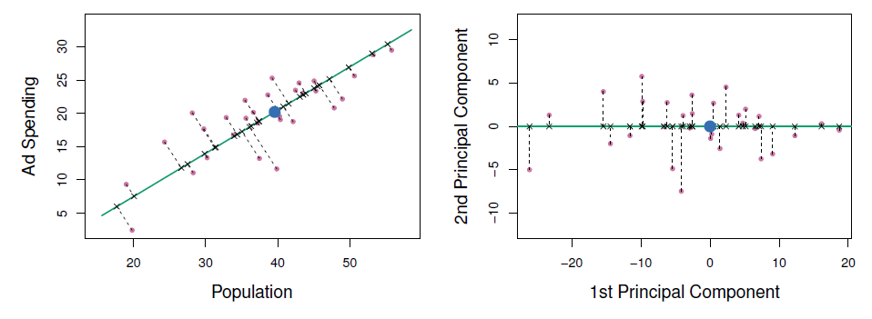
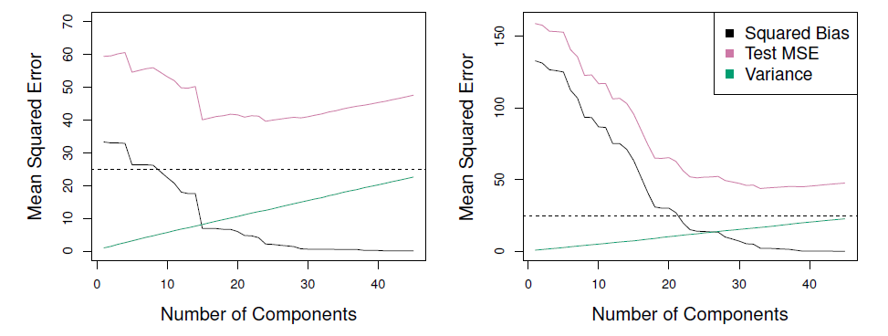
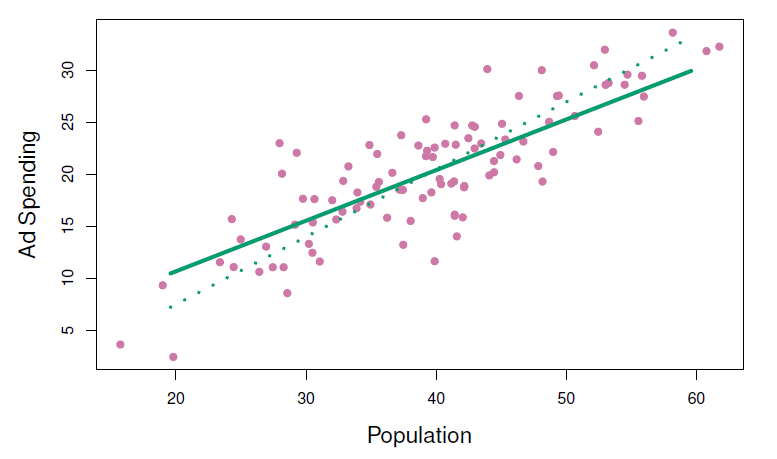
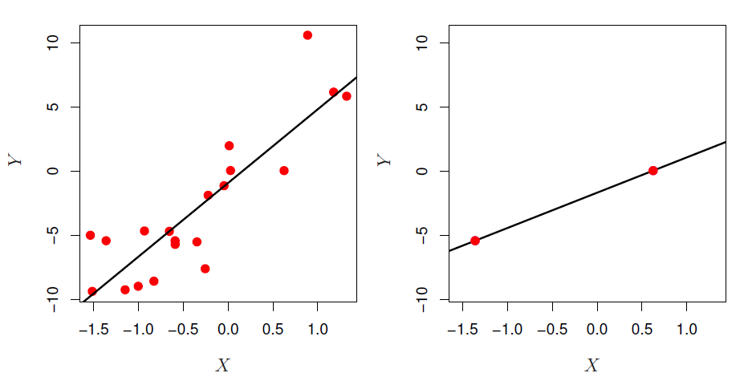
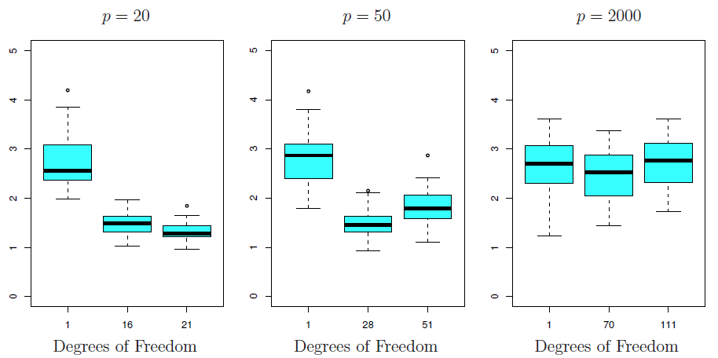

# Linear Model Selection and Regularization

**Learning objectives:**

- Select a subset of features to include in a linear model.
  - Compare and contrast the forward stepwise, backward stepwise, hybrid, and best subset methods of subset selection.
- Use shrinkage methods to constrain the flexibility of linear models.
  - Compare and contrast the lasso and ridge regression methods of shrinkage.
- Reduce the dimensionality of the data for a linear model.
  - Compare and contrast the PCR and PLS methods of dimension reduction.
- Explain the challenges that may occur when fitting linear models to high-dimensional data.

## Subset Selection

## Context for This Chapter {.unnumbered}

- `lm(y ~ ., data)`
- $p \approx n, p = n, p > n$
- perdiction error
  - low bias (by assumption)
  - ... but variance $p \approx n$
  - ... or meaninglessness $p = n$
  - ... or impossibility $p > n$
- model interpretability (?)

## Best Subset Selection (BSS) {.unnumbered}

- "To perform best subset selection, we fit a separate least squares regression best subset for each possible combination of the *p* preditors."
- "That is, we fit all *p* models selection that contain exactly one predictor, all $(^p_2) = p(p - 1)/2$ models that contain exactly two predictors, and so forth."

## BSS Algorithm {.unnumbered}

1. Start with the null model (intercept-only model), $\mathcal{M}_0$.
2. For $k = 1, 2, ..., p$:
  - Fit all $(^p_k)$ models containing $k$ predictors
  - Let $\mathcal{M}_k$ denote the best of these $(^p_k)$ models, where *best* is defined as having the lowest RSS, lowest deviance, etc
3. Choose the best model among $\mathcal{M}_0, ..., \mathcal{M}_p$, where *best* is defined as having the lowest $C_p$, $BIC$, $AIC$, cross-valided MSE, or, alternatively, *highest* adjusted $R^2$

## BSS Algorithm {.unlisted .unnumbered}

(Figure 6.1 from book)

## Behind the dots, BSS'ing ISLR2::Credit {.unnumbered}

- $(^{11}_1) = 11$
- $(^{11}_2) = 55$
- $(^{11}_3) = 165$
- $(^{11}_4) = 330$
- $(^{11}_5) = 462$
- 462, 300, 165, 55, 11, 1 ...

## Best Subset Selection (BSS) {.unnumbered}

- Pros
  - Selects the best subset
- Cons
  - Overfitting
  - I don't know how to incorporate polynomial terms and interactions (Go "Nike" and Just Do It?)
  - Computationally expensive

## Forward Stepwise Subset Selection (FsSS) {.unnumbered}

1. Let $\mathcal{M}_0$ denote the null model (no predictors)
2. For $k = 1, ..., p$:
  - Fit all $p - (k - 1)$ predictors not in model $\mathcal{M}_{k - 1}$
  - Select the predictor that raises $R^2$ the most and add it to model $\mathcal{M}_{k - 1}$ to create model $\mathcal{M}_k$
3. Select the model among $\mathcal{M}_0, ..., \mathcal{M}_k$ that minimizes validation error (or some estimate of it)

## FsSS'ing ISLR2::Credit {.unnumbered}

- $(^{11}_1) = 11$ (same as BSS)
- $(^{10}_1) = 10$ (instead of 55)
- $(^9_1) = 9$ (instead of 165)
- $(^8_1) = 8$ (instead of 330)
- $(^7_1) = 7$ (instead of 462)
- 6 instead of 462, 5 instead of 330, etc
- "When $p = 20$, best subset selection requires fitting 1,048,576 models, whereas forward stepwise selection requires fitting only 211 models."

## Backward Stepwise Subset Selection (BsSS) {.unnumbered}

0. Make sure that $n > p$
1. Let $\mathcal{M}_p$ denote the full model with all *p* predictors
2. For $k = p, p - 1, ..., 1$:
  - Consider all $k$ models that result in dropping a single predictor from $\mathcal{M}_k$ (thus containing $k - 1$ predictors)
  - Choose the best among these $k$ models, and christen it $\mathcal{M}_{k-1}$
3. Select the model among $\mathcal{M}_0, ..., \mathcal{M}_k$ that minimizes validation error (or some estimate of it)

## "Guided" searches {.unnumbered}

- FsSS and BsSS perform "guided" searches
  - Very fun footnote: "Though forward stepwise selection considers $p(p + 1)/2 + 1$ models, it performs a guided search overl model space, and so the effective model space considered contains substantially more than $p(p + 1)/2 + 1$ models."

(Table 6.1)

## Choosing the best model {.unnumbered}

- You have to punish models for having too many predictors
- Whatever the method, $RSS$ decreases / $R^2$ increases as we go from $\mathcal{M}_k$ to $\mathcal{M}_{k+1}$. Thus, $\mathcal{M}_p$ always wins that contest.

(Figure 6.1?)

- Going with $\mathcal{M}_p$ doesn't provide either of the benefits: model interpretability and variance reduction (overfitting)
- We'll need to estimate test error!

## Adjustment Methods {.unnumbered}

- $C_p = \frac{1}{n}(Rss + 2k\hat{\sigma}^2)$
- $\hat{\sigma}^2$ is an "estimate of variance of the error $\epsilon$ associated with each response measurement"
  - typically estimated using $\mathcal{M}_p$
  - like any estimator, can approach its estimand biasedly or unbiasedly (pray for the latter)
- $AIC = 2k - 2ln(\hat{L})$
- $BIC = k \cdot ln(N) - 2ln(\hat{L})$
- adjusted $R^2 = 1 - \frac{RSS}{TSS} \cdot \frac{n-1}{n-k-1}$

## Avoiding Adjustment Methods {.unnumbered}

- $\hat{\sigma}^2$ can be hard to come by
- model *df*, too
- adjustment methods make assumptions about true model
- so cross-validate!

## Various variable selection methods on ISLR2::Credit {.unnumbered}

(figure comparing different measures)

## In conclusion... {.unnumbered}

- A way to discard redundant/noise features atheoretically
- Different estimate of test error return different optima
- You're selecting/tuning complexity, ***not*** a particular set of predictors

## Shrinkage Methods

(Costanza meme)

## Overview {.unnumbered}

- Shrinkage reduces variance and *can* perform variable selection
- 'Substantial' reduction in variance for a 'slight' increase in bias
- Achieves these desiderata by 'penalizing' parameters
- Produce models 'between' the null model and the OLS estimates

## OLS review {.unnumbered}

- $\hat{\beta}^{OLS} \equiv \underset{\hat{\beta}}{argmin}(\sum_{i=1}^{n}{(y_i - \hat{\beta} - \sum_{k=1}^{p}{\beta_kx_{ik}})^2})$
- $\hat{\beta}^{OLS} \equiv \underset{\hat{\beta}}{argmin}(RSS)$

## Ridge Regression {.unnumbered}

- $\hat{\beta}^{OLS} \equiv \underset{\hat{\beta}}{argmin}(RSS)$
- $\hat{\beta}^R \equiv \underset{\hat{\beta}}{argmin}(RSS+\lambda\sum_{k=1}^p{\beta_k^2})$
- $\lambda$ tuning parameter (hyperparameter) for the *shrinkage penalty*
- there's one model parameter $\lambda$ doesn't shrink
  - ($\hat{\beta_0}$)

## Ridge Regression, Visually {.unnumbered}

(figure showing ridge regression)

$$\|\beta\|_2 = \sqrt{\sum_{j=1}^p{\beta_j^2}}$$

## Ridge, good? {.unnumbered}

(figure of ridge success(?))

- "One can show that computations required to solve (6.5), simultaneously for all values of $\lambda$, are almost identical to those for fitting a model using least squares."

## Preprocessing {.unnumbered}

- $\beta_j^R$ aren't scale invariant, so:
$$\tilde{x}_{ij} = \frac{x_{ij}}{\sqrt{\frac{1}{n}\sum_i^n{(x_{ij} - \bar{x}_j)^2}}}$$
- Applies to the least absolute shrinkage and selection operator as well

## The Lasso {.unnumbered}

- $\hat{\beta}^L \equiv \underset{\hat{\beta}}{argmin}(RSS + \lambda\sum_{k=1}^p{|\beta_k|})$
- Shrinks coefficients to 0 (sparse models)
- In `glmnet` $\alpha = 1$ is the default in:
$$\lambda[(1 - \alpha)\|\beta\|_2^2/2 + \alpha\|\beta\|_1]$$
## The Lasso, Visually {.unnumbered}

(figure of the lasso)

$$\|\beta\|_1 = \sum_{j=1}^p{|\beta_j|}$$

## Justin Grimmer Homework {.unnumbered}

(figure from homework Justin found online)

## Visualization of "such that" formulations {.unnumbered}

(figure of contours)

$$|\beta_1|+|\beta_2| \leq s\ \mathrm{and}\ \beta_1^2+\beta_2^2 \leq s$$

## Bayesian Interpretation {.unnumbered}

$$X = (X_1, ..., X_p)$$
$$\beta = (\beta_0, \beta_1, ..., \beta_p)^T$$
$$P(\beta|X, Y) \propto f(Y|X,\beta)P(\beta|X) = f(Y|X, \beta)P(\beta)$$

## Bayesian Interpretation (cont) {.unnumbered}

$$P(\beta) = \prod_{j=1}^p{g(\beta_j)}$$

(gaussian prior images)

## Choosing the tuning parameter {.unnumbered}

(figures)

- Left: Lasso, Right: Lasso is solid, ridge is dotted

## Tuning $\lambda$ {.unnumbered}

(figures)

## Dimension Reduction Methods

- Transform predictors before use.
- $Z_1, Z_2, ..., Z_M$ represent $M < p$ *linear combinations* of original p predictors.

$$Z_m = \sum_{j=1}^p{\phi_{jm}X_j}$$

- Linear regression using the transformed predictors can "often" outperform linear regression using the original predictors.

## The Math {.unnumbered}

$$Z_m = \sum_{j=1}^p{\phi_{jm}X_j}$$
$$y_i = \theta_0 + \sum_{m=1}^M{\theta_mz_{im} + \epsilon_i}, i = 1, ..., n$$
$$\sum_{m=1}^M{\theta_mz_{im}} = \sum_{m=1}^M{\theta_m}\sum_{j=1}^p{\phi_{jm}x_ij}$$
$$\sum_{m=1}^M{\theta_mz_{im}} = \sum_{j=1}^p\sum_{m=1}^M{\theta_m\phi_{jm}x_ij}$$
$$\sum_{m=1}^M{\theta_mz_{im}} = \sum_{j=1}^p{\beta_jx_ij}$$
$$\beta_j = \sum_{m=1}^M{\theta_m\phi_{jm}}$$

- Dimension reduction constrains $\beta_j$
  - Can increase bias, but (significantly) reduce variance when $M \ll p$

## Principal Components Regression {.unnumbered}

- [Allison Horst's whale-shark-vs-krill](https://twitter.com/allison_horst/status/1288904459490213888):


## Principal Components Regression {.unnumbered .unlisted}

- [Allison Horst's whale-shark-vs-krill](https://twitter.com/allison_horst/status/1288904459490213888):


## Principal Components Regression {.unnumbered .unlisted}

(Future cohorts: Try to get a screenshot of everyone turning their head like the shark; Cohort 1 mostly had their cameras off, so I didn't get a head turn)

- PCA chooses $\phi$s to capture as much variance as possible.
- Will be discussed in more detail in Chapter 12.
- First principal component = line of best fit to the data
- Second principal component = orthoganol to 1st, best fit remaining
- Etc

## Principal Components Regression {.unnumbered .unlisted}



$$Z_1 = 0.839 \times (\mathrm{pop} - \overline{\mathrm{pop}}) + 0.544 \times (\mathrm{ad} - \overline{\mathrm{ad}})$$

## Principal Components Regression {.unnumbered .unlisted}


- Assume most of the variation in $X$ is associated with variation in $Y$.
- Mitigate overfitting by reducing number of variables.
- When assumption is true, PCR can do very well.
- Note: PCR isn't feature selection, since PCs depend on all $p$s.
  - More like ridge than lasso.
- Best to standardize variables before PCR.

## Principal Components Regression {.unnumbered .unlisted}



- When variation in $X$ isn't strongly correlated with variation in $Y$, PCR isn't as effective.

## Partial Least Squares {.unnumbered}

- Partial Least Squares (PLS) is like PCA, but supervised (use $Y$ to choose).
- In this figure, `pop` is more related to $Y$ than is `ad`.
- In practice, PLS often isn't better than ridge or PCR.
- Supervision can reduce bias (vs PCR), but can also increase variance.



## Considerations in High Dimensions

- Modern data can have a *huge* number of predictors (eg: 500k SNPs, every word ever entered in a search)
- When $n = p$, linear regression memorizes the training data...



## Considerations in High Dimensions {.unnumbered .unlisted}

- Modern data can have a *huge* number of predictors (eg: 500k SNPs, every word ever entered in a search)
- When $n < p$, linear regression memorizes the training data, but can ***suck*** on test data.


## Lasso (etc) vs Dimensionality {.unnumbered}

- Reducing flexibility (all the stuff in this chapter) can help.
- It's important to choose good tuning parameters for whatever method you use.
- Features that aren't associated with $Y$ increase test error ("curse of dimensionality").
  - Fit to noise in training, noise in test is different.
- When $p > n$, *never* use train MSE, p-values, $R^2$, etc, because they're likely to be wildly different from test values.



## Meeting Videos

### Cohort 1

`r knitr::include_url("https://www.youtube.com/embed/MsyBfczbBao")`

<details>
<summary> Meeting chat log </summary>

```
00:10:43	jonathan.bratt:	:-D
00:11:02	Laura Rose:	chapter 6 is really long!
00:11:07	jonathan.bratt:	Yes, it is!
00:11:38	Laura Rose:	I can probably not do 12/21 either, due to another meeting
00:11:50	jonathan.bratt:	second
00:11:52	Laura Rose:	2
00:12:52	SriRam:	except Ryan :D
00:13:17	Ryan Metcalf:	People run away if I were to grow a beard! Patchy!
00:13:24	SriRam:	:D
00:35:32	jonathan.bratt:	> morphemepiece::morphemepiece_tokenize("unbiasedly")
[[1]]
 un##  bias  ##ed  ##ly 
11995  4903  4030  4057
00:36:06	Jon Harmon (jonthegeek):	lol I did the same thing Jonathan
00:36:32	jonathan.bratt:	😆
00:36:48	Jon Harmon (jonthegeek):	(that's a package Jonathan and I are working on for NLP)
01:01:05	jonathan.bratt:	That was really good.
```
</details>

`r knitr::include_url("https://www.youtube.com/embed/sBElE41XG2Q")`

<details>
<summary> Meeting chat log </summary>

```
00:34:42	Federica Gazzelloni:	tidy models: https://www.tmwr.org/dimensionality.html
00:35:05	Ryan Metcalf:	https://www.tmwr.org/dimensionality.html#partial-least-squares
00:35:09	Federica Gazzelloni:	pca for unsupervised
00:35:18	Federica Gazzelloni:	pls for supervised
```
</details>

