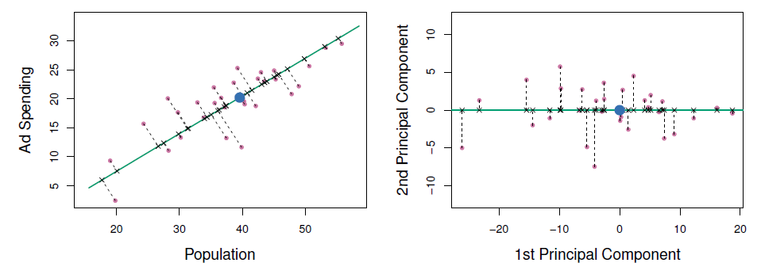
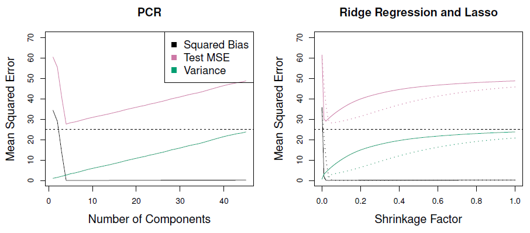
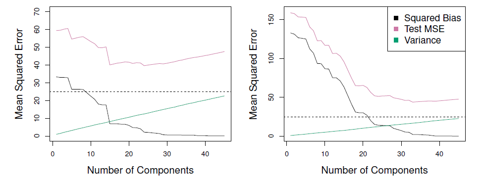
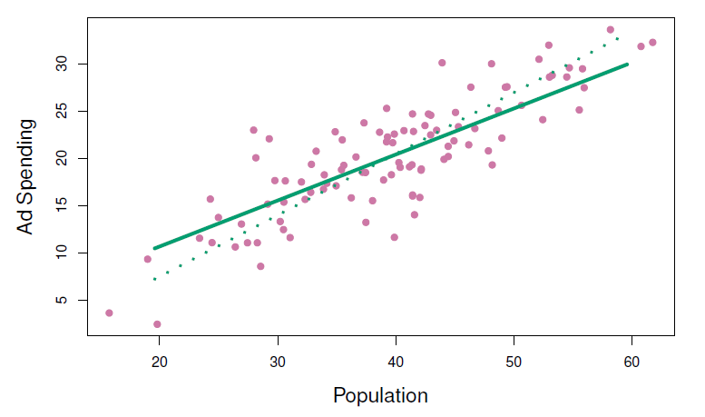
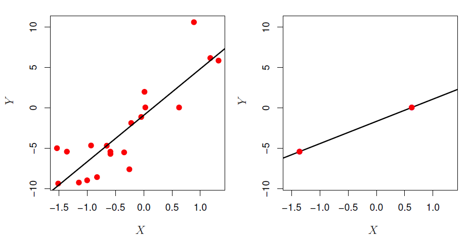
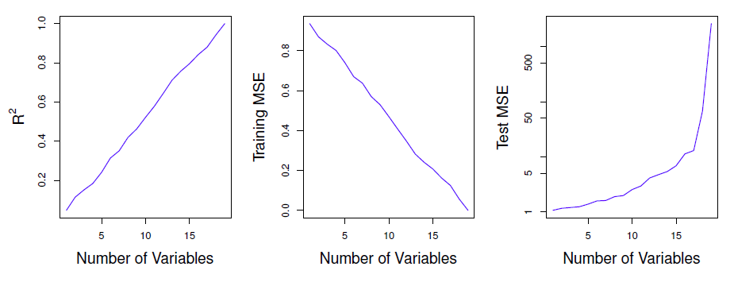
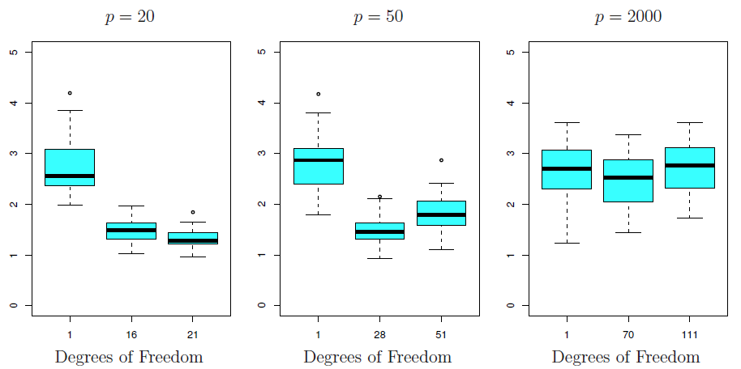

# Linear Model Selection and Regularization


**Learning objectives:**

- Select a subset of features to include in a linear model.
  - Compare and contrast the forward stepwise, backward stepwise, hybrid, and best subset methods of subset selection.
- Use shrinkage methods to constrain the flexibility of linear models.
  - Compare and contrast the lasso and ridge regression methods of shrinkage.
- Reduce the dimensionality of the data for a linear model.
  - Compare and contrast the PCR and PLS methods of dimension reduction.
- Explain the challenges that may occur when fitting linear models to high-dimensional data.

**Context for This Chapter**

- `lm(y ~ ., data)`

Why constrain or remove predictors?

- improve prediction accuracy 
  - low bias (by assumption)
  - ... but $p \approx n$ -> high variance
  - ... or meaninglessness $p = n$
  - ... or impossibility $p > n$
  
- model interpretability
  - remove or constrain irrelevant variables to simplify model.

## Subset Selection

This is a group of methods that directly reduces the number of predictors by removing the ones that don't improve the test error.


## Best Subset Selection (BSS) {.unnumbered}

- Most straightforward approach - try them all!
- "To perform best subset selection, we fit a separate least squares regression best subset for each possible combination of the *p* predictors."
- "That is, we fit all *p* models selection that contain exactly one predictor, all $(^p_2) = p(p - 1)/2$ models that contain exactly two predictors, and so forth."

### BSS Algorithm {.unnumbered}

1. Start with the null model (intercept-only model), $\mathcal{M}_0$.
2. For $k = 1, 2, ..., p$:
  - Fit all $(^p_k)$ models containing $k$ predictors
  - Let $\mathcal{M}_k$ denote the best of these $(^p_k)$ models, where *best* is defined as having the lowest RSS, lowest deviance, etc
3. Choose the best model among $\mathcal{M}_0, ..., \mathcal{M}_p$, where *best* is defined as having the lowest $C_p$, $BIC$, $AIC$, cross-validated MSE, or, alternatively, *highest* adjusted $R^2$


### Best Subset Selection (BSS) {.unnumbered}

- Pros
  - Selects the best subset
- Cons
  - Overfitting due to large search space.
  - Computationally expensive, intractable for large $p$ (exponential, $2^p$, e.g. p=20 yields over 1 million possibilities)

## Forward Stepwise Subset Selection (FsSS) {.unnumbered}

1. Let $\mathcal{M}_0$ denote the null model (no predictors)
2. For $k = 1, ..., p$:
  - Fit all $p - (k - 1)$ predictors not in model $\mathcal{M}_{k - 1}$
  - Select the predictor that raises $R^2$ the most and add it to model $\mathcal{M}_{k - 1}$ to create model $\mathcal{M}_k$
3. Select the model among $\mathcal{M}_0, ..., \mathcal{M}_k$ that minimizes validation error (or some estimate of it)

- "When $p = 20$, best subset selection requires fitting 1,048,576 models, whereas forward stepwise selection requires fitting only 211 models."


## Backward Stepwise Subset Selection (BsSS) {.unnumbered}

0. Make sure that $n > p$
1. Let $\mathcal{M}_p$ denote the full model with all *p* predictors
2. For $k = p, p - 1, ..., 1$:
  - Consider all $k$ models that result in dropping a single predictor from $\mathcal{M}_k$ (thus containing $k - 1$ predictors)
  - Choose the best among these $k$ models, and christen it $\mathcal{M}_{k-1}$
3. Select the model among $\mathcal{M}_0, ..., \mathcal{M}_k$ that minimizes validation error (or some estimate of it)

## Hybrid searches {.unnumbered}

- Combine FsSS and BsSS
- Variables added sequentially, but after adding, also may remove any variables that no longer provide an improvement in fit.


## Choosing the best model {.unnumbered}

- You have to punish models for having too many predictors
- Whatever the method, $RSS$ decreases / $R^2$ increases as we go from $\mathcal{M}_k$ to $\mathcal{M}_{k+1}$. Thus, $\mathcal{M}_p$ always wins that contest.


- Going with $\mathcal{M}_p$ doesn't provide either of the benefits: model interpretability and variance reduction (overfitting)
- We'll need to estimate test error!

### Adjustment Methods {.unnumbered}

- $C_p = \frac{1}{n}(Rss + 2k\hat{\sigma}^2)$
- $\hat{\sigma}^2$ is an "estimate of variance of the error $\epsilon$ associated with each response measurement"
  - typically estimated using $\mathcal{M}_p$
  - if $p \approx n$ estimate is going to be poor or even zero.
- $AIC = 2k - 2ln(\hat{L})$
- $BIC = k \cdot ln(N) - 2ln(\hat{L})$
- adjusted $R^2 = 1 - \frac{RSS}{TSS} \cdot \frac{n-1}{n-k-1}$

### Avoiding Adjustment Methods {.unnumbered}

- $\hat{\sigma}^2$ can be hard to come by 
- adjustment methods make assumptions about true model (e.g. Gaussian errors)
- so cross-validate!


## Shrinkage Methods

### Overview {.unnumbered}

- Shrinkage reduces variance and *can* perform variable selection
- 'Substantial' reduction in variance for a 'slight' increase in bias
- Achieves these desiderata by 'penalizing' parameters
- Produce models 'between' the null model and the OLS estimates

## OLS review {.unnumbered}

- $\hat{\beta}^{OLS} \equiv \underset{\hat{\beta}}{argmin}(\sum_{i=1}^{n}{(y_i - \hat{\beta} - \sum_{k=1}^{p}{\beta_kx_{ik}})^2})$
- $\hat{\beta}^{OLS} \equiv \underset{\hat{\beta}}{argmin}(RSS)$

## Ridge Regression {.unnumbered}

- $\hat{\beta}^{OLS} \equiv \underset{\hat{\beta}}{argmin}(RSS)$
- $\hat{\beta}^R \equiv \underset{\hat{\beta}}{argmin}(RSS+\lambda\sum_{k=1}^p{\beta_k^2})$
- $\lambda$ tuning parameter (hyperparameter) for the *shrinkage penalty*
- there's one model parameter $\lambda$ doesn't shrink
  - ($\hat{\beta_0}$)

### Ridge Regression, Visually {.unnumbered}
```{r, echo=FALSE}
knitr::include_graphics(rep("images/figure6_5.png"))
```

$$\|\beta\|_2 = \sqrt{\sum_{j=1}^p{\beta_j^2}}$$

Note the decrease in test MSE, and further that this is not computationally expensive:  "One can show that computations required to solve (6.5), simultaneously for all values of $\lambda$, are almost identical to those for fitting a model using least squares."

### Preprocessing {.unnumbered}

Note that $\beta_j^R$ aren't scale invariant, so:
$$\tilde{x}_{ij} = \frac{x_{ij}}{\sqrt{\frac{1}{n}\sum_i^n{(x_{ij} - \bar{x}_j)^2}}}$$

## The Lasso {.unnumbered}

- $\hat{\beta}^L \equiv \underset{\hat{\beta}}{argmin}(RSS + \lambda\sum_{k=1}^p{|\beta_k|})$
- Shrinks some coefficients to 0 (creates sparse models)
 
### The Lasso, Visually {.unnumbered}

```{r, echo=FALSE}
knitr::include_graphics(rep("images/figure6_6.png"))
```

Uses the 1-norm:
$$\|\beta\|_1 = \sum_{j=1}^p{|\beta_j|}$$

```{r, echo=FALSE}
knitr::include_graphics(rep("images/figure6_8.png")) 
``` 

### How lasso eliminiates predictors. {.unnumbered}

"It can be shown" that these shrinkage methods are equivalent to a OLS with a constraint that depends on the type of shrinkage. For two parameters:

- $|\beta_1|+|\beta_2| \leq s$ for lasso, 

- $\beta_1^2+\beta_2^2 \leq s$ for ridge,


The value of s depends on $\lambda$. (Larger s corresponds to smaller $\lambda$).

Graphically:


```{r, echo= FALSE}
knitr::include_graphics(rep("images/figure6_7.png"))
```

"the lasso constraint has corners at each of the axes, and
so the ellipse will often intersect the constraint region at an axis"

## Bayesian Interpretation {.unnumbered}

$$X = (X_1, ..., X_p)$$
$$\beta = (\beta_0, \beta_1, ..., \beta_p)^T$$
$$P(\beta|X, Y) \propto f(Y|X,\beta)P(\beta|X) = f(Y|X, \beta)P(\beta)$$

Often the prior takes the form: 

$$P(\beta) = \prod_{j=1}^p{g(\beta_j)}$$

- Gaussian prior for each $\beta$ corresponds to ridge regression.
- Double exponential prior for each $\beta$ corresponds to lasso.

```{r, echo= FALSE}
knitr::include_graphics(rep("images/figure6_11.png"))
```
 
## Dimension Reduction Methods

- Transform predictors before use.
- $Z_1, Z_2, ..., Z_M$ represent $M < p$ *linear combinations* of original p predictors.

$$Z_m = \sum_{j=1}^p{\phi_{jm}X_j}$$

- Linear regression using the transformed predictors can "often" outperform linear regression using the original predictors.

### The Math {.unnumbered}

$$Z_m = \sum_{j=1}^p{\phi_{jm}X_j}$$
$$y_i = \theta_0 + \sum_{m=1}^M{\theta_mz_{im} + \epsilon_i}, i = 1, ..., n$$
$$\sum_{m=1}^M{\theta_mz_{im}} = \sum_{m=1}^M{\theta_m}\sum_{j=1}^p{\phi_{jm}x_ij}$$
$$\sum_{m=1}^M{\theta_mz_{im}} = \sum_{j=1}^p\sum_{m=1}^M{\theta_m\phi_{jm}x_ij}$$
$$\sum_{m=1}^M{\theta_mz_{im}} = \sum_{j=1}^p{\beta_jx_ij}$$
$$\beta_j = \sum_{m=1}^M{\theta_m\phi_{jm}}$$

- Dimension reduction constrains $\beta_j$
  - Can increase bias, but (significantly) reduce variance when $M \ll p$

### Principal Components Regression {.unnumbered}

- PCA chooses $\phi$s to capture as much variance as possible. 
- Will be discussed in more detail in Chapter 12.
- First principal component =   direction of the data is that along which the
observations vary the most.
- Second principal component = orthogonal to 1st, capture next most variation
- Etc
- Create new 'predictors' that are more independent and potentially fewer, which improves test MSE,  but note that this doe not help improve interpretability (all $p$ predictors are still involved.)


### Principal Components Regression {.unnumbered .unlisted}



$$Z_1 = 0.839 \times (\mathrm{pop} - \overline{\mathrm{pop}}) + 0.544 \times (\mathrm{ad} - \overline{\mathrm{ad}})$$

### Principal Components Regression {.unnumbered .unlisted}



- Mitigate overfitting by reducing number of variables.
- Assume that the directions in which $X$ shows the most variation are the directions associated with variation in $Y$.
- When assumption is true, PCR can do very well.
- Note: PCR isn't feature selection, since PCs depend on all $p$s.
  - More like ridge than lasso.
- Best to standardize variables before PCR.

### Example {.unnumbered .unlisted}

In the figures below, PCR fits on simulated data are shown.  Both were generated usign n=50 observations and p = 45 predictors.  First data set response uses all the predictors, while in seond it uses only two.  PCR improves over OLS at least in the first case.  In the second case the improvement is modest, perhaps because the assumption that the directions of maximal variations in predictors doesnt correlate well with variations in the response as assumed by PCR.




- When variation in $X$ isn't strongly correlated with variation in $Y$, PCR isn't as effective.

### Partial Least Squares {.unnumbered}

- Partial Least Squares (PLS) is like PCA, but supervised (use $Y$ to choose).
- In this figure, `pop` is more related to $Y$ than is `ad`.
- In practice, PLS often isn't better than ridge or PCR.
- Supervision can reduce bias (vs PCR), but can also increase variance.



## Considerations in High Dimensions



- Modern data can have a *huge* number of predictors (eg: 500k SNPs, every word ever entered in a search)
- When $n <= p$, linear regression memorizes the training data, but can ***suck*** on test data.



### Lasso (etc) vs Dimensionality {.unnumbered}

- Reducing flexibility (all the stuff in this chapter) can help.
- It's important to choose good tuning parameters for whatever method you use.
- Features that aren't associated with $Y$ increase test error ("curse of dimensionality").
  - Fit to noise in training, noise in test is different.
- When $p > n$, *never* use train MSE, p-values, $R^2$, etc, as evidence of goodness of fit because they're likely to be wildly different from test values.



## Exercises 

### Exercise 7 

We take our model as :

$$ y_i = \beta_0 + \sum_{j=1}^{p} x_{ij} \beta_j + \epsilon_i $$

Here the $\epsilon_i$ are IID from a normal random distrubtion $N(0,\sigma^2)$
The likelihood is simply a product of normal distributions with mean $\mu_i = \beta_0 + \sum_{j=1}^{p} x_{ij} \beta_j$ and standard deviation $\sigma$ :

$$ L \propto e^{-\frac{1}{2\sigma^2}\sum_i{(y_i - (\beta_0 + \sum_{j=1}^{p} x_{ij} \beta_j))^2} }$$
we only care about the parts that depends on the $\beta_i$ so dont worry about the normalization.

The posterior is simply proportional to the product of $L$ and the prior

$$ P(\beta | Data) \propto P(Data | \beta) P(\beta)$$

$$ P(\beta | Data) \propto e^{-\frac{1}{2\sigma^2}\sum_i{(y_i - \beta_0 - \sum_{j=1}^{p} x_{ij} \beta_j)^2} } \prod_{j=1}^{p}e^{-\vert \beta_i \rvert/b}$$
again dropping any constants of proportionality that do not depend on the parameters.

Now combine the exponentials:

$$ P(\beta | Data) \propto e^{-\frac{1}{2\sigma^2}\sum_i{(y_i - \beta_0 - \sum_{j=1}^{p} x_{ij} \beta_j)^2}  -\sum_{j=1}^{p}\vert \beta_i \rvert/b}$$

The mode of this distribution is the value for the $\beta_i$ for which the exponent is maximized,  which means to find the mode we need to minimize:

$$ \frac{1}{2\sigma^2}\sum_i{(y_i - \beta_0 - \sum_{j=1}^{p} x_{ij} \beta_j)^2}  + \sum_{j=1}^{p}\vert \beta_i \rvert/b$$
or after multiplying through by $2 \sigma^2$

$$ \sum_i{(y_i - \beta_0 - \sum_{j=1}^{p} x_{ij} \beta_j)^2}  + \sum_{j=1}^{p} 2\sigma^2 \vert  \beta_i \rvert/b$$


This is the same form as 6.7

I think it should be clear that if you work throuhg the exact same steps with prior (for each $\beta_i$) $e^{-\frac{\beta_i^2}{2 c}}$ you end up with the posterior:

$$ e^{- \frac{1}{2\sigma^2}\sum_i{(y_i - \beta_0 - \sum_{j=1}^{p} x_{ij} \beta_j)^2}  -\sum_{j=1}^{p} \frac{\beta_i^2}{2 c}}$$

And to find the to find the mode of the posterior, to finding the minimum of:  

$$ \sum_i{(y_i - \beta_0 - \sum_{j=1}^{p} x_{ij} \beta_j)^2}  + \sum_{j=1}^{p} \frac{\sigma^2}{c}\beta_i^2$$
which is of the same form as 6.5.
That this mode is also the mean follows since the posterior in this case is a multinormal distribution in $\beta_i$ (it's quadratic)

## Meeting Videos

### Cohort 1

`r knitr::include_url("https://www.youtube.com/embed/MsyBfczbBao")`

<details>
<summary> Meeting chat log </summary>

```
00:10:43	jonathan.bratt:	:-D
00:11:02	Laura Rose:	chapter 6 is really long!
00:11:07	jonathan.bratt:	Yes, it is!
00:11:38	Laura Rose:	I can probably not do 12/21 either, due to another meeting
00:11:50	jonathan.bratt:	second
00:11:52	Laura Rose:	2
00:12:52	SriRam:	except Ryan :D
00:13:17	Ryan Metcalf:	People run away if I were to grow a beard! Patchy!
00:13:24	SriRam:	:D
00:35:32	jonathan.bratt:	> morphemepiece::morphemepiece_tokenize("unbiasedly")
[[1]]
 un##  bias  ##ed  ##ly 
11995  4903  4030  4057
00:36:06	Jon Harmon (jonthegeek):	lol I did the same thing Jonathan
00:36:32	jonathan.bratt:	😆
00:36:48	Jon Harmon (jonthegeek):	(that's a package Jonathan and I are working on for NLP)
01:01:05	jonathan.bratt:	That was really good.
```
</details>

`r knitr::include_url("https://www.youtube.com/embed/sBElE41XG2Q")`

<details>
<summary> Meeting chat log </summary>

```
00:34:42	Federica Gazzelloni:	tidy models: https://www.tmwr.org/dimensionality.html
00:35:05	Ryan Metcalf:	https://www.tmwr.org/dimensionality.html#partial-least-squares
00:35:09	Federica Gazzelloni:	pca for unsupervised
00:35:18	Federica Gazzelloni:	pls for supervised
```
</details>

### Cohort 2

`r knitr::include_url("https://www.youtube.com/embed/eVN-KYvjv8Y")`

`r knitr::include_url("https://www.youtube.com/embed/hv4pCWW2khc")`

<details>
<summary> Meeting chat log </summary>

```
00:08:25	Jim Gruman:	Hello
00:08:36	Federica Gazzelloni:	Hi
00:17:45	Michael Haugen:	Hi, Sorry I am late.
00:35:35	Ricardo:	Check the broom package
00:36:25	Ricardo:	https://broom.tidymodels.org/reference/augment.lm.html
00:36:56	Jim Gruman:	+1  yeah, to uncover the method help details, you can run class() on the object to see the S3 class, and then ask for help on autoplot.class to see the specific help on the autoplot in the dependent package
00:50:40	Ricardo:	PCA is unsupervised, PLS is supervised (check the outcome argument)
```
</details>

### Cohort 3

`r knitr::include_url("https://www.youtube.com/embed/b--hZlZqJ6I")`

<details>
<summary> Meeting chat log </summary>

```
00:07:07	Nilay Yönet:	https://emilhvitfeldt.github.io/ISLR-tidymodels-labs/resampling-methods.html
00:33:41	Mei Ling Soh:	Maybe we can wrap up the lab soon?
00:37:48	Fariborz Soroush:	👍
01:04:24	Mei Ling Soh:	Two more minutes to go
01:05:19	Nilay Yönet:	https://onmee.github.io/assets/docs/ISLR/Resampling-Methods.pdf
01:05:22	Nilay Yönet:	https://waxworksmath.com/Authors/G_M/James/WWW/chapter_5.html
```
</details>

`r knitr::include_url("https://www.youtube.com/embed/TPg7sAhUYV4")`

<details>
<summary> Meeting chat log </summary>

```
00:23:20	Mei Ling Soh:	Each resample is created within the stratification variable. Numeric strata are binned into quartiles.
00:34:05	Jeremy Selva:	https://dionysus.psych.wisc.edu/iaml/unit-06.html#elastic-net-regression
00:54:24	Jeremy Selva:	Here are the link to the slides and the lab
https://jauntyjjs.github.io/islr2-bookclub-cohort3-chapter6
https://jauntyjjs.github.io/islr2-bookclub-cohort3-chapter6-lab/
Source codes for the slides and the lab
https://github.com/JauntyJJS/islr2-bookclub-cohort3-chapter6
https://github.com/JauntyJJS/islr2-bookclub-cohort3-chapter6-lab
00:55:57	Rose Hartman:	Thanks, Jeremy!
00:56:01	Nilay Yönet:	thank you Jeremy!
```
</details>

### Cohort 4


`r knitr::include_url("https://www.youtube.com/embed/cMxQZnwf6VA")`

<details>
<summary>Meeting chat log</summary>
```
00:38:01	Ronald Legere:	https://stats.stackexchange.com/
```
</details>

`r knitr::include_url("https://www.youtube.com/embed/mTQD9KaymTw")`

<details>
<summary> Meeting chat log </summary>

```
00:06:57	Kevin Kent:	https://noamross.github.io/gams-in-r-course/
00:27:23	Ronald Legere:	https://stats.stackexchange.com/questions/410849/when-does-partial-least-squares-provide-1-component-solutions
```
</details>
