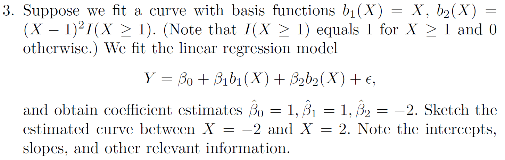
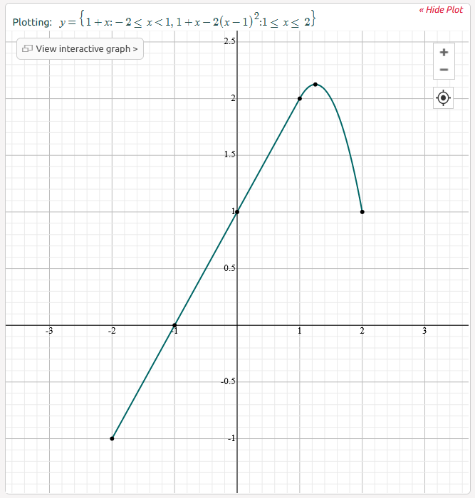
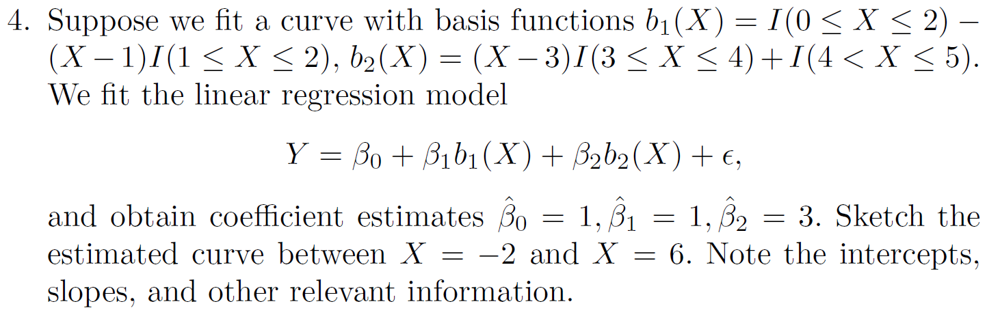

# Moving Beyond Linearity

\DeclareMathOperator*{\argmin}{arg\,min}
\newcommand{\ds}{\displaystyle}

```{css, echo=FALSE, eval = FALSE}
.summary {
  padding: 4px;
  width: 200px;
  background-color: #eeeeee;
  border: none;
  box-shadow: 1px 1px 2px #bbbbbb;
  cursor: pointer;
}

.p {
  background-color: #eeeeee;
  padding: 4px;
  margin: 0;
  box-shadow: 1px 1px 2px #bbbbbb;
}
```

**Learning objectives:**

Model relationships between a predictor and an outcome with

1. **polynomial regression** 
1. **step functions** 
1. **regression splines** 
1. **smoothing splines**
1. **local regression** 
1. **generalized additive models** 

Chapter 7 resources:

1. [The text at https://www.statlearning.com/](https://www.statlearning.com/)
1. [Cohort 1 videos](https://www.youtube.com/playlist?list=PL3x6DOfs2NGibdB0i2wveuFRDlXHbWaPD)
1. [Author videos](https://www.youtube.com/playlist?list=PL5-da3qGB5IBn84fvhh-u2MU80jvo8OoR)
1. [Author slides](https://hastie.su.domains/MOOC-Slides/nonlinear.pdf)
1. [Emil Hvitfeldt's `Tidymodels` examples](https://emilhvitfeldt.github.io/ISLR-tidymodels-labs/07-moving-beyond-linearity.html)
1. [Kim Larsen's GAM: The Predictive Modeling Silver Bullet](https://multithreaded.stitchfix.com/blog/2015/07/30/gam/)
1. [Noam Ross' GAMs in R: A Free, Interactive Course using mgcv](https://noamross.github.io/gams-in-r-course/)
1. [onmee's ISLR solutions](https://onmee.github.io/assets/docs/ISLR/Moving-Beyond-Linearity.pdf) for Chapter 7


<details>

```{r chapter7setup}

suppressPackageStartupMessages({
  library(splines)
  library(tidymodels)
  
  library(ISLR)
  library(boot)
  library(MASS)
  library(leaps)
  library(gam)
  library(ggplot2)
})

tidymodels_prefer()

#require(caTools)
attach(Wage)
attach(Auto)
```

</details>

----

## Polynomial and Step Regression 

<h4> The truth is never linear!</h4>

But often linearity is good enough.

This chapter presents a hierarchy of methods that offer more flexibility without losing much of the ease and interpret ability of linear models. The first is a polynomial expansion.

$$y_i = \beta_0+\beta_1x_i+\beta_2x_i^2...+\beta_dx_i^d+\epsilon_i$$
<center>A degree **d** polynomial</center>


```{r chapter7-1, fig.asp=0.8}

Wage <- as_tibble(ISLR2::Wage) %>% 
    mutate(high = factor(wage > 250, 
                       levels = c(TRUE, FALSE), 
                       labels = c("High", "Low")))

rec_poly <- recipe(wage ~ age, data = Wage) %>%
  step_poly(age, degree = 4)

lm_spec <- linear_reg() %>%
  set_mode("regression") %>%
  set_engine("lm")

poly_wf <- workflow() %>%
  add_model(lm_spec) %>%
  add_recipe(rec_poly)

poly_fit <- fit(poly_wf, data = Wage)

age_range <- tibble(age = seq(min(Wage$age), max(Wage$age)))

regression_lines <- bind_cols(
  augment(poly_fit, new_data = age_range),
  predict(poly_fit, new_data = age_range, type = "conf_int")
)

regression_plot <- Wage %>%
  ggplot(aes(age, wage)) +
  geom_point(alpha = 0.1) +
  geom_line(aes(y = .pred), color = "darkgreen",
            size = 1.5,
            data = regression_lines) +
  geom_line(
    aes(y = .pred_lower),
    data = regression_lines,
    linetype = "dashed",
    color = "blue"
  ) +
  geom_line(
    aes(y = .pred_upper),
    data = regression_lines,
    linetype = "dashed",
    color = "blue"
  ) +
  theme_bw() +
  theme(
    strip.placement = "outside",
    panel.grid = element_blank(),
    strip.background = element_blank(),
    plot.title.position = "plot"
  ) +
  labs(x = "Age", y = "Wage",
       subtitle = "Regression")

rec_poly <- recipe(high ~ age, data = Wage) %>%
  step_poly(age, degree = 4)

lr_spec <- logistic_reg() %>%
  set_engine("glm") %>%
  set_mode("classification")

lr_poly_wf <- workflow() %>%
  add_model(lr_spec) %>%
  add_recipe(rec_poly)

lr_poly_fit <- fit(lr_poly_wf, data = Wage)

classification_lines <- bind_cols(
  augment(lr_poly_fit, new_data = age_range, type = "prob"),
  predict(lr_poly_fit, new_data = age_range, type = "conf_int")
)

classification_plot <- classification_lines %>%
  ggplot(aes(age)) +
  ylim(c(0, 0.2)) +
  geom_line(aes(y = .pred_High), color = "darkgreen",
            size = 1.5) +
  geom_line(aes(y = .pred_lower_High),
            color = "blue",
            linetype = "dashed") +
  geom_line(aes(y = .pred_upper_High),
            color = "blue",
            linetype = "dashed") +
  geom_jitter(
    aes(y = (high == "High") / 5),
    data = Wage,
    shape = "|",
    height = 0,
    width = 0.2
  ) +
  theme_bw() +
  theme(
    strip.placement = "outside",
    panel.grid = element_blank(),
    strip.background = element_blank()
  ) +
  labs(x = "Age", y = "Pr(Wage>250 | Age)",
       subtitle = "Classification")

title_theme <- cowplot::ggdraw() +
  cowplot::draw_label("ISLR2 Wage Dataset 4th degree polynomial fits and 2x pointwise SEs", x = 0.05, hjust = 0)

cowplot::plot_grid(title_theme, 
                   cowplot::plot_grid(regression_plot, classification_plot),
                   ncol = 1, rel_heights = c(0.1, 1)) 

```

<h4>Details</h4>

- Create new variables $X_1 = X, X_2 = X^2$ etc and then treat the problem the same as multiple linear regression.

Under the hood, the expansion happens with the `poly` function

```{r, chapter7-2}
Wage %>% 
  select(age) %>% 
  bind_cols(as_tibble(round(poly(Wage$age, 3), 3))) %>% 
  head()

```

What R does, and what is a best practice, is to force an orthogonal expansion to avoid correlations in the new variables.

This behavior is somewhat different than what might have been expected, possibly as

```{r}
Wage %>% 
  select(age) %>% 
  bind_cols(as_tibble(round(poly(Wage$age, 3, raw = TRUE), 3))) %>% 
  head()

```

- We are not really interested in the coefficients; more interested in
the fitted function values at any value $x_0$

$$f\hat(x_0) = \hat\beta_0+\hat\beta_1x_0+\hat\beta_2x_0^2+\hat\beta_3x_0^3+\hat\beta_4x_0^4$$

- Since $f\hat(x_0)$ is a linear function, we can get a simple expression for pointwise-variances at any value $x_0$. 

- We either fix the degree `d` at some reasonably low value, or else use cross-validation to choose `d`.

-  Logistic regression follows naturally. Here we `mutate` a categorical variable `high` for $y_i > 250 |x_i$

-  To get confidence intervals, compute upper and lower bounds *on the logit scale*, and then invert to get on probability scale.

- Can apply the polynomial expansion separately on several variables. See GAMs later for a better approach.

- Important Caveat:  polynomials have notorious tail behavior, which can be very
bad for extrapolation.

<h4>Step Functions</h4>

Another way of creating transformations of a variable — cut the variable into distinct regions.

```{r chapter7-3, fig.asp=0.8}
rec_cut <- recipe(wage ~ age, data = Wage) %>%
  step_cut(age, breaks = c(30, 50, 70))

lm_spec <- linear_reg() %>%
  set_mode("regression") %>%
  set_engine("lm")

cut_wf <- workflow() %>%
  add_model(lm_spec) %>%
  add_recipe(rec_cut)

cut_fit <- fit(cut_wf, data = Wage)

regression_lines <- bind_cols(
  augment(cut_fit, new_data = age_range),
  predict(cut_fit, new_data = age_range, type = "conf_int")
)

regression_plot <- Wage %>%
  ggplot(aes(age, wage)) +
  geom_point(alpha = 0.1) +
  geom_line(aes(y = .pred), color = "darkgreen",
            size = 1.5,
            data = regression_lines) +
  geom_line(
    aes(y = .pred_lower),
    data = regression_lines,
    linetype = "dashed",
    color = "blue"
  ) +
  geom_line(
    aes(y = .pred_upper),
    data = regression_lines,
    linetype = "dashed",
    color = "blue"
  ) +
  theme_bw() +
  theme(
    strip.placement = "outside",
    panel.grid = element_blank(),
    strip.background = element_blank(),
    plot.title.position = "plot"
  ) +
  labs(x = "Age", y = "Wage",
       subtitle = "Regression")

rec_cut <- recipe(high ~ age, data = Wage) %>%
  step_cut(age, breaks = c(30, 50, 70))

lr_spec <- logistic_reg() %>%
  set_engine("glm") %>%
  set_mode("classification")

cut_wf <- workflow() %>%
  add_model(lr_spec) %>%
  add_recipe(rec_cut)

cut_fit <- fit(cut_wf, data = Wage)

classification_lines <- bind_cols(
  augment(cut_fit, new_data = age_range, type = "prob"),
  predict(cut_fit, new_data = age_range, type = "conf_int")
)

classification_plot <- classification_lines %>%
  ggplot(aes(age)) +
  ylim(c(0, 0.2)) +
  geom_line(aes(y = .pred_High), color = "darkgreen", size = 1.5) +
  geom_line(aes(y = .pred_lower_High),
            color = "blue",
            linetype = "dashed") +
  geom_line(aes(y = .pred_upper_High),
            color = "blue",
            linetype = "dashed") +
  geom_jitter(
    aes(y = (high == "High") / 5),
    data = Wage,
    shape = "|",
    height = 0,
    width = 0.2
  ) +
  theme_bw() +
  theme(
    strip.placement = "outside",
    panel.grid = element_blank(),
    strip.background = element_blank()
  ) +
  labs(x = "Age", y = "Pr(Wage>250 | Age)",
       subtitle = "Classification")

title_theme <- cowplot::ggdraw() +
  cowplot::draw_label("ISLR2 Wage Dataset Step Function fits and 2x pointwise SEs", x = 0.05, hjust = 0)

cowplot::plot_grid(title_theme, 
                   cowplot::plot_grid(regression_plot, classification_plot),
                   ncol = 1, rel_heights = c(0.1, 1)) 

```

- Easy to work with. Creates a series of dummy variables representing each group.

- Useful way of creating interactions that are easy to interpret. 

- Choice of cutpoints or knots can be problematic. For crafting the nonlinearities, smoother alternatives such as `splines` are available.

<h4>Piecewise Polynomials</h4>

- Instead of a single polynomial in X over its whole domain, we can rather use different polynomials in regions defined by knots.

- Better to add constraints to the polynomials, e.g. continuity

- `Splines` have the “maximum” amount of continuity

## Splines

>A linear spline is a piecewise linear polynomial continuous at each knot.

We can represent this model as

$$ y_i = \beta_0 + \beta_1b_1(x_i) + \beta_2b_2(x_i) + · · · + \beta_{K+1}b_{K+1}(x_i) + \epsilon_i $$
where the $b_k$ are *basis functions*.

```{r, Chapter7-4-1}

###

fit <- lm(wage ~ bs(age, knots = c(25, 40, 60)), data = Wage)
agelims <- range(Wage$age)
age.grid <- seq(from = agelims[1], to = agelims[2])
pred <- predict(fit, newdata = list(age = age.grid), se = T)
plot(Wage$age, Wage$wage, col = "gray")
title("Poly B-Spline Basis w 3 knots and Natural Cubic Spline")
lines(age.grid, pred$fit, lwd = 2)
lines(age.grid, pred$fit + 2 * pred$se, lty = "dashed")
lines(age.grid, pred$fit - 2 * pred$se, lty = "dashed")
###
fit2 <- lm(wage ~ ns(age, df = 4), data = Wage)
pred2 <- predict(fit2, newdata = list(age = age.grid),
     se = T)
lines(age.grid, pred2$fit, col = "red", lwd = 2)

```

<h4>Cubic Splines</h4>

> A cubic spline is a piecewise cubic polynomial with continuous derivatives up to order 2 at each knot.

- To apply a cubic spline, the knot locations have to be defined. Intuitively, one might locate them at the quartile breaks or at range boundaries that are significant for the data domain.

<h4>Natural Cubic Splines</h4>

> A natural cubic spline extrapolates linearly beyond the boundary knots. This adds 4 = 2 × 2 extra constraints, and allows us to put more internal knots for the same degrees of freedom as a regular cubic spline above.

- Fitting natural splines is easy. A cubic spline with K knots has K + 4 parameters or degrees of freedom. A natural spline with K knots has K degrees of freedom.

- The result is often a simpler, smoother, more generalizable function with less bias.

<h4>Smoothing Splines</h4>

> The solution is a natural cubic spline, with a knot at every unique value of $x_i$. A roughness penalty controls the roughness via $\lambda$.

-  Smoothing splines avoid the knot-selection issue mathematically, leaving a single λ to be chosen.

- in the R function `smooth.spline` the degrees of freedom is often specified, not the λ

- `smooth.spline` has a built-in cross-validation function to choose a suitable DF automatically, as ordinary leave-one-out (TRUE) or ‘generalized’ cross-validation (GCV) when FALSE. The ‘generalized’ cross-validation method GCV technique will work best when there are duplicated points in x. 

```{r, Chapter7-4-2}

###
plot(Wage$age, Wage$wage, xlim = agelims, cex = .5, col = "darkgrey")
title("Smoothing Spline")

fit <- smooth.spline(Wage$age, Wage$wage, df = 16)
fit2 <- smooth.spline(Wage$age, Wage$wage, cv = TRUE)

lines(fit, col = "red", lwd = 2)
lines(fit2, col = "blue", lwd = 2)
legend("topright", legend = c("16 DF", "6.8 DF"),
    col = c("red", "blue"), lty = 1, lwd = 2, cex = .8)
```

<h4>Local Regression</h4>

> Local regression is a slightly different approach for fitting which involves computing the fit at a target point $x_i$ using only nearby observations.

The loess fit yields a walk with a `span` parameter to arrive at a spline fit.

```{r, Chapter7-4-3}
###
plot(Wage$age, Wage$wage, xlim = agelims, cex = .5, col = "darkgrey")
title("Local Regression")

fit <- loess(wage ~ age, span = .2, data = Wage)
fit2 <- loess(wage ~ age, span = .5, data = Wage)
lines(age.grid, predict(fit, data.frame(age = age.grid)),
    col = "red", lwd = 2)
lines(age.grid, predict(fit2, data.frame(age = age.grid)),
    col = "blue", lwd = 2)
legend("topright", legend = c("Span = 0.2", "Span = 0.5"),
    col = c("red", "blue"), lty = 1, lwd = 2, cex = .8)

```

So far, every example model has shown one independent variable and one dependent variable. Much more utility comes when these techniques are generalized broadly for many independent variables. 

A side note - normal `ggplot` geom_smooth for small datasets applies the loess method.

```{r, Chapter7-4-4, fig.asp=0.8}

as_tibble(ISLR2::Hitters) %>% 
  ggplot(aes(RBI, Runs)) +
  geom_point(alpha = 0.2, color = "gray20") +
  stat_smooth(method = "loess", span = 0.2, color = "midnightblue", se = F) +
  stat_smooth(method = "loess", span = 0.5, color = "darkgreen", se = F) +
  stat_smooth(method = "loess", span = 0.8, color = "red", se = F) +
  labs(title = "Loess Spans on ISLR2::Hitters",
       x = "Runs Batted In", y = "Runs",
       caption = "Spans:\nBlue: 0.2, Green: 0.5, Red: 0.8") +
  theme_minimal()

```

## Generalized Additive Models

Generalized additive models were originally invented by Trevor Hastie and Robert Tibshirani in 1986 as a natural way to extend the conventional **multiple** linear regression model 

$$ y_i = \beta_0+\beta_1x_{i1}+\beta_2x_{i2}...+\beta_px_{ip}+\epsilon_i$$

Mathematically speaking, GAM is an additive modeling technique where the impact of the predictive variables is captured through smooth functions which, depending on the underlying patterns in the data, can be nonlinear:


We can write the GAM structure as:

$$g(E(Y))=\alpha + s_1(x_1)+...+s_p(x_p) $$

where $Y$ is the dependent variable (i.e., what we are trying to predict), $E(Y)$ denotes the expected value, and $g(Y)$ denotes the link function that links the expected value to the predictor variables $x_1,…,x_p$.

The terms $s_1(x_1),…,s_p(x_p)$ denote smooth, *nonparametric* functions. Note that, in the context of regression models, the terminology *nonparametric* means that the shape of predictor functions are fully determined by the data as opposed to *parametric* functions that are defined by a typically small set of parameters. This can allow for more flexible estimation of the underlying predictive patterns without knowing upfront what these patterns look like.

The `mgcv` version:

```{r chapter7-5-1, fig.asp=0.8}

gam.m3 <-
  mgcv::gam(wage ~ s(as.numeric(year), k = 4) + s(as.numeric(age), k = 5) + education, data = Wage)

summary(gam.m3)

par(mfrow = c(1, 3))
mgcv::plot.gam(
  gam.m3,
  residuals = FALSE,
  all.terms = TRUE,
  shade = TRUE,
  shade.col = 2,
  rug = TRUE,
  scale = 0
)

```

A comparable model, built with lm and natural cubic splines, plotted as the GAM contributions to the `wage`:

```{r chapter7-5-2, fig.asp=0.8}
gam::plot.Gam(
  lm(wage ~ ns(year, df = 4) + ns(age, df = 5) + education, data = Wage),
  residuals = FALSE,
  rugplot = TRUE,
  se = TRUE,
  scale = 0
)
```

<h4>Why Use GAMs?</h4>

There are at least three good reasons why you want to use GAM: interpretability, flexibility/automation, and regularization. Hence, when your model contains nonlinear effects, GAM provides a regularized and interpretable solution, while other methods generally lack at least one of these three features. In other words, GAMs strike a nice balance between the interpretable, yet biased, linear model, and the extremely flexible, “black box” learning algorithms.

- Coefficients not that interesting; fitted functions are.

- Can mix terms — some linear, some nonlinear

- Can use smoothing splines AND local regression as well

- GAMs are simply additive, although low-order interactions can be included in a natural way using, e.g. bivariate smoothers or interactions

<h4>Fitting GAMs in R</h4>

The two main packages in R that can be used to fit generalized additive models are `gam` and `mgcv`. The `gam` package was written by Trevor Hastie and is more or less frequentist. The `mgcv` package was written by Simon Wood, and, while it follows the same framework in many ways, it is much more general because it considers GAM to be any penalized GLM (and Bayesian). The differences are described in detail in the documentation for `mgcv`.

I discovered that `gam` and `mgcv` do not work well when loaded at the same time. Restart the R session if you want to switch between the two packages – detaching one of the packages is not sufficient.

An example of a classification GAM model:

```{r chapter7-5-3, fig.asp=0.8}
gam.lr <-
  mgcv::gam(I(wage > 250) ~ as.numeric(year) + s(as.numeric(age), k = 5) + education, data = Wage)

summary(gam.lr)

par(mfrow = c(1, 3))
mgcv::plot.gam(
  gam.lr,
  residuals = FALSE,
  all.terms = TRUE,
  shade = TRUE,
  shade.col = 2,
  rug = TRUE,
  scale = 0
)

```

## Conceptual Exercises

1. ... cubic regression spline with a knot at $x = \xi$ with basis functions

$$x, x^{2}, x^{3}, (x-\xi)_{+}^{3}$$
where
$$(x-\xi)_{+}^{3} = \begin{cases}
  (x-\xi)^{3} & x > \xi \\ 0 & \text{otherwise} \\
\end{cases}$$

We will show that a function of the form

$$f(x) = \beta_{0} + \beta_{1}x + \beta_{2}x^{2} + \beta_{3}x^{3} + \beta_{4}(x-\xi)_{+}^{3}$$

is indeed a cubic regression spline.

a. Find a cubic polynomial

$$f_{1}(x) = a_{1} + b_{1}x + c_{1}x^{2} + d_{1}x^{3}$$

such that $f_{1}(x) = f(x)$ for all $x \leq \xi$.

<details><summary>Answer</summary>

$$\begin{array}{rcl}
  a_{1} & = & \beta_{0} \\ b_{1} & = & \beta_{1} \\ c_{1} & = & \beta_{2} \\ d_{1} & = & \beta_{3} \\
\end{array}$$

</details>

b. Find a cubic polynomial

$$f_{2}(x) = a_{2} + b_{2}x + c_{2}x^{2} + d_{2}x^{3}$$

such that $f_{2}(x) = f(x)$ for all $x > \xi$.

<details><summary>Answer</summary>

$$\begin{array}{rcl}
  a_{2} & = & \beta_{0} - \beta_{4}\xi^{3} \\ b_{2} & = & \beta_{1} + 3\beta_{4}\xi^{2} \\ c_{2} & = & \beta_{2} - 3\beta_{4}\xi \\ d_{2} & = & \beta_{3} + \beta_{4} \\
\end{array}$$

</details>

We have now shown that $f(x)$ is a piecewise polynomial.

c. Show that $f(x)$ is continuous at $\xi$
    
<details><summary>Answer</summary>

$$\begin{array}{rcl}
  f_{1}(\xi) & = & f_{2}(\xi) \\
  \beta_{0} + \beta_{1}\xi + \beta_{2}\xi^{2} + \beta_{3}\xi^{3} & = & \beta_{0} + \beta_{1}\xi + \beta_{2}\xi^{2} + \beta_{3}\xi^{3} \\
\end{array}$$

</details>

d. Show that $f'(x)$ is continuous at $\xi$
    
<details><summary>Answer</summary>

$$\begin{array}{rcl}
  f_{1}'(\xi) & = & f_{2}'(\xi) \\
  \beta_{1} + 2\beta_{2}\xi + 3\beta_{3}\xi^{2} & = & \beta_{1} + 2\beta_{2}\xi + 3\beta_{3}\xi^{2} \\
\end{array}$$

</details>

e. Show that $f''(x)$ is continuous at $\xi$
    
<details><summary>Answer</summary>

$$\begin{array}{rcl}
  f_{1}''(\xi) & = & f_{2}''(\xi) \\
  2\beta_{2} + 6\beta_{3}\xi & = & 2\beta_{2} + 6\beta_{3}\xi \\
\end{array}$$

</details>


2. Suppose that a curve $\hat{g}$ is computed to smoothly fit a set of $n$ points using the following formula:

$$\hat{g} = \argmin_{g} \left( \ds\sum_{i=1}^{n} (y_{i}-g(x_{i}))^{2} + \lambda\ds\int \left[g^{(m)}(x)\right]^{2} \, dx \right)$$

where $g^{(m)}$ is the $m^{\text{th}}$ derivative of $g$ (and $g^{(0)} = g$).  Describe $\hat{g}$ in each of the following situations.

a. $\lambda = \infty, \quad m = 0$

<details><summary>Answer</summary>
heavy penalization of all functions except constants (i.e. horizontal lines)
</details>

b. $\lambda = \infty, \quad m = 1$

<details><summary>Answer</summary>
heavy penalization of all functions except linear functions---i.e.
$$\hat{g} = a + bx$$
</details>

c. $\lambda = \infty, \quad m = 2$

<details><summary>Answer</summary>
heavy penalization of all functions except degree-2 polynomials
$$\hat{g} = a + bx + cx^{2}$$
</details>

d. $\lambda = \infty, \quad m = 3$

<details><summary>Answer</summary>
heavy penalization of all functions except degree-3 polynomials
$$\hat{g} = a + bx + cx^{2} + dx^{3}$$
</details>

e. $\lambda = 0, \quad m = 2$

<details><summary>Answer</summary>
No penalization implies perfect fit of training data.
</details>



<details><summary>Answer</summary>
$$f(x) = \begin{cases}
  1 + x, & -2 \leq x \leq 1 \\ 1 + x - 2(x-1)^{2}, & 1 \leq x \leq 2 \\
\end{cases}$$
</details>



<details><summary>Answer</summary>
$$f(x) = \begin{cases}
  0, & -2 \leq x < 0 \\ 
  1, & 0 \leq x \leq 1 \\
  x, & 1 \leq x \leq 2 \\
  0, & 2 < x < 3 \\
  3x-3, & 3 \leq x \leq 4 \\
  1, & 4 < x \leq 5 \\
\end{cases}$$
</details>

5. Consider two curves $\hat{g}_{1}$ and $\hat{g}_{2}$

$$\hat{g}_{1} = \argmin_{g} \left( \ds\sum_{i=1}^{n} (y_{i}-g(x_{i}))^{2} + \lambda\ds\int \left[g^{(3)}(x)\right]^{2} \, dx \right)$$
$$\hat{g}_{2} = \argmin_{g} \left( \ds\sum_{i=1}^{n} (y_{i}-g(x_{i}))^{2} + \lambda\ds\int \left[g^{(4)}(x)\right]^{2} \, dx \right)$$
where $g^{(m)}$ is the $m^{\text{th}}$ derivative of $g$

a. As $\lambda \rightarrow\infty$, will $\hat{g}_{1}$ or $\hat{g}_{2}$ have the smaller training RSS?

<details><summary>Answer</summary>
$\hat{g}_{2}$ is more flexible due to the higher order of the penalty term than $\hat{g}_{1}$, so $\hat{g}_{2}$ will likely have a lower training RSS.
</details>

b. As $\lambda \rightarrow\infty$, will $\hat{g}_{1}$ or $\hat{g}_{2}$ have the smaller testing RSS?

<details><summary>Answer</summary>
Generally, $\hat{g}_{1}$ will perform better on less flexible functions, and $\hat{g}_{2}$ will perform better on more flexible functions.
</details>

c. For $\lambda = 0$, will $\hat{g}_{1}$ or $\hat{g}_{2}$ have the smaller training RSS?

<details><summary>Answer</summary>
The penalty terms will be zero for both equations, so training and test terms will be equal.
</details>


## Applied Exercises

6. For the `Wage` data

a. polynomial regression

```{r}
# Cross validation to choose degree of polynomial.
set.seed(1)
cv.error.10 = rep(0,10)
for (i in 1:10) {
glm.fit=glm(wage~poly(age,i),data=Wage)
cv.error.10[i]=cv.glm(Wage,glm.fit,K=10)$delta[1]
}
plot(cv.error.10, type="b", xlab="Degree", ylab="CV Error")
```

The cross-validation error seems stagnant after degree-4 use.

```{r}
lm.fit = glm(wage ~ poly(age,4), data = Wage)
summary(lm.fit)
```

```{r}
# Using Anova() to compare degree 4 model with others.
fit.1 = lm(wage~age ,data=Wage)
fit.2 = lm(wage~poly(age ,2) ,data=Wage)
fit.3 = lm(wage~poly(age ,3) ,data=Wage)
fit.4 = lm(wage~poly(age ,4) ,data=Wage)
fit.5 = lm(wage~poly(age ,5) ,data=Wage)
anova(fit.1,fit.2,fit.3,fit.4,fit.5)
```

ANOVA check shows significance between models stops after degree-4.

```{r}
# Grid of values for age at which we want predictions.
agelims=range(age)
age.grid=seq(from=agelims[1],to=agelims[2])
# Predictions.
preds=predict(lm.fit,newdata=list(age=age.grid),se=TRUE)
se.bands=cbind(preds$fit+2*preds$se.fit,preds$fit-2*preds$se.fit)
# Plot of polynomial fit onto data including SE bands.
plot(age,wage,xlim=agelims,cex=.5,col="darkgrey")
title("Polynomial fit using degree 4")
lines(age.grid,preds$fit,lwd=2,col="blue")
matlines(age.grid,se.bands,lwd =1,col="blue",lty =3)
```

b. For step functions

```{r}
# Cross validation to choose optimal number of cuts.
set.seed(1)
cv.error.20 = rep(NA,19)
for (i in 2:20) {
Wage$age.cut = cut(Wage$age,i)
step.fit=glm(wage~age.cut,data=Wage)
cv.error.20[i-1]=cv.glm(Wage,step.fit,K=10)$delta[1] # [1]: Std [2]: Bias corrected.
}
plot(cv.error.20,type='b',ylab="CV Error")
```

We are advised to use 8 = index + 1 cuts.

```{r}
step.fit = glm(wage~cut(age,8), data=Wage)
preds2=predict(step.fit,newdata=list(age=age.grid), se=T)
se.bands2=cbind(preds2$fit+2*preds2$se.fit,preds2$fit-2*preds2$se.fit)
plot(age,wage,xlim=agelims,cex=.5,col="darkgrey")
title("Step function using 8 cuts")
lines(age.grid,preds2$fit,lwd=2,col="blue")
matlines(age.grid,se.bands2,lwd =1,col="blue",lty =3)
```

7.

a. marital status

```{r}
Wage |>
  ggplot(aes(x = maritl, y = wage)) +
  geom_boxplot(aes(fill = maritl)) +
  theme_minimal() +
  theme(legend.position = "none")
```

The highest median wage is among married people.

```{r}
gam.model = gam(wage~maritl, data=Wage)
plot(gam.model, col="blue", se=T)
```

b. job class

```{r}
Wage |>
  ggplot(aes(x = jobclass, y = wage)) +
  geom_boxplot(aes(fill = jobclass)) +
  theme_minimal() +
  theme(legend.position = "none")
```

```{r}
gam_model_2 = gam(wage~jobclass, data=Wage)
plot(gam_model_2, col="blue", se=T)
```


8. For the `Auto` data set with the `mpg` response variable, let us explore nonlinear behavior.

```{r}
pairs(Auto[1:7])
```

* `mpg` appears to have a non-linear relationship with `horsepower`, `displacement`, and `weight`

```{r}
fit.1 = lm(mpg~horsepower ,data=Auto)
fit.2 = lm(mpg~poly(horsepower ,2) ,data=Auto)
fit.3 = lm(mpg~poly(horsepower ,3) ,data=Auto)
fit.4 = lm(mpg~poly(horsepower ,4) ,data=Auto)
fit.5 = lm(mpg~poly(horsepower ,5) ,data=Auto)
fit.6 = lm(mpg~poly(horsepower ,6) ,data=Auto)
anova(fit.1,fit.2,fit.3,fit.4,fit.5,fit.6)
```

* The p-value comparing `fit.1` (linear) to `fit.2` (quadratic) is statistically significant, and the p-value comparing `fit.2` to `fit.3` (cubic) is not significant. This indicates that a linear or cubic fit is not sufficient, but a quadratic fit should suffice.

```{r}
hplim = range(Auto$horsepower)
hp.grid = seq(from=hplim[1],to=hplim[2])
preds1=predict(fit.1,newdata=list(horsepower=hp.grid))
preds2=predict(fit.2,newdata=list(horsepower=hp.grid))
preds5=predict(fit.5,newdata=list(horsepower=hp.grid))
# Plot of linear and polynomial fits.
plot(horsepower,mpg,xlim=hplim,cex.lab=1.5)
lines(hp.grid,preds1,lwd=3,col="blue",lty=2)
lines(hp.grid,preds2,lwd=3,col="red")
lines(hp.grid,preds5,lwd=3,col="green",lty=2)
legend(180,40,legend=c("Linear fit", "Quadratic fit", "Quintic fit"),
col=c("blue", "red", "green"),lty=c(2,1,2), lwd=c(3,3,3),cex=1.5)
```

9. `Boston` data

* predictor variable: `nox` (nitrogen oxide concentration)
* response variable: `dis` (distance to employment centers)

a. cubic polynomial regression

```{r}
Boston <- ISLR2::Boston #avoid ambiguity with MASS::Boston
model.1 = glm(nox~poly(dis,3), data=Boston)
plot(Boston$dis,Boston$nox, xlab="Distance", ylab="Nox values")
dis.grid = seq(from=min(Boston$dis),to=max(Boston$dis),0.2)
preds=predict(model.1,newdata=list(dis=dis.grid), se=T)
lines(dis.grid,preds$fit,col="blue",lwd=3)
lines(dis.grid,preds$fit+2*preds$se,col="blue",lwd=3,lty=2)
lines(dis.grid,preds$fit-2*preds$se,col="blue",lwd=3,lty=2)
```

```{r}
summary(model.1)
```

b. other polynomials

```{r}
set.seed(2)
boston_df = Boston
# boston_sample = sample.split(boston_df$dis, SplitRatio = 0.80)
boston_sample = sample(c(TRUE, FALSE), 
                       replace = TRUE, size = nrow(boston_df), 
                       prob = c(0.8, 0.2))
boston_train = subset(boston_df, boston_sample==TRUE)
boston_test = subset(boston_df, boston_sample==FALSE)

rss = rep(0,10)
colours = rainbow(10)
plot(Boston$dis,Boston$nox,xlab="Distance", ylab="Nox values",
main="Polynomial fits from degree 1-10.")
for (i in 1:10){
model = glm(nox~poly(dis,i), data=boston_train)
rss[i] = sum((boston_test$nox - predict(model,newdata=list(dis=boston_test$dis)))^2)
preds=predict(model,newdata=list(dis=dis.grid))
lines(dis.grid,preds,col=colours[i], lwd=2, lty=1)
}
legend(10,0.8,legend=1:10, col= colours[1:10],lty=1,lwd=2)
```

```{r}
# RSS on the test set.
plot(1:10,rss,xlab="Polynomial degree", ylab="RSS",
main="RSS on test set vs polynomial degree", type='b')
```

c. cross-validation to find polynomial degreee

```{r}
# Cross validation to choose degree of polynomial.
set.seed(1)
cv.error.10 = rep(0,10)
for (i in 1:10) {
glm.fit=glm(nox~poly(dis,i),data=Boston)
cv.error.10[i]=cv.glm(Boston,glm.fit,K=10)$delta[1]
}
plot(cv.error.10, type="b", xlab="Degree", ylab="CV Error")
```

d. regression splines

```{r}
# Regression spline with four degrees of freedom.
spline.fit = lm(nox~bs(dis,df=4), data=Boston)
summary(spline.fit)
```

```{r}
attr(bs(Boston$dis,df=4),"knots")
```

We have a single knot at the 50th percentile of `dis`.

```{r}
plot(Boston$dis,Boston$nox,xlab="Distance", ylab="Nox values")
preds = predict(spline.fit, newdata=list(dis=dis.grid), se=T)
lines(dis.grid, preds$fit,col="red",lwd=3)
lines(dis.grid, preds$fit+2*preds$se,col="blue",lwd=3,lty=2)
lines(dis.grid, preds$fit-2*preds$se,col="blue",lwd=3,lty=2)
```

e. regression splines over several degrees of freedom

```{r, message = FALSE, warning = FALSE}
rss = rep(0,18)
colours = rainbow(18)
plot(Boston$dis,Boston$nox,xlab="Distance", ylab="Nox values",
main="Regression splines using degrees from 3-10")
# Degree of freedom starts from 3, anything below is too small.
for (i in 3:20){
spline.model = lm(nox~bs(dis,df=i), data=boston_train)
rss[i-2] = sum((boston_test$nox - predict(spline.model,newdata=list(dis=boston_test$dis)))^2)
preds=predict(spline.model,newdata=list(dis=dis.grid))
lines(dis.grid,preds,col=colours[i-2], lwd=2, lty=1)
}
legend(10,0.8,legend=3:20, col=colours[1:18],lty=1,lwd=2)
```

f. cross-validation to find the optimal number of degrees of freedom

```{r, message = FALSE, warning = FALSE}
k=10
set.seed(3)
folds = sample(1:k, nrow(Boston), replace=T)
cv.errors = matrix(NA,k,18, dimnames = list(NULL, paste(3:20))) #CV errors for degrees 3 to 20.
# Create models (total=k) for each degree using the training folds.
# Predict on held out folds and calculate their MSE's(total=k).
# Continue until all j degrees have been used.
# Take the mean of MSE's for each degree.
for(j in 3:20){
for(i in 1:k){
spline.model=lm(nox~bs(dis,df=j), data=Boston[folds!=i,])
pred=predict(spline.model,Boston[folds==i,],id=i)
cv.errors[i,j-2]=mean((Boston$nox[folds==i] - pred)^2)
}
}
mean.cv.errors = apply(cv.errors,2,mean)
mean.cv.errors[which.min(mean.cv.errors)]
```
Our calculations point toward a degree-8 polynomial.


10. For the `College` data set

* response variable: `Outstate`
* predictor variables: [all other variables]

a. forward stepwise selection

```{r}
set.seed(4)
college_df = College
# college_sample = sample.split(college_df$Outstate, SplitRatio = 0.80)
college_sample = sample(c(TRUE, FALSE), 
                        replace = TRUE, size = nrow(college_df), 
                        prob = c(0.8, 0.2))
college_train = subset(college_df, college_sample==TRUE)
college_test = subset(college_df, college_sample==FALSE)

# Forward stepwise on the training set using all variables.
fit.fwd = regsubsets(Outstate~., data=college_train, nvmax=17, method="forward")
fit.summary = summary(fit.fwd)
# Some Statistical metrics.
which.min(fit.summary$bic) #Estimate of the test error, lower is better.
```
```{r}
par(mfrow=c(2,2))
plot(1:17, fit.summary$cp,xlab="Variables",ylab="Cp",main="Cp", type='b')
plot(1:17, fit.summary$bic,xlab="Variables",ylab="BIC",main="BIC", type='b')
plot(1:17, fit.summary$adjr2,xlab="Variables",ylab="Adjusted R2",main="Adjusted R2", type='b')
```

```{r}
coef(fit.fwd,6)
```

b. GAM (generalized additive model)

```{r}
gam.m1 = gam(Outstate~Private+
               s(Room.Board,4)+
               s(PhD,4)+
               s(perc.alumni,2)+
               s(Expend,4)+
               s(Grad.Rate,5), data=college_train)
par(mfrow=c(2,3))
plot(gam.m1, col="blue", se=T)
```

c. model statistics

```{r}
gam.m2 = gam(Outstate~Private+s(Room.Board,4)+s(PhD,4)+s(perc.alumni,2)
+s(Expend,4), data=college_train) # No Grad.Rate
gam.m3 = gam(Outstate~Private+s(Room.Board,4)+s(PhD,4)+s(perc.alumni,2)
+s(Expend,4)+Grad.Rate, data=college_train) # Linear Grad rate
gam.m4 = gam(Outstate~Private+s(Room.Board,4)+s(PhD,4)+s(perc.alumni,2)
+s(Expend,4)+s(Grad.Rate,4), data=college_train) # Spline with 4 degrees
anova(gam.m2,gam.m3,gam.m4,gam.m1, test="F")
```


11. Here we explore backfitting i the context of multiple linear regression.  Suppose that we build an approach below and converge on coefficients.

a. Generate a response $Y$ from two predictors $X_{1}$ and $X_{2}$ with $n = 100$

```{r}
set.seed(5)
# Generated dataset
X1 = rnorm(100, sd=2)
X2 = rnorm(100, sd=sqrt(2))
eps = rnorm(100, sd = 1)
b0 = 5; b1=2.5 ; b2=11.5
Y = b0 +b1*X1 + b2*X2 + eps
```

b. Initialize $\hat{\beta}_{1}$ with some value, then with $\hat{\beta}_{1}$ fixed, fit the model

$$Y - \hat{\beta}_{1}X_{1} = \beta_{0} + \beta_{2}X_{2} + \epsilon$$

```{r}
beta1 = 0.1
a=Y-beta1*X1
beta2=lm(a~X2)$coef[2]
beta2
```

d. Keeping $\hat{\beta}_{2}$ fixed, fit the model

$$Y - \hat{\beta}_{2}X_{2} = \beta_{0} + \beta_{1}X_{1} + \epsilon$$

```{r}
a=Y-beta2*X2
beta1 = lm(a~X1)$coef[2]
beta1
```

e. loop

```{r}
beta.df = data.frame("beta0"=rep(0,1000),"beta1"=rep(0,1000),"beta2"=rep(0,1000))
beta1 = 0.1
for (i in 1:1000){
a=Y-beta1*X1
model = lm(a~X2)
beta2 = model$coef[2]
beta.df$beta2[i]= beta2
a=Y-beta2*X2
model = lm(a~X1)
beta1 = model$coef[2]
beta.df$beta1[i]=beta1
beta.df$beta0[i]=model$coef[1]
}
# Beta values after 5 iterations.
print(c(beta.df$beta0[5], beta.df$beta1[5], beta.df$beta2[5]))
```

f. compare to multiple linear regression

```{r}
lm.fit = lm(Y~X1+X2)
coef(lm.fit)
```


12. Here we approximate multiple linear regression by repeatedly performing simple linear regression in a backfitting procedure.

```{r}
set.seed(6)
n = 1000 # Number of examples
p = 100 # Number of predictors
# Generated dataset
X = matrix(rnorm(n*p),n,p)
beta0 = 8
betas = rnorm(100, sd = 2)
eps = rnorm(100, sd = 1)

Y = beta0 + X%*%betas + eps

bhats = matrix(0,nrow=25,ncol=100)
intercepts = matrix(0,25,1)
# For loop to create models(M) that excludes the predictors that are 'fixed',
# and uses lm() to estimate the coefficent of the unfixed predictor.
# Estimates are stored such that the values can be used for the next set of calculations.
for (i in 1:25){
for(j in 1:100){
# Matrix multiplication of the fixed predictors and their respective coefficient estimates.
M = Y - (X[,-j] %*% bhats[i,-j])
# Linear regression with results stored in all rows from row(i):row(end).
bhats[i:25,j] = lm(M~X[,j])$coef[2]
intercepts[i] = lm(M~X[,j])$coef[1]
}
}
```

* via base-R multiple linear regression

```{r}
lm.fit = lm(Y~X)
# Intercept and selected coefficient values.
print(c(coef(lm.fit)[1], coef(lm.fit)[2], coef(lm.fit)[10], coef(lm.fit)[20]))
```

* via the improvised algorithm

```{r}
# Intercept, and selected coefficient values after iterating 25 times.
print(c(intercepts[25], bhats[25,1], bhats[25,9], bhats[25,19]))
```


## Meeting Videos

### Cohort 1

`r knitr::include_url("https://www.youtube.com/embed/EvpA_jXAe2g")`

<details>
<summary> Meeting chat log </summary>

```
00:51:58    Jon Harmon (jonthegeek):    Because I'm obsessed now with "Why ξ?":
"KS" for "knot/spline" = "ks" = "ξ"?
I'm going to try to use that now, at least 🙃
00:54:45    Laura Rose: 👍
01:01:55    Federica Gazzelloni:    h(x,ξ) taylor : https://en.wikipedia.org/wiki/Taylors_theorem

```
</details>

`r knitr::include_url("https://www.youtube.com/embed/sEJ-yyypIhU")`

<details>
<summary> Meeting chat log </summary>

```
00:20:42	Federica Gazzelloni:	https://en.wikipedia.org/wiki/Smoothing_spline
00:23:23	Federica Gazzelloni:	lambda > = 0 is a smoothing parameter,
```
</details>

### Cohort 2

`r knitr::include_url("https://www.youtube.com/embed/wIj-rgxB-9A")`

<details>
<summary> Meeting chat log </summary>

```
00:20:40	Ricardo Serrano:	Orthogonal expansion in polynomial regression https://www.dropbox.com/s/j39rd74l51q2vch/Chapter12-Regression-PolynomialRegression.pdf?dl=0
00:21:05	jlsmith3:	Thank you, Ricardo!
00:21:36	Federica Gazzelloni:	@jenny you can have a look at the picture in this article for getting a sense of orthogonal expansion (in this case it is searching for next values that follow these paths) (https://www.researchgate.net/figure/Orthogonal-and-diagonal-node-expansion-in-the-A-search-algorithm_fig2_222666188)
00:22:26	Ricardo Serrano:	👍
00:48:51	jlsmith3:	Perfect, thank you Federica!
00:52:02	Federica Gazzelloni:	analysis of  wage-education  relationship
00:52:16	Federica Gazzelloni:	brand  choice
00:52:28	Jim Gruman:	👍🏼
00:52:37	Federica Gazzelloni:	number of trips to a doctor's office
00:54:52	Federica Gazzelloni:	Generalized additive  models (GAMs) are  a powerful generalization of linear, logistic, and Poisson regression models.
00:56:06	Federica Gazzelloni:	should we do the lab?
00:59:16	Ricardo Serrano:	Let's split the lab problems  https://en.wikipedia.org/wiki/Taylors_theorem
```
</details>

`r knitr::include_url("https://www.youtube.com/embed/PWBMEDH9RU8")`

<details>
<summary> Meeting chat log </summary>

```
00:34:11	Ricardo Serrano:	https://www.andreaperlato.com/mlpost/polynomial-regression-smoothing-splines/
00:34:25	Ricardo Serrano:	https://stats.stackexchange.com/questions/517375/splines-relationship-of-knots-degree-and-degrees-of-freedom
00:34:50	Ricardo Serrano:	https://parsnip.tidymodels.org/reference/mars.html
00:35:00	Ricardo Serrano:	https://www.rdocumentation.org/packages/stats/versions/3.6.2/topics/smooth.spline
00:35:10	Ricardo Serrano:	https://www.youtube.com/watch?v=bESJ81dyYro
00:35:25	Ricardo Serrano:	https://www.youtube.com/watch?v=Vf7oJ6z2LCc
00:36:22	Ricardo Serrano:	https://emilhvitfeldt.github.io/ISLR-tidymodels-labs/moving-beyond-linearity.html
00:38:13	Federica Gazzelloni:	mgcv::gam()
00:38:44	Jim Gruman:	🐕 looking for attention :)
00:44:06	Ricardo Serrano:	I’m back!
00:50:57	Ricardo Serrano:	lo() -  loess fit in a gam model
```
</details>

### Cohort 3

`r knitr::include_url("https://www.youtube.com/embed/nvbCP-hidTY")`

### Cohort 4

`r knitr::include_url("https://www.youtube.com/embed/oVmyYeyenhQ")`

<details>
<summary> Meeting chat log </summary>

```
00:11:44	Kevin Kent:	https://stackoverflow.com/questions/29710525/symbol-in-r-lm
00:49:09	Ron:	https://en.wikipedia.org/wiki/Smoothness
00:50:55	shamsuddeen:	This chapter is so mathy
00:51:04	Sandra Muroy:	:D
01:14:29	Ron:	Are we doing "bring  your won questions" next week?
01:14:30	Ron:	I hope?
01:14:40	Ron:	*own
01:18:07	Kevin Kent:	yup!
01:22:05	Ron:	I was wrong Loess is briefly looked at in the Lab section .
01:26:30	shamsuddeen:	I had to leave. See u next week.
```
</details>

`r knitr::include_url("https://www.youtube.com/embed/Y-oEhx4HFvM")`

### Cohort 5

`r knitr::include_url("https://www.youtube.com/embed/bJ_3HWWf_uQ")`

<details>
<summary> Meeting chat log </summary>

```
00:23:05	Derek Sollberger:	(a) jump discontinuity (models do not intersect)
00:23:17	Derek Sollberger:	(b) models intersect, but lower complexity
00:23:36	Derek Sollberger:	(c) models intersect, restore complexity, consider bias-variance trade-off
00:23:50	Derek Sollberger:	(d) clamped cubic spline: ensure slopes match
00:24:00	Derek Sollberger:	but doubles amount of equations and coefficients
```
</details>

`r knitr::include_url("https://www.youtube.com/embed/mDw4Nj2kf9o")`
