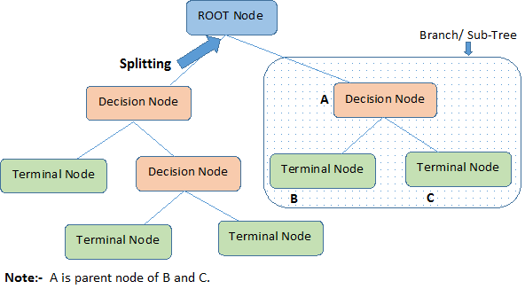

# Tree-Based Methods

**Learning objectives:**

- Use **basic decision trees** to model relationships between predictors and an outcome.
- Compare and contrast tree-based models with other model types.
- Use **tree-based ensemble methods** to build predictive models.
- Compare and contrast the various methods of building tree ensembles: bagging, boosting, random forests, and Bayesian Additive Regression Trees.
 
Original script source: https://emilhvitfeldt.github.io/ISLR-tidymodels-labs/tree-based-methods.html

## Decision Tree Terminology



## Decision Trees (Classification) Explained (StatQuest)

`r knitr::include_url("https://www.youtube.com/embed/_L39rN6gz7Y")`

## 8.1 Fitting Classification Trees

We will also use the `Carseats` data set from the `ISLR` package to demonstrate a classification model.

```{r, load_libraries, echo = FALSE}
library(tidymodels)
library(ISLR)
library(readr)
library(rpart.plot)
library(vip)
```

```{r, call_dataset}
Carseats
```

```{r, skim_dataset}
skimr::skim(Carseats)
```

We create a new variable `High` to denote if `Sales <= 8`, then the `Sales` predictor is removed as it is a perfect predictor of `High`.
```{r, create_High_feature}
carseats <- as_tibble(Carseats) %>%
  mutate(High = factor(if_else(Sales > 8, "Yes", "No"))) %>%
  select(-Sales)
```

## Exploratory Data Analysis (EDA)

Let's count `High`
```{r, count_High}
carseats %>% 
     count(High)
```

`High` plot
```{r, countplot_High}
carseats %>% 
     ggplot(aes(High, fill = High)) + 
     geom_bar() + 
     theme(legend.position = 'none')
```

## Correlation Analysis

Correlation heatmap (Pearson)
```{r, prepare_dataset_for_correlation}
# convert factor features to numeric for correlation analysis
carseats_num <- carseats %>% 
     mutate(High = ifelse(High == "No", 0 , 1), 
            Urban = ifelse(Urban == "No", 0, 1), 
            US = ifelse(US == "No", 0, 1), 
            ShelveLoc = case_when(
                 ShelveLoc == 'Bad' ~ 1, 
                 ShelveLoc == "Medium" ~ 2, 
                 TRUE ~ 3
            ))

carseats_num
```

```{r}
library(dlookr)
```

```{r, Pearson_correlation_class}
carseats_num %>% 
  correlate() %>% 
  plot()
```

Correlation heatmap (Spearman)
```{r, Spearman_correlation_class}
carseats_num %>% 
  correlate(method = "spearman") %>% 
  plot()
```

## Build a model

Split dataset into train/test
```{r, split_dataset_class}
set.seed(1234)
carseats_split <- initial_split(carseats, prop = 0.75, strata = High)

carseats_train <- training(carseats_split)
carseats_test <- testing(carseats_split)
```

Create decision tree classification spec
```{r, tree_spec}
class_tree_spec <- decision_tree() %>% 
     set_engine("rpart") %>% 
     set_mode("classification")
```

Fit the decision tree model
```{r, fit_tree}
class_tree_fit <- fit(class_tree_spec, High ~ ., data = carseats_train)
```

## Visualize our decision tree

```{r, plot_tree_diagram}
class_tree_fit %>% 
     extract_fit_engine() %>% 
     rpart.plot(roundint = FALSE)
```

## Evaluate the model

Confusion matrix (train)
```{r, train_metrics}
augment(class_tree_fit, new_data = carseats_train) %>% 
     conf_mat(truth = High, estimate = .pred_class)

augment(class_tree_fit, new_data = carseats_train) %>% 
     accuracy(truth = High, estimate = .pred_class)
```

Training accuracy: __88.3%__

Confusion matrix (test)
```{r, test_metrics}
augment(class_tree_fit, new_data = carseats_test) %>%
  conf_mat(truth = High, estimate = .pred_class)

augment(class_tree_fit, new_data = carseats_test) %>% 
     accuracy(truth = High, estimate = .pred_class)
```

Testing accuracy: __73% (overfit)__

## Tuning the model

Let's try to tune the `cost_complexity` of the decision tree to find a more optimal complexity. We use the `class_tree_spec` object and use the `set_args()` function to specify that we want to tune `cost_complexity`. This is then passed directly into the workflow object to avoid creating an intermediate object. Also, since the dataset has 400 observations (rows), we'll apply boostrapping to increase the sample number in each fold. **WARNING: Bootstraps resample number has a direct relationship with execution time. For academic purposes, a value of 100 is used. However, in a development stage, the greater the number of resamples, the greater the statistical significance of the model.**
```{r, generate_bootstrap_resamples}
set.seed(1234)

bootstraps_samples <- 100
carseats_boot <- bootstraps(carseats_train, times = bootstraps_samples, apparent = TRUE, strata = High)

carseats_boot
```

To be able to tune the variable we need 2 more objects. With the `resamples` object, we will use a k-fold bootstrap data set, and a grid of values to try. Since we are only tuning 2 hyperparameters it is fine to stay with a regular grid.
```{r, tree_spec_hyperparameters}
tree_spec <- decision_tree(
       cost_complexity = tune(), 
       tree_depth = tune(), 
       min_n = tune()
       ) %>% 
     set_engine("rpart") %>% 
     set_mode("classification")
```

Setup parallel processing ----
```{r, setup_parallel_processing, echo=FALSE}
set.seed(2022)
no_cores <- 10
doParallel::registerDoParallel(no_cores - 1)
foreach::getDoParWorkers()
```

```{r, tree_define_grid_class}
tree_grid <- grid_regular(cost_complexity(range = c(-4, -1)), 
                          tree_depth(range = c(3, 7)), 
                          min_n(range = c(10, 20)), 
                          levels = 5
                          )
```

```{r, tree_tune_grid_class}
# set.seed(2001)
# tune_res <- tune_grid(
#   tree_spec, 
#   High ~ ., 
#   resamples = carseats_boot, 
#   grid = tree_grid, 
#   metrics = metric_set(accuracy)
# )

# save tune_res
# write_rds(tune_res, 'data/08_tree_tune_grid_results.rds')

tune_res <- read_rds('data/08_tree_tune_grid_results.rds')
tune_res
```

## Evaluate the model

```{r, extract_metrics_class}
tune_res %>% 
     collect_metrics()
```


Using `autoplot()` shows which values of `cost_complexity` appear to produce the highest accuracy.
```{r, plot_tuning_results_class}
autoplot(tune_res)
```

We can now select the best performing model with `select_best()`, finalize the workflow by updating the value of `cost_complexity, tree_depth, and min_n` and fit the model on the full training data set.
```{r, final_fit_class}
# select best model
best_model <- select_best(tune_res)

# fit model with best model hyperparameters
class_tree_final <- finalize_model(tree_spec, best_model)

# refit training dataset with best model hyperparameters
class_tree_final_fit <- fit(class_tree_final, High ~ ., data = carseats_train)

class_tree_final_fit
```

## Visualize the tuned decision tree (classification)

At last, we can visualize the model, and we see that the better-performing model is less complex than the original model we fit.
```{r, plot_final_fit_tree_class_diagram}
class_tree_final_fit %>%
  extract_fit_engine() %>%
  rpart.plot(roundint = FALSE)
```

## Variable importance

The `broomstick` package (https://github.com/njtierney/broomstick/) enables the analyst to extract the decision tree variable importance from the fitted model.
```{r, variable_importance_class}
library(forcats)
broomstick::tidy(class_tree_final_fit$fit) %>% 
     mutate(variable = variable %>% as_factor() %>% fct_rev()) %>% 
     ggplot(aes(y = variable, x = importance)) + 
     geom_col(fill = "steelblue")
```

## Final evaluation

Confusion matrix (train, best model)
```{r, train_final_fit_metrics}
augment(class_tree_final_fit, new_data = carseats_train) %>% 
     conf_mat(truth = High, estimate = .pred_class)

augment(class_tree_final_fit, new_data = carseats_train) %>% 
     accuracy(truth = High, estimate = .pred_class)
```

Training accuracy: __86.3%__

Confusion matrix (test, best model)
```{r, test_final_fit_metrics}
augment(class_tree_final_fit, new_data = carseats_test) %>%
  conf_mat(truth = High, estimate = .pred_class)

augment(class_tree_final_fit, new_data = carseats_test) %>% 
     accuracy(truth = High, estimate = .pred_class)
```

Testing accuracy: __71%__

## 8.2 - Fitting Regression Trees

We will now show how we fit a regression tree. This is very similar to what we saw in the last section. The main difference here is that the response we are looking at will be continuous instead of categorical.

## Decision Trees (Regression) Explained (StatQuest)

`r knitr::include_url("https://www.youtube.com/embed/g9c66TUylZ4")`

### EDA

Let's plot a histogram for `Sales` (target)
```{r, plot_Sales}
Carseats %>% 
     ggplot(aes(Sales)) + 
     geom_histogram(fill = "steelblue")
```

## Correlation Analysis

Pearson correlation
```{r, Pearson_correlation_reg}
Carseats %>% 
     mutate(Urban = ifelse(Urban == "No", 0, 1), 
            US = ifelse(US == "No", 0, 1), 
            ShelveLoc = case_when(
                 ShelveLoc == 'Bad' ~ 1, 
                 ShelveLoc == "Medium" ~ 2, 
                 TRUE ~ 3)
            ) %>% 
  correlate() %>% 
  plot()
```

## Build a regression tree

We can reuse `class_tree_spec` as a base for the regression decision tree specification.
```{r, regression_tree_spec}
reg_tree_spec <- class_tree_spec %>% 
     set_mode("regression")
```

We are using the `Carseats` dataset. Let's do the validation split.
```{r, split_dataset}
set.seed(1010)
carseats_split <- initial_split(Carseats)

carseats_train <- training(carseats_split)
carseats_test <- testing(carseats_split)
```

Fit the decision tree regression model
```{r, fit_regression_tree}
reg_tree_fit <- fit(reg_tree_spec, Sales ~ ., data = carseats_train)
reg_tree_fit
```

## Visualize our decision tree

```{r, plot_regression_tree_diagram}
reg_tree_fit %>% 
     extract_fit_engine() %>% 
     rpart.plot(roundint = FALSE)
```

## Evaluate the model

Collect metrics using `augment`
```{r, model_metrics}
augment(reg_tree_fit, new_data = carseats_train) %>%
  rmse(truth = Sales, estimate = .pred)

augment(reg_tree_fit, new_data = carseats_test) %>%
  rmse(truth = Sales, estimate = .pred)
```

Training RMSE: __1.58__
Testing RMSE: __2.18 (overfit)__ 

## Tuning the regression model

Now let us again try to tune the `cost_complexity` to find the best performing model.
```{r, regression_workflow_hyperparameters}
reg_tree_wf <- workflow() %>% 
     add_model(reg_tree_spec %>% set_args(cost_complexity = tune())) %>% 
     add_formula(Sales ~ .)
```

Create the bootstrap folds.
```{r, boostraps_samples_folds}
set.seed(4321)

# bootstraps_samples are defined in line 158
carseats_boot <- bootstraps(carseats_train, times = bootstraps_samples, apparent = TRUE)

carseats_boot
```

Create the tuning grid.
```{r, tuning_grid}
param_grid <- grid_regular(cost_complexity(range = c(-5, -1)), levels = 10)

tune_res <- tune_grid(
  reg_tree_wf, 
  resamples = carseats_boot, 
  grid = param_grid
)

tune_res
```

## Evaluate the model

It appears that higher complexity works are to be preferred according to our cross-validation.
```{r, plot_tuning_results_reg}
autoplot(tune_res)
```

We select the best-performing model according to `"rmse"` and fit the final model on the whole training data set.
```{r, final_fit_reg}
best_complexity <- select_best(tune_res, metric = "rmse")

reg_tree_final <- finalize_workflow(reg_tree_wf, best_complexity)

reg_tree_final_fit <- fit(reg_tree_final, data = carseats_train)
reg_tree_final_fit
```

## Visualize the tuned decision tree (regression)

```{r, plot_final_fit_reg_diagram}
reg_tree_final_fit %>%
     extract_fit_engine() %>%
     rpart.plot(roundint = FALSE)
```

## Variable importance

The `broomstick` package (https://github.com/njtierney/broomstick/) enables the analyst to extract the decision tree variable importance from the fitted model.
```{r, variable_importance_reg}
broomstick::tidy(reg_tree_final_fit$fit$fit) %>% 
     mutate(variable = variable %>% as_factor() %>% fct_rev()) %>% 
     ggplot(aes(y = variable, x = importance)) + 
     geom_col(fill = "steelblue")
```

## Final evaluation

Collect tuned metrics using `augment`
```{r, reg_final_fit_metrics}
augment(reg_tree_final_fit, new_data = carseats_train) %>%
  rmse(truth = Sales, estimate = .pred)

augment(reg_tree_final_fit, new_data = carseats_test) %>%
  rmse(truth = Sales, estimate = .pred)
```

Training RMSE: __1.38__
Testing RMSE: __2.04 (still overfitting!)__

## 8.3 - Bagging and Random Forests

## Random Forest Diagram


## Example

Here, we apply bagging and random forests to the `Carseats` data set. We will be using the randomForest package as the engine. A bagging model is the same as a random forest where mtry is equal to the number of predictors. We can specify the `mtry` to be .cols() which means that the number of columns in the predictor matrix is used. This is useful if you want to make the specification more general and usable to many different data sets. .cols() is one of many `descriptors` in the `parsnip` package. We also set `importance = TRUE` in set_engine() to tell the engine to save the information regarding variable importance. This is needed for this engine if we want to use the `vip` package later.

For a more detailed explanation of `bagging` and its counterpart `boosting`, read this [link](https://quantdare.com/what-is-the-difference-between-bagging-and-boosting/)
```{r, rf_bagging_spec}
bagging_spec <- rand_forest(mtry = .cols()) %>%
     set_engine("randomForest", importance = TRUE) %>%
     set_mode("regression")
```

Fit the model.
```{r, rf_fit_bag_model}
bagging_fit <- fit(bagging_spec, Sales ~ ., data = carseats_train)
```

## Evaluate the model

... and we take a look at the testing performance (notice an improvement over the decision tree).
```{r, rf_bagging_metrics}
augment(bagging_fit, new_data = carseats_train) %>%
  rmse(truth = Sales, estimate = .pred)

augment(bagging_fit, new_data = carseats_test) %>%
  rmse(truth = Sales, estimate = .pred)
```

Training RMSE: __0.671__
Testing RMSE: __1.35 (overfit)__

We can also create a quick scatterplot between the true and predicted value to see if we can make any diagnostics.
```{r, rf_bagging_scatterplot_actual_pred}
augment(bagging_fit, new_data = carseats_test) %>% 
     ggplot(aes(Sales, .pred)) + 
     geom_abline() + 
     geom_point(alpha = 0.5)
```

## Variable importance

```{r, rf_bagging_variable_importance}
vip(bagging_fit)
```

## Random Forest using a set of features (mtry)

By default, `randomForest()` p / 3 variables when building a random forest of regression trees, and sqrt(p) variables when building a random forest of classification trees. Here we use `mtry = 6`, `trees = 2000` and `min_n = 10`.
```{r, rf_spec}
rf_spec <- rand_forest(mtry = 6, trees = 2000, min_n = 10) %>%
     set_engine("randomForest", importance = TRUE) %>%
     set_mode("regression")
```

Fit the model
```{r, rf_fit}
rf_fit <- fit(rf_spec, Sales ~ ., data = carseats_train)
```

## Evaluate the model

This model has similar performance compared to the bagging model.
```{r, rf_fit_metrics}
augment(rf_fit, new_data = carseats_train) %>%
  rmse(truth = Sales, estimate = .pred)

augment(rf_fit, new_data = carseats_test) %>%
  rmse(truth = Sales, estimate = .pred)
```

Training RMSE: __0.858__
Testing RMSE: __1.36 (still overfitting)__

We can likewise plot the true value against the predicted value.
```{r, rf_scatterplot_actual_pred}
augment(rf_fit, new_data = carseats_test) %>% 
     ggplot(aes(Sales, .pred)) + 
     geom_abline() + 
     geom_point(alpha = 0.5)
```

## Variable importance

```{r, rf_variable_importance}
vip(rf_fit)
```

## Boosting

We will now fit a boosted tree model. The `xgboost` package has a good implementation of boosted trees. It has many parameters to tune and we know that setting trees too high can lead to __overfitting__. Nevertheless, let us try fitting a boosted tree. We set `tree = 5000` to grow 5000 trees with a maximal depth of 4 by setting `tree_depth = 4`.
```{r, boost_spec}
boost_spec <- boost_tree(trees = 5000, tree_depth = 4) %>%
     set_engine("xgboost") %>%
     set_mode("regression")
```

Fit the model.
```{r, boost_fit}
boost_fit <- fit(boost_spec, Sales ~ ., data = carseats_train)
```

## Evaluate the model

... and the `rmse` is a little high in this case which is properly because we didn’t tune any of the parameters.
```{r, boost_metrics}
augment(boost_fit, new_data = carseats_train) %>%
  rmse(truth = Sales, estimate = .pred)

augment(boost_fit, new_data = carseats_test) %>%
  rmse(truth = Sales, estimate = .pred)
```

Training RMSE: __0.00162__
Testing RMSE: __1.38 (definitively overfitting)__

## Tuning the xgboost regression model

We are using the `Carseats` dataset. Let's do the validation split with a different seed.
```{r, boost_split_dataset}
set.seed(1001)
carseats_split <- initial_split(Carseats)

carseats_train <- training(carseats_split)
carseats_test <- testing(carseats_split)
```

Create the bootstrap folds.
```{r, boost_bootstraps_samples}
set.seed(2341)
carseats_boot <- bootstraps(carseats_train, times = bootstraps_samples, apparent = TRUE, strata = Sales)

carseats_boot
```

Model spec
```{r, boost_tune_spec}
xgb_spec <- 
     boost_tree(
          trees = 2000, 
          mtry = tune(), 
          min_n = tune(), 
          tree_depth = tune(), 
          learn_rate = tune()
     ) %>% 
     set_engine("xgboost") %>% 
     set_mode("regression")
```

Create the workflow()
```{r, boost_workflow}
xgb_wf <- workflow() %>% 
     add_model(xgb_spec) %>% 
     add_formula(Sales ~ .)
```

## Grid tuning with finetune::race_anova()

Tune the `xgboost` model with `race_anova()` to accelerate the tuning speed.
```{r}
# library(finetune)
# 
# set.seed(4242)
# 
# tictoc::tic()
# xgb_rs <- 
#      tune_race_anova(
#      xgb_wf, 
#      carseats_boot, 
#      grid = 30, 
#      control = control_race(verbose_elim = TRUE)
# )
# tictoc::toc()

# save xgb_rs
# write_rds(xgb_rs, 'data/08_boost_tree_racing_grid_results.rds')

xgb_rs <- read_rds('data/08_boost_tree_racing_grid_results.rds')
xgb_rs
```

## Evaluate the model

```{r, boost_tuning_evaluation_plot}
autoplot(xgb_rs)
```

Show best models
```{r, boost_best_model}
show_best(xgb_rs)
```

Select best model
```{r, boost_select_best_model}
select_best(xgb_rs, "rmse")
```

## Final evauation

Last fit
```{r, boost_last_fit}
xgb_last_fit <- 
     xgb_wf %>% 
     finalize_workflow(select_best(xgb_rs, "rmse")) %>% 
     last_fit(carseats_split)

xgb_last_fit
```

Collect metrics
```{r, boot_last_fit_metrics}
xgb_last_fit %>% collect_metrics()
```

RMSE: __1.42__
R-squared: __0.706__

## Feature importance

```{r, boost_variable_importance}
xgb_fit <- extract_fit_parsnip(xgb_last_fit)

vip(xgb_fit, geom = "point", num_features = 12)
```

Stop parallel cluster
```{r, stop_parallel_cluster, echo=FALSE}
doParallel::stopImplicitCluster()
```

## Meeting Videos

### Cohort 1

`r knitr::include_url("https://www.youtube.com/embed/3E4Pu2UspDI")`

<details>
<summary> Meeting chat log </summary>

```
00:12:39	Ryan Metcalf:	(I’m very self-conscious)
00:21:31	Mei Ling Soh:	I didn’t have time to read this chapter, so sorry to ask, how did you decide on the internal nodes?
00:22:57	Jon Harmon (jonthegeek):	I think we're about to go into that :)
00:23:08	shamsuddeen:	I guess it is calculated based on the purity
```
</details>

`r knitr::include_url("https://www.youtube.com/embed/c_u4Gh4CDnM")`

<details>
<summary> Meeting chat log </summary>

```
00:43:03	jonathan.bratt:	Maybe “inversely correlated” is more accurate?
```
</details>

`r knitr::include_url("https://www.youtube.com/embed/8NGM8aLRCv0")`

<details>
<summary> Meeting chat log </summary>

```
00:09:47	Jon Harmon (jonthegeek):	Yay for using anything other than Boston 😁
00:14:51	jonathan.bratt:	BTW:
00:15:07	jonathan.bratt:	node), split, n, loss, yval, (yprob)
      * denotes terminal node
00:15:40	jonathan.bratt:	From `rpart` output
00:21:47	Federica Gazzelloni:	I need to jump off in 15 minutes..apologies..
00:34:36	Federica Gazzelloni:	See you on Thursday @laura - thanks @jon
```
</details>

### Cohort 2

`r knitr::include_url("https://www.youtube.com/embed/URL")`

<details>
<summary> Meeting chat log </summary>

```
ADD LOG HERE
```
</details>

### Cohort 3

`r knitr::include_url("https://www.youtube.com/embed/URL")`

<details>
<summary> Meeting chat log </summary>

```
ADD LOG HERE
```
</details>
