# Tree-based methods

**Learning objectives:**

-   Use **basic decision trees** to model relationships between predictors and an outcome

-   Compare and contrast tree-based models with other model types

-   Use **tree-based ensemble methods** to build (better!) predictive models

-   Compare and contrast the various methods of building tree ensembles: bagging, boosting, random forests, and Bayesian Additive Regression Trees (BART)

-   Source: material for this chapter was adapted from <https://github.com/JauntyJJS/islr2-bookclub-cohort3-chapter8>, <https://hastie.su.domains/ISLR2/Slides/Ch8_Tree_Based_Methods.pdf>

## Introduction: Tree-based methods

-   Involve **stratifying** or **segmenting** the predictor space into a number of simple regions

-   Are simple and useful for interpretation

-   BUT, basic decision trees are NOT competitive with the best supervised learning approaches in terms of prediction accuracy

-   Thus, we also discuss **bagging**, **random forests**, and **boosting** (i.e., tree-based **ensemble methods**) to grow multiple trees which are then combined to yield a single consensus prediction

-   These can result in dramatic improvements in prediction accuracy (but some loss of interpretability)

-   Can be applied to both regression and classification

## Regression Trees

```{r echo = FALSE, fig.align='center'}
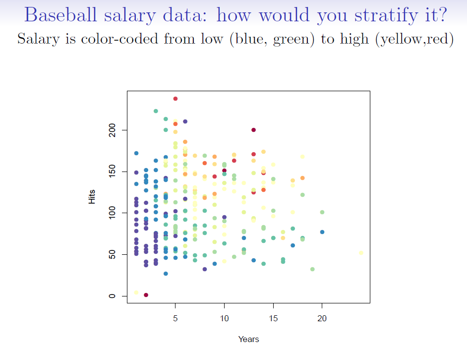

```

```{r echo = FALSE, fig.align='center'}
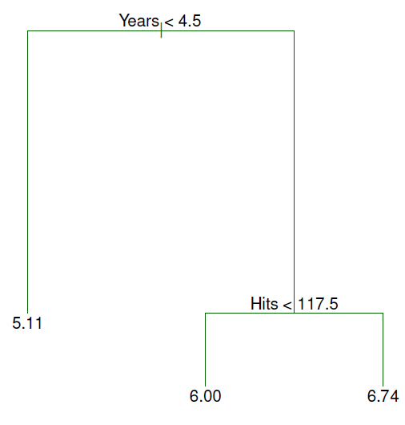
```

-   For the Hitters data, a regression tree for predicting the log salary of a baseball player based on:

    1)  number of years that he has played in the major leagues

    2)  number of hits that he made in the previous year

## Terminology:

```{r echo = FALSE, fig.align='center'}
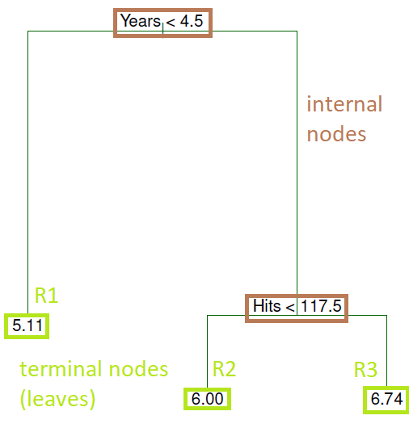
```

```{r echo = FALSE, fig.align='center'}
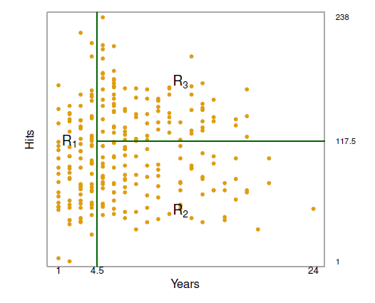
```

-   Overall, the tree stratifies or segments the players into three regions of predictor space:

    -   R1 = {X \| Years\< 4.5}

    -   R2 = {X \| Years\>=4.5, Hits\<117.5}

    -   R3 = {X \| Years\>=4.5, Hits\>=117.5}

where R1, R2, and R3 are **terminal nodes** (leaves) and green lines (where the predictor space is split) are the **internal nodes**

-   The number in each leaf/terminal node is the mean of the response for the observations that fall there

## Interpretation of results: regression tree (Hitters data)

```{r echo = FALSE, fig.align='center'}

```

1)  Years is the most important factor in determining Salary: players with less experience earn lower salaries than more experienced players.

2)  Given that a player is less experienced, the number of Hits that he made in the previous year seems to play little role in his Salary

3)  But among players who have been in the major leagues for 5 or more years, the number of Hits made in the previous year does affect Salary: players who made more Hits last year tend to have higher salaries

4)  This is surely an over-simplification, but compared to a regression model, it is easy to display, interpret and explain

## Tree-building process (regression)

1.  Divide the predictor space --- that is, the set of possible values for $X_1,X_2, . . . ,X_p$ --- into $J$ distinct and **non-overlapping** regions, $R_1,R_2, . . . ,R_J$

-   Regions can have ANY shape - they don't have to be boxes

2.  For every observation that falls into the region $R_j$, we make the same prediction: the **mean** of the response values in $R_j$

3.  The goal is to find regions (here boxes) $R_1, . . . ,R_J$ that **minimize** the $RSS$, given by

$$\mathrm{RSS}=\sum_{j=1}^{J}\sum_{i{\in}R_j}^{}(y_i - \hat{y}_{R_j})^2$$

where $\hat{y}_{R_j}$ is the **mean** response for the training observations within the $j$th box

-   Unfortunately, it is **computationally infeasible** to consider every possible partition of the feature space into $J$ boxes.

## Recursive binary splitting

So, take a top-down, greedy approach known as recursive binary splitting:

-   **top-down** because it begins at the top of the tree and then successively splits the predictor space

-   **greedy** because at each step of the tree-building process, the best split is made at that particular step, rather than looking ahead and picking a split that will lead to a better tree in some future step

## Recursive binary splitting (continued)

1)  We first select the predictor $X_j$ and the cutpoint $s$ such that splitting the predictor space into the regions ${\{X|X_j<s\}}$ and ${\{X|X_j{\ge}s}\}$ leads to the greatest possible reduction in RSS

2)  Repeat the process looking for the best predictor and best cutpoint to split data further (i.e., split one of the 2 previously identified regions - not the entire predictor space) minimizing the RSS within each of the resulting regions

3)  Continue until a stopping criterion is reached, e.g., no region contains more than five observations

4)  Again, we predict the response for a given test observation using the **mean of the training observations** in the region to which that test observation belongs

## But...

-   The previous method may result in a tree that **overfits** the data. Why?

-   Tree is too leafy (complex)

-   A better strategy is to have a smaller tree with fewer splits, which will reduce variance and lead to better interpretation of results (at the cost of a little bias)

-   So we will prune

## Pruning a tree

1)  Grow a very large tree $T_0$ as before

2)  Apply cost-complexity pruning to $T_0$ to obtain a sequence of BEST subtrees, as a function of $\alpha$

Cost complexity pruning minimizes (Eq. 8.4) $\sum_{m=1}^{|T|}\sum_{x_i{\in}R_m}(y_i-\hat{y}_{R_m})^2 + \alpha|T|$

where

$\alpha$ $\geq$ 0

$|T|$ is the number of **terminal nodes** the sub tree $|T|$ holds

$R_m$ is the rectangle/region (i.e., the subset of predictor space) corresponding to the $m$th terminal node

$\hat{y}_{R_m}$ is the **mean** response for the training observations in $R_m$

-   the tuning parameter $\alpha$ controls:

    a)  a trade-off between the subtree's complexity (the number of terminal nodes)

    b)  the subtree's fit to the training data

3)  Choose $\alpha$ using K-fold cross-validation

    -   3.1) repeat steps 1) and 2) for each $K-1/K$th fraction of training data

    -   3.2) average the results and pick $\alpha$ to minimize the average MSE

        -   Recall that in K-folds cross-validation (say K = 5): the model is estimated on 80% of the data five different times, the predictions are made for the remaining 20%, and the test MSEs are averaged

4)  Return to the subtree from Step 2) that corresponds to the chosen value of $\alpha$

## An example: tree pruning (Hitters data)

-   Results of fitting and pruning a regression tree on the Hitters data using 9 of the features
-   Randomly divided the data set in half (132 observations in training, 131 observations in the test set)
-   Built large regression tree on training data and varied $\alpha$ in Eq. 8.4 to create subtrees with different numbers of terminal nodes
-   Finally, performed 6-fold cross-validation to estimate the cross-validated MSE of the trees as a function of $\alpha$

```{r echo=FALSE, fig.align='center'}
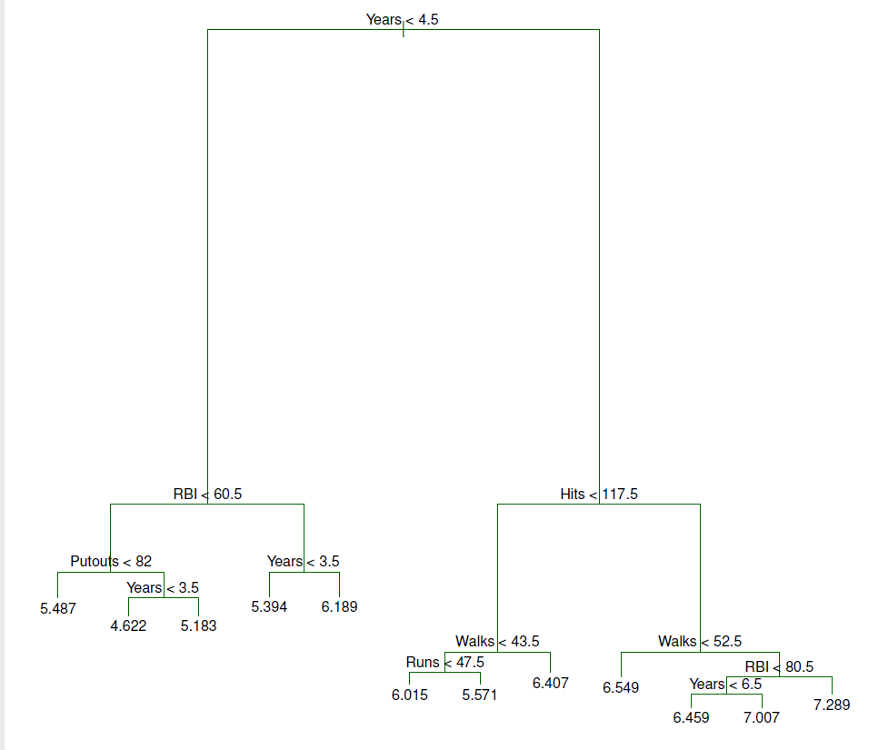

```

```{r echo=FALSE, fig.align='center', fig.cap= "Training, cross-validation, and test MSE are shown as a function of the number of terminal nodes in the pruned tree. Standard error bands are displayed. The minimum cross-validation error occurs at a tree size of 3."}
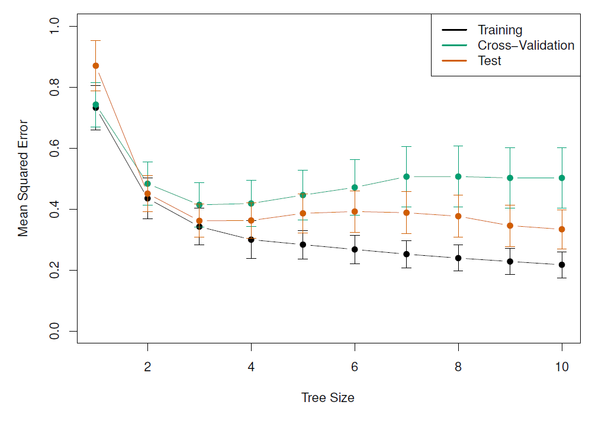

```

## Classification trees

-   Very similar to a regression tree except it predicts a qualitative (vs quantitative) response

-   We predict that each observation belongs to the **most commonly occurring class** of training observations in the region to which it belongs

-   In the classification setting, RSS cannot be used as a criterion for making the binary splits

-   A natural alternative to RSS is the classification **error rate**, i.e., the fraction of the training observations in that region that do not belong to the most common class:

$$E = 1 - \max_k(\hat{p}_{mk})$$

where $\hat{p}_{mk}$ is the **proportion of training observations** in the $m$th region that are from the $k$th class

-   However, this error rate is unsuited for tree-based classification because $E$ does not change much as the tree grows (**lacks sensitivity**)

## Classification trees (continued)

-   So, 2 other measures are preferable

    -   The **Gini Index** defined by $$G = \sum_{k=1}^{K}\hat{p}_{mk}(1-\hat{p}_{mk})$$ is a measure of total variance across the K classes

    -   The Gini index takes on a small value if all of the $\hat{p}_{mk}$'s are close to 0 or 1

    -   For this reason the Gini index is referred to as a measure of node **purity** - a small value indicates that a node contains predominantly observations from a single class

    -   An alternative to the Gini index is **cross-entropy** given by

$$D = - \sum_{k=1}^{K}\hat{p}_{mk}\log(\hat{p}_{mk})$$

-   The Gini index and cross-entropy are very similar numerically

## Example: classification tree (Heart data)

-   Data contain a binary outcome HD (heart disease Y or N based on angiographic test) for 303 patients who presented with chest pain

-   13 predictors including Age, Sex, Chol (a cholesterol measurement), and other heart and lung function measurements

-   Cross-validation yields a tree with six terminal nodes

```{r echo=FALSE, fig.align='center', fig.cap="Heart data. Top: The unpruned tree. Bottom Left: Cross-validation error, training, and test error, for different sizes of the pruned tree. Bottom Right: The pruned tree corresponding to the minimal cross-validation error."}
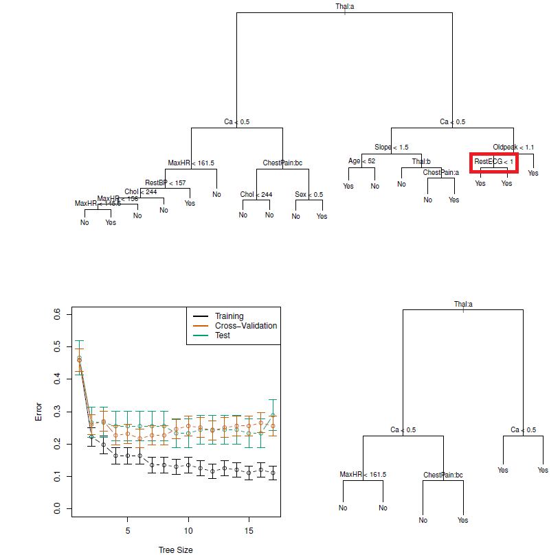
```

-   **NOTE**: classification trees can be constructed if categorical PREDICTORS are present e.g., the first split: Thal is categorical (the 'a' in Thal:a indicates the first level of the predictor, i.e. Normal levels)

-   Additionally, notice that some of the splits yield two terminal nodes that have the same predicted value (see red box)

-   Regardless of the value of RestECG, a response value of *Yes* is predicted for those observations

-   Why is the split performed at all?

    -   Because it leads to increased node purity: all 9 of the observations corresponding to the right-hand leaf have a response value of *Yes*, whereas 7/11 of those corresponding to the left-hand leaf have a response value of *Yes*

-   Why is node purity important?

    -   Suppose that we have a test observation that belongs to the region given by that right-hand leaf. Then we can be pretty certain that its response value is *Yes*. In contrast, if a test observation belongs to the region given by the left-hand leaf, then its response value is **probably** *Yes*, but we are much less certain

-   Even though the split RestECG\<1 does not reduce the classification error, it improves the Gini index and the entropy, which are more sensitive to node purity

## Advantages/Disadvantages of decision trees

-   Trees can be displayed graphically and are **very easy to explain** to people

-   They mirror human decision-making

-   Can handle qualitative predictors without the need for dummy variables

BUT,

-   They do not have the same level of predictive accuracy

-   Can be very non-robust (i.e., a small change in the data can cause large change in the final estimated tree)

-   To improve performance, we can use an **ensemble** method, which combines many simple 'buidling blocks' (i.e., regression or classification trees) to obtain a single and potentially very powerful model

-   **ensemble** methods include: bagging, random forests, boosting, and Bayesian additive regression trees

## Bagging

-   Also known as **bootstrap aggregation** is a general-purpose procedure for reducing the variance of a statistical learning method

-   It's useful and frequently used in the context of decision trees

-   Recall that given a set of $n$ independent observations $Z_1,..., Z_n$, each with variance $\sigma^2$, the variance of the mean $\bar{Z}$ of the observations is given by $\sigma^2/n$

-   So, **averaging a set of observations** reduces variance

-   But, this is not practical because we generally do not have access to multiple training sets!

-   What to do?!

## Bagging (continued)

-   Cue the bootstrap, i.e., take repeated samples from the single training set

-   Generate $B$ different bootstrapped training data sets

-   Then train our method on the $b$th bootstrapped training set to get $\hat{f}^{*b}$, the prediction at a point x

-   Average all the predictions to obtain $$\hat{f}_{bag}(x) = \frac{1}{B}\sum_{b=1}^B\hat{f}^{*b}(x)$$

-   In the case of classification trees:

    -   for each test observation:

        -   record the class predicted by each of the $B$ trees

        -   take a **majority vote**: the overall prediction is the most commonly occurring class among the $B$ predictions

**NOTE**: the number of trees $B$ is not a critical parameter with bagging - a large $B$ will not lead to overfitting

## Out-of-bag error estimation

-   But how do we estimate the test error of a bagged model?

-   It's pretty straightforward:

    1)  Because trees are repeatedly fit to bootstrapped subsets of observations, on average each bagged tree uses about 2/3 of the observations

    2)  The leftover 1/3 not used to fit a given bagged tree are called **out-of-bag** (OOB) observations

    3)  We can predict the response for the $i$th observation using each of the trees in which that observation was OOB. Gives around B/3 predictions for the $i$th observation (which we then average)

    4)  This estimate is essentially the LOO cross-validation error for bagging (if $B$ is large)

## Variable importance measures

-   Bagging results in improved accuracy over prediction using a single tree

-   But, it can be difficult to interpret the resulting model:

    -   we can't represent the statistical learning procedure using a single tree

    -   it's not clear which variables are most important to the procedure (i.e., we have many trees each of which may give a differing view on the importance of a given predictor)

-   So which predictors are important?

    -   An overall summary of the importance of each predictor can be achieved by recording how much the average $RSS$ or Gini index **improves (or decreases)** when each tree is split over a given predictor (averaged over all $B$ trees)

        -   a large value = important predictor

```{r echo=FALSE, fig.align='center', fig.cap="A variable importance plot for the Heart data. Variable importance is computed using the mean decrease in Gini index, and expressed relative to the maximum."}

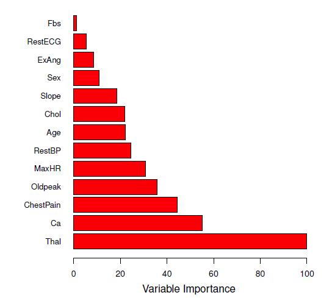
```

## Random forests

-   A problem with bagging is that bagged trees may be **highly similar** to each other.

-   For example, if there is a strong predictor in the data set, most of the bagged trees will **use this strong predictor** in the top split so that

    -   the trees will look quite similar

    -   predictions from the bagged trees will be highly correlated

-   Averaging many highly correlated quantities does not lead to as large a reduction in variance as averaging many uncorrelated quantities

## Random forests: advantages over bagging

-   Random forests overcome this problem by forcing each split to consider only a **subset** of the predictors (typically a random sample $m \approx \sqrt{p}$)

-   Thus at each split, the algorithm is NOT ALLOWED to consider a majority of the available predictors (essentially $(p - m)/p$ of the splits will not even consider the strong predictor, giving other predictors a chance)

-   This *decorrelates* the trees and makes the average of the resulting trees less variable (more reliable)

-   Only difference between bagging and random forests is the choice of predictor subset size $m$ at each split: if a random forest is built using $m = p$ that's just bagging

-   For both, we build a number of decision trees on bootstrapped training samples

## Example: Random forests versus bagging (gene expression data)

-   High-dimensional biological data set: contains gene expression measurements of 4,718 genes measured on tissue samples from 349 patients

-   Each of the patient samples has a qualitative label with 15 different levels: *Normal* or one of 14 different cancer types

-   Want to predict cancer type based on the 500 genes that have the largest variance in the training set

-   Randomly divided the observations into training/test and applied random forests (or bagging) to the training set for 3 different values of $m$ (the number of predictors available at each split)

```{r echo=FALSE, fig.align='center', fig.cap="Results from random forests for the 15-class gene expression data set with p = 500 predictors. The test error is displayed as a function of the number of trees. Random forests (m < p) lead to a slight improvement over bagging (m = p). A single classification tree has an error rate of 45.7%."}
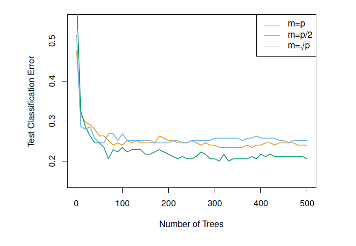
```

## Boosting

-   Yet another approach to improve prediction accuracy from a decision tree

-   Can also be applied to many statistical learning methods for regression or classification

-   Recall that in bagging each tree is built on a bootstrap training data set

-   In boosting, each tree is grown sequentially using information from previously grown trees:

    -   given the current model, we fit a decision tree to the residuals of the model (rather than the outcome *Y*) as the response

    -   we then add this new decision tree into the fitted function (model) in order to update the residuals

    -   Why? this way each tree is built on information that the previous trees were unable to 'catch'

## Boosting algorithm

```{r echo=FALSE, fig.align='center'}
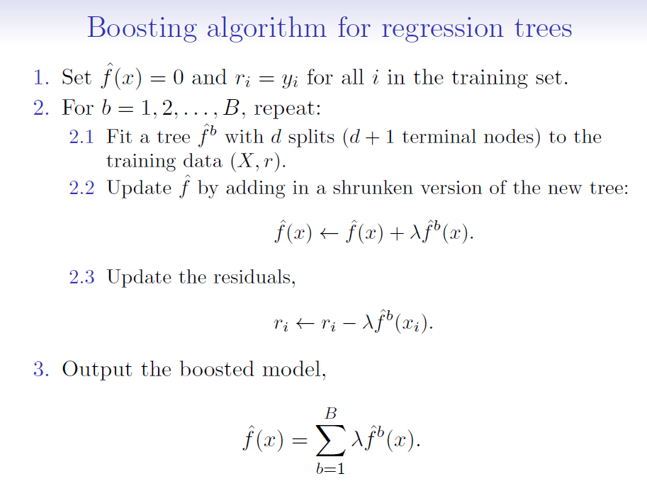
```

where:

$\hat{f}(x)$ is the decision tree (model)

$r$ = residuals

$d$ = number of splits in each tree (controls the complexity of the boosted ensemble)

$\lambda$ = shrinkage parameter (a small positive number that controls the rate at which boosting learns; typically 0.01 or 0.001 but right choice can depend on the problem)

-   Each of the trees can be small, with just a few terminal nodes (determined by $d$)

-   By fitting small trees to the residuals, we slowly improve our model ($\hat{f}$) in areas where it doesn't perform well

-   The shrinkage parameter $\lambda$ slows the process down further, allowing more and different shaped trees to 'attack' the residuals

-   Unlike bagging and random forests, boosting can OVERFIT if $B$ is too large. $B$ is selected via cross-validation

## Example: Boosting versus random forests

```{r echo=FALSE, fig.align='center', fig.cap="Results from performing boosting and random forests on the 15-class gene expression data set in order to predict cancer versus normal. The test error is displayed as a function of the number of trees. For the two boosted models, lambda = 0.01. Depth-1 trees slightly outperform depth-2 trees, and both outperform the random forest, although the standard errors are around 0.02, making none of these differences significant. The test error rate for a single tree is 24 %."}
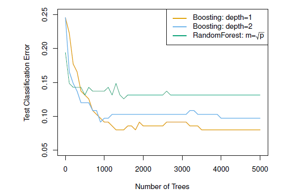
```

-   Notice that because the growth of a particular tree takes into account the other trees that have already been grown, smaller trees are typically sufficient in boosting (versus random forests)

-   Random forests and boosting are among the state-of-the-art methods for supervised learning (but, their results can be difficult to interpret)

## Bayesian additive regression trees (BART)

-   Recall that in bagging and random forests, each tree is built on a **random sample of data and/or predictors** and each tree is built **independently** of the others

-   In boosting, each tree is built to capture **signal that is not yet accounted for** by the current set of trees

-   BART is related to both - what is new is HOW the new trees are generated

-   NOTE: only BART for regression is described in the book

## But first, BART notation:

-   Let $K$ be the total **number of regression trees** and
-   $B$ be the **number of iterations** the BART algorithm will run for
-   Let $\hat{f}^b_k(x)$ be the **prediction** at $x$ for the $k$th regression tree used in the $b$th iteration of the BART algorithm
-   At the end of each iteration, the $K$ trees from that iteration will be summed:

$$\hat{f}^b(x) = \sum_{k=1}^{K}\hat{f}^b_k(x)$$ for $b=1,...,B$

## Now, the BART algorithm

-   In the first iteration of the BART algorithm, all $K$ trees are initialized to have 1 root node, with $\hat{f}^1_k(x) = \frac{1}{nK}\sum_{i=1}^{n}y_i$

    -   i.e., the mean of the response values divided by the total number of trees

-   Thus, for the first iteration ($b = 1$), the prediction for all $K$ trees is just the mean of the response

$\hat{f}^1(x) = \sum_{k=1}^K\hat{f}^1_k(x) = \sum_{k=1}^K\frac{1}{nK}\sum_{i=1}^{n}y_i = \frac{1}{n}\sum_{i=1}^{n}y_i$

## BART algorithm: iteration 2 and on

-   In subsequent iterations, BART updates each of the $K$ trees one at a time

-   In the $b$th iteration to update the $k$th tree, we subtract from each response value the predictions from all but the $k$th tree, to obtain a partial residual:

$r_i = y_i - \sum_{k'<k}\hat{f}^b_{k'}(x_i) - \sum_{k'>k}\hat{f}^{b-1}_{k'}(x_i)$

for the $i$th observation, $i = 1, …, n$

-   Rather than fitting a new tree to this partial residual, BART chooses a perturbation to the tree from a previous iteration $\hat{f}^{b-1}_{k}$ favoring perturbations that improve the fit to the partial residual

-   To perturb trees:

    -   change the structure of the tree by adding/pruning branches

    -   change the prediction in each terminal node of the tree

-   The output of BART is a collection of prediction models:

$\hat{f}^b(x) = \sum_{k=1}^{K}\hat{f}^b_k(x)$

for $b = 1, 2,…, B$

## BART algorithm: figure

```{r echo=FALSE, fig.align='center'}
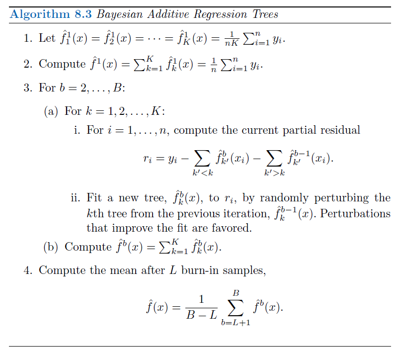
```

-   **NOTE**: the first few prediction models obtained in the earlier iterations (known as the $burn-in$ period; denoted by $L$) are typically thrown away since they tend to not provide very good results, like you throw away the first pancake of the batch

## BART: additional details

-   A key element of BART is that a fresh tree is NOT fit to the current partial residual: instead, we improve the fit to the current partial residual by slightly modifying the tree obtained in the previous iteration (Step 3(a)ii)

-   This guards against overfitting since it limits how "hard" the data is fit in each iteration

-   Additionally, the individual trees are typically pretty small

-   BART, as the name suggests, can be viewed as a *Bayesian* approach to fitting an ensemble of trees:

    -   each time a tree is randomly perturbed to fit the residuals = drawing a new tree from a *posterior* distribution

## To apply BART:

-   We must select the number of trees $K$, the number of iterations $B$ and the number of burn-in iterations $L$

-   Typically, large values are chosen for $B$ and $K$ and a moderate value for $L$: e.g. $K$ = 200, $B$ = 1,000 and $L$ = 100

-   BART has been shown to have impressive out-of-box performance - i.e., it performs well with minimal tuning


## Lab: Tree-Based Methods - Fitting Classification Trees

We will use the `Carseats` data set from the `ISLR` package to demonstrate a classification model.

```{r, load_libraries, echo = FALSE}
library(tidymodels)
library(ISLR)
library(readr)
library(rpart.plot)
library(vip)
library(broomstick)
```

```{r, call_dataset}
head(Carseats)
```

```{r, skim_dataset}
skimr::skim(Carseats)
```

We create a new variable `High` to denote if `Sales <= 8`, then the `Sales` predictor is removed as it is a perfect predictor of `High`.
```{r, create_High_feature}
carseats <- as_tibble(Carseats) %>%
  mutate(High = factor(if_else(Sales > 8, "Yes", "No"))) %>%
  select(-Sales)
```

## Exploratory Data Analysis (EDA)

Let's count `High`
```{r, count_High}
carseats %>% 
     count(High)
```

`High` plot
```{r, countplot_High}
carseats %>% 
     ggplot(aes(High, fill = High)) + 
     geom_bar() + 
     theme(legend.position = 'none')
```

## Correlation Analysis

Correlation heatmap (Pearson)
```{r, prepare_dataset_for_correlation}
# convert factor features to numeric for correlation analysis
carseats_num <- carseats %>% 
     mutate(High = ifelse(High == "No", 0 , 1), 
            Urban = ifelse(Urban == "No", 0, 1), 
            US = ifelse(US == "No", 0, 1), 
            ShelveLoc = case_when(
                 ShelveLoc == 'Bad' ~ 1, 
                 ShelveLoc == "Medium" ~ 2, 
                 TRUE ~ 3
            ))

carseats_num
```

```{r}
library(dlookr)
```

```{r, Pearson_correlation_class}
carseats_num %>% 
  correlate() %>% 
  plot()
```

Correlation heatmap (Spearman)
```{r, Spearman_correlation_class}
carseats_num %>% 
  correlate(method = "spearman") %>% 
  plot()
```

## Build a model

Split dataset into train/test
```{r, split_dataset_class}
set.seed(1234)
carseats_split <- initial_split(carseats, prop = 0.75, strata = High)

carseats_train <- training(carseats_split)
carseats_test <- testing(carseats_split)
```

Create decision tree classification spec
```{r, tree_spec}
class_tree_spec <- decision_tree() %>% 
     set_engine("rpart") %>% 
     set_mode("classification")
```

Fit the decision tree model
```{r, fit_tree}
class_tree_fit <- fit(class_tree_spec, High ~ ., data = carseats_train)
```

## Visualize our decision tree

```{r, plot_tree_diagram}
class_tree_fit %>% 
     extract_fit_engine() %>% 
     rpart.plot(roundint = FALSE)
```

## Evaluate the model

Confusion matrix (train)
```{r, train_metrics}
augment(class_tree_fit, new_data = carseats_train) %>% 
     conf_mat(truth = High, estimate = .pred_class)

augment(class_tree_fit, new_data = carseats_train) %>% 
     accuracy(truth = High, estimate = .pred_class)
```

Training accuracy: __88.3%__

Confusion matrix (test)
```{r, test_metrics}
augment(class_tree_fit, new_data = carseats_test) %>%
  conf_mat(truth = High, estimate = .pred_class)

augment(class_tree_fit, new_data = carseats_test) %>% 
     accuracy(truth = High, estimate = .pred_class)
```

Testing accuracy: __73% (overfit)__

## Tuning the model

Let's try to tune the `cost_complexity` of the decision tree to find a more optimal complexity. We use the `class_tree_spec` object and use the `set_args()` function to specify that we want to tune `cost_complexity`. This is then passed directly into the workflow object to avoid creating an intermediate object. Also, since the dataset has 400 observations (rows), we'll apply boostrapping to increase the sample number in each fold. **WARNING: Bootstraps resample number has a direct relationship with execution time. For academic purposes, a value of 100 is used. However, in a development stage, the greater the number of resamples, the greater the statistical significance of the model.**
```{r, generate_bootstrap_resamples}
set.seed(1234)

bootstraps_samples <- 100
carseats_boot <- bootstraps(carseats_train, times = bootstraps_samples, apparent = TRUE, strata = High)

carseats_boot
```

To be able to tune the variable we need 2 more objects. With the `resamples` object, we will use a k-fold bootstrap data set, and a grid of values to try. Since we are only tuning 2 hyperparameters it is fine to stay with a regular grid.
```{r, tree_spec_hyperparameters}
tree_spec <- decision_tree(
       cost_complexity = tune(), 
       tree_depth = tune(), 
       min_n = tune()
       ) %>% 
     set_engine("rpart") %>% 
     set_mode("classification")
```

Setup parallel processing ----
```{r, setup_parallel_processing, echo=FALSE}
set.seed(2022)
no_cores <- 10
doParallel::registerDoParallel(no_cores - 1)
foreach::getDoParWorkers()
```

```{r, tree_define_grid_class}
tree_grid <- grid_regular(cost_complexity(range = c(-4, -1)), 
                          tree_depth(range = c(3, 7)), 
                          min_n(range = c(10, 20)), 
                          levels = 5
                          )
```

```{r, tree_tune_grid_class}
# set.seed(2001)
# tune_res <- tune_grid(
#   tree_spec, 
#   High ~ ., 
#   resamples = carseats_boot, 
#   grid = tree_grid, 
#   metrics = metric_set(accuracy)
# )

# save tune_res
# write_rds(tune_res, 'data/08_tree_tune_grid_results.rds')

tune_res <- read_rds('data/08_tree_tune_grid_results.rds')
tune_res
```

## Evaluate the model

```{r, extract_metrics_class}
tune_res %>% 
     collect_metrics()
```


Using `autoplot()` shows which values of `cost_complexity` appear to produce the highest accuracy.
```{r, plot_tuning_results_class}
autoplot(tune_res)
```

We can now select the best performing model with `select_best()`, finalize the workflow by updating the value of `cost_complexity, tree_depth, and min_n` and fit the model on the full training data set.
```{r, final_fit_class}
# select best model
best_model <- select_best(tune_res)

# fit model with best model hyperparameters
class_tree_final <- finalize_model(tree_spec, best_model)

# refit training dataset with best model hyperparameters
class_tree_final_fit <- fit(class_tree_final, High ~ ., data = carseats_train)

class_tree_final_fit
```

## Visualize the tuned decision tree (classification)

At last, we can visualize the model, and we see that the better-performing model is less complex than the original model we fit.
```{r, plot_final_fit_tree_class_diagram}
class_tree_final_fit %>%
  extract_fit_engine() %>%
  rpart.plot(roundint = FALSE)
```

## Variable importance

The `broomstick` package (https://github.com/njtierney/broomstick/) enables the analyst to extract the decision tree variable importance from the fitted model.
```{r, variable_importance_class}
library(forcats)
broomstick::tidy(class_tree_final_fit$fit) %>% 
     mutate(variable = variable %>% as_factor() %>% fct_rev()) %>% 
     ggplot(aes(y = variable, x = importance)) + 
     geom_col(fill = "steelblue")
```

## Final evaluation

Confusion matrix (train, best model)
```{r, train_final_fit_metrics}
augment(class_tree_final_fit, new_data = carseats_train) %>% 
     conf_mat(truth = High, estimate = .pred_class)

augment(class_tree_final_fit, new_data = carseats_train) %>% 
     accuracy(truth = High, estimate = .pred_class)
```

Training accuracy: __86.3%__

Confusion matrix (test, best model)
```{r, test_final_fit_metrics}
augment(class_tree_final_fit, new_data = carseats_test) %>%
  conf_mat(truth = High, estimate = .pred_class)

augment(class_tree_final_fit, new_data = carseats_test) %>% 
     accuracy(truth = High, estimate = .pred_class)
```

Testing accuracy: __71%__

## Fitting Regression Trees

We will now show how we fit a regression tree. This is very similar to what we saw in the last section. The main difference here is that the response we are looking at will be continuous instead of categorical.

## Decision Trees (Regression) Explained (StatQuest)

`r knitr::include_url("https://www.youtube.com/embed/g9c66TUylZ4")`

### EDA

Let's plot a histogram for `Sales` (target)
```{r, plot_Sales}
Carseats %>% 
     ggplot(aes(Sales)) + 
     geom_histogram(fill = "steelblue")
```

## Correlation Analysis

Pearson correlation
```{r, Pearson_correlation_reg}
Carseats %>% 
     mutate(Urban = ifelse(Urban == "No", 0, 1), 
            US = ifelse(US == "No", 0, 1), 
            ShelveLoc = case_when(
                 ShelveLoc == 'Bad' ~ 1, 
                 ShelveLoc == "Medium" ~ 2, 
                 TRUE ~ 3)
            ) %>% 
  correlate() %>% 
  plot()
```

## Build a regression tree

We can reuse `class_tree_spec` as a base for the regression decision tree specification.
```{r, regression_tree_spec}
reg_tree_spec <- class_tree_spec %>% 
     set_mode("regression")
```

We are using the `Carseats` dataset. Let's do the validation split.
```{r, split_dataset}
set.seed(1010)
carseats_split <- initial_split(Carseats)

carseats_train <- training(carseats_split)
carseats_test <- testing(carseats_split)
```

Fit the decision tree regression model
```{r, fit_regression_tree}
reg_tree_fit <- fit(reg_tree_spec, Sales ~ ., data = carseats_train)
reg_tree_fit
```

## Visualize our decision tree

```{r, plot_regression_tree_diagram}
reg_tree_fit %>% 
     extract_fit_engine() %>% 
     rpart.plot(roundint = FALSE)
```

## Evaluate the model

Collect metrics using `augment`
```{r, model_metrics}
augment(reg_tree_fit, new_data = carseats_train) %>%
  rmse(truth = Sales, estimate = .pred)

augment(reg_tree_fit, new_data = carseats_test) %>%
  rmse(truth = Sales, estimate = .pred)
```

Training RMSE: __1.58__
Testing RMSE: __2.18 (overfit)__ 

## Tuning the regression model

Now let us again try to tune the `cost_complexity` to find the best performing model.
```{r, regression_workflow_hyperparameters}
reg_tree_wf <- workflow() %>% 
     add_model(reg_tree_spec %>% set_args(cost_complexity = tune())) %>% 
     add_formula(Sales ~ .)
```

Create the bootstrap folds.
```{r, boostraps_samples_folds}
set.seed(4321)

# bootstraps_samples are defined in line 158
carseats_boot <- bootstraps(carseats_train, times = bootstraps_samples, apparent = TRUE)

carseats_boot
```

Create the tuning grid.
```{r, tuning_grid}
param_grid <- grid_regular(cost_complexity(range = c(-5, -1)), levels = 10)

tune_res <- tune_grid(
  reg_tree_wf, 
  resamples = carseats_boot, 
  grid = param_grid
)

tune_res
```

## Evaluate the model

It appears that higher complexity works are to be preferred according to our cross-validation.
```{r, plot_tuning_results_reg}
autoplot(tune_res)
```

We select the best-performing model according to `"rmse"` and fit the final model on the whole training data set.
```{r, final_fit_reg}
best_complexity <- select_best(tune_res, metric = "rmse")

reg_tree_final <- finalize_workflow(reg_tree_wf, best_complexity)

reg_tree_final_fit <- fit(reg_tree_final, data = carseats_train)
reg_tree_final_fit
```

## Visualize the tuned decision tree (regression)

```{r, plot_final_fit_reg_diagram}
reg_tree_final_fit %>%
     extract_fit_engine() %>%
     rpart.plot(roundint = FALSE)
```

## Variable importance

The `broomstick` package (https://github.com/njtierney/broomstick/) enables the analyst to extract the decision tree variable importance from the fitted model.
```{r, variable_importance_reg}
broomstick::tidy(reg_tree_final_fit$fit$fit) %>% 
     mutate(variable = variable %>% as_factor() %>% fct_rev()) %>% 
     ggplot(aes(y = variable, x = importance)) + 
     geom_col(fill = "steelblue")
```

## Final evaluation

Collect tuned metrics using `augment`
```{r, reg_final_fit_metrics}
augment(reg_tree_final_fit, new_data = carseats_train) %>%
  rmse(truth = Sales, estimate = .pred)

augment(reg_tree_final_fit, new_data = carseats_test) %>%
  rmse(truth = Sales, estimate = .pred)
```

Training RMSE: __1.38__
Testing RMSE: __2.04 (still overfitting!)__

## Bagging and Random Forests

## Random Forest Diagram

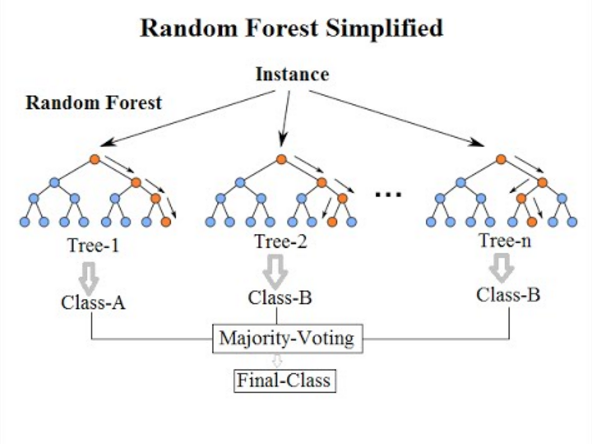

## Example

Here, we apply bagging and random forests to the `Carseats` data set. We will be using the randomForest package as the engine. A bagging model is the same as a random forest where mtry is equal to the number of predictors. We can specify the `mtry` to be .cols() which means that the number of columns in the predictor matrix is used. This is useful if you want to make the specification more general and usable to many different data sets. .cols() is one of many `descriptors` in the `parsnip` package. We also set `importance = TRUE` in set_engine() to tell the engine to save the information regarding variable importance. This is needed for this engine if we want to use the `vip` package later.

For a more detailed explanation of `bagging` and its counterpart `boosting`, read this [link](https://quantdare.com/what-is-the-difference-between-bagging-and-boosting/)
```{r, rf_bagging_spec}
bagging_spec <- rand_forest(mtry = .cols()) %>%
     set_engine("randomForest", importance = TRUE) %>%
     set_mode("regression")
```

Fit the model.
```{r, rf_fit_bag_model}
bagging_fit <- fit(bagging_spec, Sales ~ ., data = carseats_train)
```

## Evaluate the model

... and we take a look at the testing performance (notice an improvement over the decision tree).
```{r, rf_bagging_metrics}
augment(bagging_fit, new_data = carseats_train) %>%
  rmse(truth = Sales, estimate = .pred)

augment(bagging_fit, new_data = carseats_test) %>%
  rmse(truth = Sales, estimate = .pred)
```

Training RMSE: __0.671__
Testing RMSE: __1.35 (overfit)__

We can also create a quick scatterplot between the true and predicted value to see if we can make any diagnostics.
```{r, rf_bagging_scatterplot_actual_pred}
augment(bagging_fit, new_data = carseats_test) %>% 
     ggplot(aes(Sales, .pred)) + 
     geom_abline() + 
     geom_point(alpha = 0.5)
```

## Variable importance

```{r, rf_bagging_variable_importance}
vip(bagging_fit)
```

## Random Forest using a set of features (mtry)

By default, `randomForest()` p / 3 variables when building a random forest of regression trees, and sqrt(p) variables when building a random forest of classification trees. Here we use `mtry = 6`, `trees = 2000` and `min_n = 10`.
```{r, rf_spec}
rf_spec <- rand_forest(mtry = 6, trees = 2000, min_n = 10) %>%
     set_engine("randomForest", importance = TRUE) %>%
     set_mode("regression")
```

Fit the model
```{r, rf_fit}
rf_fit <- fit(rf_spec, Sales ~ ., data = carseats_train)
```

## Evaluate the model

This model has similar performance compared to the bagging model.
```{r, rf_fit_metrics}
augment(rf_fit, new_data = carseats_train) %>%
  rmse(truth = Sales, estimate = .pred)

augment(rf_fit, new_data = carseats_test) %>%
  rmse(truth = Sales, estimate = .pred)
```

Training RMSE: __0.858__
Testing RMSE: __1.36 (still overfitting)__

We can likewise plot the true value against the predicted value.
```{r, rf_scatterplot_actual_pred}
augment(rf_fit, new_data = carseats_test) %>% 
     ggplot(aes(Sales, .pred)) + 
     geom_abline() + 
     geom_point(alpha = 0.5)
```

## Variable importance

```{r, rf_variable_importance}
vip(rf_fit)
```

## Boosting

We will now fit a boosted tree model. The `xgboost` package has a good implementation of boosted trees. It has many parameters to tune and we know that setting trees too high can lead to __overfitting__. Nevertheless, let us try fitting a boosted tree. We set `tree = 5000` to grow 5000 trees with a maximal depth of 4 by setting `tree_depth = 4`.
```{r, boost_spec}
boost_spec <- boost_tree(trees = 5000, tree_depth = 4) %>%
     set_engine("xgboost") %>%
     set_mode("regression")
```

Fit the model.
```{r, boost_fit}
boost_fit <- fit(boost_spec, Sales ~ ., data = carseats_train)
```

## Evaluate the model

... and the `rmse` is a little high in this case which is properly because we didn’t tune any of the parameters.
```{r, boost_metrics}
augment(boost_fit, new_data = carseats_train) %>%
  rmse(truth = Sales, estimate = .pred)

augment(boost_fit, new_data = carseats_test) %>%
  rmse(truth = Sales, estimate = .pred)
```

Training RMSE: __0.00162__
Testing RMSE: __1.38 (definitively overfitting)__

## Tuning the xgboost regression model

We are using the `Carseats` dataset. Let's do the validation split with a different seed.
```{r, boost_split_dataset}
set.seed(1001)
carseats_split <- initial_split(Carseats)

carseats_train <- training(carseats_split)
carseats_test <- testing(carseats_split)
```

Create the bootstrap folds.
```{r, boost_bootstraps_samples}
set.seed(2341)
carseats_boot <- bootstraps(carseats_train, times = bootstraps_samples, apparent = TRUE, strata = Sales)

carseats_boot
```

Model spec
```{r, boost_tune_spec}
xgb_spec <- 
     boost_tree(
          trees = 2000, 
          mtry = tune(), 
          min_n = tune(), 
          tree_depth = tune(), 
          learn_rate = tune()
     ) %>% 
     set_engine("xgboost") %>% 
     set_mode("regression")
```

Create the workflow()
```{r, boost_workflow}
xgb_wf <- workflow() %>% 
     add_model(xgb_spec) %>% 
     add_formula(Sales ~ .)
```

## Grid tuning with finetune::race_anova()

Tune the `xgboost` model with `race_anova()` to accelerate the tuning speed.
```{r}
# library(finetune)
# 
# set.seed(4242)
# 
# tictoc::tic()
# xgb_rs <- 
#      tune_race_anova(
#      xgb_wf, 
#      carseats_boot, 
#      grid = 30, 
#      control = control_race(verbose_elim = TRUE)
# )
# tictoc::toc()

# save xgb_rs
# write_rds(xgb_rs, 'data/08_boost_tree_racing_grid_results.rds')

xgb_rs <- read_rds('data/08_boost_tree_racing_grid_results.rds')
xgb_rs
```

## Evaluate the model

```{r, boost_tuning_evaluation_plot}
autoplot(xgb_rs)
```

Show best models
```{r, boost_best_model}
show_best(xgb_rs)
```

Select best model
```{r, boost_select_best_model}
select_best(xgb_rs, "rmse")
```

## Final evauation

Last fit
```{r, boost_last_fit}
xgb_last_fit <- 
     xgb_wf %>% 
     finalize_workflow(select_best(xgb_rs, "rmse")) %>% 
     last_fit(carseats_split)

xgb_last_fit
```

Collect metrics
```{r, boot_last_fit_metrics}
xgb_last_fit %>% collect_metrics()
```

RMSE: __1.42__
R-squared: __0.706__

## Feature importance

```{r, boost_variable_importance}
xgb_fit <- extract_fit_parsnip(xgb_last_fit)

vip(xgb_fit, geom = "point", num_features = 12)
```

Stop parallel cluster
```{r, stop_parallel_cluster, echo=FALSE}
doParallel::stopImplicitCluster()
```

## Meeting Videos

### Cohort 1

`r knitr::include_url("https://www.youtube.com/embed/3E4Pu2UspDI")`

<details>
<summary> Meeting chat log </summary>

```
00:12:39	Ryan Metcalf:	(I’m very self-conscious)
00:21:31	Mei Ling Soh:	I didn’t have time to read this chapter, so sorry to ask, how did you decide on the internal nodes?
00:22:57	Jon Harmon (jonthegeek):	I think we're about to go into that :)
00:23:08	shamsuddeen:	I guess it is calculated based on the purity
```
</details>

`r knitr::include_url("https://www.youtube.com/embed/c_u4Gh4CDnM")`

<details>
<summary> Meeting chat log </summary>

```
00:43:03	jonathan.bratt:	Maybe “inversely correlated” is more accurate?
```
</details>

`r knitr::include_url("https://www.youtube.com/embed/8NGM8aLRCv0")`

<details>
<summary> Meeting chat log </summary>

```
00:09:47	Jon Harmon (jonthegeek):	Yay for using anything other than Boston 😁
00:14:51	jonathan.bratt:	BTW:
00:15:07	jonathan.bratt:	node), split, n, loss, yval, (yprob)
      * denotes terminal node
00:15:40	jonathan.bratt:	From `rpart` output
00:21:47	Federica Gazzelloni:	I need to jump off in 15 minutes..apologies..
00:34:36	Federica Gazzelloni:	See you on Thursday @laura - thanks @jon
```
</details>

### Cohort 2

`r knitr::include_url("https://www.youtube.com/embed/h3v_qhWDlbM")`

<details>
<summary> Meeting chat log </summary>

```
01:08:47	Jim Gruman:	thank you. see you all next week
01:11:56	Ricardo:	https://youtu.be/_L39rN6gz7Y
```
</details>

`r knitr::include_url("https://www.youtube.com/embed/OAlBRNS7q0k")`

<details>
<summary> Meeting chat log </summary>

```
00:27:35	Jim Gruman:	Jared Lander gives a talk on Finding the Tallest Tree and references ISLR as a great resource to learn more. He discusses the various types of hyperparameters of rpart and others. His deck: https://jaredlander.com/content/2020/08/TallestTree.html#1
```
</details>

### Cohort 3

`r knitr::include_url("https://www.youtube.com/embed/Ruv7LABdmK8")`

<details>
<summary> Meeting chat log </summary>

```
00:06:04	Fariborz Soroush:	Hi All... after a long time I am back :D
00:06:24	Mei Ling Soh:	Welcome back!!!! 🥳
00:06:57	Fariborz Soroush:	Thanks :)
00:08:52	Fariborz Soroush:	I can do 12 :D
00:10:06	Fariborz Soroush:	I sighed up for 12
00:10:18	Fariborz Soroush:	*signed!!
00:10:21	Fariborz Soroush:	:))
00:12:47	Rose Hartman:	Apologies --- I wish I could help, but I've got some medical stuff going on and there's a good chance I'll be hospitalized for an extended period soon, so not a good idea for me to sign up to lead anything right now.
00:15:10	Jeremy Selva:	https://jauntyjjs.github.io/islr2-bookclub-cohort3-chapter8
00:20:06	Fariborz Soroush:	I love stat quest … :))
00:20:15	Rose Hartman:	me too 🙂
00:20:18	Mei Ling Soh:	Me too.
00:31:58	Rose Hartman:	Yes, unfortunately
01:01:29	Jeremy Selva:	https://jauntyjjs.github.io/islr2-bookclub-cohort3-chapter8-lab/
01:01:48	Jeremy Selva:	https://jauntyjjs.github.io/islr2-bookclub-cohort3-chapter8
01:04:13	Fariborz Soroush:	Thanks a lot Jeremy. Great presentation.
01:04:34	Rose Hartman:	Bye, thank you!
```
</details>

`r knitr::include_url("https://www.youtube.com/embed/RbzMFuGNrFg")`

<details>
<summary> Meeting chat log </summary>

```
00:25:31	Rose Hartman:	Apologies, I have to jump off. See you in two weeks!
00:26:55	Mei Ling Soh:	https://yardstick.tidymodels.org/reference/conf_mat.html
```
</details>

### Cohort 4

`r knitr::include_url("https://www.youtube.com/embed/fi4p6a1LLNw")`

`r knitr::include_url("https://www.youtube.com/embed/lgmQmtXcjRk")`

<details>
<summary> Meeting chat log </summary>

```
00:14:50	Ron:	https://www.youtube.com/watch?v=i5wGWV5H7oM&t=1s
00:30:58	Ron:	https://projecteuclid.org/journals/annals-of-applied-statistics/volume-4/issue-1/BART-Bayesian-additive-regression-trees/10.1214/09-AOAS285.full
```
</details>
