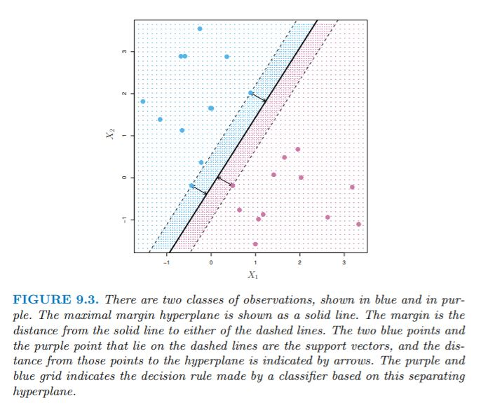
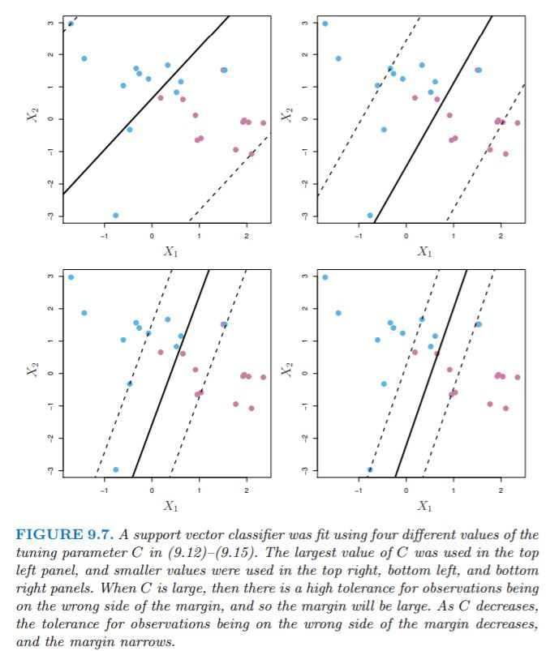
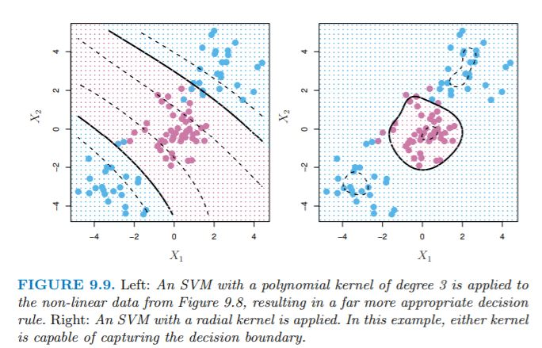

# Support Vector Machines

**Learning objectives:**

- Implement a binary classification model using a **maximal margin classifier**.
- Implement a binary classification model using a **support vector classifier**.
- Implement a binary classification model using a **support vector machine** (SVM).
- Generalize SVM models to **multi-class** cases.


## Maximal Margin Classifier & Hyperplanes
- A *hyperplane* is a $p-1$-dimensional flat subspace of a $p$-dimensional space. For example, in a 2-dimensional space, a hyperplane is a flat one-dimensional space: a line. 
- Mathematical definition of hyperplane (2D space):
$$\beta_{0} + \beta_{1}X_{1} + \beta_{2}X_{2} = 0$$
- Any $X$ s.t. $X = (X_{1}, X_{2})^T$ for which the equation above is satisfied is a point on the hyperplane.

## Using a Separating Hyperplane to Classify

- Consider a matrix **X** of dimensions $n*p$, and a $y_{i} \in \{-1, 1\}$. We have a new observation, $x^*$, which is a vector $x^* = (x^*_{1}...x^*_{p})^T$ which we wish to classify to one of two groups.
- We will use a *separating hyperplane* to classify the observation.

## Visual Example of Using a Hyperplane to Classify

```{r hyperplane-class, echo=FALSE, out.width=800}
knitr::include_graphics('./images/fig9_2.JPG', error = FALSE)
```
 
- We can label the blue observations as $y_{i} = 1$ and the pink observations as $y_{i} = -1$. 
- Thus, a separating hyperplane has the property s.t. $\beta_{0} + \beta_{1}X_{i1} + \beta_{2}X_{i2} ... + \beta_{p}X_{ip} > 0$ if $y_{i} =1$ and $\beta_{0} + \beta_{1}X_{i1} + \beta_{2}X_{i2} ... + \beta_{p}X_{ip} < 0$ if $y_{i} = -1$.
- In other words, a separating hyperplane has the property s.t. $y_{i}(\beta_{0} + \beta_{1}X_{i1} + \beta_{2}X_{i2} ... + \beta_{p}X_{ip}) > 0$ for all $i = 1...n$.
- Consider also the *magnitude* of $f(x^*)$. If it is far from zero, we are confident in its classification, whereas if it is close to 0, then $x^*$ is located near the hyperplane, and we are less confident about its classification.

## Maximal Margin Classifier

- Generally, if data can be perfectly separated using a hyperplane, an infinite amount of such hyperplanes exist.
- An intuitive choice is the *maximal margin hyperplane*, which is the hyperplane that is farthest from the training data.
- We compute the perpendicular distance from each training observation to the hyperplane. The smallest of these distances is known as the *margin*.
- The *maximal margin hyperplane* is the hyperplane for which the *margin* is maximized. We can classify a test observation based on which side of the maximal margin hyperplane it lies on, and this is known as the *maximal margin classifier*.
- The maximal margin classifier classifies $x^*$ based on the sign of $f(x^*) = \beta_{0} + \beta_{1}x^*_{1} + ... + \beta_{p}x^*_{p}$.

## Visual Representation of Maximal Margin Classifier
```{r mmc, echo=FALSE, out.width=800}

```

- Note the 3 training observations that lie on the margin and are equidistant from the hyperplane. These are the *support vectors* (vectors in *p*-dimensional space; in this case $p=2$).
- They support the hyperplane because if their location was changed, the hyperplane would change. 
- The maximal margin hyperplane depends on these observations, but not the others (unless the other observations were moved at or within the margin).

## Mathematics of the MMC

- Consider constructing an MMC based on the training observations $x_{1}...x_{n} \in \mathbb{R}^p$. This is the solution to the optimization problem:

$$maximize_{\beta_{0}...\beta_{p}, M} \space M$$
$$subject \space to \space\sum_{j=1}^{p}\beta_{j}^2 = 1$$
$$y_{i}(\beta_{0} + \beta_{1}X_{i1} + \beta_{2}X_{i2} ... + \beta_{p}X_{ip}) \geq M \space\space \forall \space\space i = 1...n$$

- M is the margin, and the $\beta s$ are chosen to maximize M. 
- The constraint (3rd equation) ensures that each observation will be correctly classified, as long as M is positive. 
- The 2nd and 3rd equations ensure that each data point is on the correct side of the hyperplane and at least M-distance away from the hyperplane.
- The perpendicular distance to the hyperplane is given by $y_{i}(\beta_{0} + \beta_{1}x_{i1} + \beta_{2}x_{i2} ... + \beta_{p}x_{ip})$.

## Support Vector Classifiers

- We can't always use a hyperplane to separate two classes. 
- Even if such a classifier does exist, it's not always desirable, due to overfitting or too much sensitivity to individual observations.
- Thus, it might be worthwhile to consider a classifier/hyperplane that misclassifies a few observations in order to improve classification of the remaining data points. 
- The *support vector classifier*, a.k.a the *soft margin classifier*, allows some training data to be on the wrong side of the margin or even the hyperplane. 

## Mathematics of the SVC
- The SVC classifies a test observation based on which side of the hyperplane it lies. 

$$maximize_{\beta_{0}...\beta_{p}, \epsilon_{1}...\epsilon_{n}, M} \space M$$
$$subject \space to \space\sum_{j=1}^{p}\beta_{j}^2 = 1$$
$$y_{i}(\beta_{0} + \beta_{1}X_{i1} + \beta_{2}X_{i2} ... + \beta_{p}X_{ip}) \geq M(1 - \epsilon_{i})$$
$$\epsilon_{i} \geq 0, \sum_{i=1}^{n}\epsilon_{i} \leq C$$

- *C* is a nonnegative tuning parameter, typically chosen through cross-validation, and can be thought of as the budget for margin violation by the observations. 
- The $\epsilon$s are *slack variables* that allow individual observations to be on the wrong side of the margin or hyperplane. The $\epsilon_{i}$ indicates where the *i*th observation is located with regards to the margin and hyperplane. 
- If $\epsilon_{i}$ = 0, the observation is on the correct side of the margin. If greater than 0, it is on the wrong side of margin. If greater than 1, it is on the wrong side of the hyperplane. 
- Since *C* constrains the sum of the $\epsilon$s, it determines the number and magnitude of violations to the margin. If $C=0$, there is no margin for violation, thus all the $\epsilon_{1}...\epsilon_{n} = 0$. 
- Note that if $C>0$, no more than *C* observations can be on wrong side of hyperplane, since in these cases $\epsilon_{i} > 1$. 

## Visual Illustration of SVC
```{r svc-vis, echo=FALSE, out.width=800}

```

- A property of the classifier is that only data points which lie on or violate the margin will affect the hyperplane. These data points are known as *support vectors*.
- *C* controls the bias-variance tradeoff of the classifier. 
- When *C* is large, the budget for margin violation is large, and there are many observations involved in determining the hyperplane. See upper left pane of Figure 9.7 for an illustration of high bias-low variance. 
- When *C* is small, we have a low bias-high variance classifier related to the low number of support vectors involved in determination of the SVC. See bottom right panel above.
- The property of the SVC solely being dependent on certain observations in classification differs from other classification methods such as LDA (depends on mean of all observations in each class, as well as each class's covariance matrix using all observations). 
- However, logistic regression is more similar to SVC in that it has low sensitivity to observations far from the decision boundary.

## Support Vector Machines
- Many decision boundaries are not linear.
- We could fit an SVC to the data using $2p$ features (in the case of *p* features and using a quadratic form).
- See page 380 for equations.
- Note that in the enlarged feature space (i.e., with the quadratic terms), the decision boundary is linear. But in the original feature space, it is quadratic $q(x) = 0$ (in this example), and generally the solutions are not linear.
- One could also include interaction terms, higher degree polynomials, etc., and thus the feature space could enlarge quickly and entail unmanageable computations.

## Support Vector Machines, cont.
- The SVM is an extension of the SVC which results from using *kernels* to enlarge the feature space. A kernel is a function that quantifies the similarity of two data points.
- Essentially, we want to enlarge the feature space to make use of a nonlinear decision boundary, while avoiding getting bogged down in unmanageable calculations.
- The solution to the SVC problem in the SVM context involves only the *inner products* (a.k.a dot products) of the observations.

$$\langle x_{i}  \; , x_{i'} \; \rangle = \sum_{j=1}^{p}x_{ij}x_{i'j}$$
In the context of SVM, the linear support vector classifier is as follows:

$$f(x) = \beta_{0} + \sum_{i=1}^{n}\alpha_{i}\langle \; x, x_i\; \rangle$$

- To estimate the *n* $\alpha$s, and $\beta_{0}$, we only need the ${n \choose 2}$ (n choose 2) inner products between all pairs of training observations.
- Note that in the equation above, in order to compute $f(x)$ for the new point $x$, we need the inner product between the new point and all the training observations. However, $\alpha_{i} = 0$ for all points that are not on or within the margin (i.e., points that are not support vectors). So we can rewrite the equation as follows, where $S$ is the set of support point indices:

$$f(x) = \beta_{0} + \sum_{i \in S}\alpha_{i}\langle \; x, x_{i} \; \rangle$$

- Replace every inner product with $K(x_{i}, x_{i'})$, where $K$ is a kernel function. 
- $K(x_{i}, x_{i'}) = \sum_{j=1}^{p}x_{ij}x_{i'j}$ is the SVC and is known as a linear kernel since it is linear in the features. 
- One could also have kernel functions of the following form, where $d$ is a positive integer:

$$K(x_{i}, x_{i'}) = (1 + \sum_{j=1}^{p}x_{ij}x_{i'j})^d$$

- This will lead to a much more flexible decision boundary, and is basically fitting an SVC in a higher-dimensional space involving polynomials of degree $d$, instead of the original feature space. 
- When an SVC is combined with a nonlinear kernel as above, the result is a *support vector machine*.

$$f(x) =  \beta_{0} + \sum_{i \in S}\alpha_{i}K(x, x_{i})$$

## Radial Kernels
- There are other options besides polynomial kernel functions, and a popular one is a *radial kernel*. $\gamma$ is a positive constant. 

$$K(x, x_{i}) = exp(-\gamma\sum_{j=1}^p(x_{ij} - x_{i'j})^2)$$

- For a given test observations $x^*$, if it is far from $x_{i}$, then $K(x^*, x_{i})$ will be small given the negative $\gamma$ and large $\sum_{j=1}^p(x^*_{j} - x_{ij})^2)$. 
- Thus, $x_{i}$ will play little role in $f(x^*)$.
- The predicted class for $x^*$ is based on the sign of $f(x^*)$, so training observations far from a given test point play little part in determining the label for a test observation.
- The radial kernel therefore exhibits local behavior with respect to other observations.

## Radial Kernels, cont.
```{r radkern, echo=FALSE, out.width=800}

```

- The advantage of using a kernel rather than simply enlarging feature space is computational, since it is only necessary to compute $n \choose 2$ kernel functions. 
- For radial kernels, the feature space is implicit and infinite dimensional, so we could not do the computations in such a space anyways.

## SVMs with More than Two Classes
- The concept of separating hyperplanes does not extend naturally to more than two classes, but there are some ways around this.
- A *one-versus-one* approach constructs $K \choose 2$ SVMs, where $K$ is the number of classes. An observation is classified to each of the $K \choose 2$ classes, and the number of times it appears in each class is counted.
- The $k$th class might be coded as +1 versus the $k$'th class is coded as -1. 
- The data point is classified to the class for which it was most often assigned in the pairwise classifications.
- Another option is *one-versus-all* classification. This can be useful when there are a lot of classes.
- $K$ SVMs are fitted, and one of the K classes to the remaining $K-1$ classes. 
- $\beta_{0k}...\beta_{pk}$ denotes the parameters that results from constructing an SVM comparing the $k$th class (coded as +1) to the other classes (-1).
- Assign test observation $x^*$ to the class $k$ for which $\beta_{0k} + ... + \beta_{pk}x^*_{p}$ is largest.


## Meeting Videos

### Cohort 1

`r knitr::include_url("https://www.youtube.com/embed/URL")`

<details>
<summary> Meeting chat log </summary>

```
ADD LOG HERE
```
</details>
