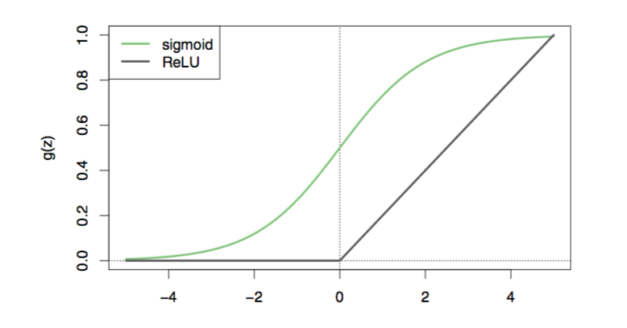
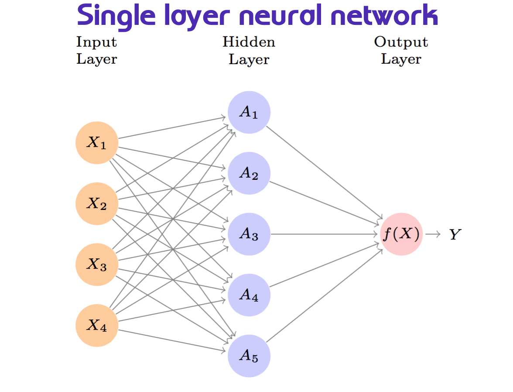
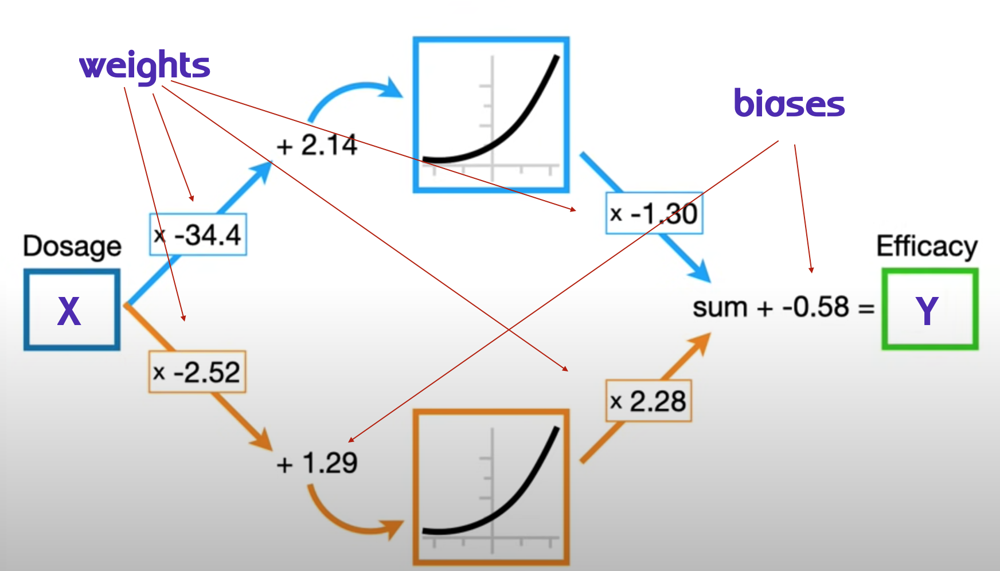
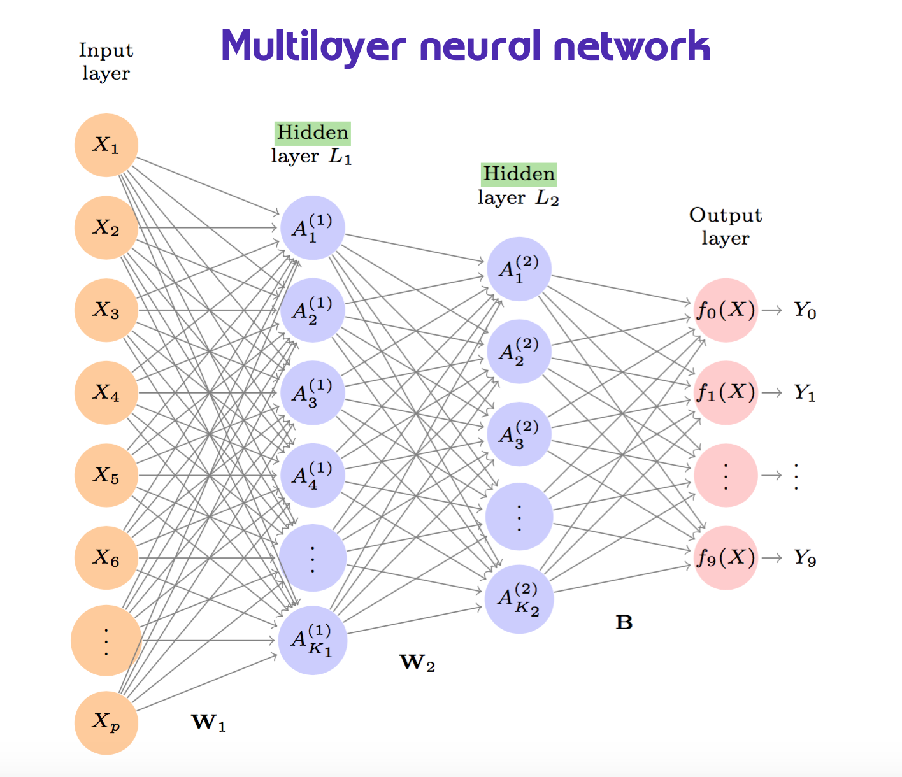
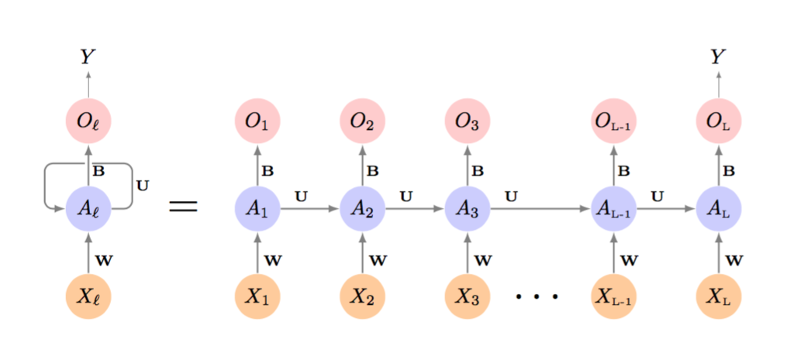

# Deep Learning

**Learning objectives:**

- Describe the structure of a *single-layer neural network.*
- Describe the structure of a *multilayer neural network.*
- Describe the structure of a *convolutional neural network.*
- Describe the structure of a *recurrent neural network.*
- **Compare deep learning** to simpler models.
- **Recognize** the process by which **neutral networks are fit.**
- Explain the **double descent** phenomenon.

## Introduction

Deep learning is an area of research in machine learning. It is the new name of neural network. Since late 1980s, when first arose, **neural network** improved in algorithms methodology, and was followed by other techniques such as SVMs, boosting, and random forests to then become deep learning. The structure of the model calculation is widely used for image/video classification, speech and text modeling.

## Single Layer Neural Network

Let's consider a dataset made of $p$ predictors

$$X=(X_1,X_2,X_3,...,X_p)$$

and build a **non linear** function $f(X)$ to predict a response $Y$.

$$f(X)=\beta_0+\sum_{k=1}^K{\beta_kh_k(X)}$$

where $h_k(X)$ is the expression of the **hidden layers**, named as the $A_k$ function of $X$ with $K$ activations, $k=1,...,K$, which are not directly observed.

$$A_k=h_k(X)$$
and identify the **non linear activation function** $g(z)$

$$A_k=h_k(X)=g(z)$$


$$A_k=h_k(X)=g(w_{k0}+\sum_{j=1}^p{w_{kj}X_j})$$
to obtain an output layer which is a **linear model** that uses these activations $A_k$ as inputs, resulting in a function $f(X)$.


$$f(X)=\beta_0+\sum_{k=1}^K{\beta_kA_k}$$
aech $A_k$ is a different transformation of $h_k(X)$

$\beta_0,...,B_K$ and $w_{1,0},...,w_{K,p}$ need to be estimated from data.

What about the **activation function** $g(z)$? There are various options, but the most used ones are:

1.  sigmoid

$$g(z)=\frac{e^z}{1+e^z}$$

2.  ReLU rectified linear unit

$$g(z)=(z)_+=\left\{ \begin{array}{ll}
          0 & \mbox{if z<0};\\
          1 & \mbox{otherwise}.\end{array}\right.$$


```{r 10-Deep-learning-1, echo=FALSE,fig.cap="Activation functions - Chap 10",fig.align='center'}

```


This is the structure of a **single layer** neural network. Here we can see the layer inputs, the hidden layers and the output layer.

```{r 10-Deep-learning-2, echo=FALSE,fig.cap="Single layer neural network - Chap 10",fig.align='center'}

```

In this example, we see deep learning applied to dosage/efficacy study, the model parameters with the activation function in the middle.

The parameters can be retrieved with **backpropagation** which optimizes **weights** for coefficients $w_{kj}$ and **biases** for the intercepts $w_{k0}$. We will see about that later on this notes. For now we suppose to know what is the value of the parameters, and we investigate the calculation of the deep learning model.


$$f(X)=\beta_0+\sum_{k=1}^K{\beta_kg(w_{k0}+\sum_{wkj}^p{X_j})}$$


```{r 10-Deep-learning-3, echo=FALSE,fig.cap="Neural network Pt.1 Inside the black box - Youtube video",fig.align='center'}

```

[Neural network Pt.1 Inside the black box](https://www.youtube.com/watch?v=CqOfi41LfDw)

This is from the book pg.406, and you can see all the passages for calculating the estimated $f(X)$ supposing that we know the value of the parameters.

```{r 10-Deep-learning-4, echo=FALSE,fig.cap="Neural network model fit calculation - Chap 10",fig.align='center'}
knitr::include_graphics("images/10_04_calculations.png")
```

Fitting a **quantitative** neural network to estimate the unknown parameters $w_{kj}$ and $\beta_{k}$ requires the squared-error loss function to be minimum.


Mean squared-error:


$$min\sum{i=1}^n{(y_i-f(x_i))^2}$$

Or to train a **qualitative** neural network is to minimizing the negative multinomial log-likelihood or the $$cross-entrophy$$. We see this explained in the multilayer neural network section.

Min of the negative multinomial log-likelyhood:


$$-\sum_{i=1}^n{\sum_{m=0}^K{y_{im}log(f_m(x_i))}}$$

As **deep learnig** models have the ability to fit a good squiggle lines to data, the estimated parameters can be applied to a special **softmax** function:

$$f_{m}=Pr(Y=m|X)=\frac{e^{Z_m}}{\sum_{k=0}^K{e^{Z_k}}}$$


## Lab: A Single Layer Network on the Hitters Data

How to perform **deep learning** in RStudio:

- [keras](https://cran.r-project.org/web/packages/keras/index.html)
- [tensorflow](https://tensorflow.rstudio.com/)
- [torch](https://cran.r-project.org/web/packages/torch/index.html)


1.  Single Layer

```{r 10-Deep-learning-5}
library(ISLR2)
Gitters <- na.omit(Hitters)
n <- nrow(Gitters)

set.seed(13)
ntest <- trunc(n / 3) #rounding numbers
testid <- sample(1:n, ntest)
```

Fit the model with **testid** selection

```{r 10-Deep-learning-6}
training <- Gitters[-testid, ]
testing <- Gitters[testid, ]

lfit <- lm(Salary ~ ., data = training)

lpred <- predict(lfit, testing)

pred_test <- cbind(testing,lpred)

mean(abs(pred_test$lpred-pred_test$Salary))
```

Standardize the matrix and fit the lasso using **glmnet**

```{r 10-Deep-learning-7}
x <- scale(model.matrix(Salary ~ . - 1, data = Gitters))

y <- Gitters$Salary

library(glmnet)
cvfit <- cv.glmnet(x[-testid, ], y[-testid], type.measure = "mae")
cpred <- predict(cvfit, x[testid, ], s = "lambda.min")
mean(abs(y[testid] - cpred))
```


There are two ways to fit the Neural Network:

- using {keras} implies pyton
- using {torch}


[book-Lab-source](https://www.statlearning.com/resources-second-edition)

Fit the neural network with {keras}:

- `keras_model_sequential()`
- `layer_dense()`
- `layer-dropout()`


Keras requires some [installation](https://hastie.su.domains/ISLR2/keras-instructions.html) on RStudio:
```{r 10-Deep-learning-8, eval=FALSE}
library(ISLR2)
tryCatch(
  remove.packages(c("keras", "tensorflow", "reticulate")),
  error = function(e) "Some or all packages not previously installed, that's ok!"
)

install.packages("keras", repos = 'https://cloud.r-project.org')

write('RETICULATE_AUTOCONFIGURE=FALSE', file = "~/.Renviron", append = TRUE)
write(sprintf('RETICULATE_MINICONDA_PATH=%s',
           normalizePath("~/islr-miniconda", winslash = "/", mustWork = FALSE)),
   file = "~/.Renviron", append = TRUE)

# restart R

source(system.file("helpers", "install.R", package = "ISLR2"))

reticulate::install_miniconda(force = TRUE)
tensorflow::install_tensorflow()
```


```{r 10-Deep-learning-9, eval=FALSE}
library(tidyverse)
library(keras)
library(tensorflow)

modnn <- keras_model_sequential() %>%
     layer_dense(units = 50, activation = "relu",
        input_shape = ncol(x)) %>%
     layer_dropout(rate = 0.4) %>%
     layer_dense(units = 1)
```

Resources:

- [example-tensorflow](https://hastie.su.domains/ISLR2/Labs/Rmarkdown_Notebooks/Ch10-deeplearning-lab-keras.Rmd)


The second way is to use {torch}:

```{r 10-Deep-learning-10, eval=FALSE}
library(torch)
library(luz) # high-level interface for torch
library(torchvision) # for datasets and image transformation
library(torchdatasets) # for datasets we are going to use
library(zeallot)
torch_manual_seed(13)
```

```{r 10-Deep-learning-11, eval=FALSE}
modnn <- nn_module(
  initialize = function(input_size) {
    self$hidden <- nn_linear(input_size, 50)
    self$activation <- nn_relu()
    self$dropout <- nn_dropout(0.4)
    self$output <- nn_linear(50, 1)
  },
  forward = function(x) {
    x %>% 
      self$hidden() %>% 
      self$activation() %>% 
      self$dropout() %>% 
      self$output()
  }
)
```

[Torch Lab - html](https://hastie.su.domains/ISLR2/Labs/Rmarkdown_Notebooks/Ch10-deeplearning-lab-torch.html)


## Multilayer Neural Network

First hidden layer for $k=1,...,K_{1}$

$$A_{k}^{(1)}=h_k^{1}(X)$$

Second hidden layer for $l=1,...,K_2$

$$A_{k}^{(2)}=h_k^{2}(X)$$


```{r 10-Deep-learning-12, echo=FALSE,fig.cap="Multilayer Neural Network - Chap 10",fig.align='center'}

```

## Convolutional Neural Network

Convolutional neural network (CNNs) evolved for classifying images by recognizing specific features, distinguishing each particular object class.

The network first identifies low-level features in the input image. These features are then combined to form higher-level features.

**Convolutional filters** determine whether a local feature is present in the image.

We can have:

- K different convolution filters in the first hidden layer
- typically apply the the ReLU activation function

**Pooling Layers** reduce the size of the image by a factor of two in each direction and provide some location invariance.


## Recurrent Neural Network

Predictive models for sequential data in nature:

- xX is a sequence
- hidden-layer is a sequence $\left \{ A_l \right \}_1^L = \left \{ A_1, A_2,..., A_L \right \}$

Each $A_l$ feeds into the output layer and produces a **prediction** $O_l$ for $Y$.

$$O_l=\beta_0+\sum_{k=1}^K{\beta_kA_{Lk}}$$

Loss function: $(Y-O_L)^2$


```{r 10-Deep-learning-13, echo=FALSE,fig.cap="Recurrent Neural Network - Chap 10",fig.align='center'}

```

## Backpropagation


```{r 10-Deep-learning-14, echo=FALSE,fig.cap="Backpropagation - youtube: https://www.youtube.com/watch?v=Ilg3gGewQ5U",fig.align='center'}

```


## Meeting Videos

### Cohort 1

`r knitr::include_url("https://www.youtube.com/embed/1D6plTaDvTU")`

<details>
<summary> Meeting chat log </summary>

```
00:22:21	Mei Ling Soh:	It's z <0 in the book, pg 405
00:26:39	Jon Harmon (jonthegeek):	For anyone who wants to watch that video after this: https://www.youtube.com/watch?v=CqOfi41LfDw
00:53:53	Federica Gazzelloni:	part2 of the video: https://www.youtube.com/watch?v=IN2XmBhILt4&list=PLblh5JKOoLUIxGDQs4LFFD--41Vzf-ME1&index=4
00:57:40	Mei Ling Soh:	Thanks!
```
</details>

`r knitr::include_url("https://www.youtube.com/embed/_MOovDiGzHg")`

<details>
<summary> Meeting chat log </summary>

```
00:09:09	Jon Harmon (jonthegeek):	https://www.statlearning.com/resources-second-edition
00:41:00	Jon Harmon (jonthegeek):	(dataloader, dataset or list) A dataloader created with torch::dataloader() used for training the model, or a dataset created with torch::dataset() or a list. Dataloaders and datasets must return list with at most 2 items. The first item will be used as input for the module and the second will be used as target for the loss function.
```
</details>

### Cohort 2

`r knitr::include_url("https://www.youtube.com/embed/Itju79hysRE")`

<details>
<summary> Meeting chat log </summary>

```
00:28:37	Jim Gruman:	https://playground.tensorflow.org/
00:29:06	Federica Gazzelloni:	Thanks Jim
```
</details>

`r knitr::include_url("https://www.youtube.com/embed/b_5WvnqtyDE")`

<details>
<summary> Meeting chat log </summary>

```
00:14:41	Ricardo Serrano:	Neural network course https://youtu.be/ob1yS9g-Zcs
```
</details>

### Cohort 3

`r knitr::include_url("https://www.youtube.com/embed/h3BUIkPniIw")`

`r knitr::include_url("https://www.youtube.com/embed/CvCWbi6KnTk")`

<details>
<summary> Meeting chat log </summary>

```
00:10:25	Fariborz Soroush:	https://rfordatascience.slack.com/archives/C02CQ93F882/p1647029662583599
00:10:42	Fariborz Soroush:	https://www.statlearning.com/resources-second-edition
00:11:16	Fariborz Soroush:	https://hastie.su.domains/ISLR2/Labs/Rmarkdown_Notebooks/Ch10-deeplearning-lab-torch.html
```
</details>

### Cohort 4

`r knitr::include_url("https://www.youtube.com/embed/afMkOcWNiDc")`

<details>
<summary> Meeting chat log </summary>

```
00:25:11	kevin_kent:	For dropout I believe the nodes themselves are dropped
00:26:50	Ron:	They mention that lasso can be used too
00:35:16	Ron:	like that animation!
00:35:38	Sandra Muroy:	yes! very cool!
00:42:54	Ron:	It's exercise 4 I was thinking of ;)
00:42:56	Ron:	Sorry
00:47:43	Ron:	max/ avg pooling == downsampling  for sure
00:50:41	Ron:	https://medium.com/@bdhuma/which-pooling-method-is-better-maxpooling-vs-minpooling-vs-average-pooling-95fb03f45a9
01:03:15	Ron:	can you link the book?
01:04:00	kevin_kent:	https://course.fast.ai/Resources/book.html
01:05:54	Ron:	Deep learning libraries are python focused so I think it is easier (less impedance mismatch) to use python
01:08:18	kevin_kent:	Jeremy Howard has really worked hard at that course and book the teaching approach and has consulted materials about the science of learning. I find his stuff really inspirational
01:11:47	Ron:	https://www.manning.com/books/deep-learning-and-the-game-of-go
01:12:10	Sandra Muroy:	cool
```
</details>

`r knitr::include_url("https://www.youtube.com/embed/zMqelxtBt_4")`

<details>
<summary> Meeting chat log </summary>

```
00:47:28	kevin_kent:	The term “gradient boosting” comes from the idea of “boosting” or improving a single weak model by combining it with a number of other weak models in order to generate a collectively strong model. Gradient boosting is an extension of boosting where the process of additively generating weak models is formalized as a gradient descent algorithm over an objective function. Gradient boosting sets targeted outcomes for the next model in an effort to minimize errors. Targeted outcomes for each case are based on the gradient of the error (hence the name gradient boosting) with respect to the prediction.

GBDTs iteratively train an ensemble of shallow decision trees, with each iteration using the error residuals of the previous model to fit the next model. The final prediction is a weighted sum of all of the tree predictions. Random forest “bagging” minimizes the variance and overfitting, while GBDT “boosting” minimizes the bias and underfitting.

XGBoost is a scalable and highly accurate implementatio
00:53:53	Ron:	I have some reading to do ^^^ thanks!
01:09:13	shamsuddeen:	I need to hop off now. See you all next week.
01:14:03	Ron:	I am going to hop off as well, see you next time!
```
</details>
