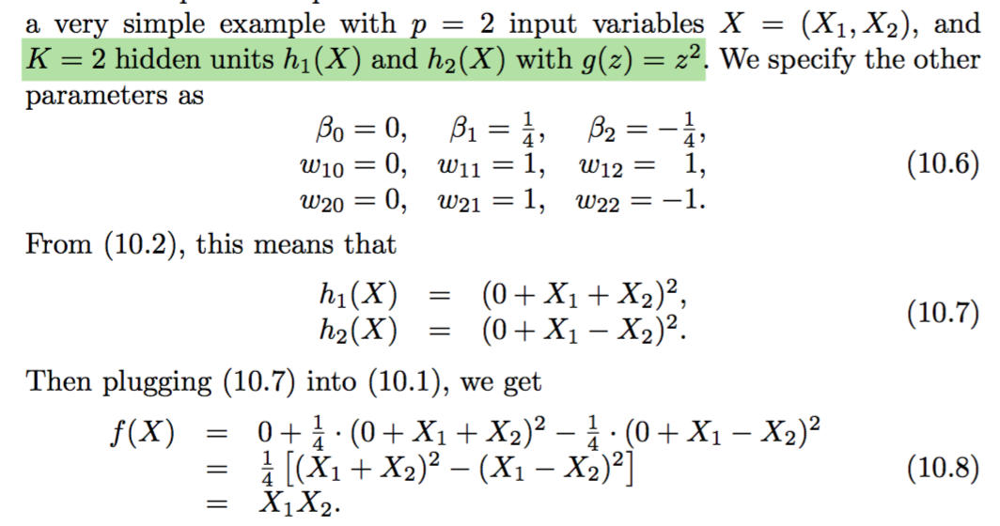

# Deep Learning

**Learning objectives:**

- Describe the structure of a *single-layer neural network.*
- Describe the structure of a *multilayer neural network.*
- Describe the structure of a *convolutional neural network.*
- Describe the structure of a *recurrent neural network.*
- **Compare deep learning** to simpler models.
- **Recognize** the process by which **neutral networks are fit.**
- Explain the **double descent** phenomenon.

## Introduction

Deep learning is an area of research in machine learning. It is the new name of neural network. Since late 1980s, when first arose, **neural network** improved in algorithms methodology, and was followed by other techniques such as SVMs, boosting, and random forests to then become deep learning. The structure of the model calculation is widely used for image/video classification, speech and text modeling.

## Single Layer Neural Network

Let's consider a dataset made of $p$ predictors

$$X=(X_1,X_2,X_3,...,X_p)$$

and build a **non linear** function $f(X)$ to predict a response $Y$.

$$f(X)=\beta_0+\sum_{k=1}^K{\beta_kh_k(X)}$$

where $h_k(X)$ is the expression of the **hidden layers**, a transformation of the input, named as the $A_k$ function of $X$ with $K$ activation, $k=1,...,K$, which are not directly observed.

$$A_k=h_k(X)$$
and identify the activation: a **non linear transformation of a linear function** $g(z)$

$$A_k=h_k(X)=g(z)$$


$$A_k=h_k(X)=g(w_{k0}+\sum_{j=1}^p{w_{kj}X_j})$$
to obtain an output layer which is a **linear model** that uses these activations $A_k$ as inputs, resulting in a function $f(X)$.


$$f(X)=\beta_0+\sum_{k=1}^K{\beta_kA_k}$$
aech $A_k$ is a different transformation of $h_k(X)$

$\beta_0,...,B_K$ and $w_{1,0},...,w_{K,p}$ need to be estimated from data.

What about the **activation function** $g(z)$? There are various options, but the most used ones are:

1.  sigmoid

$$g(z)=\frac{e^z}{1+e^z}$$

2.  ReLU rectified linear unit

$$g(z)=(z)_+=\left\{ \begin{array}{ll}
          0 & \mbox{if z<0};\\
          1 & \mbox{otherwise}.\end{array}\right.$$


```{r 10-Deep-learning-1, echo=FALSE,fig.cap="Activation functions - Chap 10",fig.align='center'}

```


This is the structure of a **single layer** neural network. Here we can see the layer inputs, the hidden layers and the output layer.

```{r 10-Deep-learning-2, echo=FALSE,fig.cap="Single layer neural network - Chap 10",fig.align='center'}

```

In this example, we see deep learning applied to dosage/efficacy study, the model parameters with the activation function in the middle.

The parameters can be retrieved with **backpropagation** which optimizes **weights** for coefficients $w_{kj}$ and **biases** for the intercepts $w_{k0}$. We will see about that later on this notes. For now we suppose to know what is the value of the parameters, and we investigate the calculation of the deep learning model.


$$f(X)=\beta_0+\sum_{k=1}^K{\beta_kg(w_{k0}+\sum_{wkj}^p{X_j})}$$


```{r 10-Deep-learning-3, echo=FALSE,fig.cap="Neural network Pt.1 Inside the black box - Youtube video",fig.align='center'}

```

[Neural network Pt.1 Inside the black box](https://www.youtube.com/watch?v=CqOfi41LfDw)

This is from the book pg.406, and you can see all the passages for calculating the estimated $f(X)$ supposing that we know the value of the parameters.

```{r 10-Deep-learning-4, echo=FALSE,fig.cap="Neural network model fit calculation - Chap 10",fig.align='center'}

```

Fitting a **quantitative** neural network to estimate the unknown parameters $w_{kj}$ and $\beta_{k}$ requires the squared-error loss function to be minimum.


Mean squared-error:


$$min\sum{i=1}^n{(y_i-f(x_i))^2}$$

Or to train a **qualitative** neural network is to minimizing the negative multinomial log-likelihood or the $$cross-entrophy$$. We see this explained in the multilayer neural network section.

Min of the negative multinomial log-likelyhood:


$$-\sum_{i=1}^n{\sum_{m=0}^K{y_{im}log(f_m(x_i))}}$$

As **deep learnig** models have the ability to fit a good squiggle lines to data, the estimated parameters can be applied to a special **softmax** function:

$$f_{m}=Pr(Y=m|X)=\frac{e^{Z_m}}{\sum_{k=0}^K{e^{Z_k}}}$$


## Lab: A Single Layer Network on the Hitters Data

How to perform **deep learning** in RStudio:

- [keras](https://cran.r-project.org/web/packages/keras/index.html)
- [tensorflow](https://tensorflow.rstudio.com/)
- [torch](https://cran.r-project.org/web/packages/torch/index.html)


1.  Single Layer

```{r 10-Deep-learning-5}
library(ISLR2)
Gitters <- na.omit(Hitters)
n <- nrow(Gitters)

set.seed(13)
ntest <- trunc(n / 3) #rounding numbers
testid <- sample(1:n, ntest)
```

Fit the model with **testid** selection

```{r 10-Deep-learning-6}
training <- Gitters[-testid, ]
testing <- Gitters[testid, ]

lfit <- lm(Salary ~ ., data = training)

lpred <- predict(lfit, testing)

pred_test <- cbind(testing,lpred)

mean(abs(pred_test$lpred-pred_test$Salary))
```

Standardize the matrix and fit the lasso using **glmnet**

```{r 10-Deep-learning-7}
x <- scale(model.matrix(Salary ~ . - 1, data = Gitters))

y <- Gitters$Salary

library(glmnet)
cvfit <- cv.glmnet(x[-testid, ], y[-testid], type.measure = "mae")
cpred <- predict(cvfit, x[testid, ], s = "lambda.min")
mean(abs(y[testid] - cpred))
```


There are two ways to fit the Neural Network:

- using {keras} implies pyton
- using {torch}


[book-Lab-source](https://www.statlearning.com/resources-second-edition)

Fit the neural network with {keras}:

- `keras_model_sequential()`
- `layer_dense()`
- `layer-dropout()`


Keras requires some [installation](https://hastie.su.domains/ISLR2/keras-instructions.html) on RStudio:
```{r 10-Deep-learning-8, eval=FALSE}
library(ISLR2)
tryCatch(
  remove.packages(c("keras", "tensorflow", "reticulate")),
  error = function(e) "Some or all packages not previously installed, that's ok!"
)

install.packages("keras", repos = 'https://cloud.r-project.org')

write('RETICULATE_AUTOCONFIGURE=FALSE', file = "~/.Renviron", append = TRUE)
write(sprintf('RETICULATE_MINICONDA_PATH=%s',
           normalizePath("~/islr-miniconda", winslash = "/", mustWork = FALSE)),
   file = "~/.Renviron", append = TRUE)

# restart R

source(system.file("helpers", "install.R", package = "ISLR2"))

reticulate::install_miniconda(force = TRUE)
tensorflow::install_tensorflow()
```


```{r 10-Deep-learning-9, eval=FALSE}
library(tidyverse)
library(keras)
library(tensorflow)

modnn <- keras_model_sequential() %>%
     layer_dense(units = 50, activation = "relu",
        input_shape = ncol(x)) %>%
     layer_dropout(rate = 0.4) %>%
     layer_dense(units = 1)
```

Resources:

- [example-tensorflow](https://hastie.su.domains/ISLR2/Labs/Rmarkdown_Notebooks/Ch10-deeplearning-lab-keras.Rmd)


The second way is to use {torch}:

```{r 10-Deep-learning-10, eval=FALSE}
library(torch)
library(luz) # high-level interface for torch
library(torchvision) # for datasets and image transformation
library(torchdatasets) # for datasets we are going to use
library(zeallot)
torch_manual_seed(13)
```

```{r 10-Deep-learning-11, eval=FALSE}
modnn <- nn_module(
  initialize = function(input_size) {
    self$hidden <- nn_linear(input_size, 50)
    self$activation <- nn_relu()
    self$dropout <- nn_dropout(0.4)
    self$output <- nn_linear(50, 1)
  },
  forward = function(x) {
    x %>% 
      self$hidden() %>% 
      self$activation() %>% 
      self$dropout() %>% 
      self$output()
  }
)
```

[Torch Lab - html](https://hastie.su.domains/ISLR2/Labs/Rmarkdown_Notebooks/Ch10-deeplearning-lab-torch.html)


## Multilayer Neural Network

First hidden layer for $k=1,...,K_{1}$

$$A_{k}^{(1)}=h_k^{1}(X)$$

Second hidden layer for $l=1,...,K_2$

$$A_{k}^{(2)}=h_k^{2}(X)$$


```{r 10-Deep-learning-12, echo=FALSE,fig.cap="Multilayer Neural Network - Chap 10",fig.align='center'}

```

## Convolutional Neural Network

Convolutional neural network (CNNs) evolved for classifying images by recognizing specific features, distinguishing each particular object class.

The network first identifies low-level features in the input image. These features are then combined to form higher-level features.

**Convolutional filters** determine whether a local feature is present in the image.

We can have:

- K different convolution filters in the first hidden layer
- typically apply the the ReLU activation function

**Pooling Layers** reduce the size of the image by a factor of two in each direction and provide some location invariance.


## Recurrent Neural Network

Predictive models for sequential data in nature:

- xX is a sequence
- hidden-layer is a sequence $\left \{ A_l \right \}_1^L = \left \{ A_1, A_2,..., A_L \right \}$

Each $A_l$ feeds into the output layer and produces a **prediction** $O_l$ for $Y$.

$$O_l=\beta_0+\sum_{k=1}^K{\beta_kA_{Lk}}$$

Loss function: $(Y-O_L)^2$


```{r 10-Deep-learning-13, echo=FALSE,fig.cap="Recurrent Neural Network - Chap 10",fig.align='center'}

```

## Backpropagation


```{r 10-Deep-learning-14, echo=FALSE,fig.cap="Backpropagation - youtube: https://www.youtube.com/watch?v=Ilg3gGewQ5U",fig.align='center'}

```


## Deep Learning part 2


**Learning objectives:**

- Multilayer neural network
- Convolutional neural network
- Recurrent neural network
  - Case Study: Time series 
  

  
## Introduction  
  
We will be exploring three powerful types of neural networks:


- multilayer neural networks
- convolutional neural networks (CNNs)
- recurrent neural networks (RNNs). 


These networks have revolutionized various fields by their ability to learn complex patterns and make intelligent predictions.


### Multilayer neural networks


Let's begin with **multilayer neural networks**. These networks represent a fundamental building block in the field of deep learning. Unlike their simpler counterparts with only one hidden layer, multilayer neural networks consist of multiple hidden layers, each containing numerous interconnected units called neurons. This architecture enables them to learn intricate representations of data and make highly accurate predictions.


The power of multilayer neural networks lies in their capability to approximate almost any function. With just a single hidden layer containing a large number of neurons, they can effectively model complex relationships between input data and output predictions. However, the learning process becomes more manageable when we employ multiple hidden layers, each with a more modest number of neurons. This layered structure allows the network to gradually learn and extract abstract features from the input data, leading to enhanced performance and improved generalization.

In practice, multilayer neural networks have demonstrated remarkable success in a wide range of applications, including image and speech recognition, **natural language processing**, and even **autonomous driving**. By leveraging their ability to learn from vast amounts of labeled data, these networks excel at recognizing intricate patterns, providing invaluable insights, and making accurate predictions.

Now that we have a solid understanding of multilayer neural networks, let's move on to the next topic: convolutional neural networks.


### Convolutional Neural Networks (CNNs):

Convolutional neural networks, or CNNs, represent a **specialized type of neural network architecture** that has revolutionized the field of **computer vision**. Inspired by the human visual system, CNNs are designed to process and **understand visual data**, such as images and videos, with exceptional accuracy.

What sets CNNs apart from other neural network architectures is their ability to exploit the spatial structure of visual data. They achieve this by employing a unique operation called convolution, which involves the application of filters or kernels to extract local features from the input. These filters act as feature detectors, capturing patterns such as edges, textures, and shapes at different scales.

CNNs also incorporate other essential components, such as **pooling layers**, which downsample the extracted features, reducing the network's spatial dimensionality while retaining important information. Additionally, fully connected layers at the end of the network utilize these extracted features to make high-level predictions.

One remarkable application of CNNs is in **image classification**. By training on large datasets, CNNs can learn to distinguish between thousands of object classes with impressive accuracy. They can identify specific objects in images, recognize faces, detect anomalies in medical images, and even analyze intricate details in satellite imagery.

The versatility and power of CNNs extend beyond image classification. They have also made significant contributions to other tasks, including **object detection**, **semantic segmentation**, and **image generation**. CNNs continue to push the boundaries of what is possible in computer vision and have become an indispensable tool in various industries, ranging from healthcare to self-driving cars.

Having explored the wonders of CNNs, let's now dive into the world of recurrent neural networks.

### Recurrent Neural Networks (RNNs):

Recurrent neural networks, or RNNs, have emerged as a groundbreaking type of neural network capable of **modeling sequential data and capturing temporal dependencies**. This makes them highly effective in analyzing and generating sequences, such as natural language text, speech, and time series data.

Unlike feedforward neural networks, where information flows in a single direction from input to output, RNNs introduce **feedback connections** that allow information to persist over time.


## Case Study: RNN - Time Series

The idea is to extract many short mini-series of input sequences $X=X_1,X_2,...,X_L$ with a predefined length L (called the lag) and a corresponding target Y.

The target Y is the value of the log volume $v_t$ at a single timepoint $t$, and the input sequence X is the series of 3-vectors ${X_ℓ}^L$ each consisting of the three measurements log volume, DJ return and log volatility from day $t−L, t−L+1, ... t−1$. Each value of time $t$ makes a separate $(X,Y)$ pair, for $t$ running from $L+1$ to $T$.


##### Autoregression

The RNN fit has much in common with a traditional **autoregression (AR)** linear model. They both use the same response $Y$ and input sequences $X$ of length $L=5$ and dimension $p=3$ in this case. 

The RNN processes this sequence from left to right with the same weights $W$ (for the input layer), while the AR model simply treats all L elements of the sequence equally as a vector of $L×p$ predictors, a process called **flattening** in the neural network literature. 

> The RNN also includes the hidden layer activations $A$ which transfer information along the sequence, and introduces additional non-linearity.


```{r message=FALSE,warning=FALSE}
library(tidyverse)
library(ISLR2)
NYSE%>%head
```


```{r}
xdata <- data.matrix(
    NYSE[, c("DJ_return", 
             "log_volume",
             "log_volatility")]
    )

xdata %>% head
```


```{r}
istrain <- NYSE[, "train"]
xdata <- scale(xdata)
```


Make a function to create **lagged** versions of the three time series. 

```{r}
lagm <- function(x, k = 1) {
  n <- nrow(x)
  pad <- matrix(NA, k, ncol(x))
  rbind(pad, x[1:(n - k), ])
}
```


Apply the lags:
```{r}
arframe <- data.frame(log_volume = xdata[, "log_volume"],
   L1 = lagm(xdata, 1), L2 = lagm(xdata, 2),
   L3 = lagm(xdata, 3), L4 = lagm(xdata, 4),
   L5 = lagm(xdata, 5)
 )

arframe %>% head(3,3)
```

```{r}
arframe <- arframe[-(1:5), ]
istrain <- istrain[-(1:5)]
```


#### Linear AR model

The “AR” stands for **autoregression**, indicating that the model uses the dependent relationship between current data and its past values.

Fit the **linear AR model** to the training data using lm(), and predict on the test data. 

```{r}
arfit <- lm(log_volume ~ ., 
            data = arframe[istrain, ])

summary(arfit)
```


```{r}
arpred <- predict(arfit, arframe[!istrain, ])
```


```{r}
full_arpred <- data.frame(pred=arpred,
                          log_volume=arframe[!istrain, "log_volume"])

full_arpred %>%
  ggplot(aes(x=log_volume,y=pred))+
  geom_point(alpha=0.5)+
  geom_smooth(method = "lm")
```

##### $R^2$

$$V_0=1.054108$$

$$R^2=0.413223$$

```{r}
V0 <- var(arframe[!istrain, "log_volume"])
1 - mean((arpred - arframe[!istrain, "log_volume"])^2) / V0
```

#### Add day_of_week in the model

Re-fit this model, including the factor variable `day_of_week`.

```{r}
arframed <- data.frame(day = NYSE[-(1:5), "day_of_week"], arframe)

arframed%>%head
```


```{r}
arfitd <- lm(log_volume ~ ., 
             data = arframed[istrain, ])
```


```{r}
arpredd <- predict(arfitd, arframed[!istrain, ])
```

```{r}
full_arpredd <- data.frame(pred=arpredd,
                           log_volume=arframed[!istrain, "log_volume"])

full_arpred %>%
  mutate(type="arpred")%>%
  rbind(full_arpredd%>%mutate(type="arpredd")) %>%
  ggplot(aes(x=log_volume,y=pred,group=type,color=type))+
  geom_point(alpha=0.5)+
  geom_smooth(method = "lm")+
  scale_color_viridis_d()+
  theme_bw()
```

$$R^2(\text{+day of week})=0.4598616$$

```{r}
1 - mean((arpredd - arframe[!istrain, "log_volume"])^2) / V0
```

#### Preprocessing

To fit the **RNN** reshape the data sequencing `L=5` feature vectors $X=(Xℓ)_1^L$ for each observation.

(book source (10.20) on page 428)

These are lagged versions of the time series going back L time points.


Preprocessing step transoforming data into a matrix.
```{r}
n <- nrow(arframe)
xrnn <- data.matrix(arframe[, -1])
xrnn <- array(xrnn, c(n, 3, 5))
xrnn <- xrnn[,, 5:1]
xrnn <- aperm(xrnn, c(1, 3, 2))
```


```{r}
dim(xrnn)
```

#### RNN Model 


To start using **Keras**, follow this order:
```{r eval=FALSE}
library(reticulate)
virtualenv_create("r-reticulate", python = path_to_python)
library(tensorflow)
use_virtualenv("r-reticulate")
```

```{r eval=FALSE}
library(keras)
```


Set the model specidfications:
```{r results='hide',eval=FALSE}
model <- keras_model_sequential() %>%
  layer_simple_rnn(
    units = 12,
    input_shape = list(5, 3),
    dropout = 0.1,
    recurrent_dropout = 0.1
  ) %>%
  layer_dense(units = 1)
```


```{r eval=FALSE}
model
```

```{r echo=FALSE}
knitr::include_graphics("images/10_model_ts_keras.png")
```


Compile the model with adding specification of parameters optimization:

```{r eval=FALSE}
model %>% 
  compile(optimizer = optimizer_rmsprop(),
    loss = "mse")
```


#### History (RNN model fit)

```{r eval=FALSE}
history <- model %>% 
  fit(
    # training set
    xrnn[istrain,, ], 
    arframe[istrain, "log_volume"],
    batch_size = 64, 
    epochs = 200,
    # testing set
    validation_data = list(xrnn[!istrain,, ], 
                           arframe[!istrain, "log_volume"])
    )
```


```{r}
knitr::include_graphics("images/10_history_ts_plot.png")
```


```{r eval=FALSE}
kpred <- predict(model, xrnn[!istrain,, ])
```


This value varies if the model runs more than one time on the same training set, for reproducibility the history need to be run anytime before the `predict()` function. This assures that the $R^2$ calculation below releases consistent results.

$$R^2(\text{keras})=0.4102655$$
```{r eval=FALSE}
1 - mean((kpred - arframe[!istrain, "log_volume"])^2) / V0
```

#### Model 2

Set a **nonlinear AR model** extracting the model matrix x from `arframed`, which includes the `day_of_week` variable.

```{r}
x <- model.matrix(log_volume ~ . - 1, 
                  data = arframed)

colnames(x)
```

```{r eval=FALSE}
arnnd <- keras_model_sequential() %>%
  layer_dense(units = 32, activation = 'relu',
      input_shape = ncol(x)) %>%
  layer_dropout(rate = 0.5) %>%
  layer_dense(units = 1)
```

```{r eval=FALSE}
arnnd %>% 
  compile(loss = "mse",
    optimizer = optimizer_rmsprop())
```

#### History 2 (RNN model2 fit)

```{r eval=FALSE}
history2 <- arnnd %>% 
  fit(
    x[istrain, ], arframe[istrain, "log_volume"], 
    epochs = 100,
    batch_size = 32, 
    validation_data =
      list(x[!istrain, ], arframe[!istrain, "log_volume"])
  )
```


```{r}
knitr::include_graphics("images/10_history2_ts_plot.png")
```


```{r eval=FALSE}
npred <- predict(arnnd, x[!istrain, ])
```


$$R^2=0.4675589$$

```{r eval=FALSE}
1 - mean((arframe[!istrain, "log_volume"] - npred)^2) / V0
```


## Meeting Videos

### Cohort 1

`r knitr::include_url("https://www.youtube.com/embed/1D6plTaDvTU")`

<details>
<summary> Meeting chat log </summary>

```
00:22:21	Mei Ling Soh:	It's z <0 in the book, pg 405
00:26:39	Jon Harmon (jonthegeek):	For anyone who wants to watch that video after this: https://www.youtube.com/watch?v=CqOfi41LfDw
00:53:53	Federica Gazzelloni:	part2 of the video: https://www.youtube.com/watch?v=IN2XmBhILt4&list=PLblh5JKOoLUIxGDQs4LFFD--41Vzf-ME1&index=4
00:57:40	Mei Ling Soh:	Thanks!
```
</details>

`r knitr::include_url("https://www.youtube.com/embed/_MOovDiGzHg")`

<details>
<summary> Meeting chat log </summary>

```
00:09:09	Jon Harmon (jonthegeek):	https://www.statlearning.com/resources-second-edition
00:41:00	Jon Harmon (jonthegeek):	(dataloader, dataset or list) A dataloader created with torch::dataloader() used for training the model, or a dataset created with torch::dataset() or a list. Dataloaders and datasets must return list with at most 2 items. The first item will be used as input for the module and the second will be used as target for the loss function.
```
</details>

### Cohort 2

`r knitr::include_url("https://www.youtube.com/embed/Itju79hysRE")`

<details>
<summary> Meeting chat log </summary>

```
00:28:37	Jim Gruman:	https://playground.tensorflow.org/
00:29:06	Federica Gazzelloni:	Thanks Jim
```
</details>

`r knitr::include_url("https://www.youtube.com/embed/b_5WvnqtyDE")`

<details>
<summary> Meeting chat log </summary>

```
00:14:41	Ricardo Serrano:	Neural network course https://youtu.be/ob1yS9g-Zcs
```
</details>

### Cohort 3

`r knitr::include_url("https://www.youtube.com/embed/h3BUIkPniIw")`

`r knitr::include_url("https://www.youtube.com/embed/CvCWbi6KnTk")`

<details>
<summary> Meeting chat log </summary>

```
00:10:25	Fariborz Soroush:	https://rfordatascience.slack.com/archives/C02CQ93F882/p1647029662583599
00:10:42	Fariborz Soroush:	https://www.statlearning.com/resources-second-edition
00:11:16	Fariborz Soroush:	https://hastie.su.domains/ISLR2/Labs/Rmarkdown_Notebooks/Ch10-deeplearning-lab-torch.html
```
</details>

### Cohort 4

`r knitr::include_url("https://www.youtube.com/embed/afMkOcWNiDc")`

<details>
<summary> Meeting chat log </summary>

```
00:25:11	kevin_kent:	For dropout I believe the nodes themselves are dropped
00:26:50	Ron:	They mention that lasso can be used too
00:35:16	Ron:	like that animation!
00:35:38	Sandra Muroy:	yes! very cool!
00:42:54	Ron:	It's exercise 4 I was thinking of ;)
00:42:56	Ron:	Sorry
00:47:43	Ron:	max/ avg pooling == downsampling  for sure
00:50:41	Ron:	https://medium.com/@bdhuma/which-pooling-method-is-better-maxpooling-vs-minpooling-vs-average-pooling-95fb03f45a9
01:03:15	Ron:	can you link the book?
01:04:00	kevin_kent:	https://course.fast.ai/Resources/book.html
01:05:54	Ron:	Deep learning libraries are python focused so I think it is easier (less impedance mismatch) to use python
01:08:18	kevin_kent:	Jeremy Howard has really worked hard at that course and book the teaching approach and has consulted materials about the science of learning. I find his stuff really inspirational
01:11:47	Ron:	https://www.manning.com/books/deep-learning-and-the-game-of-go
01:12:10	Sandra Muroy:	cool
```
</details>

`r knitr::include_url("https://www.youtube.com/embed/zMqelxtBt_4")`

<details>
<summary> Meeting chat log </summary>

```
00:47:28	kevin_kent:	The term “gradient boosting” comes from the idea of “boosting” or improving a single weak model by combining it with a number of other weak models in order to generate a collectively strong model. Gradient boosting is an extension of boosting where the process of additively generating weak models is formalized as a gradient descent algorithm over an objective function. Gradient boosting sets targeted outcomes for the next model in an effort to minimize errors. Targeted outcomes for each case are based on the gradient of the error (hence the name gradient boosting) with respect to the prediction.

GBDTs iteratively train an ensemble of shallow decision trees, with each iteration using the error residuals of the previous model to fit the next model. The final prediction is a weighted sum of all of the tree predictions. Random forest “bagging” minimizes the variance and overfitting, while GBDT “boosting” minimizes the bias and underfitting.

XGBoost is a scalable and highly accurate implementatio
00:53:53	Ron:	I have some reading to do ^^^ thanks!
01:09:13	shamsuddeen:	I need to hop off now. See you all next week.
01:14:03	Ron:	I am going to hop off as well, see you next time!
```
</details>

### Cohort 5

`r knitr::include_url("https://www.youtube.com/embed/PXcKjeVv5Wg")`

<details>
<summary> Meeting chat log </summary>

```
00:12:08	Federica Gazzelloni:	start
00:15:39	Federica Gazzelloni:	https://github.com/tristanoprofetto/neural-networks/blob/main/ANN/Regressor/feedforward.R
00:33:45	Federica Gazzelloni:	https://www.youtube.com/watch?v=CqOfi41LfDw
01:09:11	Federica Gazzelloni:	end
```
</details>

`r knitr::include_url("https://www.youtube.com/embed/c-4eXkKrlvo")`

<details>
<summary> Meeting chat log </summary>

```
00:07:17	Lucio Cornejo:	Hello, everyone
00:07:40	Derek Sollberger (he/him):	Good afternoon
00:09:11	Federica Gazzelloni:	start
00:26:20	Federica Gazzelloni:	https://hastie.su.domains/ISLR2/Labs/Rmarkdown_Notebooks/Ch10-deeplearning-lab-torch.html
00:27:28	Federica Gazzelloni:	https://hastie.su.domains/ISLR2/Labs/Rmarkdown_Notebooks/Ch10-deeplearning-lab-keras.html
00:44:30	Federica Gazzelloni:	(book source (10.20) on page 428)
00:44:47	Derek Sollberger (he/him):	The keras workflow and pipes are interesting
00:53:54	Lucio Cornejo:	no questions from me
00:57:52	Federica Gazzelloni:	end
```
</details>
