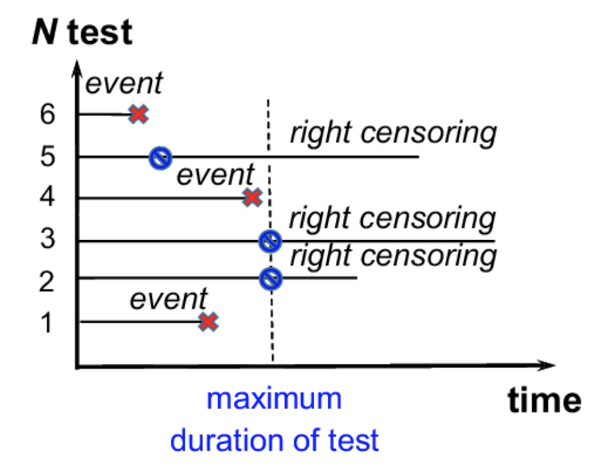

# Survival Analysis and Censored Data

**Learning objectives:**

- Describe how **censored data** impacts survival analysis.
- Calculate a **Kaplan-Meier survival curve.**
- Compare the survival rates of two groups with the **log-rank test.**
- Model survival data using **Cox's proportional hazards**
 

```{r 11load_libraries, echo = FALSE, message=FALSE}
library(ISLR2)
library(survival)
library(dplyr)
```

## What is survival data?


Time-to-event data that consist of a distinct start time and end time

Examples:

- Time from surgery to death

- Time for customer to cancel a subscription (churn)

- Time to machine malfunction

Survival analysis is common in many other fields, such as:

- Reliability analysis

- Duration analysis

- Event history analysis

- Time-to-event analysis


## Introduction to Survival Analysis (zedstatistics) ---

`r knitr::include_url("https://www.youtube.com/embed/v1QqpG0rR1k")`

## Censored Data





Observations are __censored__ when the information about their survival time is incomplete.

Examples:

- Loss to follow-up

- Withdrawal from study (line 5)

- No event/outcome by end of fixed study period (line 3 and 2)

These are examples of **right** censoring.

Left censoring and interval censoring are also possible, but the most frequent is right censoring.


## Lab: Brain Cancer survival analysis

Rather then do the lab at the end, let's try a different approach and thread the Brain Cancer lab  through the chapter discussion.

Hopefully this helps illustrate the main points of the text with examples worked out in R. 

We begin with the `BrainCancer` data set, which is part of the  `ISLR2` package.

```{r 11dataset}
data("BrainCancer")
dim(BrainCancer)
head(BrainCancer)
```

The rows index the 88 patients, while the columns contain the 8 predictors.

```{r 11count}
BrainCancer %>% 
     count(status)
```


Before beginning an analysis, it is important to know how the `status` variable has been coded.  Most software, including `R`, uses the convention that `status = 1` indicates an uncensored observation,  and `status = 0` indicates a censored observation. But some scientists might use the opposite coding. For the `BrainCancer` data set $35$ patients died before the end of the study.


## Kaplan-Meier survival curve

The survival function / curve:

$$
S(t) = Pr(T>t)
$$

Here T is the time of 'death' or whatever is being considered, and $S(t)$ is the probability of surviving up to time t.  

However, due to censoring, we don't actually observe the time T of the event (e.g. 'death') but rather a variable $Y$:

$$ Y = min(T,C)$$

where C is the time of censoring.  We also need to observe a status indicator:

$$ \delta = 
             \left\{ \begin{array}{c l}
                1, & \text{if } T \leq C \\
                0, & \text{if } T > C
            \end{array} \right.
$$

These together as pairs $(y_n, \delta_n)$ represent the survival data. (In R, they are combined to make a survival object using `Surv`)

So we cannot just count up how many are alive at any given point in the study to estimate $S(t)$.  Instead, consider  the instantaneous rate of death at time $t$, this is something we might be able to estimate since it only depends on the number patients 'at risk' at that moment and how many of them die 'at' that moment.  This is the basic idea behind the construction on page  465 for estimating the survival curve directly from the data. 

- $d_k$ are the 'death' times (ordered)

- $r_k$ are the number of non-censored 'alive' cases at time $d_k$.  (at risk)

- $q_k$ are the number that die at time $d_k$ (typically just 1!)

Then we can (as shown in the text) decompose $S(d_k)$:

$$
S(d_k) = Pr(T> d_k | T> d_{k-1}) \times ... \times Pr(T > d_2 | T > d_1)Pr(T> d_1)
$$

The reason for this decomposition is that the conditional probability $Pr(T> d_j | T> d_{j-1})$ can be estimated by:

$$
(r_j - q_j)/r_j
$$

That is, it is just the fraction of at risk 'patients' that survive past time $q_j$.  This leads to the Kaplan-Meier estimator:

$$
\hat{S}(d_k) = \Pi_{j=1}^{k} (\frac{r_j- q_j}{r_j})
$$

Note also that:

$$
\ln\hat{S}(d_k) = \sum_{j=1}^{k} \ln (\frac{r_j- q_j}{r_j})
$$


## Kaplan-Meier survival curve in R

To begin the analysis, we re-create  the Kaplan-Meier survival curve  shown in  Figure 11.2, using the `survfit()` function within the `R` `survival` library. Here `time` corresponds to $y_i$, the time to the $i$th event (either censoring or death).

```{r 11plot_KM_curve}
fit.surv <- survfit(Surv(time, status) ~ 1, data = BrainCancer)
plot(fit.surv, xlab = "Months",
    ylab = "Estimated Probability of Survival")
```

## KM curve stratified by sex

Next we create Kaplan-Meier survival curves that are stratified by `sex`, in order to reproduce Figure 11.3.

```{r 11KM_curve_sex}
fit.sex <- survfit(Surv(time, status) ~ sex, data = BrainCancer)
plot(fit.sex, xlab = "Months",
    ylab = "Estimated Probability of Survival", col = c(2,4))
legend("bottomleft", levels(BrainCancer$sex), col = c(2,4), lty = 1)
```

## Log-Rank test

As discussed in the book, Section 11.4, we can perform a log-rank test to compare the survival of males to females, using the `survdiff()` function.

> See also Exercise 7 to go into depth on this!

```{r 11logrank_test}
logrank.test <- survdiff(Surv(time, status) ~ sex, data = BrainCancer)
logrank.test
```

The resulting $p$-value is $0.23$, indicating  no evidence of a difference in survival between the two sexes.


## Survminer package

- Survminer is a package that draws survival curves using ggplot, and can provide logrank p-values all in one go!

Using `survminer` package
```{r 11survminer, message=FALSE}
library(survminer)
ggsurvplot(fit.sex, data = BrainCancer, 
           pval = TRUE,
           conf.int = TRUE, 
           risk.table = TRUE, 
           legend.title = "Sex", 
           legend.labs = c("Female", "Male"))
```


## Hazard Function

The hazard function (11.9) is defined at a given moment *t* in time, the potential risk of having an event given you survived up to time *t*.

$$h(t) = lim_{\Delta t \to 0}  \frac{ Pr(t+ \Delta t \geq T > t | T > t)}{\Delta t}$$

Why do we care about the hazard function? It turns out that a key approach for modeling survival data as a function of covariates (i.e., regressors) relies heavily on the hazard function.

> Note the following is basically Excercise 8.  But I think it is important to understand $h$, $S$, and $f$.

How is the hazard rate related to the survival probability?  It seems that the rate of death should be related to the rate of change of 'survival' in some way. Lets try this:

$$
\begin{align}
\frac{d S}{d t} &= lim_{\Delta t \to 0} \frac{S(t+dt) - S(t)}{\Delta t} \\
& = lim_{\Delta t \to 0}  \frac{Pr(T>t+\Delta t) - Pr(T > t)}{\Delta t}\\
& = lim_{\Delta t \to 0}  \frac{Pr(T>t+\Delta t) - (Pr(T > t + \Delta t) + Pr(t+ \Delta t \geq T > t))}{\Delta t} \\
& = lim_{\Delta t \to 0}  \frac{- Pr(t+ \Delta t \geq T > t)}{\Delta t} \\
& = - f(t)  \text{  see book eqn 11.11}
\end{align}
$$

$f(t)$ is the instantaneous death rate, close to what we want..  But we can relate $f(t)$ to $h(t)$ and $S(t)$ simply by observing that the probability of an event near (i.e. within $\delta t$) time $t$ should be equal to the probability of surviving until time $t$ multiplied by the probability of an event near time $t$ *given* that you have survived until time $t$. That is:

$$
f(t)  = h(t)S(t)
$$

The book gives a more rigorous derivation using Baye's rule, but this is the intuition.


 
So we have finally:

$$
\frac{d S}{d t} = - S(t)h(t)
$$

or 

$$
\frac{d \text{ ln} S}{d t} = -h(t)
$$

so that the log of the survival probability is the negative of the 'cumulative' hazard ($\int{h(t) dt}$)

$$
\ln S =  -\int{h(t) dt} 
$$

 
> Note that this construction seems similar to that of the Kaplan-Meier curve, if we think of $\ln (\frac{r_j- q_j}{r_j})$ as the integrated hazard during the time between deaths.
 

As a simple example, consider a constant hazard (e.g. radioactive decay) $h=\lambda$ (i.e. at any moment, the chance of an event is constant given no event up to that moment).  In that case the survival is exponential, as we expect,  $S(t) = \exp(-\lambda t)$ and $f(t) = \lambda \exp(-\lambda t)$ .  

## Regression models

* The hazard function can be used to specify a likelihood (for maximum likelihood methods)

$$
L = \prod_{i=1}^{n}h(y_i)^{\delta_i}S(y_i)
$$

* For non-censored data, the factor is $h(y_i)S(y_i) = f(y_i)$ , the probability of dying in an tiny interval around $y_i$ 

* For censored data, the factor is just $S(y_i)$, the likelihood of surviving at *least* until $y_i$.

* This could  be used for some parameterized model of $h$, Exercise 9 looks at this for a simple (constant hazard) example.

* But we really want to do regression, and one approach is to assume functional form like 
$h(t|x_i) = exp \left(\beta_0 + \sum_{j=1}^{p}\beta_j x_{ij}\right)$.  This could be used in the likelihood to estimate the parameters, but the lack of time depenance is very restrictive.


## Proportional Hazards

The *proportional hazards assumption* states that (ISLR2 11.14):

$$
h(t|x_i)= h_0(t) \exp\left(\sum_{j=1}^{p}x_{ij}\beta_k\right)
$$

*Assumes* separate time dependence (baseline hazard $h_0$) from feature dependence.


## Cox Proportional Hazards Model


- Because $h_0(t)$ is unknown we cannot just plug $h(t|x_i)$ into the likelihood function and apply maximum likelihood

- **Cox proportionalhazards model (Cox, 1972)** estimates $\beta$ without having to specify the form of $h_0(t)$ by using a partial (relative) likelihood.


Let's fit the Cox proportional hazards models using the `coxph()`  function.
To begin, we consider a model that uses `sex` as the only predictor.
```{r 11coxph}
fit.cox <- coxph(Surv(time, status) ~ sex, data = BrainCancer)
summary(fit.cox)
```

Regardless of which test we use, we see that there is no clear evidence for a difference in survival between males and females.


Now we fit a  model that makes use of additional predictors. 

```{r chunk10}
fit.all <- coxph(
Surv(time, status) ~ sex + diagnosis + loc + ki + gtv +
   stereo, data = BrainCancer)
fit.all
```

- The `diagnosis` variable has been coded so that the baseline corresponds to meningioma.

- Results indicate that the risk associated with HG glioma is more than eight times (i.e. $e^{2.15}=8.62$) the risk associated with meningioma. In other words, after adjusting for the other predictors, patients with HG glioma have much worse survival compared to those with meningioma.  

- In addition, larger values of the Karnofsky index, ki, are associated with lower risk, i.e. longer survival.

## Surivival Curves

- Plot (estimated) survival curves for each diagnosis category,  adjusting for the other predictors.

- To make these plots, set the values of the other predictors equal to the mean for quantitative variables, and the modal value for factors. 

```{r chunk11}
with(BrainCancer,{
  modaldata <- data.frame(
       diagnosis = levels(diagnosis),
       sex = rep("Female", 4),
       loc = rep("Supratentorial", 4),
       ki = rep(mean(ki), 4),
       gtv = rep(mean(gtv), 4),
       stereo = rep("SRT", 4)
       )
  survplots <- survfit(fit.all, newdata = modaldata)
  plot(survplots, xlab = "Months",
      ylab = "Survival Probability", col = 2:5)
  legend("bottomleft", levels(diagnosis), col = 2:5, lty = 1)
})
```

The book says that the methods used to estimate $h_0(t)$ are beyond the scope of the book. Documentation for  `survfit.coxph` mentions a 'Breslow estimator' which seems to be similar to Kaplan-Meier... something for future study! 

 
## Additional Topics Covered in Text:

- Shrinkage for the Cox Model

    Uses 'loss + penalty' formulation (11.17) to reduce variance.
    
- Area Under the Curve for Survival Analysis

- Choice of Time Scale

- Time-Dependent Covariates

- Checking Proportional Hazard Assumptions

- Survival Trees


## Conclusions

- Introduced Survival Analysis

- Learned a few tools to apply

- Much more out there to learn on this, only scratching the surface!

  

## Meeting Videos

### Cohort 1

`r knitr::include_url("https://www.youtube.com/embed/VyjPLYLwBMg")`

<details>
<summary> Meeting chat log </summary>

```
00:30:47	Jon Harmon (jonthegeek):	ggplot2 default red is "salmon" (according to this site: https://www.htmlcsscolor.com/hex/F8766D)

the default blue is  "cornflower blue" https://www.htmlcsscolor.com/hex/619CFF

and while I'm at it, the default green is "dark pastel green" https://www.htmlcsscolor.com/hex/00BA38
00:55:24	Jon Harmon (jonthegeek):	summand == addend https://www.merriam-webster.com/dictionary/summand
00:55:54	Jon Harmon (jonthegeek):	subtrahend
00:56:31	Jon Harmon (jonthegeek):	https://www.merriam-webster.com/dictionary/subtrahend

A subtrahend is subtracted from a minuend.

https://www.merriam-webster.com/dictionary/minuend
00:57:29	Jonathan.Bratt:	😄
01:05:55	Federica Gazzelloni:	workshop: https://bioconnector.github.io/workshops/r-survival.html
01:06:29	Jon Harmon (jonthegeek):	There's an in-progress survival analysis package in tidymodels, btw: https://github.com/tidymodels/censored/
```
</details>

`r knitr::include_url("https://www.youtube.com/embed/dbIg-JyWn8U")`

<details>
<summary> Meeting chat log </summary>

```
00:27:56	Jon Harmon (jonthegeek):	https://github.com/tidymodels/censored/ not yet on CRAN
00:50:52	Jon Harmon (jonthegeek):	https://twitter.com/justsaysrisks
```
</details>

### Cohort 2

`r knitr::include_url("https://www.youtube.com/embed/8JhVCWNVpyw")`

<details>
<summary> Meeting chat log </summary>

```
00:27:58	Jim Gruman:	+1 zed stats is excellent
00:28:55	Ricardo Serrano:	https://youtu.be/v1QqpG0rR1k
00:37:00	Ricardo Serrano:	https://sphweb.bumc.bu.edu/otlt/MPH-Modules/BS/BS704_Survival/BS704_Survival5.html
00:41:06	Jim Gruman:	🧟   The ggfortify package also contains methods for autoplotting simple km plots.
00:50:26	Jim Gruman:	Hannah Frick's recent post on survival in tidymodels: https://www.tidyverse.org/blog/2021/11/survival-analysis-parsnip-adjacent/
00:58:55	Jim Gruman:	Emily Zabor's intro guide is also a nice supplement to the ISLR survival chapter https://www.emilyzabor.com/tutorials/survival_analysis_in_r_tutorial.html#Part_1:_Introduction_to_Survival_Analysis
01:06:52	Jim Gruman:	thank you Ricardo!
```
</details>

`r knitr::include_url("https://www.youtube.com/embed/EdNBZVNSXyA")`

<details>
<summary> Meeting chat log </summary>

```
00:14:15	Ricardo Serrano:	https://github.com/rserran/survival_analysis
00:14:26	Federica Gazzelloni:	thank you!
00:58:33	Jim Gruman:	yes
00:59:38	Federica Gazzelloni:	let's talk on slack
00:59:56	Jim Gruman:	see you all on slack
```
</details>

### Cohort 3

`r knitr::include_url("https://www.youtube.com/embed/Ivl1tOWOfEM")`

<details>
<summary> Meeting chat log </summary>

```
00:01:30	Mei Ling Soh:	https://www.youtube.com/watch?v=AsNTP8Kwu80&vl=en
00:02:57	Mei Ling Soh:	https://www.rstudio.com/blog/torch/
00:05:11	Mei Ling Soh:	https://rstudio.github.io/reticulate/
00:54:05	Fariborz Soroush:	No question here :D
```
</details>

`r knitr::include_url("https://www.youtube.com/embed/ONEtOcZMoZY")`

<details>
<summary> Meeting chat log </summary>

```
00:51:05	Nilay Yönet:	https://hastie.su.domains/ISLR2/Labs/Rmarkdown_Notebooks/Ch11-surv-lab.html
00:51:14	Nilay Yönet:	https://bioconnector.github.io/workshops/handouts/r-survival-cheatsheet.pdf
00:51:31	Nilay Yönet:	https://bioconnector.github.io/workshops/r-survival.html#survival_curves
```
</details>

### Cohort 4

`r knitr::include_url("https://www.youtube.com/embed/URL")`

<details>
<summary> Meeting chat log </summary>

```
ADD LOG HERE
```
</details>
