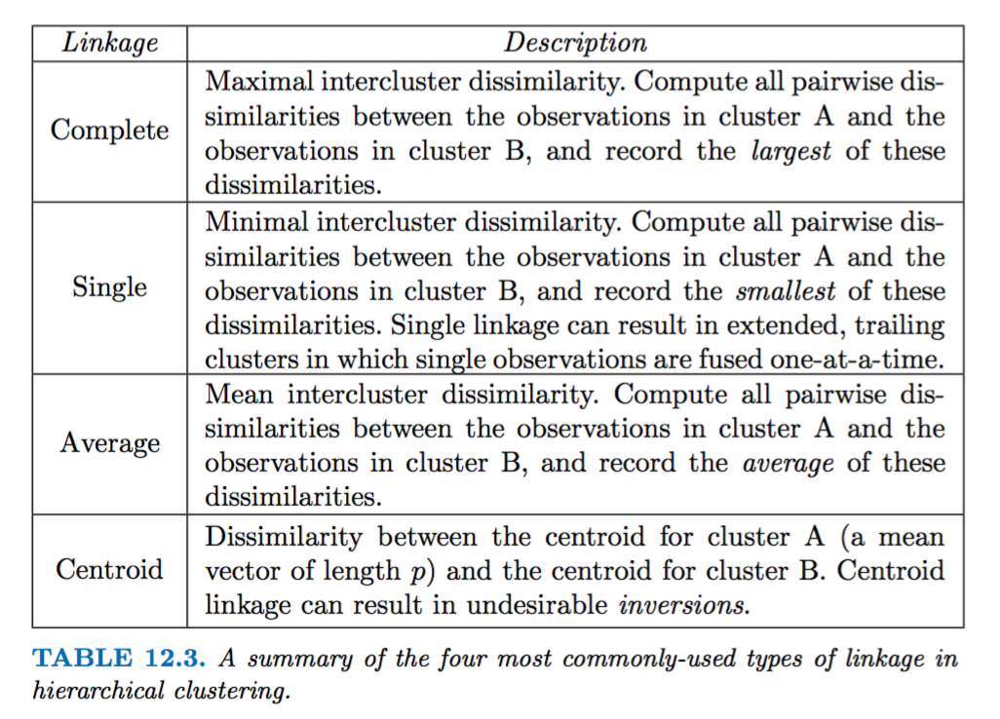

# Unsupervised Learning

**Chapter learning objectives:**

- Compare and contrast **supervised learning** and **unsupervised learning.**
- Perform **principal component analysis** to analyze the sources of variance in a dataset.
- **Impute missing values** in a dataset via **matrix completion.**
- Perform **K-means clustering** to partition observations into a pre-specified number of clusters.
- Perform **hierarchical clustering** to partition observations into a tree-like structure.


## Introduction

**Unsupervised learning techniques** are used to reduce the dimension of the dataset.
Suppose we have a dataset composed of **n** observations and **p** features, so we have a matrix **n x p**, what we want is to select **the best composition among our p features** to achieve the highest value of data representation in a lower dimension environment.

A little **recap** of the **difference between supervised and unsupervised learning**:

- **supervised** is intended as guided by a response variable. In this case, our dimension reduction analysis is supported by an outcome variable which will serve as **control-variable** of the result of the analysis.
- on the contrary the **unsupervised** analysis hasn't got a response variable to use as a checker, but the dimension reduction is carried on only on the features/predictors based on their variance level. This is the reason for which the unsupervised learning technique is a bit more challenging, we do not have something, such as a control-variable to rely on to verifying the results.

The main scope of the **unsupervised principal component analysis** is data visualization. To obtain a visualization of all the components of a data set in a lower dimension space, and have an idea of their relations.

---

## Principal component analysis


**PCA learning objectives**

- understand **principal component analysis (pca)**
- make a visualization using pca
- introduction to matrix decomposition

---

### What are the steps to principal component analysis?

**Steps to unsupervised dimensionality reduction principal component analysis:**

1. variables normalization ($z=\frac{x-\bar x}{sd(x)}$)
2. highest variance component selection 
3. reduced variables linear combination 

Given these indexes, with $m < p$:

- $i={1,...,m}$
- $j={1,...,p}$

This is our starting point, a **n x p** dataset $X$ made of a series of $X_j$ features, with $j={1,...,p}$:

$$
X_{n,p} = 
\begin{pmatrix}
x_{1,1} & x_{1,2} & \cdots & x_{1,p} \\
x_{2,1} & x_{2,2} & \cdots & x_{2,p} \\
\vdots & \vdots & \ddots & \vdots \\
x_{n,1} & x_{n,2} & \cdots & x_{n,p} 
\end{pmatrix}
$$
Of which the first row (observation) is:

$$X_{1},X_{2},...,X_{p}$$
The linear combination of $X_j$ and $\beta_j$, with $j={1,...,p}$ shown here is just for the first element with $i=1$:

$$\beta_{11}x_{i1}+\beta_{21}x_{i2}+...+\beta_{p1}x_{ip}$$
This is the linear combination of the original data.

The first step, as said, is the normalization of the observations:
$$z=\frac{x-\bar x}{sd(x)}$$

What we want is to visualize our features on a reduced dimensional space while extrapolating the highest level of the information from original data.

In order to do this, we reduce $p$ to a lower value $M$: $M < p$ to obtain a sample which is still representative of the level of variance in our data.

Our new $Z_m$ composition is made of $M$ features, i.e. $m = 1,...,M$:

$$Z_1, Z_2, ..., Z_m$$

To obtain a new linear combination:

$$Z_m = \sum_{j=1}^p{\phi_{jm}X_j}=\phi_{1m}X_1+\phi_{2m}X_2+...+\phi_{pm}X_p$$

And so, an approximation of the original features:

$$x_{ij}\approx\sum_{m=1}^Mz_{im}\phi_{jm}$$


We do this by **normalizing** these elements in the vector $z=\frac{x-\bar x}{sd(x)}$ to obtain a new vector of elements named **loadings**, $(\phi_{11},\phi_{21},...,\phi_{p1})^T$. In particular when $M=min(n-1,p)$, we have: $x_{ij}=\sum_{m=1}^Mz_{im}\phi_{jm}$.

We *constrain* these **lodings** so their sum of squares would be equal to one:

$$\sum_{j=1}^p{\phi_{j1}}^2=1$$

**The Euclidean distance:**

> "The first **M** principal component **score vectors** and the first **M** principal component **loading vectors** provide **the best M-dimensional approximation** (in terms of **Euclidean distance**) to the ith observation xij."


$$\min_{}\left \{\sum_{j=1}^p\sum_{i=1}^n\left(x_{ij}-\sum_{m=1}^Mz_{im}\phi_{jm}\right)^2\right \}$$


**The First pricipal component**

Since we are only interested in **variance**, the total variance is defined as:

$$\sum_{j=1}^pVar(X_j)=\sum_{j=1}^p\frac{1}{n}\sum_{i=1}^nx_{ij}^2$$

The formula for the **max sample variance explained** by the *m*th principal component:

$$\frac{1}{n}\sum_{i=1}^nz_{im}^2=\frac{1}{n}\sum_{i=1}^n\left(\sum_{j=1}^p\phi_{jm}x_{ij}\right)^2$$


$$\max_{\phi_{11},\phi_{21},...,\phi_{p1}}\left \{\frac{1}{n}\sum_{i=1}^nz_{i1}^2\right \}$$
$$\max_{\phi_{11},\phi_{21},...,\phi_{p1}}\left \{\frac{1}{n}\sum_{i=1}^n\left(\sum_{j=1}^p\phi_{j1}x_{ij}\right)^2\right \}$$
$$subject \to\sum_{j=1}^p\phi_{j1}^2=1$$

The calculation of this *objective* pass through the **eigen value decomposition** which alternative is the **singular value decomposition**.


**How much of the information in a given data set is lost by projecting the observations onto the first few principal components?**

**How much of the variance in the data is not contained in the first few principal components?**

To answer this questions we need to consider the **proportion of variance explained (PVE)**

Maximizing the variance of the first M principal components, we minimize the mean squared error of the M-dimensional approximation, and viceversa.

In conclusion, principal component analysis is a question of **minimizing the approximation error or maximizing the variance**.


## Geometric interpretation

This is the representation of the Ad Spending vs Population with the first and second principal components.
Let's go a bit more in deep about how to make such as visualization.
```{r echo=FALSE, fig.dim="50%"}
knitr::include_graphics("images/fig06-14.png")
```

source: http://www.sthda.com/english/articles/31-principal-component-methods-in-r-practical-guide/112-pca-principal-component-analysis-essentials/


```{r message=FALSE, warning=FALSE, include=FALSE, paged.print=FALSE}
library(tidymodels)
library(tidyverse)
library(magrittr)
library(factoextra)
library(patchwork)
library(proxy)
library(ISLR2)
```


```{r}
USArrests <- as_tibble(USArrests, rownames = "state")
USArrests
```

Use of the `scale()` function to show how data are centered

```{r}
USArrests %>%
select(-state) %>%
  scale() %>%
  as.data.frame() %>%
  map_dfr(mean)
```


```{r}
USArrests %>%
select(-state)%>%
  mutate(z_Murder=(Murder-mean(Murder))/sd(Murder),
         z_Assault=(Assault-mean(Assault))/sd(Assault),
         z_UrbanPop=(UrbanPop-mean(UrbanPop))/sd(UrbanPop),
         z_Rape=(Rape-mean(Rape))/sd(Rape)) %>%
  map_dfr(mean)
  # z varables have mean zero
```


Representation of the **loadings**: $\phi_1$ and $\phi_2$ are the first and the second principal components. 
```{r}
USArrests_pca <- USArrests %>%
  select(-state) %>%
  prcomp(scale = TRUE)

USArrests_pca
```


```{r}
tidy(USArrests_pca, matrix = "loadings")
```


```{r}
tidy(USArrests_pca, matrix = "scores")
```


```{r}
label_value<-c("1"="PC1","2"="PC2","3"="PC3","4"="PC4")

tidy(USArrests_pca, matrix = "loadings") %>%
  ggplot(aes(value, column)) +
  facet_wrap(~ PC,labeller = labeller(.cols = label_value)) +
  geom_col(aes(fill=column),show.legend = F)+
  labs(x= "Loadings",y="Predictors")+
  theme_bw()
```


Representation of the **scores**
```{r}
pca_rec <- recipe(~., data = USArrests) %>%
  step_normalize(all_numeric()) %>%
  step_pca(all_numeric(), id = "pca") %>%
  prep() %>%
  bake(new_data = NULL)

pca_rec
```

```{r}
# loadings
df_rotation<-USArrests_pca$rotation %>%
  as.data.frame() %>%
  rownames_to_column()

# range(df_rotation$PC1)

pca_rec%>%
  arrange(-PC1) %>%
ggplot(aes(-PC1,-PC2,label=state))+
  geom_point(shape=".")+
  ggrepel::geom_text_repel(color="navy",size=2)+
  geom_hline(yintercept=0,linetype="dashed",size=0.2)+
  geom_vline(xintercept=0,linetype="dashed",size=0.2)+
  geom_smooth(method = "lm",se=F,size=0.5)+
  geom_segment(data=df_rotation,
               mapping=aes(x=0,xend=-PC1,y=0,yend=-PC2),
               inherit.aes = FALSE,
               arrow = arrow(length = unit(0.1, "cm")),
               color="orange") +
  geom_text(data=df_rotation,
            mapping=aes(x=-PC1,y=-PC2,label=rowname),
            color="orange",size=3,vjust=0,hjust=0)+
  scale_x_continuous(name = "PC1",
                     sec.axis = sec_axis(trans=~.*(1/2), 
                                         name="",
                                         breaks=c(-0.5,0.5,0.5)))+
  scale_y_continuous(name = "PC2",
                     sec.axis = sec_axis(trans=~.*1, 
                                         name="",
                                         breaks=c(-0.5,0.5,0.5)))+
  #xlim(-3,3)+
  labs(title="Principal component scores and the loading vectors",x="PC1",y="PC2")+
  theme_bw()
```


sources: 

- https://stackoverflow.com/questions/26995923/ggplot2-how-to-plot-an-orthogonal-regression-line


```{r}
pca <- prcomp(~Assault+Murder, USArrests[,-1])

slp <- with(pca, 5*rotation[2,1] / rotation[2,2])
slp2 <- with(pca, 0.5*rotation[2,1] / rotation[2,2])
int <- with(pca, center[2] - slp*center[1])
int2 <- with(pca, center[2] - slp2*center[1])

#pca$center
#pca$rotation

ggplot(USArrests,aes(Assault,Murder))+
  geom_point(size=0.8,color="purple") +
  stat_smooth(method=lm, color="darkgreen", se=FALSE) +
  geom_abline(slope=slp, intercept=int, 
              color="blue",linetype="dashed",size=1)+
  geom_abline(slope=slp2, intercept=int2, 
              color="red",linetype="dashed",size=1)+
  labs(title="Murder vs Assault",
       subtitle="First principal component & second principal component")+
  theme_minimal()
```


## Proportion of variance explained


First we look at the **variance**

```{r}
names(USArrests_pca)
```
```{r}
pr.var <- USArrests_pca$sdev^2
pr.var
```


**Proportion of variance explained** by each principal component:
```{r}
pve <- pr.var / sum(pr.var)
pve
```

```{r}
par(mfrow = c(1, 2))
plot(pve, xlab = "Principal Component",
ylab = "Proportion of Variance Explained", ylim = c(0, 1),
type = "b")
plot(cumsum(pve), xlab = "Principal Component",
ylab = "Cumulative Proportion of Variance Explained", ylim = c(0, 1), type = "b")
```

```{r}
X <- data.matrix(scale(USArrests[,-1])) 
pcob <- prcomp(X)
summary(pcob)
```


## The matrix decomposition

**The singular value decomposition (SVD):**

the `svd()` function returns three components, u, d, and v.

```{r}
sX <- svd(X)
names(sX)
round(sX$v, 3)
```
 **v** is equivalent to the **loadings**, **u** is equivalent to the **standardized scores**, and **d** is the matrix of the **standard deviations**.
 
```{r}
t(sX$d * t(sX$u)) %>% head
```
 
```{r}
pcob$x %>% head
```

### Matrix Completion 

> Sometimes you want to **fill in NAs intelligently.**

**Technique**

- Start with mean imputation per column.
- Use the computed PCA data to impute values.
- Recompute PCA and repeat.
- Technically they use `svd()` (singular-value decomposition) in the lab, which is called inside the `prcomp()` function, to more directly demonstrate what's happening.


**Set up**

- First we set up a matrix with missing values.
- The code for this is in the book and not particularly interesting, but I've made the names suck less.
- I also don't scale, because their package does this internally.

```{r 12-softImpute-setup}
arrests <- data.matrix(USArrests)

n_omit <- 20
set.seed(15)
target_rows <- sample(seq(50), n_omit)
target_cols <- sample(1:4, n_omit, replace = TRUE)
targets <- cbind(target_rows, target_cols)
head(targets, 2)

arrests_na <- arrests
arrests_na[targets] <- NA
head(arrests_na, 2)

is_missing <- is.na(arrests_na)
```


> The `{softImpute}` package to do this, let's use it!

```{r 12-softImpute-use}
fit_svd <- softImpute::softImpute(
  arrests_na, 
  type = "svd",
  thresh = 1e-16,
  maxit = 3000
)
arrests_imputed <- softImpute::complete(arrests_na, fit_svd, unscale = TRUE)
cor(arrests_imputed[is_missing], arrests[is_missing])
```


---

## Clustering


**Learning objectives**


- Two best-known clustering approaches: K-means clustering and hierarchical clustering

- Discuss clustering observations on the basis of the features


---

**Questions**

What it means for two or more observations to be similar or different?

What is the difference between PCA and Clustering?

- PCA looks to find a low-dimensional representation of the observations that explain a good fraction of the variance;
- Clustering looks to find homogeneous subgroups among the observations.
 
 
---


## K-means

K-means clustering, we seek to partition the observations into a pre-specified clustering number of clusters.


**Steps to K-means:**

- decide the number of clusters
- then the K-means algorithm will assign each observation to exactly one of the K clusters

Let C1, . . . , CK denote sets containing the indices of the observations in each cluster


**Rule of thumb**

A good clustering is one for which the **within-cluster variation** is as small as possible.


**Within-cluster variation** measure: $W(C_k)$

Minimize $\sum_{k=1}^KW(C_k)$


In R we use the  `kmeans()` function. Here is an example with two clusters:

```{r message=FALSE, warning=FALSE, include=FALSE, paged.print=FALSE}
library(tidyverse)
library(broom)
library(tidymodels)
tidymodels::tidymodels_prefer()
```


```{r}
set.seed(2)
x <- matrix(rnorm(50 * 2), ncol = 2)
x[1:25, 1] <- x[1:25, 1] + 3
x[1:25, 2] <- x[1:25, 2] - 4
```

```{r}
x_df <-data.frame(x) %>%
  mutate(variant=rep(c("A", "B"), each = 25)) 

ggplot(x_df,aes(X1, X2, color = variant)) +
  geom_point()
```


```{r}
km.out <- kmeans(x, 2, nstart = 20)

broom::tidy(km.out)
```

Functions to use to extrapolate values:

- tidy()
- glance()
- augment()

```{r}
augment(km.out, data = x_df) %>%
  ggplot(aes(X1, X2, color = .cluster)) +
  geom_point()
```


Try different clusters numbers to find the best one grouping.

```{r}
set.seed(1234)
multi_kmeans <- tibble(k = 1:10) %>%
  mutate(
    model = purrr::map(k, ~ kmeans(x, centers = .x, nstart = 20)),
    tot.withinss = purrr::map_dbl(model, ~ glance(.x)$tot.withinss)
  )

multi_kmeans
```

```{r}
multi_kmeans_2 <- multi_kmeans %>%
  filter(k>1 & k<=4) %>%
pull(model) %>%
pluck(1)
multi_kmeans_3 <- multi_kmeans %>%
  filter(k>1 & k<=4) %>%
pull(model) %>%
pluck(2)
multi_kmeans_4 <- multi_kmeans %>%
  filter(k>1 & k<=4) %>%
pull(model) %>%
pluck(3)
```

```{r}
group1<-augment(multi_kmeans_2, data = x) %>%
  ggplot(aes(X1, X2, color = .cluster)) +
  geom_point(show.legend = F) +
  theme_bw()
group2<-augment(multi_kmeans_3, data = x) %>%
  ggplot(aes(X1, X2, color = .cluster)) +
  geom_point(show.legend = F) +
  labs(y="") +
  theme_bw()
group3<-augment(multi_kmeans_4, data = x) %>%
  ggplot(aes(X1, X2, color = .cluster)) +
  geom_point(show.legend = F) +
  labs(y="") +
  theme_bw()

library(patchwork)
group1|group2|group3
```


---


## Hierarchical clustering

Hierarchical clustering, number of clusters are unknown in advance; usually it is a **tree-like visual representation** of the observations, called a **dendrogram**, that allows the understanding of the clusters for each possible number of clusters, from 1 to n.


The algorithm defines some sort of dissimilarity measure between each pair of observations, with the use of Euclidean distance.

### Consideration on how to interpret Dendrogram results

In general, there are 2n−1 possible reordering of the dendrogram, where n is the number of leaves, for this reason it is important to keep in mind that the positions of the two fused branches could be swapped without affecting the meaning of the dendrogram, and that it would be incorrect to conclude that two observations are similar on the basis that they are near each other on the dendrogram.

Here we use `hclust()` function. And define the dissimilarity between two clusters.

**What if one or both of the clusters contains multiple observations?**

The concept of dissimilarity between a pair of observations needs to be extended to a pair of groups of observations. 

This extension is achieved by developing the notion of **linkage**, which defines the dissimilarity between two groups of observations. 

The four most common types of linkage: complete, average, single, and centroid.

```{r echo=FALSE}

```


```{r}
res_hclust_complete <- x %>%
  stats::dist() %>%
  hclust(method = "complete")

res_hclust_average <- x %>%
  stats::dist() %>%
  hclust(method = "average")

res_hclust_single <- x %>%
  stats::dist() %>%
  hclust(method = "single")
```

```{r}
factoextra::fviz_dend(res_hclust_complete, main = "complete", k = 2)
```

Therefore, we cannot draw conclusions about the similarity of two observations based on their proximity along the horizontal axis. But on their position on the vertical axis.

**Hierarchical** refers to the fact that clusters, obtained by cutting the dendrogram at a given height, are necessarily nested within the clusters obtained by cutting the dendrogram at any greater height.


```{r}
factoextra::fviz_dend(res_hclust_average, main = "average", k = 2)
```


```{r}
x %>%
  scale() %>%
  stats::dist() %>%
  hclust(method = "complete") %>%
  factoextra::fviz_dend(k = 2)
```

 
---


## References
 
 [Principal component analysis essentials](http://www.sthda.com/english/articles/31-principal-component-methods-in-r-practical-guide/112-pca-principal-component-analysis-essentials/)
 [Vignettes plot_pca](https://cran.r-project.org/web/packages/ggfortify/vignettes/plot_pca.html)
 [Euclidean_distance](https://en.wikipedia.org/wiki/Euclidean_distance)
 [Emil Hvitfeldt's tidymodels implementation](https://emilhvitfeldt.github.io/ISLR-tidymodels-labs/unsupervised-learning.html#principal-components-analysis)
 
 
 
---
 

## Meeting Videos {-}

### Cohort 1

`r knitr::include_url("https://www.youtube.com/embed/CAGvO0rC6Ek")`

### Cohort 2

`r knitr::include_url("https://www.youtube.com/embed/_sJ6I0HoqWA")`

<details>
<summary> Meeting chat log </summary>

```
00:20:14	Ricardo Serrano:	StatQuest PCA https://youtu.be/FgakZw6K1QQ
00:35:35	Federica Gazzelloni:	http://www.sthda.com/english/articles/31-principal-component-methods-in-r-practical-guide/112-pca-principal-component-analysis-essentials/
00:51:17	Federica Gazzelloni:	https://stackoverflow.com/questions/26995923/ggplot2-how-to-plot-an-orthogonal-regression-line
```
</details>

`r knitr::include_url("https://www.youtube.com/embed/idZ3XFP_ikM")`

### Cohort 3

`r knitr::include_url("https://www.youtube.com/embed/bfOfGLEO_GQ")`

<details>
<summary> Meeting chat log </summary>

```
00:43:40	Jeremy Selva:	https://journals.plos.org/ploscompbiol/article?id=10.1371/journal.pcbi.1006907
```
</details>

`r knitr::include_url("https://www.youtube.com/embed/pTys5kfA6Yc")`


### Cohort 4

`r knitr::include_url("https://www.youtube.com/embed/eVub95ivy2Y")`

`r knitr::include_url("https://www.youtube.com/embed/_Ycna0Kf1h0")`

<details>
<summary> Meeting chat log </summary>

```
00:19:10	Sandra Muroy:	https://hastie.su.domains/Papers/gap.pdf
00:19:16	Sandra Muroy:	gap statistic original paper
```
</details>
