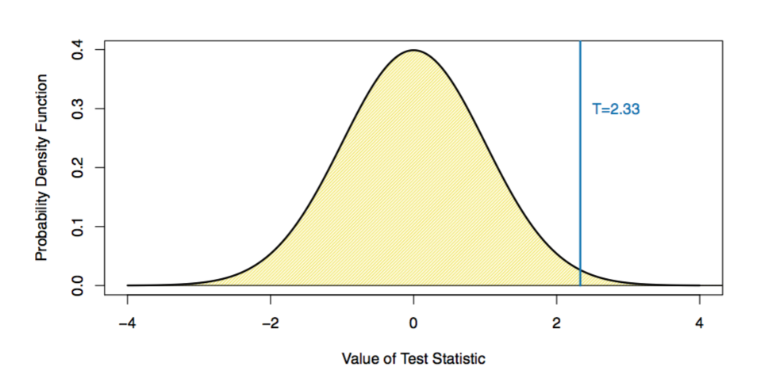
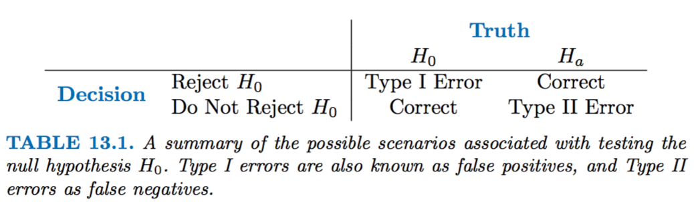
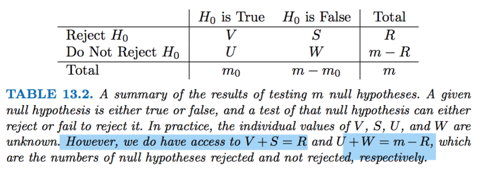

# Multiple Testing

**Learning objectives:**

- Identify the challenges of performing **multiple hypothesis tests.**
- Reduce Type I errors by controlling the **family-wise error rate** (FWER).
- Balance Type I and Type II errors by controlling the **false discovery rate** (FDR).
- Calculate p-values using **resampling**.


---

## How to deal with more than one hypothesis test

In this chapter we focus on hypothesis testing to make inference.
```{r 13-01,echo=FALSE}
library(DiagrammeR)

DiagrammeR::mermaid(
  "graph TB
A((estimation))
 B((prediction))
C((hypothesis testing))-->D(inference)
  "
,height = '100%', width = '100%')
```

When making a hypothesis testing, the steps are:

```{r 13-02,echo=FALSE, fig.align='center'}
DiagrammeR::mermaid(
  "graph LR
A[1.Null hypothesis H0]

C[2.P-value]-->D(to quantify the results of a Hp testing)

B[3.T-statistic]
  "
,height = '100%', width = '100%')
```

In general, we have two hypotheses $H_{0}$ and $H_{a}$:

$$H_{0}:\text{the mean in the control group equals the mean in the treatment group}$$
$$H_{0}:\mu_{t}=\mu_{c}$$
and 

$$H_{a}:\text{mean values are not equal}$$


Now we want to **test some particular set of null hypotheses**:

$$\text{m are the number of hypotheses we make}$$

$$H_{01},...,H_{0m}$$ 

$H_{0j}$ is the mean value of the $j^{th}$ value

Multiple testing lead to the **False discovery rate** (1990) 

```{r 13-03,echo=FALSE}
DiagrammeR::mermaid(
  "graph LR
A(Multiple testing)-->B(False discovery rate - FDR)
  "
,height = '100%', width = '100%')
```


## Hypothesis testing steps

1.  Define a hypothesis
2.  Make a test statistic
3.  compute a p-value (to quantify the prob of having a value which is equal or more extreme than the t-test result)
4.  decide if to reject $H_0$


**Step 1** is what we decide based on our investigation.

**Step 2** is to construct a t-statistic, it summarize the relation with $H_0$.

if: $$H_{0}:\mu_{t}=\mu_{c}$$ we have a **two sample test** as we are searching values on the left and on the right of the t-test results
$$T=\frac{\mu_{t}-\mu_{c}}{s\sqrt{\frac{1}{n_t}+\frac{1}{n_c}}}$$
$$s=\sqrt{\frac{(n_{t}-1)s_{t}^2+(n_{t}-1)s_{c}^2}{n_{t}+n_{c}-2}}$$
A *large* absolute value of the T-statistic is against the $H_0$.

```{r 13-04, echo=FALSE}

```


**Step 3** is to compute a **p-value**, the probability of observing a value which is equal or more extreme than the observed value.

**P-value is observing a T-stat which is equal or more extreme than the observed statistic**

The p-value let's us interpret the scale of out t-statistic absolute result.

The t-stat value is arbitrarily "LARGE", the p-value rescale it to (0 to 1), in terms of probability to find an equal or more extreme value.

**Step 4** is to identify if to reject $H_0$ or fail to reject $H_0$.
The smaller the p-value is the stronger is the evidence AGAINST the NULL hypothesis.


```{r 13-05, echo=FALSE}

```

- **Type I error** reject $H_0$ when $H_0$ is TRUE
- **Type I error Rate** is the prob of type I error
- **Type II error** no reject $H_0$ when $H_0$ is FALSE
- **POWER** of hypothesis is the prob of not making type II error

**There is a trade-off between type I & type II error**

## m NULL hypotheses

$$H_{01},...,H_{0m}$$ 

If we reject all NULL hypotheses with p-value < 0.01

**How many type I error are to expect?**

**Example**

1.  $p-value < \alpha$ with $\alpha=0.01$

there is $1%$ chance to FALSE reject $H_0$ (if $H_0$ is TRUE)

2.  $\text{m NULL hypotheses}$

there is $1%$ chance of rejecting single $H_0$, and $\text{m x }0.01$ FALSE rejections in total.

---


## Family Wise Error Rate (FWER)

Probability of making at least 1 type I error.


```{r 13-06, echo=FALSE}

```


**FWER is the probability of at least 1 type I error**

$$FWER =Pr(V\geq1)=$$
$$=1-Pr(V=0)=$$
$$=1-\prod_{1}^{m}{(1-\alpha)}=$$
$$1-(1-\alpha)^m$$

With hypothesis that **m** tests are independents.

---

### Controlling FWER

1.  **Bonferroni correction**

$$FWER\leq m\frac{\alpha}{m}=\alpha$$
We set a new $\alpha$ value which is lower in proportion.

**Bonferroni** $\frac{\alpha}{m}=\text{new } \alpha$


2.  **Holm's step down**
**Holm's** $L=min{j:p_j>\frac{\alpha}{m+1-j}}$ is less conservative, with fewer type II errors and greater **power**.

$$\text{min }\{p_j>\frac{\alpha}{m+1-j}\}$$


These other two are subsequent methods to apply for further investigations:

3.  **Tukey's method**

4.  **Scheffè's method**


---

## Power

*Power* is the number of FALSE $H_0$ rejected/total FALSE $H_0$

$$\frac{S}{(m-m_0)}$$


When **m** increases **power** decreases.

---


## False Discovery Rate (FDR)

Other than **FWER** which is too stringent, there is **FDR**.

$$FDR=\frac{V}{V+S}=\frac{V}{R}$$

The **False Discovery Proportion (FDP)** can be used as a threshold:
$$FDP = \frac{V}{R}$$
$$FDR=E(FDP)=E(\frac{V}{R})$$
---


## Benjamini-Hochberg procedure

This procedure is to control **FDP** deciding which $H_0$ to reject while $FDR\approx{E(\frac{V}{R})}$


$$FDR={E(\frac{V}{R})}<q$$

Less than $q$, a specific value to use in the algorithm:

ordered p-values: $p_1<p_2<...<p_m$

$$L=max\{j:p_{j}<\frac{qj}{m}\}$$
reject $h_{0j}:p_{j}\leq{p_{(L)}}$


In conclusion, on average no more than a fraction of $q$ of rejected $H_0$ are FALSE POSITIVE.

---

## Case Study: Multiple hypothesis test in Genomics


This is an example of how to make **multiple hypothesis test** in Genomics.

More information about this example can be found in [HarvardX Biomedical Data Science Open Online Training](https://rafalab.github.io/pages/harvardx.html) by [Prof. Rafael Irizarry](https://rafalab.github.io/)


Here are some references:

- [Introduction](https://genomicsclass.github.io/book/pages/intro_to_highthroughput_data.html)
- [multiple testing](https://genomicsclass.github.io/book/pages/multiple_testing.html)
- [EDA](https://genomicsclass.github.io/book/pages/eda_for_highthroughput.html)
- [Bioconductor](https://www.bioconductor.org/)

---

## Load libraries and datasets
```{r chunk29, message=FALSE, warning=FALSE, paged.print=FALSE}
library(tidyverse)
library(rafalib)
```
```{r chunk29hide, eval = FALSE}
# BiocManager::install(c("genefilter", "qvalue"))
library(genefilter) # rowttests function
library(qvalue) # to calculate a qvalue and compare with p.adjust(...method="fdr")
```

```{r chunk29a, eval=FALSE, include=FALSE}
# install_github("genomicsclass/GSE5859Subset")
# library(GSE5859Subset)
# data(GSE5859Subset)
# saveRDS(geneExpression,"data/13_geneExpression.rds")
# saveRDS(sampleInfo,"data/13_sampleInfo.rds")
```


```{r chunk29c, message=FALSE, warning=FALSE, paged.print=FALSE}
geneExpression <- readRDS("data/13_geneExpression.rds")
sampleInfo<- readRDS("data/13_sampleInfo.rds")
```


## Multiple T-test

For calculating the t-test for all the genes in the **geneExpression** matrix, we use the `rowttests()` function from the {genefilter} package.
```{r chunk30, eval=FALSE, include=T}
?rowttests
```
We define the **NULL Hypothesis** with a vector of the same length of the unique elements in the dataset.
If our dataset is made of m unique elements and m0 are the number of positives, we can build a binary vector to use in the calculation of the pvalues.

Here is an example on how to make a nullHypothesis vector.
```{r chunk31, eval=FALSE, include=T}
nullHypothesis <- c(rep(TRUE,m0), rep(FALSE,m-m0))
null_hypothesis <- factor(nullHypothesis, levels=c("TRUE","FALSE"))
```

In our case study we use the **geneExpression** matrix with genes expression data and the **sampleInfo** for retrieving the groups of positives and negatives within the dataset.
```{r chunk32}
null_hypothesis <- factor(sampleInfo$group)
```

Have a look a the dimentsion of the geneExpression matrix:
```{r chunk33}
dim(geneExpression)
```

```{r chunk34}
geneExpression%>%
  as.data.frame() %>%
  rownames_to_column("gene") %>%
  count(gene,sort=T)%>%
  head
```

Statistics, difference in mean and p.value:
```{r chunk35, eval = FALSE}
results <- rowttests(geneExpression,null_hypothesis)
results2 <- rowttests(geneExpression,factor(rep("a","b",24)))
results%>%head;results2%>%head
```
```{r chunk35b, echo = FALSE}
# saveRDS(results, "data/13_results35.rds")
# saveRDS(results2, "data/13_results35_2.rds")
results <- readRDS("data/13_results35.rds")
results2 <- readRDS("data/13_results35_2.rds")

results%>%head;results2%>%head
```

The results is 1383 genes have a pvalue lower than 5%
```{r chunk36, eval = FALSE}
results <- rowttests(geneExpression,null_hypothesis)
sum(results$p.value<0.05)
```
```{r chunk36b, echo = FALSE}
# saveRDS(results, "data/13_results36.rds")
results <- readRDS("data/13_results36.rds")
```
```{r chunk37}
mean(results$p.value<0.05)
```

### FWER Family Wise Error Rate

What is the **probability to make at least 1 type I error**?

First consider the nuber of hypothesis which is the number of genes in our case:
```{r chunk38}
m <- length(results$p.value) 
m
```

Then calculate the FWER:
```{r chunk39}
1-(1-0.05)^m
```

So, the probability to make at least one type I error is 1! 
if we set $\alpha$:
$$P(\text{at least one rejection})=1−(1−k)^m=5\%$$
$$k=1-0.95^{\frac{1}{m}}\approx 0.000005$$

```{r chunk40}
1-0.95^(1/m)
```
What we need to do next is to adjust this FWER to a suitable threshold applying some corrections, such as the **Bonferroni** correction procedure sets $k=\alpha/m$:
```{r chunk41}
1-(1-0.05/m)^m
```

```{r chunk42}
0.05/m
```


```{r chunk43}
sum(results$p.value<0.05/m)
```

Now, the number of hypothesis with a pvalue lower than 5% are 10 and the FWER adjusted is:
```{r chunk44}
mean(results$p.value<0.05/m)
```

### FDR False discovery rate

This is referred to as a **discovery driven project or experiment**, as we are now going to adjust the threshold to a lower value than $\alpha$ through experiment just as the same as we have demonstrated above.


>"The idea behind FDR is to focus on the random variable Q≡V/R with Q=0 when R=0 and V=0. Note that R=0 (nothing called significant) implies V=0 (no false positives). So Q is a random variable that can take values between 0 and 1 and we can define a rate by considering the average of Q. To better understand this concept here, we compute Q for the procedure: call everything p-value < 0.05 significant."

Compare the FDR results for two methods.

1.  First method: using `p.adjust()` function from {stats} package
```{r chunk45}
pvals = results$p.value
pvals<-sort(pvals)

# to find a q-value with the false discovery rate method
fdr <- p.adjust(pvals, method="fdr")

sum(fdr<0.05)
```


```{r chunk46}
mean(fdr<0.05)
```

2.  Second method: using the `qvalue()` function from {qvalue} package
```{r chunk47, eval = FALSE}
res <- qvalue::qvalue(pvals)
```
```{r chunk47b, echo = FALSE}
# saveRDS(res, "data/13_res47.rds")
res <- readRDS("data/13_res47.rds")
```
```{r chunk47c}
qvals <- res$qvalues
#plot(pvals,qvals)
sum(qvals<0.05)
```


```{r chunk48}
mean(qvals<0.05)
```

The proportion of true null hypotheses:
```{r chunk49}
res$pi0
```


```{r chunk51, eval = FALSE}
hist(pvals,breaks=seq(0,1,len=21))
expectedfreq <- length(pvals)/20 #per bin
abline(h=expectedfreq*qvalue(pvals)$pi0,col=2,lty=2)
```
```{r chunk51b, echo = FALSE}
hist(pvals,breaks=seq(0,1,len=21))
expectedfreq <- length(pvals)/20 #per bin
# h <- expectedfreq*qvalue::qvalue(pvals)$pi0
# saveRDS(h, "data/13_h51.rds")
h <- readRDS("data/13_h51.rds")
abline(h=h,col=2,lty=2)
```


## Replications

Little recap: **There is a trade-off between type I & type II error**

- **Type I error** reject $H_0$ when $H_0$ is TRUE
- **Type I error Rate** is the prob of type I error
- **Type II error** no reject $H_0$ when $H_0$ is FALSE
- **POWER** of hypothesis is the prob of not making type II error


{width=80%}

{width=80%}


- R: sum of the number of pvalues which are below the threshold and will be rejected (n. rejections)
- m: total hypothesis testing
- m0: negatives
- m1: m-m0 positives

Now what we do is replicating the sample in a lab environment to obtain fake data, in order to do that we generate a matrix from a replication of normal distribution of the same size of our data.

```{r fake}
n <- 24
m <- 8793
delta <- 2 # this is the sample split in two
positives <- 500 # m1
# negatives
m0<- m-positives # 8293

mat <- matrix(rnorm(n*m),m,n)
mat[1:positives,1:(n/2)] <- mat[1:positives,1:(n/2)] + delta
```


Then we do 1000 replications to see in what is the false discovery rate for this lab.
```{r fake2, eval=FALSE, include=T}
B<-1000
set.seed(1173)
results_global <- replicate(B,{
  mat <- matrix(rnorm(n*m),m,n)
  mat[1:positives,1:(n/2)] <- mat[1:positives,1:(n/2)] + delta
  pvals = genefilter::rowttests(mat,null_hypothesis)$p.val
  ##Bonferroni
  FP1 <- sum(pvals[-(1:positives)]<=0.05/m)  
  FN1 <- sum(pvals[1:positives]>0.05/m)
  # p.adjust
  qvals1 <- p.adjust(pvals,method = "fdr")
  FP2<-sum(qvals1[-(1:positives)]<=0.05)
  FN2 <- sum(qvals1[1:positives]>0.05)
  # qvalue
  qvals2 <- qvalue::qvalue(pvals)$qvalues
  FP3<-sum(qvals2[-(1:positives)]<=0.05)
  FN3 <- sum(qvals2[1:positives]>0.05)
  c(FP1,FN1,FP2,FN2,FP3,FN3)
}) 

```

```{r saverds,eval=FALSE, include=FALSE}
# saveRDS(results_global,"data/13_results_global.rds")
# rm(results_global)
```

```{r readrds,include=FALSE}
results_global<-readRDS("data/13_results_global.rds")
```

```{r chunk52}
class(results_global)
```

In this table are summarised the: false positives (FP) and the false negatives (FN) for three methods:

- Bonferroni
- FDR with p.adjust()
- FDR with qvalue()

The counts for FP and FN for the three cases:
```{r results_global, echo=FALSE, message=FALSE, warning=FALSE, paged.print=FALSE}
results_global2<-results_global%>%
  as_tibble()%>%
  mutate(id=c("FP1","FN1","FP2-padjust","FN2-padjust","FP3-qvalue","FN3-qvalue"))%>%
  relocate(id)%>%
  column_to_rownames("id")
results_global2%>%select(1:6)
```

The mean values or the proportions for the same methods:
```{r chunk53, echo=FALSE}
data.frame(
  id=c("FP","FN"),
  "Bonferroni"=c(mean(results_global[1,]/m0),mean(results_global[2,]/positives)),
  "FDR - padjust"=c(mean(results_global[3,]/m0),mean(results_global[4,]/positives)),
  "FDR - qvalue"=c(mean(results_global[5,]/m0),mean(results_global[6,]/positives))
)
```


---

**Benjamini-Hochberg**

$$p(i)≤\frac{i}{m}\alpha$$
```{r chunk54}
alpha <- 0.05
i = seq(along=pvals)

mypar(1,2)
plot(i,sort(pvals))
abline(0,i/m*alpha)
##close-up
plot(i[1:15],sort(pvals)[1:15],main="Close-up")
abline(0,i/m*alpha)
```


```{r chunk55}
k <- max( which( sort(pvals) < i/m*alpha) )
cutoff <- sort(pvals)[k]
cat("k =",k,"p-value cutoff=",cutoff)
```


```{r chunk56}
fdr <- p.adjust(pvals, method="fdr")
mypar(1,1)
plot(pvals,fdr,log="xy")
abline(h=alpha,v=cutoff)
```


---

## Lab: Multiple Testing

**Review of Hypothesis Tests**

We begin by performing some one-sample  $t$-tests  using the `t.test()` function.

First we create 100 variables, each consisting of 10 observations. The first 50 variables have mean $0.5$ and variance $1$, while the others have mean $0$ and variance $1$.

```{r chunk1}
set.seed(6)
x <- matrix(rnorm(10 * 100), 10, 100)
x[, 1:50] <- x[, 1:50] + 0.5
```

Calculate the t-test.
```{r chunk2}
t.test(x[, 1], mu = 0)
```

And with a `for` we calculate the t-tests and the pvalues:
```{r chunk3}
p.values <- rep(0, 100)

for (i in 1:100)
  p.values[i] <- t.test(x[, i], mu = 0)$p.value

decision <- rep("Do not reject H0", 100)
decision[p.values <= .05] <- "Reject H0"
```


```{r chunk4}
table(decision,
    c(rep("H0 is False", 50), rep("H0 is True", 50))
  )
```

Repeate the t-test:

```{r chunk5}
x <- matrix(rnorm(10 * 100), 10, 100)
x[, 1:50] <- x[, 1:50] + 1

for (i in 1:100)
  p.values[i] <- t.test(x[, i], mu = 0)$p.value


decision <- rep("Do not reject H0", 100)
decision[p.values <= .05] <- "Reject H0"


table(decision,
    c(rep("H0 is False", 50), rep("H0 is True", 50))
  )
```


## The Family-Wise Error Rate

If the null hypothesis is true for each of $m$ independent hypothesis tests, then the FWER is equal to $1-(1-\alpha)^m$. 

We can use this expression to compute the FWER for $m=1,\ldots, 500$ and $\alpha=0.05$, $0.01$, and $0.001$.

```{r chunk6}
m <- 1:500
fwe1 <- 1 - (1 - 0.05)^m
fwe2 <- 1 - (1 - 0.01)^m
fwe3 <- 1 - (1 - 0.001)^m
```


We now conduct a one-sample $t$-test for each of the first five managers in the `Fund` dataset, in order to test the null hypothesis that the $j$th fund manager's mean return equals zero, $H_{0j}: \mu_j=0$.

```{r chunk8}
library(ISLR2)
fund.mini <- Fund[, 1:5]

t.test(fund.mini[, 1], mu = 0)

fund.pvalue <- rep(0, 5)


for (i in 1:5)
  fund.pvalue[i] <- t.test(fund.mini[, i], mu = 0)$p.value

fund.pvalue
```

We will make a correction with Bonferroni's method and Holm's method to control the FWER.


To do this, we use the `p.adjust()` function. 


In other words, the adjusted $p$-values resulting from the `p.adjust()` function can be compared to the desired FWER in order to determine whether or not to reject each hypothesis.


```{r chunk9}
p.adjust(fund.pvalue, method = "bonferroni")
pmin(fund.pvalue * 5, 1)
```

Therefore, using Bonferroni's method, we are able to reject the null hypothesis only for Manager One while controlling the FWER at $0.05$.

By contrast, using Holm's method, the adjusted $p$-values indicate that we can reject the null hypotheses for Managers One and Three at a FWER of $0.05$.

```{r chunk10}
p.adjust(fund.pvalue, method = "holm")
```

Manager One performs well, whereas Manager Two has poor performance.

```{r chunk11}
apply(fund.mini, 2, mean)
```


```{r chunk12}
t.test(fund.mini[, 1], fund.mini[, 2], paired = T)
```

Here, we use the `TukeyHSD()` function to apply Tukey's methodin order to adjust for multiple testing.

```{r chunk13}
conflicted::conflict_prefer("as.matrix", "base")
returns <- as.vector(base::as.matrix(fund.mini))
manager <- rep(c("1", "2", "3", "4", "5"), rep(50, 5))
a1 <- aov(returns ~ manager)
TukeyHSD(x = a1)
```


```{r chunk13a}
mean(TukeyHSD(x = a1)$manager[,4])

```

The `TukeyHSD()` function provides confidence intervals for the difference between each pair of managers (`lwr` and `upr`), as well as a $p$-value. 


All of these quantities have been adjusted for multiple testing. 

Let's plot the confidence intervals for the pairwise comparisons using the `plot()` function.

```{r chunk14}
plot(TukeyHSD(x = a1))
```

---

## The False Discovery Rate

Now we perform hypothesis tests for all 2,000 fund managers in the `Fund` dataset. 


With one-sample $t$-test of $H_{0j}: \mu_j=0$, which states that the $j$th fund manager's mean return is zero.

```{r chunk15}
fund.pvalues <- rep(0, 2000)
for (i in 1:2000)
  fund.pvalues[i] <- t.test(Fund[, i], mu = 0)$p.value
```

The `p.adjust()` function can be used with Benjamini-Hochberg procedure.

```{r chunk16}
q.values.BH <- p.adjust(fund.pvalues, method = "BH")
q.values.BH[1:10]
```

The q-values output by the Benjamini-Hochberg procedure can be interpreted as the smallest FDR threshold.

> How many of the fund managers can we reject $H_{0j}: \mu_j=0$?

```{r chunk17}
sum(q.values.BH <= .1)
```

What if we had instead used Bonferroni's method to control the FWER at level  $\alpha=0.1$?

```{r chunk18}
sum(fund.pvalues <= (0.1 / 2000))
```

Finally, `wh` indexes all  $p$-values that are less than or equal to the largest $p$-value in `wh.ps`. Therefore, `wh`indexes the $p$-values rejected by the Benjamini-Hochberg procedure.

```{r chunk19}
ps <- sort(fund.pvalues)
m <- length(fund.pvalues)
q <- 0.1
wh.ps <- which(ps < q * (1:m) / m)
if (length(wh.ps) >0) {
  wh <- 1:max(wh.ps)
 } else {
  wh <- numeric(0)
 }
```


```{r chunk20}
plot(ps, log = "xy", ylim = c(4e-6, 1), ylab = "P-Value",
    xlab = "Index", main = "")
points(wh, ps[wh], col = 4)
abline(a = 0, b = (q / m), col = 2, untf = TRUE)
abline(h = 0.1 / 2000, col = 3)
```

---

## A Re-Sampling Approach

Re-sampling approach to hypothesis testing using the `Khan` dataset.

```{r chunk21}
attach(Khan)
x <- rbind(xtrain, xtest)
y <- c(as.numeric(ytrain), as.numeric(ytest))
dim(x)
table(y)
```

There are four classes of cancer. 

For each gene, we compare the mean expression in the second class (rhabdomyosarcoma) to the mean expression in the fourth class (Burkitt's lymphoma).

```{r chunk22}
x <- as.matrix(x)
x1 <- x[which(y == 2), ]
x2 <- x[which(y == 4), ]
n1 <- nrow(x1)
n2 <- nrow(x2)
t.out <- t.test(x1[, 11], x2[, 11], var.equal = TRUE)
TT <- t.out$statistic
TT
t.out$p.value
```


Instead of using this theoretical null distribution, we can randomly split the 54 patients into two groups of 29 and 25, and compute a new test statistic.

Repeating this process 10,000 times:
```{r chunk23}
set.seed(1)
B <- 10000
Tbs <- rep(NA, B)
for (b in 1:B) {
   dat <- sample(c(x1[, 11], x2[, 11]))
   Tbs[b] <- t.test(dat[1:n1], dat[(n1 + 1):(n1 + n2)],
        var.equal = TRUE
      )$statistic
}
mean((abs(Tbs) >= abs(TT)))
```

This fraction, $0.0416$, is our re-sampling-based $p$-value. It is almost identical to the $p$-value of $0.0412$ obtained using the theoretical null distribution.

A histogram of the re-sampling-based test statistics:

```{r chunk24}
hist(Tbs, breaks = 100, xlim = c(-4.2, 4.2), main = "",
    xlab = "Null Distribution of Test Statistic", col = 7)
lines(seq(-4.2, 4.2, len = 1000),
    dt(seq(-4.2, 4.2, len = 1000),
      df = (n1 + n2 - 2)
    ) * 1000, col = 2, lwd = 3)
abline(v = TT, col = 4, lwd = 2)
text(TT + 0.5, 350, paste("T = ", round(TT, 4), sep = ""),
    col = 4)
```


For each gene, we first compute the observed test statistic,

```{r chunk25}
m <- 100
B<-1000
set.seed(1)
index <- sample(ncol(x1), m)
Ts <- rep(NA, m)
Ts.star <- matrix(NA, ncol = m, nrow = B)
for (j in 1:m) {
  k <- index[j]
  Ts[j] <- t.test(x1[, k], x2[, k],
        var.equal = TRUE
      )$statistic
  for (b in 1:B) {
    dat <- sample(c(x1[, k], x2[, k]))
    Ts.star[b, j] <- t.test(dat[1:n1],
         dat[(n1 + 1):(n1 + n2)], var.equal = TRUE
       )$statistic
  }
}
```

Compute a number of rejected null hypotheses $R$.

```{r chunk26}
cs <- sort(abs(Ts))
FDRs <- Rs <- Vs <- rep(NA, m)
for (j in 1:m) {
  R <- sum(abs(Ts) >= cs[j])
  V <- sum(abs(Ts.star) >= cs[j]) / B
  Rs[j] <- R
  Vs[j] <- V
  FDRs[j] <- V / R
}
```


The variable `index` is needed here since we restricted our analysis to just $100$ randomly-selected genes.

```{r chunk27}
max(Rs[FDRs <= .1])
sort(index[abs(Ts) >= min(cs[FDRs < .1])])
max(Rs[FDRs <= .2])
sort(index[abs(Ts) >= min(cs[FDRs < .2])])
```


```{r chunk28}
plot(Rs, FDRs, xlab = "Number of Rejections", type = "l",
    ylab = "False Discovery Rate", col = 4, lwd = 3)
```

---

## Meeting Videos

### Cohort 1

`r knitr::include_url("https://www.youtube.com/embed/iwd20sDYUbY")`

`r knitr::include_url("https://www.youtube.com/embed/7r7uhb2JCas")`


### Cohort 2

`r knitr::include_url("https://www.youtube.com/embed/tIifL-FfRV4")`

<details>
<summary> Meeting chat log </summary>

```
00:11:46	Ricardo Serrano:	Frequentists vs Bayesian Statistics https://towardsdatascience.com/frequentist-vs-bayesian-statistics-54a197db21
```
</details>

`r knitr::include_url("https://www.youtube.com/embed/gp_aNi2oAeE")`

`r knitr::include_url("https://www.youtube.com/embed/wwS-yXJKVNw")`

<details>
<summary> Meeting chat log </summary>

```
00:21:28	Ricardo Serrano:	Julia Silge blog episode use of tidymodels 'infer' package for statistical inference https://juliasilge.com/blog/tuskegee-airmen/
01:08:00	Federica Gazzelloni:	resources from the course: https://rafalab.github.io/pages/harvardx.html
```
</details>

### Cohort 3

`r knitr::include_url("https://www.youtube.com/embed/_70M4_BGEZk")`

<details>
<summary> Meeting chat log </summary>

```
00:07:53	Mei Ling Soh:	https://github.com/sohmeiling/islr_chapter13_multiple-testing
00:09:19	Mei Ling Soh:	https://github.com/sohmeiling/islr_chapter13_multiple-testing
00:39:43	Fariborz Soroush:	Sorry IT pushed an update on my system :|
00:39:54	Fariborz Soroush:	I just joined
```
</details>

`r knitr::include_url("https://www.youtube.com/embed/B0QBc6FBM3o")`

<details>
<summary> Meeting chat log </summary>

```
00:45:34	Mei Ling Soh:	https://rpubs.com/Mei_Ling/938384
00:45:35	Mei Ling Soh:	https://r4ds.github.io/bookclub-islr/a-re-sampling-approach.html
00:45:54	Mei Ling Soh:	https://github.com/sohmeiling/islr_chapter13_multiple-testing
```
</details>

### Cohort 4

`r knitr::include_url("https://www.youtube.com/embed/ajoJyZM4cws")`

<details>
<summary> Meeting chat log </summary>

```
00:53:00	Ron:	FROM "Regression and Other Stories": 

The three challenges of statistical inference are:
1. Generalizing from sample to population, a problem that is associated with survey sampling but
actually arises in nearly every application of statistical inference;


2. Generalizing from treatment to control group, a problem that is associated with causal inference,
which is implicitly or explicitly part of the interpretation of most regressions we have seen; and

3. Generalizing from observed measurements to the underlying constructs of interest, as most of the
time our data do not record exactly what we would ideally like to study.
01:00:11	Ron:	Might be of interest, Gelman on multiple comparisons in Bayesian methods : http://www.stat.columbia.edu/~gelman/research/published/multiple2f.pdf
01:03:45	kevin_kent:	https://linear.axler.net/
01:06:14	Ron:	"Down with determinants" lol
```
</details>
