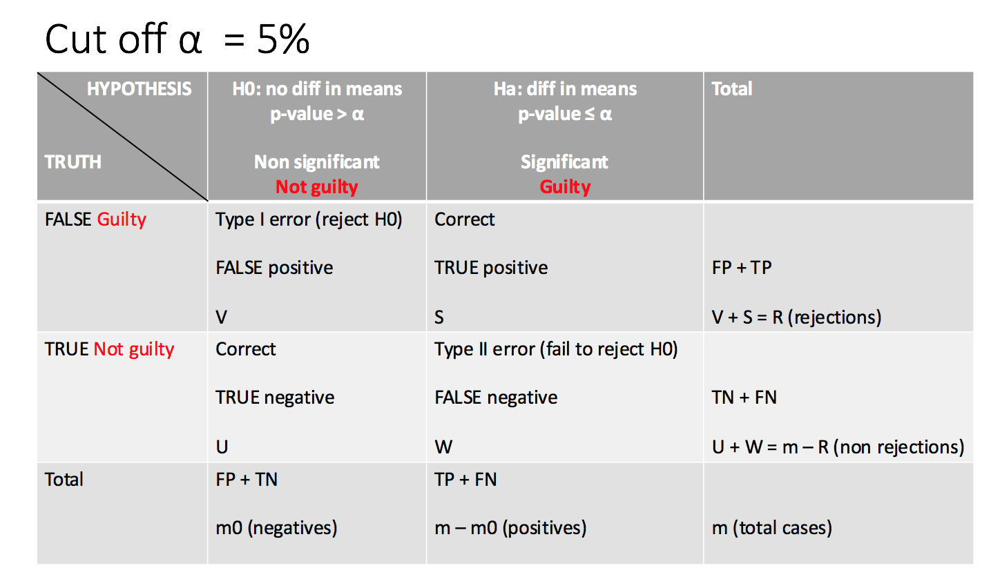

# Multiple Testing

**Learning objectives:**

- Identify the challenges of performing **multiple hypothesis tests.**
- Reduce Type I errors by controlling the **family-wise error rate** (FWER).
- Balance Type I and Type II errors by controlling the **false discovery rate** (FDR).
- Calculate p-values using **resampling**.


## How to deal with more than one hypothesis test

In this chapter we focus on hypothesis testing to make inference.
```{r 13-01,echo=FALSE}
library(DiagrammeR)

DiagrammeR::mermaid(
  "graph TB
A((estimation))
 B((prediction))
C((hypothesis testing))-->D(inference)
  "
,height = '100%', width = '100%')
```

When making a hypothesis testing, the steps are:

```{r 13-02,echo=FALSE, fig.align='center'}
DiagrammeR::mermaid(
  "graph LR
A[1.Null hypothesis H0]

C[2.P-value]-->D(to quantify the results of a Hp testing)

B[3.T-statistic]
  "
,height = '100%', width = '100%')
```

In general, we have two hypotheses $H_{0}$ and $H_{a}$:

$$H_{0}:\text{the mean in the control group equals the mean in the treatment group}$$
$$H_{0}:\mu_{t}=\mu_{c}$$
and 

$$H_{a}:\text{mean values are not equal}$$


Now we want to **test some particular set of null hypotheses**:

$$\text{m are the number of hypotheses we make}$$

$$H_{01},...,H_{0m}$$ 

$H_{0j}$ is the mean value of the $j^{th}$ value

Multiple testing lead to the **False discovery rate** (1990) 

```{r 13-03,echo=FALSE}
DiagrammeR::mermaid(
  "graph LR
A(Multiple testing)-->B(False discovery rate - FDR)
  "
,height = '100%', width = '100%')
```


## Hypothesis testing steps

1.  Define a hypothesis
2.  Make a test statistic
3.  compute a p-value (to quantify the prob of having a value which is equal or more extreme than the t-test result)
4.  decide if to reject $H_0$


**Step 1** is what we decide based on our investigation.

**Step 2** is to construct a t-statistic, it summarize the relation with $H_0$.

if: $$H_{0}:\mu_{t}=\mu_{c}$$ we have a **two sample test** as we are searching values on the left and on the right of the t-test results
$$T=\frac{\mu_{t}-\mu_{c}}{s\sqrt{\frac{1}{n_t}+\frac{1}{n_c}}}$$
$$s=\sqrt{\frac{(n_{t}-1)s_{t}^2+(n_{t}-1)s_{c}^2}{n_{t}+n_{c}-2}}$$
A *large* absolute value of the T-statistic is against the $H_0$.

```{r 13-04, echo=FALSE}

```


**Step 3** is to compute a **p-value**, the probability of observing a value which is equal or more extreme than the observed value.

**P-value is observing a T-stat which is equal or more extreme than the observed statistic**

The p-value let's us interpret the scale of out t-statistic absolute result.

The t-stat value is arbitrarily "LARGE", the p-value rescale it to (0 to 1), in terms of probability to find an equal or more extreme value.

**Step 4** is to identify if to reject $H_0$ or fail to reject $H_0$.
The smaller the p-value is the stronger is the evidence AGAINST the NULL hypothesis.


```{r 13-05, echo=FALSE}
knitr::include_graphics("images/13_02.png")
```

- **Type I error** reject $H_0$ when $H_0$ is TRUE
- **Type I error Rate** is the prob of type I error
- **Type II error** no reject $H_0$ when $H_0$ is FALSE
- **POWER** of hypothesis is the prob of not making type II error

**There is a trade-off between type I & type II error**

## m NULL hypotheses

$$H_{01},...,H_{0m}$$ 

If we reject all NULL hypotheses with p-value < 0.01

**How many type I error are to expect?**

**Example**

1.  $p-value < \alpha$ with $\alpha=0.01$

there is $1%$ chance to FALSE reject $H_0$ (if $H_0$ is TRUE)

2.  $\text{m NULL hypotheses}$

there is $1%$ chance of rejecting single $H_0$, and $\text{m x }0.01$ FALSE rejections in total.

---


## Family Wise Error Rate (FWER)

Probability of making at least 1 type I error.


```{r 13-06, echo=FALSE}
knitr::include_graphics("images/13_03.png")
```


**FWER is the probability of at least 1 type I error**

$$FWER =Pr(V\geq1)=$$
$$=1-Pr(V=0)=$$
$$=1-\prod_{1}^{m}{(1-\alpha)}=$$
$$1-(1-\alpha)^m$$

With hypothesis that **m** tests are independents.

---

### Controlling FWER

1.  **Bonferroni correction**

$$FWER\leq m\frac{\alpha}{m}=\alpha$$
We set a new $\alpha$ value which is lower in proportion.

**Bonferroni** $\frac{\alpha}{m}=\text{new } \alpha$


2.  **Holm's step down**
**Holm's** $L=min{j:p_j>\frac{\alpha}{m+1-j}}$ is less conservative, with fewer type II errors and greater **power**.

$$\text{min }\{p_j>\frac{\alpha}{m+1-j}\}$$


These other two are subsequent methods to apply for further investigations:

3.  **Tukey's method**

4.  **Scheffè's method**


---

## Power

*Power* is the number of FALSE $H_0$ rejected/total FALSE $H_0$

$$\frac{S}{(m-m_0)}$$


When **m** increases **power** decreases.

---


## False Discovery Rate (FDR)

Other than **FWER** which is too stringent, there is **FDR**.

$$FDR=\frac{V}{V+S}=\frac{V}{R}$$

The **False Discovery Proportion (FDP)** can be used as a threshold:
$$FDP = \frac{V}{R}$$
$$FDR=E(FDP)=E(\frac{V}{R})$$
---


## Benjamini-Hochberg procedure

This procedure is to control **FDP** deciding which $H_0$ to reject while $FDR\approx{E(\frac{V}{R})}$


$$FDR={E(\frac{V}{R})}<q$$

Less than $q$, a specific value to use in the algorithm:

ordered p-values: $p_1<p_2<...<p_m$

$$L=max\{j:p_{j}<\frac{qj}{m}\}$$
reject $h_{0j}:p_{j}\leq{p_{(L)}}$


In conclusion, on average no more than a fraction of $q$ of rejected $H_0$ are FALSE POSITIVE.


---


## Lab: Multiple Testing

## Review of Hypothesis Tests

We begin by performing some one-sample  $t$-tests  using the `t.test()` function.
 First we create 100 variables, each consisting of 10 observations. The first 50 variables have mean $0.5$ and variance $1$,
while the others have mean $0$ and variance $1$.

```{r chunk1}
set.seed(6)
x <- matrix(rnorm(10 * 100), 10, 100)
x[, 1:50] <- x[, 1:50] + 0.5
```


The `t.test()` function can perform a one-sample or a two-sample $t$-test.
 By default, a  one-sample test is performed. To begin, we test $H_{0}: \mu_1=0$, the null hypothesis that the first variable has mean zero.

```{r chunk2}
t.test(x[, 1], mu = 0)
```

The $p$-value comes out to $0.067$, which is not quite low enough to reject the null hypothesis at level $\alpha=0.05$.
  In this case, $\mu_1=0.5$, so the null hypothesis is false. Therefore, we have made a Type II error by failing to reject the null hypothesis when
the null hypothesis is false. 

We now test $H_{0j}: \mu_j=0$ for $j=1,\ldots,100$. We compute the 100
 $p$-values, and then construct a vector recording whether the $j$th $p$-value is less than or equal to 0.05, in which case we reject $H_{0j}$,
 or greater than 0.05, in which case we do not reject $H_{0j}$, for $j=1,\ldots,100$.

```{r chunk3}
p.values <- rep(0, 100)
for (i in 1:100)
  p.values[i] <- t.test(x[, i], mu = 0)$p.value
decision <- rep("Do not reject H0", 100)
decision[p.values <= .05] <- "Reject H0"
```

Since this is a simulated data set, we can create a $2 \times 2$ table similar to Table 13.2.

```{r chunk4}
table(decision,
    c(rep("H0 is False", 50), rep("H0 is True", 50))
  )
```

Therefore, at level $\alpha=0.05$, we reject just 10 of the 50 false null hypotheses,
 and we incorrectly reject 3 of the true null hypotheses. Using the notation from Section 13.3, we have $W=40$, $U=47$, $S=10$, and $V=3$.
  Note that the rows and columns of this table are reversed relative to Table 13.2.
 We have set $\alpha=0.05$, which means that we expect to reject around $5\%$ of the true null hypotheses. This is in line with the $2 \times 2$ table
above, which indicates that we rejected $V=3$ of the $50$ true null hypotheses.


In the simulation above, for the false null hypotheses, the ratio of the mean to the standard deviation
 was only $0.5/1 = 0.5$. This amounts to quite a weak signal, and

it resulted in a high number of Type II errors.
If we instead simulate data with a stronger signal, so that  the ratio of the mean to the standard deviation for the false null hypotheses equals $1$,
then we make only $9$ Type II errors.

```{r chunk5}
x <- matrix(rnorm(10 * 100), 10, 100)
x[, 1:50] <- x[, 1:50] + 1
for (i in 1:100)
  p.values[i] <- t.test(x[, i], mu = 0)$p.value
decision <- rep("Do not reject H0", 100)
decision[p.values <= .05] <- "Reject H0"
table(decision,
    c(rep("H0 is False", 50), rep("H0 is True", 50))
  )
```


## The Family-Wise Error Rate
Recall from (13.5) that if the null hypothesis is true for each of $m$ independent hypothesis tests, then the
  FWER is equal to $1-(1-\alpha)^m$. We can use this expression to compute the FWER for $m=1,\ldots, 500$ and $\alpha=0.05$, $0.01$, and $0.001$.

```{r chunk6}
m <- 1:500
fwe1 <- 1 - (1 - 0.05)^m
fwe2 <- 1 - (1 - 0.01)^m
fwe3 <- 1 - (1 - 0.001)^m
```

We plot these three vectors in order to
reproduce Figure 13.2. The  red, blue, and green lines correspond to $\alpha=0.05$, $0.01$, and $0.001$, respectively.

```{r chunk7}
par(mfrow = c(1, 1))
plot(m, fwe1, type = "l", log = "x", ylim = c(0, 1), col = "red",
    ylab = "Family - Wise Error Rate",
    xlab = "Number of Hypotheses")
lines(m, fwe2, col = "blue")
lines(m, fwe3, col = "green")
abline(h = 0.05, lty = 2)
```

 As discussed previously, even for moderate values of $m$ such as $50$, the FWER exceeds $0.05$ unless $\alpha$ is set to a very low value,
  such as $0.001$.
Of course,
 the problem with setting $\alpha$ to such a low value is that we are likely to make a number of Type II errors: in other words, our power is very low.


We now conduct a one-sample $t$-test for each of the first five managers in the `Fund` dataset,
  in order to test the null hypothesis that the $j$th fund manager's mean return equals zero,
$H_{0j}: \mu_j=0$.

```{r chunk8}
library(ISLR2)
fund.mini <- Fund[, 1:5]
t.test(fund.mini[, 1], mu = 0)
fund.pvalue <- rep(0, 5)
for (i in 1:5)
  fund.pvalue[i] <- t.test(fund.mini[, i], mu = 0)$p.value
fund.pvalue
```

The  $p$-values are low for Managers One and Three, and high for the other three managers.
 However, we cannot simply reject $H_{01}$ and $H_{03}$, since this would fail to account for the multiple testing that we
have performed. Instead, we will
 conduct Bonferroni's method and Holm's method
to control the FWER.


To do this, we use the `p.adjust()` function. Given the $p$-values, the
 function outputs , which
 can be thought of as a new set of $p$-values that have been corrected for  multiple testing. If the adjusted $p$-value for a given hypothesis is
less than or equal to $\alpha$, then that hypothesis can be rejected while maintaining a FWER
of no more than $\alpha$.
In other words, the adjusted $p$-values resulting from the `p.adjust()` function can simply be compared to the desired FWER in order to determine
whether or not to reject
each hypothesis.

For example, in the case of Bonferroni's
method, the raw $p$-values are multiplied by the total number of hypotheses, $m$, in order to obtain the adjusted $p$-values. (However,
adjusted $p$-values are not allowed to exceed $1$.)

```{r chunk9}
p.adjust(fund.pvalue, method = "bonferroni")
pmin(fund.pvalue * 5, 1)
```

Therefore, using Bonferroni's method, we are able to reject the null hypothesis only for Manager
One while controlling the FWER at $0.05$.

By contrast, using Holm's method, the adjusted $p$-values indicate that we can  
 reject the null hypotheses for Managers One and Three at a FWER
of $0.05$.

```{r chunk10}
p.adjust(fund.pvalue, method = "holm")
```


As discussed previously, Manager One seems to perform particularly well, whereas Manager Two has poor performance.

```{r chunk11}
apply(fund.mini, 2, mean)
```

Is there evidence of a meaningful difference in performance between these two managers? Performing a paired $t$-test 
using the `t.test()` function results in a $p$-value of $0.038$, suggesting a statistically significant difference.

```{r chunk12}
t.test(fund.mini[, 1], fund.mini[, 2], paired = T)
```

However, we decided to perform this test only after examining the data and noting that Managers One and Two had the highest and lowest mean performances.
 In a sense, this means that we have implicitly performed ${5 \choose 2} = 5(5-1)/2=10$ hypothesis tests, rather than just one, as discussed
in Section 13.3.2.
 Hence, we use the `TukeyHSD()` function to apply  Tukey's method  in order to adjust for multiple testing.
This function takes as input the output of an  regression model,
which is essentially just a linear regression in which all of the predictors are qualitative.
In this case, the response consists of the monthly excess returns achieved by each manager,
 and the predictor indicates the manager to which each return corresponds.

```{r chunk13}
returns <- as.vector(as.matrix(fund.mini))
manager <- rep(c("1", "2", "3", "4", "5"), rep(50, 5))
a1 <- aov(returns ~ manager)
TukeyHSD(x = a1)
```

```{r}
mean(TukeyHSD(x = a1)$manager[,4])

```

The `TukeyHSD()` function provides confidence intervals for the difference between each pair of managers (`lwr` and `upr`),
as well as a $p$-value. All of these quantities
  have been adjusted for multiple testing. Notice that the $p$-value for the difference between Managers One and Two
  has increased from $0.038$ to $0.186$, so there is no longer  clear evidence of a difference between the managers' performances.
We can plot the confidence intervals for the pairwise comparisons using the `plot()` function.

```{r chunk14}
plot(TukeyHSD(x = a1))
```

---

## The False Discovery Rate

Now we perform hypothesis tests for all 2,000 fund managers in the `Fund` dataset. We perform a one-sample $t$-test of
$H_{0j}: \mu_j=0$, which states that the $j$th fund manager's mean return is zero.

```{r chunk15}
fund.pvalues <- rep(0, 2000)
for (i in 1:2000)
  fund.pvalues[i] <- t.test(Fund[, i], mu = 0)$p.value
```

There are far too many managers to consider trying to control the FWER.
Instead, we focus on controlling the FDR: that is, the expected fraction of rejected null hypotheses that are actually false positives.
The `p.adjust()` function can be used to carry out the Benjamini-Hochberg procedure.

```{r chunk16}
q.values.BH <- p.adjust(fund.pvalues, method = "BH")
q.values.BH[1:10]
```

The q-values output by the Benjamini-Hochberg procedure can be interpreted as the smallest FDR threshold at which we
would reject a particular null hypothesis. For instance, a $q$-value of $0.1$ indicates that we can reject the corresponding null hypothesis at
an FDR of $10\%$ or greater, but that we cannot reject the null hypothesis at an FDR below $10\%$.

If we control the FDR at $10\%$, then for how many of the fund managers can we reject $H_{0j}: \mu_j=0$?

```{r chunk17}
sum(q.values.BH <= .1)
```

We find that 146 of the 2,000 fund managers have a $q$-value below 0.1; therefore, we are able to conclude that 146 of the fund managers
beat the market at an FDR of $10\%$.  Only about 15 ($10\%$ of 146) of these fund managers are likely to be false discoveries.
By contrast,
if we had instead used Bonferroni's method to control the FWER at level  $\alpha=0.1$, then we would have failed to reject any null hypotheses!

```{r chunk18}
sum(fund.pvalues <= (0.1 / 2000))
```


Figure 13.6 displays the ordered $p$-values, $p_{(1)} \leq p_{(2)} \leq \cdots \leq p_{(2000)}$,
for the `Fund` dataset, as well as the
threshold for rejection by the Benjamini-Hochberg procedure.
Recall that the Benjamini-Hochberg procedure search\-es for the largest $p$-value such that $p_{(j)}<qj/m$, and rejects all hypotheses
for which the $p$-value is  less than or equal to $p_{(j)}$. In the code below, we implement
 the Benjamini-Hochberg procedure ourselves, in order to illustrate how it works. We
first order the $p$-values. We then  identify
all $p$-values that satisfy $p_{(j)}<qj/m$ (`wh.ps`).
Finally, `wh` indexes all  $p$-values that are less than or equal to the largest $p$-value in `wh.ps`. Therefore, `wh`
indexes the $p$-values rejected by the Benjamini-Hochberg procedure.

```{r chunk19}
ps <- sort(fund.pvalues)
m <- length(fund.pvalues)
q <- 0.1
wh.ps <- which(ps < q * (1:m) / m)
if (length(wh.ps) >0) {
  wh <- 1:max(wh.ps)
 } else {
  wh <- numeric(0)
 }
```

We now reproduce the middle panel of Figure 13.6.

```{r chunk20}
plot(ps, log = "xy", ylim = c(4e-6, 1), ylab = "P-Value",
    xlab = "Index", main = "")
points(wh, ps[wh], col = 4)
abline(a = 0, b = (q / m), col = 2, untf = TRUE)
abline(h = 0.1 / 2000, col = 3)
```

---

## A Re-Sampling Approach
Here, we implement the re-sampling approach to hypothesis testing using the `Khan` dataset, which we investigated in Section 13.5.
 First, we merge the training and testing data, which results in observations on $83$ patients for $2{,}308$ genes.

```{r chunk21}
attach(Khan)
x <- rbind(xtrain, xtest)
y <- c(as.numeric(ytrain), as.numeric(ytest))
dim(x)
table(y)
```

There are four classes of cancer. For each gene, we compare the mean expression in the second class (rhabdomyosarcoma)
 to the mean expression in the fourth class (Burkitt's lymphoma).
  Performing a standard two-sample $t$-test on the $11$th gene produces a test-statistic of $-2.09$
and an associated $p$-value of $0.0412$, suggesting modest evidence of a difference in mean expression levels between the two cancer types.

```{r chunk22}
x <- as.matrix(x)
x1 <- x[which(y == 2), ]
x2 <- x[which(y == 4), ]
n1 <- nrow(x1)
n2 <- nrow(x2)
t.out <- t.test(x1[, 11], x2[, 11], var.equal = TRUE)
TT <- t.out$statistic
TT
t.out$p.value
```

However, this $p$-value relies on the assumption that under the null hypothesis of no difference between the two groups, the
 test statistic follows a $t$-distribution with $29+25-2=52$ degrees of freedom.
Instead of using this theoretical null distribution,
 we can randomly split the 54 patients into two groups of 29 and 25, and compute a new test statistic.
Under the null hypothesis of no difference between the groups, this new test statistic should have the same distribution as our original one.
Repeating this process 10,000 times allows us to approximate the null distribution of the test statistic.
 We compute the fraction of the time that our observed test statistic exceeds the test statistics obtained via re-sampling.

```{r chunk23}
set.seed(1)
B <- 10000
Tbs <- rep(NA, B)
for (b in 1:B) {
   dat <- sample(c(x1[, 11], x2[, 11]))
   Tbs[b] <- t.test(dat[1:n1], dat[(n1 + 1):(n1 + n2)],
        var.equal = TRUE
      )$statistic
}
mean((abs(Tbs) >= abs(TT)))
```

This fraction, $0.0416$, is our re-sampling-based $p$-value. It is almost identical to the $p$-value of $0.0412$ obtained using the theoretical null distribution.

We can plot  a histogram of the re-sampling-based test statistics in order to reproduce Figure 13.7.

```{r chunk24}
hist(Tbs, breaks = 100, xlim = c(-4.2, 4.2), main = "",
    xlab = "Null Distribution of Test Statistic", col = 7)
lines(seq(-4.2, 4.2, len = 1000),
    dt(seq(-4.2, 4.2, len = 1000),
      df = (n1 + n2 - 2)
    ) * 1000, col = 2, lwd = 3)
abline(v = TT, col = 4, lwd = 2)
text(TT + 0.5, 350, paste("T = ", round(TT, 4), sep = ""),
    col = 4)
```

The re-sampling-based null distribution is almost identical to the theoretical null distribution, which is displayed in red.


Finally, we implement the plug-in re-sampling FDR approach outlined in Algorithm 13.4. Depending on the speed of your computer, calculating the FDR for all 2,308 genes in the `Khan` dataset may take a while.
Hence, we will illustrate the approach on a random subset of 100 genes.
For each  gene, we first compute the observed test statistic,
and then produce $10{,}000$ re-sampled test statistics. This may take a few minutes to run.  If you are in a rush,
then you could set `B` equal to a smaller
value (e.g. `B = 500`).

```{r chunk25}
m <- 100
B<-1000
set.seed(1)
index <- sample(ncol(x1), m)
Ts <- rep(NA, m)
Ts.star <- matrix(NA, ncol = m, nrow = B)
for (j in 1:m) {
  k <- index[j]
  Ts[j] <- t.test(x1[, k], x2[, k],
        var.equal = TRUE
      )$statistic
  for (b in 1:B) {
    dat <- sample(c(x1[, k], x2[, k]))
    Ts.star[b, j] <- t.test(dat[1:n1],
         dat[(n1 + 1):(n1 + n2)], var.equal = TRUE
       )$statistic
  }
}
```

Next, we compute the number of rejected null hypotheses $R$, the estimated number of false positives $\widehat{V}$,
 and the estimated FDR, for a range of threshold values
  $c$ in Algorithm 13.4. The threshold values are chosen using the absolute values of the
  test statistics from the $100$ genes.

```{r chunk26}
cs <- sort(abs(Ts))
FDRs <- Rs <- Vs <- rep(NA, m)
for (j in 1:m) {
  R <- sum(abs(Ts) >= cs[j])
  V <- sum(abs(Ts.star) >= cs[j]) / B
  Rs[j] <- R
  Vs[j] <- V
  FDRs[j] <- V / R
}
```

Now, for any given FDR, we can find the genes that will be
rejected. For example, with the FDR controlled at 0.1,
 we reject 15 of the 100 null hypotheses. On average, we would expect about one or two of these genes (i.e. $10\%$ of 15) to be false discoveries.
At an FDR of $0.2$, we can reject the null hypothesis for $28$ genes, of which we expect around six to be false discoveries.
The variable `index` is needed here since we restricted our analysis to just $100$ randomly-selected genes.

```{r chunk27}
max(Rs[FDRs <= .1])
sort(index[abs(Ts) >= min(cs[FDRs < .1])])
max(Rs[FDRs <= .2])
sort(index[abs(Ts) >= min(cs[FDRs < .2])])
```

The next line  generates Figure 13.11, which is similar to Figure 13.9,
except that it is based on only  a subset of the genes.

```{r chunk28}
plot(Rs, FDRs, xlab = "Number of Rejections", type = "l",
    ylab = "False Discovery Rate", col = 4, lwd = 3)
```

As noted in the chapter, much more efficient implementations of the re-sampling approach to FDR calculation are available, using
e.g. the `samr` package in `R`.

---

## Case Study: Multiple hypothesis test in Genomics


This is an example of how to make **multiple hypothesis test** in Genomics.

More information about this example can be found in [HarvardX Biomedical Data Science Open Online Training](https://rafalab.github.io/pages/harvardx.html) by [Prof. Rafael Irizarry](https://rafalab.github.io/)


Here are some references:

- [Introduction](https://genomicsclass.github.io/book/pages/intro_to_highthroughput_data.html)
- [multiple testing](https://genomicsclass.github.io/book/pages/multiple_testing.html)
- [EDA](https://genomicsclass.github.io/book/pages/eda_for_highthroughput.html)
- [Bioconductor](https://www.bioconductor.org/)

---

## Load libraries and datasets
```{r message=FALSE, warning=FALSE, paged.print=FALSE}
library(tidyverse)
library(rafalib)

# These packages are referenced but not used by these notes.
# Install them with BiocManager:install.
# library(genefilter) # rowttests function
# library(qvalue) # to calculate a qvalue and compare with p.adjust(...method="fdr")
```

```{r eval=FALSE, include=FALSE}
#install_github("genomicsclass/GSE5859Subset")
# BiocManager::install(c("genefilter", "qvalue"))
# library(GSE5859Subset)
# data(GSE5859Subset)
# saveRDS(geneExpression,"data/geneExpression.rds")
saveRDS(sampleInfo,"data/sampleInfo.rds")
```


```{r message=FALSE, warning=FALSE, paged.print=FALSE}
geneExpression <- readRDS("data/geneExpression.rds")
sampleInfo<- readRDS(sampleInfo,"sampleInfo.rds")
```


## Multiple T-test

For calculating the t-test for all the genes in the **geneExpression** matrix, we use the `rowttests()` function from the {genefilter} package.
```{r eval=FALSE, include=T}
?rowttests
```
We define the **NULL Hypothesis** with a vector of the same length of the unique elements in the dataset.
If our dataset is made of m unique elements and m0 are the number of positives, we can build a binary vector to use in the calculation of the pvalues.

Here is an example on how to make a nullHypothesis vector.
```{r eval=FALSE, include=T}
nullHypothesis <- c(rep(TRUE,m0), rep(FALSE,m-m0))
null_hypothesis <- factor(nullHypothesis, levels=c("TRUE","FALSE"))
```

In our case study we use the **geneExpression** matrix with genes expression data and the **sampleInfo** for retrieving the groups of positives and negatives within the dataset.
```{r}
null_hypothesis <- factor(sampleInfo$group)
```

Have a look a the dimentsion of the geneExpression matrix:
```{r}
dim(geneExpression)
```

```{r}
geneExpression%>%
  as.data.frame() %>%
  rownames_to_column("gene") %>%
  count(gene,sort=T)%>%
  head
```

Statistics, difference in mean and p.value:
```{r}
results <- rowttests(geneExpression,null_hypothesis)
results2 <- rowttests(geneExpression,factor(rep("a","b",24)))
results%>%head;results2%>%head
```


The results is 1383 genes have a pvalue lower than 5%
```{r}
results <- rowttests(geneExpression,null_hypothesis)
sum(results$p.value<0.05)
```

```{r}
mean(results$p.value<0.05)
```

### FWER Family Wise Error Rate

What is the **probability to make at least 1 type I error**?

First consider the nuber of hypothesis which is the number of genes in our case:
```{r}
m <- length(results$p.value) 
m
```

Then calculate the FWER:
```{r}
1-(1-0.05)^m
```

So, the probability to make at least one type I error is 1! 
if we set $\alpha$:
$$P(\text{at least one rejection})=1−(1−k)^m=5\%$$
$$k=1-0.95^{\frac{1}{m}}\approx 0.000005$$

```{r}
1-0.95^(1/m)
```
What we need to do next is to adjust this FWER to a suitable threshold applying some corrections, such as the **Bonferroni** correction procedure sets $k=\alpha/m$:
```{r}
1-(1-0.05/m)^m
```

```{r}
0.05/m
```


```{r}
sum(results$p.value<0.05/m)
```

Now, the number of hypothesis with a pvalue lower than 5% are 10 and the FWER adjusted is:
```{r}
mean(results$p.value<0.05/m)
```

### FDR False discovery rate

This is referred to as a **discovery driven project or experiment**, as we are now going to adjust the threshold to a lower value than $\alpha$ through experiment just as the same as we have demonstrated above.


>"The idea behind FDR is to focus on the random variable Q≡V/R with Q=0 when R=0 and V=0. Note that R=0 (nothing called significant) implies V=0 (no false positives). So Q is a random variable that can take values between 0 and 1 and we can define a rate by considering the average of Q. To better understand this concept here, we compute Q for the procedure: call everything p-value < 0.05 significant."

Compare the FDR results for two methods.

1.  First method: using `p.adjust()` function from {stats} package
```{r}
pvals = results$p.value
pvals<-sort(pvals)

# to find a q-value with the false discovery rate method
fdr <- p.adjust(pvals, method="fdr")

sum(fdr<0.05)
```
```{r}
mean(fdr<0.05)
```

2.  Second method: using the `qvalue()` function from {qvalue} package
```{r}
res <- qvalue::qvalue(pvals)
qvals <- res$qvalues
#plot(pvals,qvals)
sum(qvals<0.05)
```
```{r}
mean(qvals<0.05)
```

The proportion of true null hypotheses:
```{r}
res$pi0
```


```{r eval=FALSE, include=FALSE}
plot(qvals/fdr)
abline(h=res$pi0,col=2)
```


```{r}
hist(pvals,breaks=seq(0,1,len=21))
expectedfreq <- length(pvals)/20 #per bin
abline(h=expectedfreq*qvalue(pvals)$pi0,col=2,lty=2)
```

## Replications

Little recap: **There is a trade-off between type I & type II error**

- **Type I error** reject $H_0$ when $H_0$ is TRUE
- **Type I error Rate** is the prob of type I error
- **Type II error** no reject $H_0$ when $H_0$ is FALSE
- **POWER** of hypothesis is the prob of not making type II error


{width=80%}

{width=80%}


- R: sum of the number of pvalues which are below the threshold and will be rejected (n. rejections)
- m: total hypothesis testing
- m0: negatives
- m1: m-m0 positives

Now what we do is replicating the sample in a lab environment to obtain fake data, in order to do that we generate a matrix from a replication of normal distribution of the same size of our data.

```{r fake}
n <- 24
m <- 8793
delta <- 2 # this is the sample split in two
positives <- 500 # m1
# negatives
m0<- m-positives # 8293

mat <- matrix(rnorm(n*m),m,n)
mat[1:positives,1:(n/2)] <- mat[1:positives,1:(n/2)] + delta
```


Then we do 1000 replications to see in what is the false discovery rate for this lab.
```{r fake2, eval=FALSE, include=T}
B<-1000
set.seed(1173)
results_global <- replicate(B,{
  mat <- matrix(rnorm(n*m),m,n)
  mat[1:positives,1:(n/2)] <- mat[1:positives,1:(n/2)] + delta
  pvals = genefilter::rowttests(mat,null_hypothesis)$p.val
  ##Bonferroni
  FP1 <- sum(pvals[-(1:positives)]<=0.05/m)  
  FN1 <- sum(pvals[1:positives]>0.05/m)
  # p.adjust
  qvals1 <- p.adjust(pvals,method = "fdr")
  FP2<-sum(qvals1[-(1:positives)]<=0.05)
  FN2 <- sum(qvals1[1:positives]>0.05)
  # qvalue
  qvals2 <- qvalue::qvalue(pvals)$qvalues
  FP3<-sum(qvals2[-(1:positives)]<=0.05)
  FN3 <- sum(qvals2[1:positives]>0.05)
  c(FP1,FN1,FP2,FN2,FP3,FN3)
}) 

```

```{r saverds,eval=FALSE, include=FALSE}
# saveRDS(results_global,"data/results_global.rds")
# rm(results_global)
```

```{r readrds,include=FALSE}
results_global<-readRDS("data/results_global.rds")
```

```{r}
class(results_global)
```

In this table are summarised the: false positives (FP) and the false negatives (FN) for three methods:

- Bonferroni
- FDR with p.adjust()
- FDR with qvalue()

The counts for FP and FN for the three cases:
```{r results_global, echo=FALSE, message=FALSE, warning=FALSE, paged.print=FALSE}
results_global2<-results_global%>%
  as_tibble()%>%
  mutate(id=c("FP1","FN1","FP2-padjust","FN2-padjust","FP3-qvalue","FN3-qvalue"))%>%
  relocate(id)%>%
  column_to_rownames("id")
results_global2%>%select(1:6)
```

The mean values or the proportions for the same methods:
```{r echo=FALSE}
data.frame(
  id=c("FP","FN"),
  "Bonferroni"=c(mean(results_global[1,]/m0),mean(results_global[2,]/positives)),
  "FDR - padjust"=c(mean(results_global[3,]/m0),mean(results_global[4,]/positives)),
  "FDR - qvalue"=c(mean(results_global[5,]/m0),mean(results_global[6,]/positives))
)
```


---

**Benjamini-Hochberg**

$$p(i)≤\frac{i}{m}\alpha$$
```{r}
alpha <- 0.05
i = seq(along=pvals)

mypar(1,2)
plot(i,sort(pvals))
abline(0,i/m*alpha)
##close-up
plot(i[1:15],sort(pvals)[1:15],main="Close-up")
abline(0,i/m*alpha)
```


```{r}
k <- max( which( sort(pvals) < i/m*alpha) )
cutoff <- sort(pvals)[k]
cat("k =",k,"p-value cutoff=",cutoff)
```


```{r}
fdr <- p.adjust(pvals, method="fdr")
mypar(1,1)
plot(pvals,fdr,log="xy")
abline(h=alpha,v=cutoff)
```


---


## Meeting Videos

### Cohort 1

`r knitr::include_url("https://www.youtube.com/embed/URL")`

<details>
<summary> Meeting chat log </summary>

```
ADD LOG HERE
```
</details>

### Cohort 2

`r knitr::include_url("https://www.youtube.com/embed/URL")`

<details>
<summary> Meeting chat log </summary>

```
ADD LOG HERE
```
</details>

### Cohort 3

`r knitr::include_url("https://www.youtube.com/embed/URL")`

<details>
<summary> Meeting chat log </summary>

```
ADD LOG HERE
```
</details>

### Cohort 4

`r knitr::include_url("https://www.youtube.com/embed/URL")`

<details>
<summary> Meeting chat log </summary>

```
ADD LOG HERE
```
</details>
